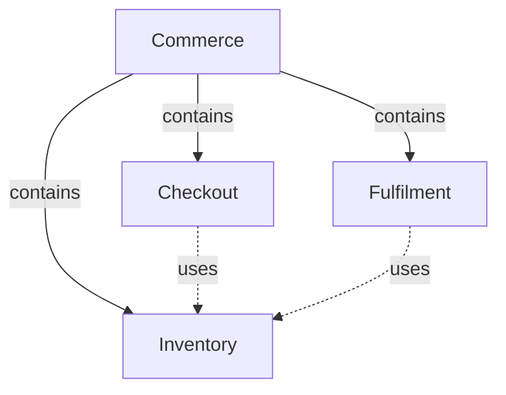
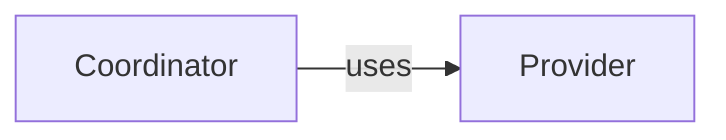

# Module specifications

A Module specifies one responsibility for consumers and implementers. It need not correspond to a
physical software unit. The complete content includes reading and associated machine declarations;
the Protocol defines which information must remain readable. A publisher organizes that reading
without becoming another authority over the specification.

## Reading content

A developer must be able to understand the responsibility, use it correctly and maintain its
realization without assembling meaning from an inventory. Reading begins with Purpose, Usage,
Design and Relationships. The entry and its explanatory topic companions have role `module`.
Precise requirements, scenarios and canonical interface agreements belong in owned role
`implementation` companions, never in the entry or topic pages. Both roles remain reading content
and together form one complete Module specification; neither role is a separate owner or context.
A Module may use several implementation documents rather than one oversized specification file.

### Purpose

State what the Module is for, who relies on it and where its promises stop. Use short plain prose,
not an inventory, table or code block. A directory or package name does not establish responsibility.
A composite Module may delegate all realization and bind no implementation files of its own.

### Usage

Explain audience, use conditions, prerequisites, relevant concepts and actual entry points. Follow
representative input through results and effects, then explain errors, repeated invocation,
cancellation and compatibility where applicable. An unsupported behavior must be identified rather
than invented. A logical responsibility can participate in a workflow or conceptual agreement
without having a callable public API.

Usage is canonical explanatory prose, not a second summary with weaker promises. Link to precise
requirements, scenarios and interface definitions. A consumer should not need a repository lock's
implementation details to learn that concurrent publication is serialized or rejected.

### Design

Explain how responsibility decomposition, state, control/data flow, collaboration and failure
containment fulfill the guarantees. Record significant choices and required internal constraints,
distinguishing them from incidental current code and unresolved implementation. Links to guarantees
are preferable to restating them as new obligations.

Entity meaning belongs within these explanations: a reservation record, boundary actor, interface
or program is introduced where understanding it matters. Entity identity and implementation
bindings belong in metadata, not a standalone entity-inventory chapter. Several entities may share
one coherent explanation with distinct identity anchors; that explanation must actually explain
all of them. Merely placing anchors above unrelated prose does not establish completeness.

### Relationships

Explain the collaborations and the scope of each relationship diagram. Directed edges have
meaningful labels, preferably verbs. Nodes resolve to local entity titles, including local entities
representing used or child Modules. A diagram may select a subset of the inventory or split a topic
into several scoped views. It must not invent entities or import every internal entity of an
included provider. An omitted inventory node is not by itself a missing contract.

The diagrams are authored Mermaid flowcharts in registered reading documents. A reading entry's
Relationships section contains the principal relationship view; prose explains conditions,
invariants and reactions that the edges cannot convey. Further behavioral diagrams can illustrate
state and execution without becoming another relationship inventory. A rendering, export or
navigation tree is derived, not an independent authority.

## Precise obligations

Define these only in implementation-role units owned directly by the Module. Topic names can group
related definitions but do not own them. Module Specs explain the important guarantees and link to
these canonical definitions; readers should not need to read every acceptance case to understand
the Module. Do not move coherent topic explanations wholesale merely because they once contained
formal definitions.

### Requirements

A requirement has a stable identity, a title and one decidable statement containing SHALL or
SHALL NOT exactly once. It expresses a Module-wide obligation, not one scenario's private rule.

```markdown
### req.checkout.single-order — One order per submission

Checkout SHALL create at most one order for a successfully admitted request.
```

One sentence with two SHALL occurrences must be split. "The response SHALL be fast" is not
decidable; an explicit bound can be. Internal structural or technology constraints can be normative
requirements just as external guarantees can. Their location does not weaken them or change their
owner. Explanatory prose and links may follow the statement. Ordinary headings may group definitions.

### Scenarios

A scenario is one concrete situation and the unit tests verify. GIVEN establishes preconditions,
WHEN names the trigger, THEN specifies the promised result. AND and BUT continue the preceding kind.

```markdown
### scenario.checkout.submit — Successful checkout

- GIVEN a customer has a valid cart and delivery details
- WHEN the customer submits it
- THEN Checkout creates one order
- AND returns its identifier
- BUT does not charge the payment method twice
```

Success, failure, partial results, retries and concurrency deserve their own scenarios when their
outcomes differ. A situation's additional guarantees belong in its own steps or explanation, not
in attached requirements. A Module-wide obligation is defined once as a requirement and linked.
Scenarios may verify internal transitions as well as boundary invocations. Group headings have no
identity and do not create new context-query kinds.

### Interfaces

An interface is an entity: an API, command, protocol, event or file boundary. Its canonical readable
agreement explains inputs, outputs, effects, failures, compatibility and repeat behavior, with related
scenarios. A structured contract may use a readable schema and example; structured syntax is not a
reason to classify useful contract content as machine-only metadata.

A shared interface's canonical definition occupies an owned implementation-role companion referenced by many Modules. It retains
one definition and one owner. Participant metadata names ID, version, role and peer and points to
local readable participation conditions, relied-upon guarantees and obligations. It does not copy
the canonical schema or common semantics, and does not override that agreement.

## Composition and dependencies

Composition states the Module's single structural parent. Parent links are acyclic. A parent
explains how its children fulfill the containing responsibility. Dependency states which separately
identified provider a Module uses. It does not imply ownership, deployment, directory nesting,
shared source code or additional context.



Every direct child and used Module has one local entity with its provider identity. The local
reading states that provider's responsibility, selection/use conditions and canonical promises
relied upon, plus local duties and failure reactions. Metadata links the declared provider to that
explanation. A uses arrow or a link to the provider alone is insufficient. A shared provider and
its consumers remain siblings, each with one identity and parent.

## Realization and external knowledge

Entity metadata may bind exact files and directory prefixes. Directory entries retain their slash
and bind future files under the tool's deterministic exclusions. Within a Module, the most specific
entry determines the owning entity; several Modules may list one realization without merging their
contracts. The registry's file listing equals the union of entity entries, entry for entry.
A missing intended entry can be pending. No reading or metadata member of a document unit can be
implementation, and a listed directory cannot contain either member.

Tests are bound implementation, but the test-to-scenario declaration is authored in the test,
not in reading prose. Derived verification coverage is evidence, never another source of promises.
A pending marker is removed after its realization exists; until then it is an intention.

Vendored library/service/tool documentation or source is declared separately as external reference
material at a known revision. It must exist, cannot overlap the Module's implementation listing or
any document unit, and supplies no promise absent from the Spec. Context selection and execution
permissions remain separate: listing names does not grant file contents or network access.

## Completeness

The selected complete context makes every owned and explicitly included unit available with both
members intact. Its readable subset must supply the meaning needed by the selected task. A schema,
heading, diagram or correctly registered file set is not proof of sufficient meaning. Honest drafts
name unknowns. Missing necessary meaning remains a gap until explicit authored changes repair it;
source code, recursive references and publisher summaries cannot silently supply the missing contract.

# Module template

Register `module.md` as the reading entry of one Module and author its paired `module.md.json`.
The pair has one document ID and owner. This starter illustrates the [required format](../format.md),
not business facts, semantic completeness or a required website layout.

## Reading member: module.md

````markdown
# [Module title]

## Purpose

[State the responsibility, consumers and scope in short plain prose.]

## Usage

[Explain when and how to use it, prerequisites and actual entry points, representative inputs and
results, effects and relevant errors, repetition, cancellation and compatibility. A logical Module
need not invent an API. Link to precise definitions rather than duplicating them.]

## Design

<a id="entity.example.coordinator"></a>

[Explain how the coordinator's responsibility, state and control/data flow fulfill the guarantees.
Record required internal constraints and significant choices. Do not substitute a file inventory.]

## Relationships

[Explain this view's collaboration scope and what its arrows do not show.]



### Provider collaboration

<a id="entity.example.provider"></a><a id="example.provider-agreement"></a>

[Explain the provider's responsibility, when it is selected and which included canonical guarantees
this Module relies on. Link to those guarantees, and state local duties and failure reactions.]

## Precise specifications

[Explain the important guarantees above and link to the Module's owned requirements, scenarios
and interface contracts. Do not define formal obligations in this entry or explanatory topic pages.]

## Unresolved information

[Name missing behavior/design and the steps it blocks, or state that no such gaps are known.]
````

The example's anchors identify canonical readable explanations. Adjacent anchors **on the same
standalone line** can identify entities and agreements explained together without repeating prose.
An entity not relevant to this diagram can remain in the metadata and be explained elsewhere in
the owned reading. A diagram must not invent entities or import every included provider's internals.

## Metadata member: module.md.json

```json
{
  "schema_version": 2,
  "document": {"id": "document.example.module", "owner": "module.example", "role": "module"},
  "entities": [
    {"id": "entity.example.coordinator", "title": "Coordinator", "kind": "program",
     "meaning": "#entity.example.coordinator", "files": ["src/example/"]},
    {"id": "entity.example.provider", "title": "Provider", "kind": "used module",
     "meaning": "#entity.example.provider", "target_id": "module.provider"}
  ],
  "dependencies": [
    {"target_id": "module.provider", "meaning": "#example.provider-agreement"}
  ],
  "bindings": []
}
```

Replace example identities and paths with actual facts. A missing intended implementation entry
needs a `pending` marker; a real provider is registered as a use or child. The registry file union
must equal the entity entries, and necessary definitions enter context through explicit Module
references. A Markdown link does not include its target. Remove inapplicable declarations instead
of inventing a provider, file or interface merely to fill this starter.

## Companion documents and interfaces

A companion has its own metadata pair and sole Module owner but no mandatory entry sections.
Use role `module` for explanatory topics such as Registry or Publication. Use role `implementation`
for the Module's requirements, scenarios and precise interfaces. Never place formal definitions in
explanatory topics. Register every reading path in the same owner's collection; consumers reference
its document ID or the owner's Module ID. A split requires explicit references to the units now
containing relied-upon definitions; following Markdown links does not include them.

For example, `requirements.md` has schema-2 metadata:

```json
{
  "schema_version": 2,
  "document": {"id": "document.example.requirements", "owner": "module.example", "role": "implementation"},
  "entities": [], "dependencies": [], "bindings": []
}
```

Its reading member can define:

```markdown
# Example requirements

### req.example.promise — [Requirement title]

[One decidable sentence containing SHALL or SHALL NOT exactly once.]
```

Use the [scenario fragment](scenario.md) in another registered implementation-role unit, or in the
same unit when this keeps the Module's precise specification readable. A canonical structured
agreement is also defined once in an implementation-role unit:

````markdown
```concorde-contract
{
  "id": "contract.example.request",
  "version": 1,
  "schema": {
    "type": "object",
    "properties": {"request_id": {"type": "string", "minLength": 1}},
    "required": ["request_id"],
    "additionalProperties": false
  },
  "semantics": "[Explain the agreed value and its use.]",
  "example": {"request_id": "example-1"}
}
```

[Describe the offline schema vocabulary, inputs, results, effects, failures, compatibility and
related scenarios. Schema shape alone is not a behavioral agreement.]

### Local participation {#example.participation}

[State use conditions, relied-upon guarantees and obligations, with ordinary links to the included
canonical definition. Do not copy its schema or common semantics.]
````

Its participant metadata selects the existing definition:

```json
{
  "id": "contract.example.request", "version": 1, "role": "required",
  "peer": "module.provider", "meaning": "#example.participation"
}
```

Place that record in the companion's `bindings` array. Internal peers need complementary roles;
external peers use `external:<name>`. Tests declare scenario IDs in their own code, not in reading.
Changing either source member invalidates dependent context/review identities. Neither a metadata
record nor this template grants access to implementation or undeclared external material.

# Scenario fragment

A scenario belongs to the Module owning its defining document unit. It can describe boundary use or
an internal verification situation. It is not another Spec kind, document owner or context filter.
Define it only in an implementation-role companion, never in `module.md` or a module-role topic.
Register its Markdown reading path and author schema-2 metadata with the owner's identity,
`document.role: implementation` and explicit declaration arrays. No enclosing usage/architecture parts
are required. The [required format](../format.md) applies.

````markdown
### scenario.example.situation — [Scenario title]

- GIVEN [the precondition or state]
- AND [another precondition]
- WHEN [the trigger]
- THEN [the promised outcome]
- AND [another outcome]
- BUT [an outcome that explicitly must not occur]

[Explain relevant limits, the triggering interface or unresolved facts in ordinary prose.]
````

Write separate scenarios for situations with distinct successful, failed, repeated or concurrent
outcomes. Put a situation's guarantees in its steps or explanation; define Module-wide obligations
once as requirements and link to them. Keep identities stable across title or path changes. Tests
name the scenario identity, and publication exposes it as an anchor. Querying the scenario selects
its owner's entire complete context, including both source members of every explicitly included
unit, not just this fragment or the human-readable subset.
