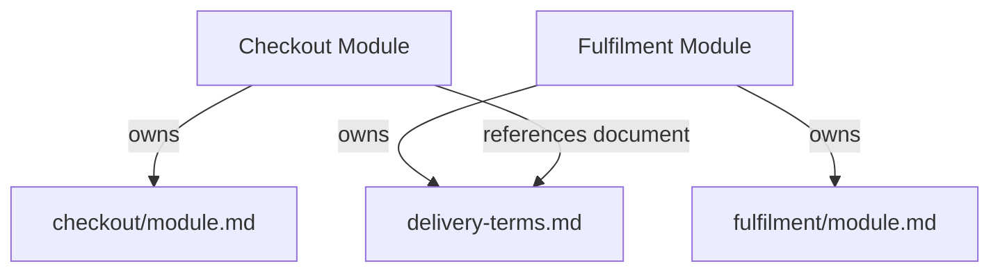
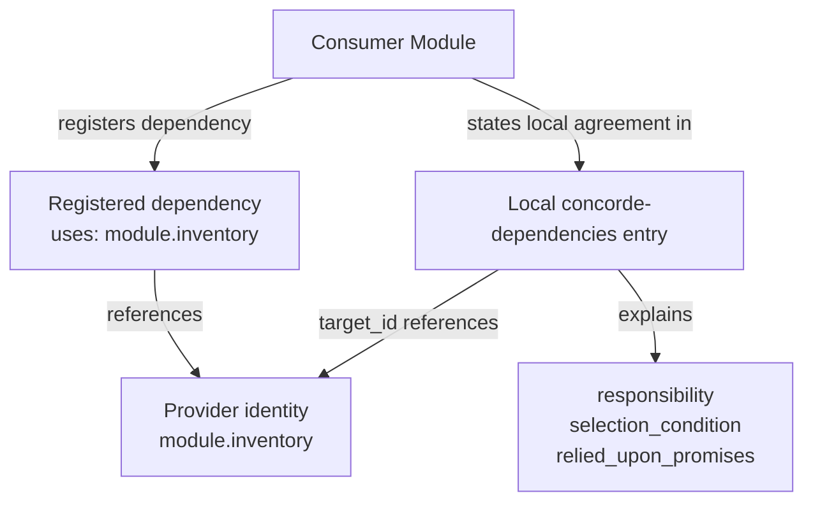
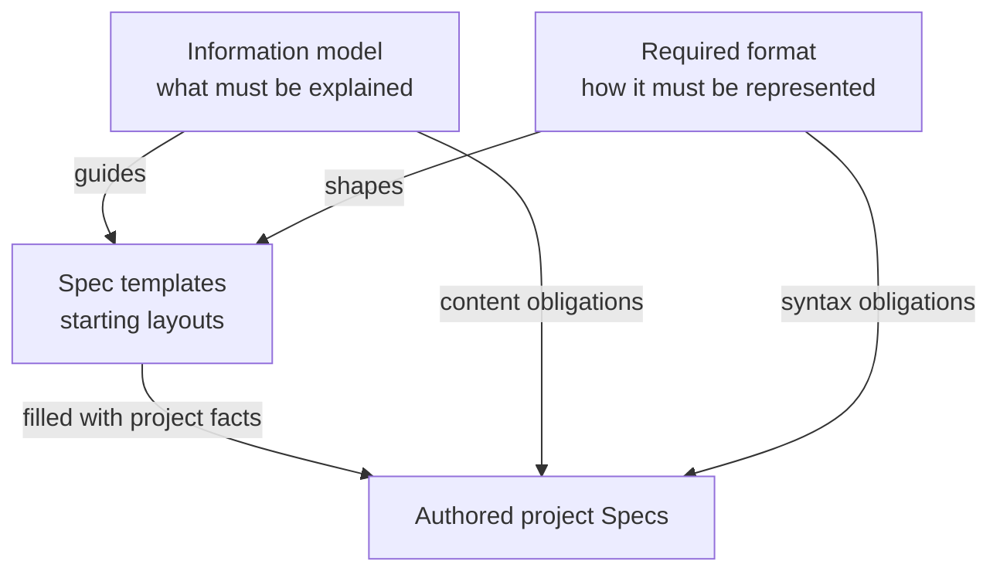

# Spec Protocol principles

Concorde Spec Protocol 5.2.0 defines Module Specs and their organization. These requirements apply
to project specifications, including the specifications of software that implements this Protocol.
They do not require the Protocol text to describe itself as a Module.

## Requirement language

**MUST** states a requirement for conformance. **MUST NOT** states a prohibition. **SHOULD** states
a recommendation that may be departed from for an explained reason. **MAY** states an allowed
choice. Examples illustrate the rules; their names, paths and subject matter are not prescribed.

### P1. A Module describes a cohesive software responsibility in four parts

A **Module** is a cohesive software responsibility. It is a unit of specification, not a unit of
implementation: a Module need not correspond to a package, directory, process, service or other
physical unit. Its realization may be spread across several such units, shared with other Modules,
or supplied entirely by its children. The Module's boundary is established by its purpose,
requirements, scenarios and entities; its file bindings record where that responsibility is realized
and do not define it.

A Module's Spec MUST contain four parts:

1. **Purpose**: a concise plain-prose statement of what the Module is for and for whom.
2. **Requirements**: what the Module as a whole must guarantee. Each requirement is one SHALL
   statement with its own stable identity; it expresses exactly one behavior and can be judged
   true or false against the Module.
3. **Scenarios**: the concrete situations in which the Module is used and how it must react, each
   written as a sequence of GIVEN, WHEN and THEN steps. A scenario is the unit that tests verify.
4. **Ontology**: the things that exist in the Module's world and how they relate. Its
   **entities** may be submodules, programs, files, records, concepts, interfaces at the Module
   boundary or external actors. Its **relationships** are directed edges between entities, each
   with a free-text label, which SHOULD be a verb such as "uses", "downloads", "saves" or "loads".

Purpose, requirements and scenarios form the Module's **functional spec**: they state what the
Module promises. The Ontology forms its **architecture spec**: it states how the Module is built.
The word ontology is used in its plain sense, the Module's account of what exists in its domain and
how those things stand to one another. It asks for no formal ontology language, and it is not
limited to business concepts: a program or a file the Module consists of belongs to its Ontology as
much as a business record or an external actor does.

Requirements and scenarios differ in granularity and in owner. A requirement is a coarse promise
about the Module and belongs to the Module alone. A scenario is one specific, testable situation;
whatever it must additionally guarantee is written into its own steps and prose rather than attached
as a separate requirement. Implementation detail cannot replace either part. An interface is an
entity whose behavior is given by scenarios; inputs, outputs, effects, errors, compatibility and
repeated-invocation behavior are specified through a canonical interface definition and its related
scenarios, not a second kind of Spec.

The Module definition applies recursively to submodules. Each Module MUST have at most one
structural parent, and parent relationships MUST be acyclic. Composition and dependency are
distinct: using a capability does not give the consumer structural ownership of its provider. A
capability shared by several consumers has one identity and is a sibling of those consumers.

### P2. Implementation files are Module metadata

An entity MAY bind project-relative implementation files, each listing entry naming either an exact
file or a directory prefix. A directory prefix binds every regular file below it, including files
created later. The Module's **implementation files** are the union of what its entities' entries
bind. Binding files records which files realize the Module; it does not make those files part of the
Spec and does not let the code supply a promise the Spec omits.

Within one Module each file belongs to exactly one entity: when several entries of the same Module
cover a file, the most specific entry owns it, an exact file before a directory and a longer
directory before a shorter one. Several Modules MAY list the same file or directory when one
realization serves several contracts; that file then has several using Modules and a change to it
concerns all of them. Reuse does not merge Module identities or create another structural parent.
Listing a directory does not by itself establish a Module boundary; the Module's declared purpose,
requirements, scenarios and entities do.

A declared entry MAY be pending: intended but not yet created. A pending declaration describes an
intended output, not evidence that the file or directory exists. An entry that is declared without a
pending marker MUST exist.

Tests are implementation files like any other. A test declares which scenario it verifies by that
scenario's identity; a Spec never lists tests. A tool derives each scenario's verifying tests from
those declarations. That derived coverage is evidence about the tests, not part of the contract, and
a scenario without a declared test remains a promise the Module makes.

The files a Module lists, together with their pending status, form that Module's **implementation
context**; Spec management defines how it is resolved and keeps it separate from the Module's Spec
context.


### P3. A Module resolves a complete contract context

Each Module MUST have a stable identity and a nonempty `documents` collection that it owns, with
exactly one local `module.md` reading entry. Every physical Spec document MUST have exactly one
owning Module. Ownership of a requirement, scenario, entity or interface definition follows its
defining document and remains unchanged when another Module reads it.

Each Module MUST independently declare `references` in its registration record: what the Module
reads but does not own. A reference selects either another Module's entire owned document
collection or one registered document by stable identity, or it names **external** reference
material: a project-relative file or directory prefix holding vendored documentation or source of
a library, service or tool the Module relies on, pinned at a known revision. References determine
context inclusion, not ownership, composition, dependency, implementation file binding or
permission. An external reference is never included in the Spec context and supplies no promise
the Spec omits: it is neither a Spec document nor an implementation file, it is never pending,
and a tool that gives an agent knowledge of external capabilities takes that knowledge from these
declarations rather than from an undeclared network or dependency installation. Only the selected Module's references are expanded, once:
referenced Modules' references and Markdown links MUST NOT be followed. The complete context is the
deduplicated union of full owned and directly referenced documents. A tool delivers that context as
an index of the included documents together with a read-only grant of exactly those documents; it
does not copy their bodies into the reader's instructions, and the reader opens them on demand.

That resolved context MUST explain the selected Module's purpose, requirements, scenarios, entities
and relationships without undeclared reading or source code supplying missing meaning. For each
dependency and child the local contract states responsibility, selection conditions, which canonical
guarantees it relies on and its own obligations or reactions. It SHOULD link to included provider
definitions instead of copying them. Shared interfaces MAY be ordinary documents owned by one Module
and referenced by many; they do not require a new Spec kind or Module.

A scenario query MUST first resolve its unique owning Module, then return that Module's complete
context. Context resolution MUST be deterministic and record identities, inclusion provenance and
exact byte digests. Referenced definitions do not become local entities or requirements, and do not
add provider implementation files or diagram nodes to the consumer.

All prose references use ordinary Markdown links. Publishing renders them as links, never content
inclusion; only registered Module references select Agent context. Every requirement, scenario,
entity and structured contract has its stable identity as its definition anchor.

A missing required definition is a gap. A reader MUST NOT silently fetch more files to repair it. An
honest draft identifies unresolved meaning and does not claim completeness for it.

### P4. Conformance concerns both meaning and structure

A claim of conformance MUST identify the Protocol version it applies to. Stable identity, unique
document ownership, explicit one-level references, consistent relationship declarations, the four
mandatory parts, one statement per requirement and consistent file listings are structural
requirements. Complete and mutually consistent requirements, scenarios and relationships, and
requirements that can each be judged true or false, are semantic requirements.

A document heading, diagram or correctly shaped metadata block does not establish semantic
completeness. Structural checks can establish particular invariants; they cannot establish that
every intended behavior has been specified or that an implementation fulfills its contract.

The Protocol defines the meaning to preserve. A tool's configuration version, serialized registry
version, execution policy or review procedure is a separate agreement. Tools that represent these
specifications MUST preserve their identities, ownership, context inclusion, relationship meanings
and contracts.

The Required format chapter defines the mandatory representation of authored Spec documents. The
Protocol templates demonstrate starting layouts; filling them out does not replace the semantic and
structural requirements above.

# Spec management

Spec management defines how specifications are identified, grouped and related. Its purpose is to
make an authored contract unambiguous regardless of where its documents are stored or how a tool
publishes them. A registry is the explicit inventory of these declarations; its storage format and
the configuration used to locate it are separate from the meanings defined here.

This chapter explains the meaning of the declarations. The Required format chapter specifies their
mandatory syntax, and the Protocol templates provide authoring starters for them.

## Spec and Context

[Spec and Context](spec-management/spec-and-context.md) defines the queryable entities and the
deterministic mapping from a query identity to its complete Spec file set. Module queries select
their own contracts; scenario queries select the providing Module's complete context. The rules use
explicit identity, unique ownership and Module references. A Module's implementation context is
resolved separately from its entity file bindings.

## Stable identities

Modules, physical Spec documents, scenarios, requirements and entities MUST have stable identities,
unique across those categories within a project. An identity is distinct from a title or file path.
Renaming a title or relocating a document does not by itself change what it identifies.

Scenarios, requirements and entities each belong to one providing Module. Their definitions MUST be
located in documents that belong to that Module alone. Their project-wide unique IDs identify
locally owned parts of a contract; they do not make those parts independent document collections.

An identity is also the anchor of its definition. A link to the defining document whose fragment is
the identity, such as `inventory/module.md#req.inventory.no-oversell`, reaches that definition
wherever the document is published. The path locates the document and may change when the document
moves; the fragment is the stable part. A link is navigation and grants nothing.

For example, `module.inventory`, `scenario.inventory.reserve`, `req.inventory.no-oversell`,
`entity.inventory.stock-ledger` and `document.inventory.contract` identify a Module, one of its
scenarios, one of its requirements, one of its entities and a document describing it. The particular
prefixes in these examples aid recognition; ownership follows the explicit declarations and document
ownership.

## Document ownership, references and reading entries

Every Module registers a nonempty `documents` collection with exactly one local `module.md` reading
entry. Registering a physical document establishes its sole owner. Multiple ownership, unregistered
documents and aliases of a physical file are invalid. Reading order and visibility are presentation
attributes; all selected files are included in full.

The Module registration also declares `references`, a distinct list of typed stable identities:

```json
{
  "id": "module.checkout",
  "documents": ["checkout/module.md", "checkout/scenarios.md"],
  "references": [
    {"kind": "module", "id": "module.inventory"},
    {"kind": "document", "id": "document.delivery-terms"},
    {"kind": "external", "path": "reference/payment-sdk/"}
  ]
}
```

This is a partial registration example, not a second context list. A Module reference includes all
documents owned by that Module; a document reference includes just that file. It does not include
the referenced Module's own references. An external reference names vendored material the Module
reads but does not own, such as the documentation and source of a library pinned at a known
revision; it never enters the Spec context and is resolved separately as reference material. A reference MUST resolve to its declared kind; duplicate
reference pairs and references to the selecting Module or its own documents are invalid. Overlapping
Module/document references are allowed and produce one copy with all inclusion reasons. Cycles
between Modules' references are permitted because resolution never recurses.



Delivery terms can define Fulfilment-owned requirements, scenarios, entities and interfaces.
Checkout reads them without acquiring those definitions, the remaining Fulfilment context, its
implementation files, or authority to edit the terms.

## Document metadata

Every registered physical Spec document MUST contain exactly one JSON `concorde-document` block:

```concorde-document
{
  "id": "document.inventory.contract",
  "owner": "module.inventory",
  "main_visible": true
}
```

`id` identifies the document. `owner` MUST equal the sole Module whose `documents` registers it.
`main_visible` is a boolean controlling the main reading view only. Metadata does not declare
references: the Module registration is their sole authority. The example is syntax, not a
declaration that this Protocol chapter belongs to Inventory.

## Relationship declarations

An inventory MUST distinguish these relationships:

- **Composition:** a Module's `parent` is another Module identity or absent. It establishes the
  single-parent, acyclic structure described by the Module model.
- **Dependency:** a Module's `uses` references identify the Modules whose capabilities it consumes.
  These are directed references and do not confer structural ownership.
- **File listing:** a Module's `files` identify the implementation files its entities bind, as
  exact files or directory prefixes. The inventory value MUST equal the union of the Module's
  entity file declarations, entry for entry.
- **Document ownership:** a Module's `documents` identify the documents it alone owns.
- **Context inclusion:** a Module's `references` identify other Modules or registered documents
  to include once, without following their references, and the external material the Module may
  read. These do not imply any other relationship.

All references MUST resolve to the appropriate kind of entity. File paths and display titles MUST
NOT be used to infer undeclared parentage, dependencies or file ownership.

## Local dependency promises

Every direct dependency and child MUST be described in the containing or consuming Module's own
collection with a JSON `concorde-dependencies` declaration. Each entry has four fields:

```concorde-dependencies
[
  {
    "target_id": "module.inventory",
    "responsibility": "Maintain available stock and reservations.",
    "selection_condition": "When checkout needs to reserve the requested quantity.",
    "relied_upon_promises": [
      "[Reservation outcome](inventory/module.md#scenario.inventory.reserve), used to decide whether checkout can proceed."
    ]
  }
]
```

`target_id` identifies the provider. `responsibility` describes what it supplies.
`selection_condition` explains when this collaboration applies; it is not an agent-routing command.
`relied_upon_promises` is a nonempty list of the guarantees the consumer or parent relies on; a
promise SHOULD be a Markdown link to a canonical provider definition with a local explanation of why
it is needed. Required definitions MUST be present in the resolved context through explicit
references; a prose link alone does not load them. Consumer obligations and failure reactions stay
local; the provider schema and common behavior MUST NOT be copied into a second authority. The set
of provider identities MUST agree with the Module's direct dependency and child relationships. A
relationship edge alone does not supply these behavioral promises.



Both representations identify the same provider: one records the relationship, the other supplies
its local meaning. For composition, the child's `parent` reference and the parent's local child
declaration must likewise agree. Following either relationship does not expand context.

## Entity declarations

A Module declares its entities in JSON `concorde-entities` blocks within its own single-owner
documents. Each entry identifies one entity:

```concorde-entities
[
  {
    "id": "entity.inventory.stock-ledger",
    "title": "Stock ledger",
    "kind": "program",
    "responsibility": "Keeps the available quantity per item and applies reservations atomically.",
    "files": ["src/inventory/ledger/", "tests/inventory/test_ledger.py"],
    "pending": ["tests/inventory/test_ledger.py"]
  },
  {
    "id": "entity.inventory.warehouse",
    "title": "Warehouse",
    "kind": "used module",
    "target_id": "module.warehouse",
    "responsibility": "Reports physical stock counts that the ledger reconciles against."
  }
]
```

`id` is the entity's stable identity. `title` names the entity in prose and diagrams and is unique
within the Module. `kind` is free text. `responsibility` states what the entity does or represents.
`files` lists the entries that realize the entity, each an exact file or a directory prefix with a
trailing slash; `pending` names the subset of those entries that are declared but not yet created.
`target_id` identifies a child or used Module the entity stands for; such an entity lists no files,
because those files belong to that Module. An entity without `files` and without `target_id` is a
concept, record, interface or actor; an external library the Module builds on is such an entity,
and its vendored material is declared as an external reference of the Module, not on the entity.

Within one Module each entry appears under one entity, and a file covered by several entries of the
Module belongs to the most specific one. The union of a Module's entity entries is its
implementation file listing and MUST equal the inventory's `files` for that Module, entry for entry.
Every child and every used Module MUST be represented by an entity with the corresponding
`target_id`, and every `target_id` MUST name a child or used Module. Listing a file grants nothing
by itself; a development tool decides which phases may read or change listed files.

## Structured interface agreements

An interface remains an entity of its owning Module. Its definition MAY occupy a separate owned
document referenced by any number of Modules. Each structured contract ID has exactly one canonical
`concorde-contract` definition, with `id`, `version`, `schema`, `semantics` and `example`. `version`
is a positive integer and `example` MUST satisfy `schema`. Definitions are unique across the
project's identity categories; a binding uses an existing ID without defining it again.

The owning document centralizes the structure, meaning, inputs and outputs, errors, side effects,
compatibility and related scenarios. Those behaviors MAY be stated by ordinary Markdown links to
other canonical definitions only when all necessary definitions occur in each consuming context.
There is no recursive inclusion or special link syntax. The schema's supported vocabulary MUST be
explicit and offline; schema references cannot load Spec files or remote resources.

Each participant declares a `concorde-contract-binding` with `id`, `version`, `role`, `peer`,
`selection_condition`, `relied_upon_guarantees` and `obligations`. Role is `provided` or `required`;
peer is a Module ID or `external:<name>`. Both guarantee and obligation lists are nonempty strings.
Guarantees SHOULD link to the canonical definition/scenarios and explain their local use. Bindings
MUST NOT repeat schema, example or common semantics. Consumers retain their own use conditions,
obligations and error reactions. The defining owner need not be every provider, but every
participant MUST include the exact definition version in its resolved context.

For an internal peer, the counterpart MUST declare a complementary role for the same ID/version and
identify the participant as peer. External peers need no project-owned counterpart. A binding cannot
override a definition. Multiple providers may implement one canonical contract; contradictory
bindings or duplicate participant/peer/role bindings are errors. Structural matching does not prove
behavioral compatibility.

Changing the canonical agreement requires review of its owner and all contexts that include its
document, whether through Module or document references. Byte or inclusion changes invalidate their
dependent context/review identities. A behavior or schema change increments the contract version and
updates affected bindings atomically; editorial changes still invalidate byte-bound evidence.
Ownership transfer preserves IDs and atomically reconciles registrations, metadata, links, bindings
and affected references. Publication shows the definition once with owner and consumer links,
without transcluding it into consumer pages.

## Relationship diagrams

A Module's relationships are authored as Mermaid flowchart fences inside its registered Markdown
documents. The fences in the Relationships subsection of the reading entry's Ontology are the
authoritative relationship model: their nodes MUST be exactly the owning Module's entity titles,
excluding included foreign entities and every edge MUST carry a label. Further diagrams in other
registered documents MAY illustrate behavior or detail. An inline fence is part of its containing
document and adds no file to the collection. Rendered diagrams, indexes and navigation views derive
from the registered documents and MUST NOT create a second authority for the contract or change
ownership or context inclusion.

## Scenario verification index

A tool MAY derive a verification index from the Module's implementation files: for every scenario,
the tests that declare its identity. The index is derived from the tests alone, in the declaration
syntax the tool defines; no Spec document contributes to it and no Spec document lists a test. It is
implementation metadata beside the reverse file index, reported as coverage evidence, and it does
not change identities, ownership, references or the contract.

## Versions and consistency

A project identifies the Protocol version its specifications follow. This is distinct from the
versions of its own interface agreements and any registry serialization used by a tool. Tools may
additionally identify exact revisions or content digests for reproducibility.

Identities, ownership, references, interface bindings, local dependency promises, entity
declarations and file listings MUST describe one consistent model. A structured declaration cannot
override contradictory prose, and prose cannot silently add a relationship missing from the explicit
inventory.

# Spec and Context

Module is the core unit of Spec context resolution. Ownership determines definitions; registered
Module references determine additional reading. Implementation context is resolved separately.
Neither context inclusion nor inventory metadata grants write, command or network authority.

## Queryable entities

| Entity kind | Resolution |
| --- | --- |
| Module | Its own complete context. |
| Scenario | Find the sole owner of its defining document, then resolve that Module's context. |

The requested scenario remains the focus, but never trims files. Ownership comes from registration
and document metadata, not prefixes, paths or the Module in whose context a definition was seen.
Requirements, entities, documents and headings are addressable artifacts, not additional Spec query
kinds. A document reference is an inclusion instruction, not a document-scoped task.

## Deterministic single-level resolution

Let `D(M)` be the documents owned by M and `R(M)` its registered references. Let `include(r)` be
`D(r.id)` for a Module reference, or the singleton registered document for a document reference.

```text
Context(M) = D(M) union (union of include(r) for r in R(M))
Context(scenario S) = Context(owner(defining_document(S)))
```

Only `R(M)` is consulted. Never resolve `Context(r.id)` during expansion. Links, directory
neighbors, parentage, uses, file bindings and included document metadata do not expand context. All
included files are complete, even with `main_visible: false`; no excerpt or summary replaces them.
Completeness is a property of admission: every included file is admitted whole, and how a tool
delivers it to a reader is defined under Context index and grant below. Cycles in references
terminate immediately because the algorithm is not recursive.

```text
resolve(inventory, query_id):
    M = registered Module or unique owner of registered scenario(query_id)
    validate ownership, paths, reference kinds and availability
    include every document in D(M), reason = owned(M.id)
    for r in R(M):
        include every document in include(r), reason = reference(r.kind, r.id)
    deduplicate by canonical physical document identity and path
    return complete records sorted by canonical project-relative POSIX path
```

Aliases, symlinks, duplicate paths/IDs, missing files, ambiguous owners, wrong kinds and unknown
identities fail resolution without a partial successful context. Distinct routes to the same file
retain every reason, sorted by kind and ID, but supply its bytes once. A reading entry and authored
document order aid navigation and do not change this reproducible file order.

Every resolution MUST record query ID/kind, selected Module ID, scenario owner when applicable, the
selecting Module's ownership and reference declarations, and for each included file its stable
document ID, canonical path, sole owner, byte digest and inclusion reasons. A byte digest is SHA-256
of the exact source bytes, before decoding or rendering. The resolver MUST bind these declarations
and source identities to the snapshot so unchanged file sets with changed references also invalidate
reuse. Inventory metadata can resolve identities without admitting unrelated source bodies.

## Context index and grant

A tool delivers a resolved context to a reader in two parts. The **context index** is the
resolution record above with the selected Module's reading entry marked: it tells the reader which
files it may read, who owns each, why each is included and where to start. The **context grant** is
read-only access to exactly those files at their project-relative paths; the reader opens them on
demand with its own file tools. A tool MUST supply the index and MUST grant the files. It MUST NOT
embed the file bodies in the reader's instructions in place of the grant, because embedding
delivers every byte of every included document to every reader whether or not the task needs it,
and it MUST NOT grant any file outside the resolved set. A copy of a granted file placed in a
private workspace MUST be byte-identical to the file the record identifies. What the reader may
read is bounded by the grant and not by the reader's judgment: a file outside the grant is
unavailable rather than merely discouraged, and the tool enforces the boundary with the same
permission mechanism that protects implementation files.

The grant changes neither membership nor identity. The context identity still covers every
included file's bytes through its digest, and a reader that opens only part of the granted set has
still received the complete context. Whether a definition is missing is judged against the granted
set, never against what the reader chose to open.

## Example: overlapping references without recursion

Checkout owns `checkout/module.md` and `checkout/scenarios.md`. It references Module Inventory and
document `document.inventory.interface`, which Inventory owns alongside `inventory/module.md`.
Inventory references Tax. Checkout's context has four full files: its two own files and Inventory's
two files. The interface has two reference reasons and one body. No Tax file is included. Querying a
scenario defined in the Inventory interface selects Inventory, whose own context includes Tax; it
does not select Checkout. Removing Checkout's redundant document reference preserves the file set
but changes provenance and the context identity.

## Implementation context


**Implementation context** is the Protocol term for the implementation knowledge that belongs to a
Module: the files its entities bind, each identified as existing or pending. Let `F(E)` be the
files bound by entity `E`, that is its exact entries together with every regular file below its
directory prefixes that the tool's explicit exclusion rule does not remove, and `entities(M)` the
entities defined in documents owned by Module `M`, excluding referenced definitions. Then:

```text
ImplementationContext(M) = union over E in entities(M) of F(E)
ImplementationContext(scenario S) = ImplementationContext(owner(S))
```

Implementation context is determined from the entity declarations alone, without model judgment or
interpretation of prose links; expanding a directory prefix is a deterministic listing of the files
below it, not a judgment about them. The scenario verification index is likewise derived from the
tests in that context and adds no file to it. It is disjoint from `Context(M)`: neither owned nor
referenced Spec documents are part of it, and a file shared with another Module never adds that
Module's contract. Those other users remain metadata identified by the reverse index. Declared files
pending creation are identified as pending rather than represented as available contents. A Module
whose entities bind no files has an empty implementation context; that is a statement about the
declarations, not evidence that no realization exists.

The file names in a Module's implementation context are visible wherever the Module's entity
declarations are visible, because those declarations are part of the Spec context. File contents are
a separate grant. A tool MAY authorize a phase-specific subset of the implementation context, such
as file names without contents for planning or read-only contents for review, but MUST NOT add files
outside it. The union of `Context(M)` and `ImplementationContext(M)` is the maximal file set a
Module-bound task may receive without a new explicit selection. The development environment defines
which phases receive which subset and the applicable permissions; a Spec query never includes file
contents implicitly.

## External references

**External references** are the Protocol term for the external knowledge a Module declares it
relies on: the vendored documentation and source of libraries, services or tools named by its
`references` of kind `external`. Let `X(M)` be those entries and `files(x)` the readable regular
files below entry `x` under the tool's explicit exclusion rule, which MAY additionally exclude media
and archives. Then:

```text
References(M) = union over x in X(M) of files(x)
References(scenario S) = References(owner(S))
```

External references are disjoint from `Context(M)` and from `ImplementationContext(M)`: they are
neither promises of the Module nor files that realize it, and a change to them changes no contract.
The resolver identifies each entry by one digest over its readable files rather than listing them,
because such material is large and read on demand. Its entry names are visible wherever the
registration is, and its contents are a separate grant that a tool MAY give phase by phase,
read-only. A tool MUST NOT substitute an undeclared network fetch or an installed dependency's
sources for the declared references, and MUST NOT grant material outside them without a new
explicit declaration. A reference that does not cover a needed fact is reported as a gap in the
ordinary way, not repaired by wider reading.

## Completeness and gaps

A missing necessary definition is a semantic gap even when the declared file set resolved fully.
Name the required definition, its owner when known, selected Module, snapshot and blocked step. Do
not silently follow an included link or a referenced Module's references to repair the gap. An
explicit additional Module selection is a new bounded context, never a retrospective claim that the
old one was complete. Included definitions retain their owner; they confer no authority to edit
provider Specs or read provider implementation. A consumer's main diagram covers only its own
entities, including its local collaborator entities, not every included provider entity.

# Required format

This chapter defines the mandatory representation of project Spec documents. The information model
determines what a Spec must explain; these format rules determine how its identity, ownership,
references, four mandatory parts and structured declarations are expressed. Templates provide
starting layouts for satisfying both. The Protocol chapters and template examples are not themselves
project Specs.



## Markdown documents and entry names

Every registered Spec document MUST be a nonempty Markdown file with a `.md` extension. Paths MUST
identify explicit project-relative files, using `/` separators without absolute paths or `.` and
`..` components. A file path is a locator, not its stable identity.

A Module MUST register exactly one local `module.md` reading entry and its complete document
collection. Fenced code blocks are opaque: headings, list items and declarations inside a fence are
not interpreted by the rules below.

## The four mandatory sections

The `module.md` reading entry MUST contain these four ATX headings, at level 1, 2 or 3, with exactly
this text, outside code fences and in this order:

```text
Purpose
Requirements
Scenarios
Ontology
```

Each section extends to the next heading of the same or a higher level. The **Purpose** section MUST
contain nonempty prose only: no headings, list items, tables or fenced blocks. The **Requirements**
section introduces the Module's requirements and the **Scenarios** section its scenarios; their
definitions MAY appear there or in other single-owner documents of the collection.

The **Ontology** section MUST contain two ATX subsections, each exactly once and in this order, at a
level deeper than the Ontology heading:

```text
Entities
Relationships
```

The **Entities** subsection MUST contain at least one `concorde-entities` block. The
**Relationships** subsection MUST contain at least one Mermaid flowchart fence that satisfies the
diagram rules below. Other prose and titles may use the project's language, and further sections MAY
follow.

## Identifier spelling

Module, document, scenario, requirement, entity and structured contract IDs MUST match:

```text
^[a-z][a-z0-9]*(?:[.-][a-z0-9-]+)*$
```

IDs use lowercase ASCII letters, digits, dots and hyphens. Scenario IDs MUST additionally begin with
`scenario.` and requirement IDs with `req.`; these prefixes let a reader and a tool recognize the
definitions below without a registry entry. Other prefixes such as `module.`, `document.` and
`entity.` aid reading but do not establish ownership. Identity uniqueness and ownership follow the
rules in Spec management. A structured contract ID has one definition and may be used by many
participant bindings.

## Required document declaration

Every registered physical Spec document MUST contain exactly one `concorde-document` fenced JSON
block. Use the literal opening and closing fence lines shown here, at the start of their lines:

```concorde-document
{
  "id": "document.inventory.contract",
  "owner": "module.inventory",
  "main_visible": true
}
```

The object has exactly `id`, `owner` and `main_visible`. `owner` is one registered Module ID and
MUST agree with the sole registration under `documents`. `main_visible` is a boolean. Neither
`targets` nor document-level `references` is admitted.

## Module reference declarations

Each Module registration MUST contain `references`, an array (possibly empty) of closed objects.
A context reference has exactly `kind` and `id`: `kind` is `module` or `document` and `id` is a
stable registered ID of that kind; paths, fragments and display names are not reference
identities. An external reference has exactly `kind`, which is `external`, and `path`: a
project-relative exact file or directory prefix with a trailing slash that MUST exist, MUST NOT be
or contain a registered Spec document and MUST NOT overlap the Module's `files` entries. Reference
entries must be unique, must not select self or an owned document, and must resolve. References to a Module and one
of its documents may overlap; inclusion is deduplicated and all provenance retained. `documents`
remains the nonempty list of solely owned document paths. Tools may choose their registry encoding,
but MUST preserve these declarations and the one-level resolution meaning.

The template places this declaration first so it is easy to find; its physical position is not
otherwise prescribed. Additional presentation metadata cannot replace or contradict the block. All
structured blocks in this chapter use valid JSON with unique object keys, not YAML or JavaScript
expressions. Field names and named fences are case-sensitive; indentation inside JSON objects and
arrays is not significant.

## Requirement definitions

A requirement is defined by an ATX heading at level 2 to 5 whose text is the requirement ID, a
spaced dash and the title, followed by its statement:

```markdown
### req.checkout.single-order — One order per submission

The system SHALL create at most one order for a successfully submitted checkout request.

A retried submission is answered from the existing order; see the repeated-submission scenario.
```

The dash MAY be `—`, `–` or `-`, surrounded by spaces. The requirement section extends to the next
heading of any level and MUST NOT contain a nested heading. Its **statement** is the first paragraph
of prose after the heading: one sentence that contains the uppercase word `SHALL` or `SHALL NOT`
exactly once. A statement with two occurrences expresses two behaviors and MUST be split into two
requirements. Further paragraphs, list items and fenced blocks after the statement are explanatory
and are not interpreted; a list item that begins with a requirement ID is an error, because a
requirement is never a list item.

Requirement definitions MUST be located in a document registered to exactly one Module; that Module
is the requirement's owner. Ordinary headings MAY group requirements; a group has no identity. A
requirement MUST NOT be defined inside a scenario section.

## Scenario definitions

A scenario is defined by an ATX heading at level 2 to 5 whose text is the scenario ID, a spaced dash
and the title:

```markdown
### scenario.checkout.submit — Successful checkout

- GIVEN a customer has a valid cart
- AND valid delivery and payment information
- WHEN the customer submits checkout
- THEN the system creates one order
- AND returns the order identifier
- BUT does not charge the payment method twice
```

The dash MAY be `—`, `–` or `-`, surrounded by spaces. The scenario section extends to the next
heading of any level. Its steps are list items whose text begins with one of the uppercase keywords
`GIVEN`, `WHEN`, `THEN`, `AND` or `BUT` followed by a space. Steps MUST appear in the order GIVEN,
WHEN, THEN: the first step is GIVEN or WHEN, every scenario has at least one WHEN and at least one
THEN, `AND` and `BUT` continue the preceding kind of step, and a keyword MUST NOT return to an
earlier kind. Every list item in a scenario section MUST be a step. Prose paragraphs MAY appear
anywhere in the section and are not interpreted.

Scenario definitions MUST be located in a document registered to exactly one Module; that Module is
the scenario's provider. Ordinary headings MAY group scenarios; a group has no identity. A scenario
section MUST NOT contain a nested heading.

## Identity anchors and links

The identity of a scenario or requirement is the anchor of its heading, and the identity of an
entity or canonical structured contract is an anchor in the document that declares it. A local
Markdown link whose fragment is such an identity addresses that definition:

```markdown
See [successful checkout](checkout/module.md#scenario.checkout.submit) and
[one order per submission](#req.checkout.single-order).
```

The path part locates the defining document relative to the linking document; a link with only a
fragment addresses the current document. A link whose fragment is a scenario, requirement, entity or
structured contract ID MUST point at the document that defines that ID, and a fragment that has the
shape of such an ID but names no definition is an error. A publisher MUST expose these identities as
anchors, whatever slug it derives for other headings. Fragments that are not IDs address ordinary
headings as the renderer defines and are not interpreted.

## Entity declarations

A Module declares its entities in `concorde-entities` fenced JSON blocks located in its single-owner
documents; the reading entry's Entities subsection holds at least one. Each block is a nonempty JSON
array whose entries have exactly the required fields `id`, `title`, `kind` and `responsibility`, and
any of the optional fields `files`, `pending` and `target_id`:

- `id`: the entity's stable ID.
- `title`: a nonempty string, unique within the Module; the diagram node label.
- `kind`: a nonempty free-text string.
- `responsibility`: a nonempty string.
- `files`: a nonempty array of distinct project-relative entries that realize the entity. An entry
  ending in `/` is a directory prefix and binds every regular file below it; any other entry is
  an exact file.
- `pending`: an array of distinct entries, each also present in `files`, declared but not yet
  created.
- `target_id`: the ID of a child or used Module the entity stands for; not combined with `files`.

Spec management gives a complete example. A listed entry MUST NOT be a registered Spec document, a
generated output or a project-control record, and a directory prefix MUST NOT contain a registered
Spec document. Within one Module each entry appears under one entity and a file covered by several
entries belongs to the most specific one; the union of a Module's entity entries MUST equal its
inventory `files`. Every child and used Module MUST have exactly one entity with its `target_id`.

## Relationship diagrams

The reading entry's Relationships subsection contains one or more Mermaid fences (` ```mermaid `)
whose first line begins with `flowchart` or `graph`. Together their node labels MUST be exactly
the Module's own entity titles, excluding definitions in referenced foreign documents, and every edge MUST carry a label. A node's label is the text inside
its shape delimiters; when the label spans several lines with `<br/>`, the first line is the
title. A node that is referenced without a defining shape has its identifier as its label. Edges
are labeled either as `A -->|label| B` or as `A -- label --> B`, for any of the arrow styles
Mermaid supports. Accessible `accTitle` and `accDescr` lines, `subgraph` groupings, comments,
directions and style statements are permitted and not interpreted. Mermaid fences elsewhere in the
collection are not interpreted by these rules.

## Dependency declarations

A Module with direct dependencies or children MUST describe each distinct provider exactly once
across its collection in `concorde-dependencies` blocks. Each block contains a nonempty JSON array.
Each entry has exactly these fields:

- `target_id`: the referenced Module ID.
- `responsibility`: a nonempty string describing what the provider supplies.
- `selection_condition`: a nonempty string describing when the collaboration applies.
- `relied_upon_promises`: a nonempty array of distinct, nonempty promise strings.

The provider set MUST equal the union of direct dependencies and children. A Module with neither
omits the block. If one provider is both a child and a used capability, one entry describes that
local relationship. Spec management gives a complete example of the JSON representation.

## Structured contract declarations

A `concorde-contract` fenced JSON block is the unique definition of a structured interface. It
contains exactly `id`, `version`, `schema`, `semantics` and `example`. `version` is a positive
integer; `semantics` is a nonempty string; `schema` declares its offline vocabulary and `example`
conforms to it. The definition anchor is its ID. Related prose and scenarios supply inputs, outputs,
errors, effects and compatibility. There is no `role` or `peer` in a definition.

A `concorde-contract-binding` fenced JSON block contains exactly `id`, `version`, `role`, `peer`,
`selection_condition`, `relied_upon_guarantees` and `obligations`. ID/version select a definition
included in the participant's context. Role is `provided` or `required`; peer is a registered Module
ID or `external:<name>`. Selection condition is a nonempty string and both lists are nonempty arrays
of distinct nonempty strings. They use ordinary Markdown links to canonical guarantees and state
local duties or reactions without copying common definitions. A binding creates no definition
anchor. Internal peer bindings must be complementary and version-equal. See [Spec
management](spec-management.md) for ownership and change semantics.

## Verification declarations

A test declares the scenario it verifies inside the test itself, by the scenario's ID. The Protocol
fixes the direction and the identity: the declaration lives with the test, names one or more
scenario IDs, and never appears in a Spec document. The syntax of the declaration is defined by the
development tool for each language it supports; a tool that supports a language MUST publish that
syntax and MUST read the declarations without executing the tests. A declared ID that names no
scenario is an error.

## Templates and unresolved content

The context file set is derived from the owning document registrations and Module references. A
scenario or requirement definition identifies its owner through its defining document; that location
is not a context filter. A prose section MAY explain the derived file set, but MUST NOT override
those declarations or introduce an independent context file list. Spec and Context, under Spec
management, defines the selection rules.

The canonical starters are the Module template and the Scenario fragment under this standard's
Templates section. Square-bracket placeholders stand for facts the author must supply. Template
instructions, sample IDs and sample paths are not adopted project facts.

Authors MAY rearrange optional sections or split requirements, scenarios and entities across
registered single-owner documents while preserving the mandatory syntax, the four mandatory sections
of the reading entry and the complete information contract. A Scenario fragment is inserted into its
owning Module collection; it does not create another Spec kind. If saved as a separate document, it
needs its own document declaration and explicit ownership registration.

Unresolved facts MUST be identified as unresolved. A template with placeholders is a draft, not an
assertion of complete behavior or existing implementation. Copying the layout does not establish
semantic conformance.

These rules govern authored Spec documents. A tool's registry serialization, configuration file,
rendering engine and execution workflow remain separately defined implementation choices.

## Concorde Framework execution profile

This profile applies the independent Spec Protocol to Concorde's runtime. Framework configuration
uses `profile_version: 12` for the four-part Module model and registry schema 4 for its JSON
storage. `.concorde/config.json` declares `profile_version`, `registry`, `protocol` and
`capability_configuration`. Its `protocol` binding identifies the accepted version and exact
manifest digest. These configuration and storage versions are Framework compatibility identifiers,
not additional versions of the specification language. Older configurations require explicit
migration; the runtime must not infer their meaning from paths or names.

### P5. One complete Module context per bounded task

A bounded invocation selects one Module and freezes four kinds of context. Its **Spec context** is
the Protocol's one-level union of owned documents and explicit Module references; scenario focus
does not trim it. Definitions in included documents retain their original owner. The host delivers
it as the Protocol's context index and grant: the invocation's frozen record lists every included
document with its identity, owner, digest, inclusion reasons and the reading entry, and the
documents themselves are granted read-only at their project-relative paths, copied byte-for-byte
into a capsule when the phase has no project workspace. No document body is embedded in an
invocation's input; the agent opens the granted files with its own tools, starting from the
reading entry, and nothing outside the grant is readable. Its
**implementation context** is the Protocol-defined set of files bound by the Module's entities:
their exact entries plus every regular file below their directory prefixes, excluding directories
named `node_modules`, `__pycache__`, `.venv`, `build` or `dist`, directories and files whose names
start with a dot, and `.pyc` and `.log` files. Every phase may see the declared entries and the
resulting file names, because the entity declarations are part of the Spec context; only
code-writing and code-review phases receive file contents, in their declared subsets. Its
**capability context** is the set of admitted Capability and Tool contracts the invocation may use
together with the Module's Protocol-defined external references: the vendored documentation and
source of the libraries, services and tools it declares with `references` of kind `external`,
each identified by one tree digest. Every phase sees those entries; planning, task authoring,
code-writing and code-review phases receive their readable files read-only, copied into a capsule
when the phase has no project workspace, with media and archives excluded. No phase receives an
undeclared network or an installed dependency's sources in their place. Its **task context** is the
task, constraints, admitted stage artifacts and lifecycle metadata. A
kind may be empty for a phase, but the frozen closure is never empty. Planner and task-author inputs
contain no implementation file contents. A global coordinator may reason across explicitly selected
complete Module Spec contexts for questions, routing and topology design. The host deterministically
resolves their registered documents, grants each source once as a read-only file listed in the
index, and preserves unique ownership, per-Module inclusion provenance and source byte digests. Questions are answered directly from these original
sources; additional Module contexts require explicit selection. For mutations, each selected worker
is a fresh invocation with only its own complete Module context. Routing metadata is an explicit
input, not permission to inspect implementation. Coordinator discovery never loads implementation
files.

Spec authors, assessors, planners and task authors use only the selected Module's complete
project-Spec collection and, for planners and task authors, its declared external references.
They MUST NOT read source code to supply missing Module meaning. Only the
code-writing phase receives the complete implementation context; code review receives its separately
declared read-only subset. Agent instructions, the Protocol rule bundle and Skills are not context:
instructions belong to the Agent definition, and a Skill is the installed projection of a public
Capability for the developer's own agent runtime. The Protocol rule bundle reaches an invocation
the same way as Spec documents: its rendered files are listed in the index with their digests and
granted read-only, never embedded.

Context identities cover ownership, explicit references, inclusion reasons and document bytes,
Protocol and instructions, declared stage artifacts, declared listing entries and lifecycle
identity. Code-phase context identities additionally cover the bound file names and their current
digests; a code writer may create files below a listed directory without a prior pending
declaration. A changed input requires a new snapshot. Implementation-only changes do not add
implementation knowledge to a planner.

### P6. Gaps and review are tied to the affected contract

Missing required behavior is a Module Spec gap. Name the missing promise, blocked step, Module and
snapshot; continue only independent work. Implementation source cannot resolve that gap implicitly.
A failed execution, an explicit prohibition and a missing runtime value with defined failure
behavior are distinct from an unspecified contract.

Spec review uses Module Specs. Code review uses the same Module contracts and authorized code in a
fresh read-only invocation. A review records its exact inputs, coverage, findings and completion.
Changed relevant inputs invalidate it. Skipped, failed, incomplete and successful reviews remain
distinct. A changed canonical Spec document requires review for its owner and every Module whose
resolved context includes it, including Module-reference consumers. Reference and ownership changes
also invalidate their snapshots, plans and reviews. A change to a file listed by several Modules
requires checks for all listing Modules, with separate Module contexts and explicit per-consumer
evidence. Deterministic validation also reads the scenario declarations of the listed Python tests
and reports every scenario that no test declares; that coverage is evidence about the tests, never a
change to the contract. No passing structural check proves semantic completeness.

### P7. Execution authority is explicit

The host binds each normal Framework invocation to declared context and file permissions. Only
code-writing invocations receive file contents with write authority, and only for the files the
selected Module lists; they never change Spec documents, entity declarations or the registry. Code
review and deterministic checks have separately declared read authority. The registry's reverse
index never grants a writer another Module's Spec or unrelated code. Unsupported enforcement fails
closed. An outer developer-authorized maintenance session may read and modify the project directly;
its explicit authorization does not silently widen normal worker permissions or become a project
business contract.

Every Framework capability's control flow is a LangGraph graph built with the Graph API: a
`StateGraph` whose nodes and edges are declared before it is compiled. The Functional API,
`entrypoint` and `task` from `langgraph.func`, MUST NOT be used, because it keeps control flow
inside ordinary Python where neither a Flow Spec nor Studio can inspect it; a deterministic check
refuses it. The graph's nodes are deterministic capabilities, which make no model call, or
Agents, which do; a leaf node may be either. The same graphs are the inspectable Studio surface,
and no capability runs control flow outside them.

Agent instructions, Skills, schemas and rule assets are deterministic projections of authored
sources. Generated output is not edited as source. Builds distribute the Module kind definition and
the accepted Protocol binding. Configuration, installation and publication must agree on that
binding. Runtime Agent responsibility files are authored implementation assets, not another category
of project Spec.

### P8. Structure and file listings change together

Topology changes reconcile Module parentage, uses, document ownership, explicit references,
interface bindings and file listings as one consistent proposal. A candidate registry states each
Module's `files` as exact files and directory prefixes; the private author of that Module writes
entity declarations whose entry union equals it, entry for entry, marking files and directories that
do not yet exist as pending. Within one Module the most specific entry owns a file, and a listed
directory never contains a registered Spec document. The reverse index identifies every listing
Module before a shared file changes. A new or changed Module's author sees its resolved context but
may propose replacements only for its owned documents; referenced provider documents remain
read-only. A canonical shared-interface change is authored once by its owner and checked in every
affected consumer context; consumer agreement does not mean several authors submit identical copies.
Ownership transfers and reference changes reconcile old and candidate affected contexts atomically.
Each code-writing invocation receives the listed entries and the files they bind. Other Module
contracts are reviewed separately. An atomic application checks source versions and preserves prior
bytes if applying the proposed structure fails. Human acceptance is explicit where the selected
workflow requires it; direct maintenance follows the developer's explicit task authorization.

### P9. Candidate and delivery evidence belong to a worktree

One candidate worktree holds one change, including its component progress, gaps and implementation
impact evidence. Partial work is inspectable and resumable, not represented as completed delivery.
Validation and review evidence bind to actual candidate inputs. Changes to a file listed by several
Modules invalidate evidence for every listing Module even if only one Module initiated the change.
Shared Spec document changes invalidate evidence for the owner and every direct context consumer;
inclusion never gives those consumers provider implementation files or write authority. Delivery
preserves unrelated local changes, checks the actual integration and records incomplete cleanup
separately from a completed merge. After the candidate is verified, delivery confirms pending
entries: every declared pending file or directory that now exists has its marker removed by a
deterministic host edit included in the delivered commit, and the receipt names the confirmed
entries; an entry that still does not exist stays pending and is reported. No component
independently delivers its enclosing change.

### P10. Explicit session handoffs

When the selected workflow requires a new outer session, start it in the intended worktree with
fresh context and that worktree's instructions. Changing cwd does not erase prior cognitive inputs.
Supply a self-contained prompt in the developer's language with the absolute directory, branch,
task, authorizations, completed and remaining work, artifacts, checks and next steps. Start the
session automatically when isolation can be established; otherwise provide a complete copyable
prompt. A direct maintenance task explicitly authorized by the developer does not require a workflow
handoff solely because it updates the Framework's own instructions.

### Framework authoring and publication conventions

Every Concorde Module's `module.md` carries the four mandatory parts in order: Purpose,
Requirements, Scenarios and Ontology, and its Ontology holds the Entities and Relationships
subsections. A requirement is a heading section `req.<module>.<name> — Title` whose first paragraph
is one SHALL sentence about the Module; a scenario section holds steps only, and whatever one
situation must additionally guarantee is written into its steps or prose rather than attached as a
requirement. The Relationships subsection holds an inline Mermaid flowchart with English `accTitle`
and `accDescr` lines whose nodes are exactly the declared entity titles and whose edge labels are
the relationship verbs. Show real responsibilities and connections; do not invent nodes to satisfy a
diagram shape. Files that realize an entity are listed on that entity: a Module's own package
directories (`src/concorde/<module>/`, `tests/concorde/<module>/`) and the directories it alone owns
are listed as directory prefixes on the entity that owns that directory's core responsibility, and a
file shared by several Modules is listed exactly by each of them under its own entity.

Every executable Flow has a Flow Spec in its owning Module's documents written with LangGraph's
concepts: a State part, a Nodes table (node name, what executes, `in` and `out` state) and a
Mermaid flowchart bound to the compiled Flow by `%% flow: <name>` whose node identifiers are the
compiled node names including `__start__` and `__end__`, whose node labels state `in:` and
`out:`, and whose edges carry their routing condition as a label exactly when the source node has
several successors. The configured Flow Spec check keeps every diagram equal to its compiled Flow.

A Python test declares the scenarios it verifies with the `verifies` decorator from
`concorde.spec.verification`, for example `@verifies("scenario.harness.context-freeze")` on the test
function or method; a test may name several scenarios, and the declaration is read by parsing, not
by running the test. No Spec document lists tests. Links inside Specs address definitions by ID
(`context.md#scenario.harness.context-freeze`, `#req.harness.permission-no-widen`); publication
turns every scenario, requirement, entity and canonical contract ID into an anchor. Rendered views
and navigation are derived and create no ownership or context inclusion. Links to canonical shared
definitions remain links in rendered pages, never transclusions; the site exposes owner and
reference provenance. These conventions implement the Protocol's requirements for this project; they
are not requirements on every Protocol implementation.
