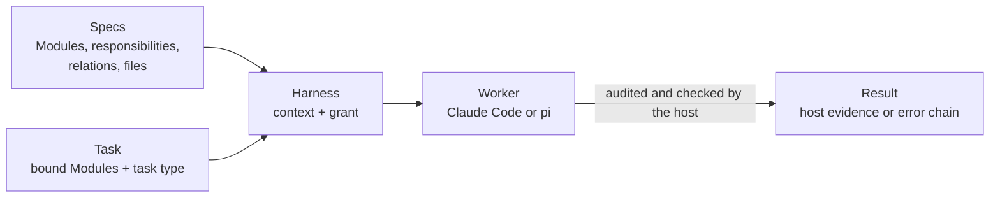

<p align="center">
  
</p>

<p align="center">
  <a href="https://github.com/FTOD/concorde/actions/workflows/validate-source-checkout.yml"></a>
  <a href="protocol/README.md"></a>
  <a href="#get-started"></a>
  <a href="LICENSE"></a>
</p>

<p align="center">
  <a href="#the-idea"><strong>The idea</strong></a> ·
  <a href="#why-concorde"><strong>Why Concorde</strong></a> ·
  <a href="#get-started"><strong>Get started</strong></a> ·
  <a href="https://ftod.github.io/concorde/"><strong>Docsite</strong></a> ·
  <a href="docs/using-concorde.md"><strong>Using Concorde</strong></a>
</p>

# Concorde

**Specs that harness your agents.**

Concorde is **spec-harnessed agent development**. Your project's Specs divide it into Modules and
say what each one is responsible for. Concorde turns that division of responsibility into the
**harness** of every AI agent that works on the project: the context it is given and the files it
may read and write. You work with your own Claude Code or pi session, the **main agent**; it splits
the work into tasks, and every worker it launches through Concorde runs inside the harness its
task's Modules define.

## The idea



1. **The Specs divide the responsibility.** Every Module states its purpose, its words, how it is
   used, how it is designed, which Modules it relates to and which files realize it.
2. **The division derives the harness.** A task binds some Modules and has one of six task types
   (`understand`, `specify`, `implement`, `test`, `review-spec`, `review-code`). From those alone
   Concorde computes the worker's **context**, the Specs, implementation files and tools it needs,
   and its **grant**, every path it may know by name, read or write. Everything else is denied.
3. **The host enforces and verifies.** The grant is compiled into the worker's own settings. After
   the worker stops, the host audits what it changed, runs the project's checks itself and keeps
   what it verified apart from what the worker claims.
4. **Failures travel up as an error chain.** A level that cannot handle an error adds a detailed
   link saying why and keeps what it received underneath, so the main agent, and you when a
   decision is yours, see the whole path.

Change the Specs and the harness changes with them: there is no separate permission file to keep in
step.

## Why Concorde

- **Architecture-aware Specs.** Module documents follow the independent
  [Spec Protocol](protocol/README.md) and explain the architecture to a reader who does not know the
  code. A human understands the project from them; an agent receives the same text as its context,
  so both work from one description. The docsite publishes them.
- **Just the context a task needs.** A worker sees what its Modules declare, one level deep, and no
  more. It never infers a missing promise from the code: it stops with a **Spec gap**, and the Spec
  is changed first.
- **Verified, not trusted.** Every Operation returns one JSON result where `host_evidence` (the
  grant, the write audit, each check with its exit code and log) is kept apart from `worker`, which
  is only a claim.
- **Tasks that can run side by side.** Each task is a branch with its own worktree, record and
  decision log. Tasks whose Modules and shared files do not overlap run at once in task sessions,
  and `concorde task merge` merges them one at a time and re-validates the result.
- **Spec tooling that stands alone.** `concorde validate`, `concorde grant` and the local stdio MCP
  server `concorde spec-mcp` answer from the Specs of one worktree without calling a model, so any
  agent can ask which Modules exist, what a Module's context is and what a task may touch.
- **Claude Code and pi.** One grant is compiled into each backend: Claude Code deny rules, a write
  hook and its Bash sandbox, or a pi permission extension on the same sandbox engine. In pi the
  main agent also sees every run in [pi-subagents](https://github.com/nicobailon/pi-subagents)'
  FleetView. Worker models are yours to choose, for all workers or one Operation's.

These layers guard against scope drift and mistakes, not a malicious actor; the
[Harness](specs/concorde/harness/module.md) Spec states their limits.

## How work flows

- **You** decide the direction and answer the questions with a major impact.
- **The main agent** discusses the project with you, opens a task for each agreed change, works
  inside its worktree or starts a task session for it, reads the results, keeps the decision log
  and merges what was delivered.
- **Operations** carry out bounded steps. The deterministic **Operation host** computes the grant,
  launches a headless `claude -p` or `pi -p` worker inside it, audits the worker and writes the
  result; `validate` and `delivery` run no worker at all.

A typical change, as the main agent runs it:

```bash
concorde task open retry --goal "limit payment retries" --modules module.payments
concorde run understand --task retry --goal "how should retries be limited?" --plan
concorde run specify    --task retry --intent "state the retry limit"
concorde run implement  --task retry --goal "implement the retry limit"
concorde run validate   --task retry
concorde run delivery   --task retry
concorde task merge retry
```

## Get started

Install Concorde into a Git project and initialize its first Spec:

```bash
python3 /path/to/concorde/scripts/concorde.py build
python3 /path/to/concorde/scripts/install-concorde.py /path/to/project   # add --pi for pi
cd /path/to/project
.concorde/bin/concorde init --propose --name "My project" > /tmp/proposal.json
jq .result /tmp/proposal.json > /tmp/accepted.json   # inspect it first
.concorde/bin/concorde init --apply --proposal /tmp/accepted.json
.concorde/bin/concorde validate
```

The installer places the runtime under `.concorde/framework/`, the `.concorde/bin/concorde`
command, the Protocol copy under `.concorde/protocol/`, the main agent's guidance (a Claude Code
skill and a block in `CLAUDE.md`) and the pinned [`d2`](https://github.com/d2lang/d2) program that
renders your Specs' diagrams. With `--pi` it also places the locked pi runtime, the pi run view and
the pi skill. It never writes your Specs. Then open Claude Code or pi in the project and talk to it:
it is now the main agent.

[Using Concorde](docs/using-concorde.md) walks through installation, the first Spec, worker models,
tasks, results and error chains in detail.

## The docsite

The **[published docsite](https://ftod.github.io/concorde/)** opens on Concorde's user documents
under [`docs/`](docs/README.md), then renders Concorde's own Specs and the Spec Protocol. To
preview it locally with Node.js 20+ and the [`d2`](https://github.com/d2lang/d2/releases) program
on `PATH`:

```bash
python3 scripts/concorde.py build
npm --prefix docsite ci
npm --prefix docsite run start -- --host 127.0.0.1 --no-open
```

For your own project, [scaffold a docsite](docsite/README.md#scaffold-a-docsite) with
`concorde docsite --propose` and then `--apply`.

## The Spec Protocol in brief

Concorde's independent **[Spec Protocol 13.0.0](protocol/README.md)** has two purposes: a human
understands a project's backbone from its Specs without reading code, and a harness derives from
the Specs exactly what each AI task may read and write. A Module's entry answers five questions in
order — **Purpose**, **Terminology**, **Usage**, **Design**, **Relationships** — and every node and
relation is declared exactly once. A Module's context is computed from its own declarations, one
level deep, and its write sets are its own documents and the files its realizations bind. The
Protocol also defines the six **task types** and the access level each assigns to every boundary
set. A project needs neither Concorde nor a particular agent runtime to use it.

## Develop Concorde

```bash
uv sync --locked --group dev
python3 scripts/concorde.py build
python3 scripts/concorde.py build --check
python3 scripts/concorde.py validate
.venv/bin/python -m pytest                          # parallel by default; -n 0 runs in-process
CONCORDE_LIVE_CLAUDE=1 .venv/bin/python -m pytest tests/concorde/harness/workers/test_live.py
CONCORDE_LIVE_PI=1 .venv/bin/python -m pytest tests/concorde/harness/workers/test_pi_live.py
```

The last two commands run a real worker to check what only the agent itself enforces: the first
needs a logged-in Claude Code and costs a few cents; the second needs a configured pi
(`CONCORDE_LIVE_PI_MODEL` names the model) and the pi runtime, from `install-concorde.py --pi` or
`CONCORDE_SANDBOX_RUNTIME`. Never edit build output under `generated/`; change the
sources (`prompts/`, `protocol/`, `src/`) and rebuild. See the [source-checkout rules](AGENTS.md) and
[Concorde's own Specs](specs/concorde/module.md).

---

[MIT licensed](LICENSE). Built with Concorde's own [Specs](specs/concorde/module.md).
