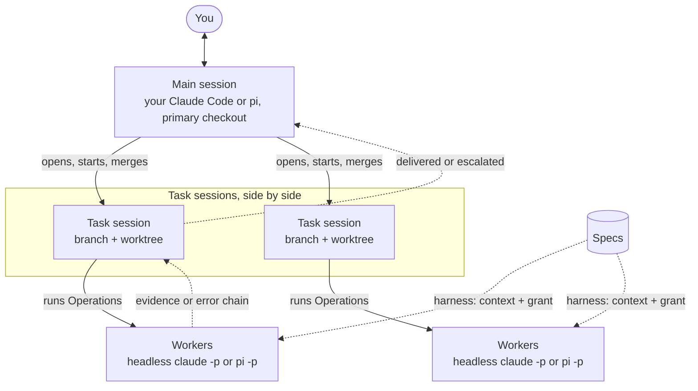

<p align="center">
  
</p>

<p align="center">
  <a href="https://github.com/FTOD/concorde/actions/workflows/validate-source-checkout.yml"></a>
  <a href="protocol/README.md"></a>
  <a href="#get-started"></a>
  <a href="LICENSE"></a>
</p>

<p align="center">
  <a href="#the-idea"><strong>The idea</strong></a> ·
  <a href="#why-concorde"><strong>Why Concorde</strong></a> ·
  <a href="#get-started"><strong>Get started</strong></a> ·
  <a href="https://ftod.github.io/concorde/"><strong>Docsite</strong></a> ·
  <a href="docs/using-concorde.md"><strong>Using Concorde</strong></a>
</p>

# Concorde

**Specs that harness your agents.**

Concorde is **spec-harnessed agent development**. Your project's Specs divide it into Modules and
say what each one is responsible for. Concorde turns that division of responsibility into the
**harness** of every AI agent that works on the project: the context it is given and the files it
may read and write. You work with your own Claude Code or pi session, the **main agent**; it splits
the work into tasks, and every worker it launches through Concorde runs inside the harness its
task's Modules define.

## The idea

Concorde organizes the AI work on a project in three levels, and the project's Specs shape every
one of them.



**The main session: the project.** You work with your own Claude Code or pi session in the
project's primary checkout; Concorde's installed guidance makes it the **main agent**. It discusses
the project with you from the Specs, which describe every Module's purpose, usage, design,
relations and files to a human and an agent alike. It splits the agreed work into tasks, decides
the ordinary things itself and writes them into each task's decision log, asks you only about
decisions with a major impact, and merges what was delivered. It never edits the primary checkout's
sources.

**Task sessions: one per task, in parallel.** A task is a branch with its own worktree, record and
decision log, and Concorde manages the worktree for you: `concorde task open` creates it for the
task's goal and Modules, and `concorde task merge` takes a lock, merges the branch, validates the
result, undoes the merge if validation fails, and removes the worktree. For work split into several
tasks, the main agent starts one task session per task, on its own program and configuration, and
tasks whose Modules and shared files do not overlap run at once. A task session may write only its
own task: it changes Specs and code in the worktree, commits verified steps, runs `validate` and
`delivery`, and reports back when it has delivered or needs a decision beyond its task. A single
task the main agent can also carry out itself inside the worktree.

**Workers: one bounded step, inside a harness.** For a bounded step, a task runs an Operation: the
deterministic Operation host launches a headless `claude -p` or `pi -p` worker for one task type
(`understand`, `specify`, `implement`, `test`, `review-spec`, `review-code` or `code-to-spec`). Its
**harness** comes from the Specs. From the task's Modules and the task type alone, Concorde
computes the worker's **context**, the Specs, implementation files and tools it needs, and its
**grant**, every path it may know by name, read or write, and compiles the grant into the worker's
own settings. Everything else is denied. A worker never touches Git, never starts other agents and
never infers a missing promise from the code: it stops with a **Spec gap**, and the Spec is changed
first.

What travels back up is just as structured:

- **Evidence, not claims.** When a worker stops, the host audits what it wrote against the grant
  and runs the project's checks itself. The Operation's JSON result keeps this `host_evidence`
  apart from `worker`, which is only the worker's claim. `validate` and `delivery` run no worker at
  all, and `delivery` validates the whole task again before it may be merged.
- **Error chains, not bare failures.** A level that cannot handle an error, whether the worker, the
  Operation, the task session or the main agent, adds a link saying what failed, its evidence and
  why this level cannot handle it (a missing permission, a decision that is not its own, work
  outside its task), and keeps the error it received underneath. When a question reaches you, you
  see the whole path from where the error started to the decision you are asked for.

Change the Specs and the harness changes with them: there is no separate permission file to keep in
step.

A typical change: the main agent opens the task, the task's steps run in its worktree, and the main
agent merges it.

```bash
concorde task open retry --goal "limit payment retries" --modules module.payments
concorde run understand --task retry --goal "how should retries be limited?" --plan
concorde run specify    --task retry --intent "state the retry limit"
concorde run implement  --task retry --goal "implement the retry limit"
concorde run validate   --task retry
concorde run delivery   --task retry
concorde task merge retry
```

## Why Concorde

- **Architecture-aware Specs.** Module documents follow the independent
  [Spec Protocol](protocol/README.md) and explain the architecture to a reader who does not know the
  code. A human understands the project from them; an agent receives the same text as its context,
  so both work from one description. The docsite publishes them.
- **Just the context a task needs.** A worker sees what its Modules declare, one level deep, and no
  more.
- **Spec tooling that stands alone.** `concorde validate`, `concorde grant` and the local stdio MCP
  server `concorde spec-mcp` answer from the Specs of one worktree without calling a model, so any
  agent can ask which Modules exist, what a Module's context is and what a task may touch.
- **Claude Code and pi.** One grant is compiled into each backend: Claude Code deny rules, a write
  hook and its Bash sandbox, or a pi permission extension on the same sandbox engine. In pi the
  main agent also sees every run in [pi-subagents](https://github.com/nicobailon/pi-subagents)'
  FleetView. Worker models are yours to choose, for all workers or one Operation's.

These layers guard against scope drift and mistakes, not a malicious actor; the
[Harness](specs/concorde/harness/module.md) Spec states their limits.

## Get started

Install Concorde into a Git project and initialize its first Spec:

```bash
python3 /path/to/concorde/scripts/concorde.py build
python3 /path/to/concorde/scripts/install-concorde.py /path/to/project   # add --pi for pi
cd /path/to/project
.concorde/bin/concorde init --propose --name "My project" > /tmp/proposal.json
jq .result /tmp/proposal.json > /tmp/accepted.json   # inspect it first
.concorde/bin/concorde init --apply --proposal /tmp/accepted.json
.concorde/bin/concorde validate
```

The installer places the runtime under `.concorde/framework/`, the `.concorde/bin/concorde`
command, the Protocol copy under `.concorde/protocol/`, the main agent's guidance (a Claude Code
skill and a block in `CLAUDE.md`) and the pinned [`d2`](https://github.com/d2lang/d2) program that
renders your Specs' diagrams. With `--pi` it also places the locked pi runtime, the pi run view and
the pi skill. It never writes your Specs. Then open Claude Code or pi in the project and talk to it:
it is now the main agent.

[Using Concorde](docs/using-concorde.md) walks through installation, the first Spec, worker models,
tasks, results and error chains in detail.

## The docsite

The **[published docsite](https://ftod.github.io/concorde/)** opens on Concorde's user documents
under [`docs/`](docs/README.md), then renders Concorde's own Specs and the Spec Protocol. To
preview it locally with Node.js 20+ and the [`d2`](https://github.com/d2lang/d2/releases) program
on `PATH`:

```bash
python3 scripts/concorde.py build
npm --prefix docsite ci
npm --prefix docsite run start -- --host 127.0.0.1 --no-open
```

For your own project, [scaffold a docsite](docsite/README.md#scaffold-a-docsite) with
`concorde docsite --propose` and then `--apply`.

## The Spec Protocol in brief

Concorde's independent **[Spec Protocol 14.0.0](protocol/README.md)** has two purposes: a human
understands a project's backbone from its Specs without reading code, and a harness derives from
the Specs exactly what each AI task may read and write. A Module's entry answers four questions in
order — **Purpose**, **Terminology**, **Usage** and **Design**, where Design shows how the Module
is built inside and how it works with the Modules around it — and every node and
relation is declared exactly once. A Module's context is computed from its own declarations, one
level deep, and its write sets are its own documents and the files its realizations bind. The
Protocol also defines the six **task types** and the access level each assigns to every boundary
set. A project needs neither Concorde nor a particular agent runtime to use it.

## Develop Concorde

```bash
uv sync --locked --group dev
python3 scripts/concorde.py build
python3 scripts/concorde.py build --check
python3 scripts/concorde.py validate
.venv/bin/python -m pytest                          # parallel by default; -n 0 runs in-process
CONCORDE_LIVE_CLAUDE=1 .venv/bin/python -m pytest tests/concorde/harness/workers/test_live.py
CONCORDE_LIVE_PI=1 .venv/bin/python -m pytest tests/concorde/harness/workers/test_pi_live.py
```

The last two commands run a real worker to check what only the agent itself enforces: the first
needs a logged-in Claude Code and costs a few cents; the second needs a configured pi
(`CONCORDE_LIVE_PI_MODEL` names the model) and the pi runtime, from `install-concorde.py --pi` or
`CONCORDE_SANDBOX_RUNTIME`. Never edit build output under `generated/`; change the
sources (`prompts/`, `protocol/`, `src/`) and rebuild. See the [source-checkout rules](AGENTS.md) and
[Concorde's own Specs](specs/concorde/module.md).

---

[MIT licensed](LICENSE). Built with Concorde's own [Specs](specs/concorde/module.md).
