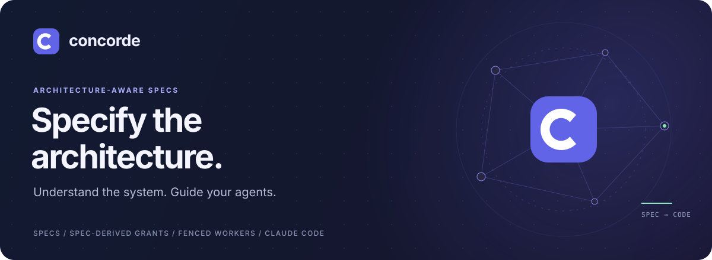
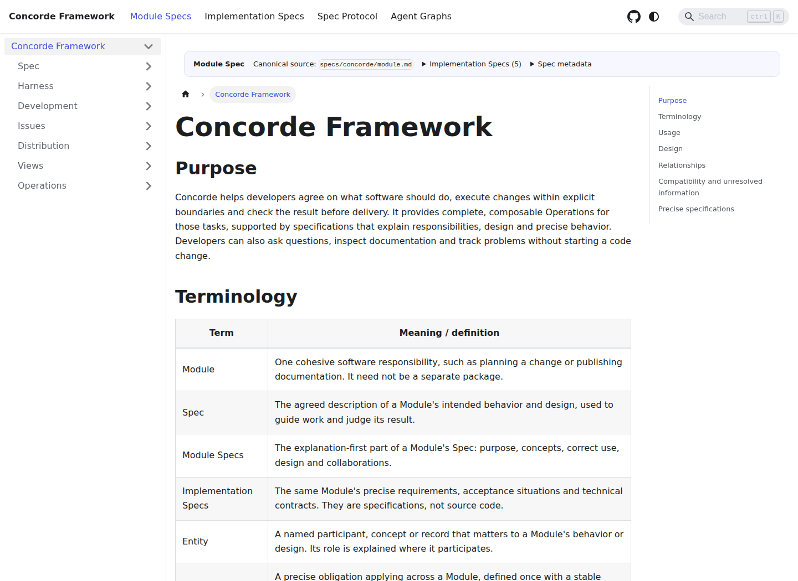
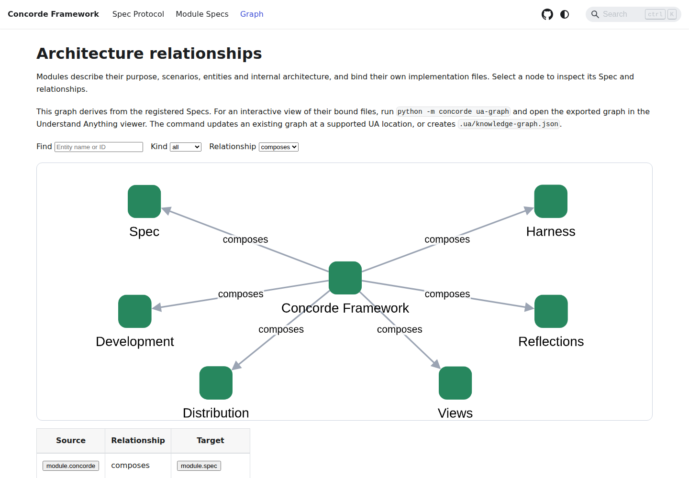
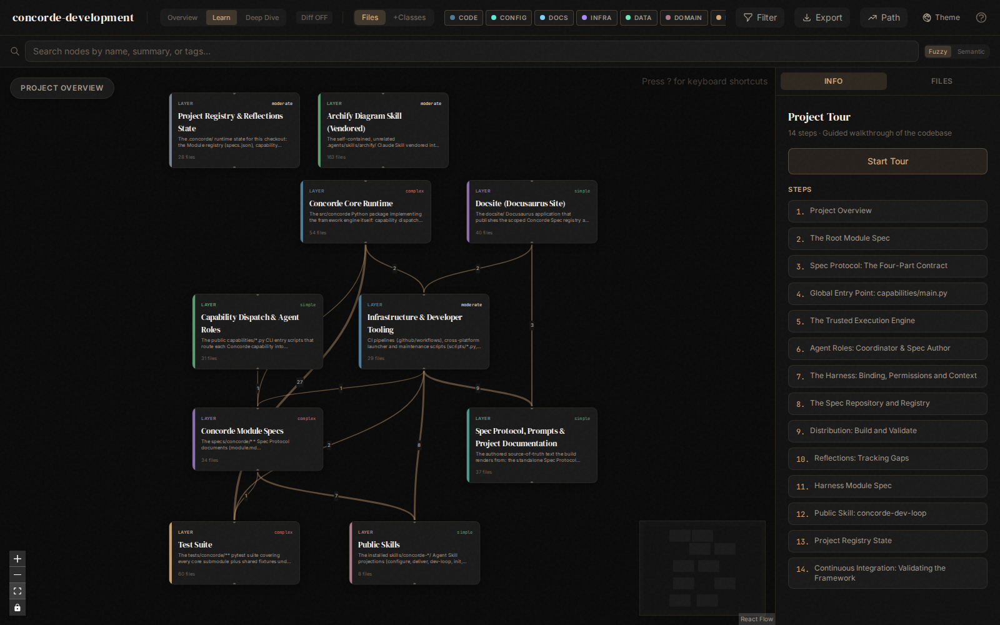
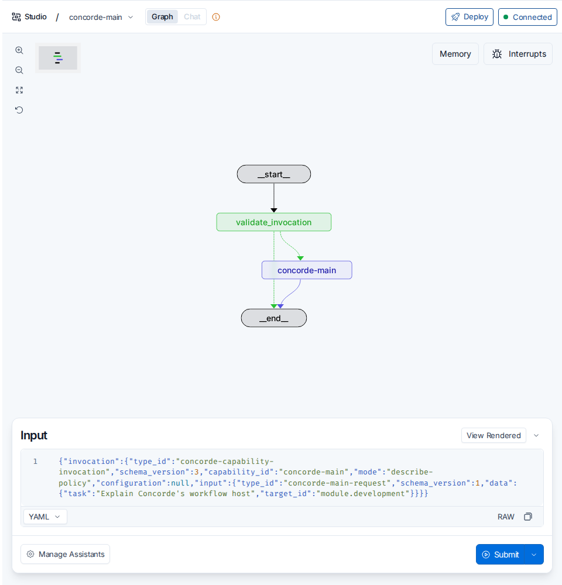

<p align="center">
  
</p>

<p align="center">
  <a href="https://github.com/FTOD/concorde/actions/workflows/validate-source-checkout.yml"></a>
  <a href="protocol/README.md"></a>
  <a href="#get-started"></a>
  <a href="LICENSE"></a>
</p>

<p align="center">
  <a href="#why-concorde"><strong>Why Concorde</strong></a> ·
  <a href="#get-started"><strong>Get started</strong></a> ·
  <a href="#explore-concorde"><strong>Docs, graphs & Studio</strong></a> ·
  <a href="https://ftod.github.io/concorde/"><strong>Explore the Specs</strong></a> ·
  <a href="docs/workflow-guide.md"><strong>Workflow guide</strong></a>
</p>

# Concorde

**Architecture-aware Specs, project understanding, and scoped agents for Codex and Claude.**

Concorde helps you write and maintain software Specs that explain both behavior and architecture:
what each Module is responsible for, how its entities relate, what it depends on, and which files
realize it. These Specs give people a way to understand the project and agents a clear contract
to work within as the software evolves.

The framework brings together a Spec docsite, an Understand Anything graph view, LangGraph Studio
support for observing agent execution, explicit agent context and permissions, and a small set of
built-in agents for specification and development. A reflection system retains feedback and Spec
gaps so they can be investigated and carried into future improvements.

## Why Concorde

### 1. Write and maintain architecture-aware Specs

A Module Spec describes purpose, requirements, scenarios and architecture together. Its entities,
relationships, dependencies and implementation file bindings make software structure explicit.
Concorde supports authoring, reviewing and updating these Specs, checking their consistency, and
tracking which Module contracts are affected as shared code changes.

### 2. Understand the project and observe agent execution

The **[docsite](docsite/README.md)** publishes Specs with Module navigation, composition and
dependency graphs, and inline architecture diagrams. The **[Understand Anything graph
view](viewer/README.md)** lets you explore an existing code graph; Concorde can export a graph
from its Spec registry or overlay Module structure onto an existing graph. Opening the viewer
does not itself analyze code or generate a graph.

**Agent observability** covers the working process as well as its results. Concorde supports
**[LangGraph Studio](scripts/development/STUDIO.md)** to inspect execution graphs and follow live
stage and agent-process events: when work starts, finishes or fails. Recorded context, permission
policies, checks and reviews show what each agent could see and change and what evidence supports
its work. Studio is an optional interface for running and debugging these same workflows.

### 3. Guide agents with Specs and explicit permissions

Each subagent should receive the information and authority its task needs. A bounded task gets
its Module's complete Spec collection, with file access narrowed by phase. Planners reason from
the Spec; code writers receive the declared implementation files. The host enforces these
boundaries, and a dependency never silently imports another Module's context.

The design premise is that good results within these limits increase confidence in both the
solution and the architecture: the agent can work from the declared contract without relying on
hidden implementation knowledge or changes outside its responsibility. That is useful evidence
that the Spec is sufficient and the Modules are well decoupled. It is not a proof of correctness;
tests and review still matter. Missing promises are reported as Spec gaps.

### 4. Use built-in agents for everyday development

Concorde includes three basic agents: a **coordinator** for questions, routing and topology design;
a **Spec engineer** for authoring, reviewing, planning and task definition; and a **programmer** for
implementation, code review and investigation. Public Skills compose them into workflows with
explicit context and permissions for each invocation.

### 5. Turn feedback into tracked improvements

The **[reflection system](specs/concorde/reflections/module.md)** keeps project feedback and
persistent Spec gaps as records attributed to a Module or scenario. Use
`concorde-reflections-triage` to inspect the queue, capture selected gaps, investigate problems and
turn an approved resolution into a fresh development task.

Each record retains the observation, evidence, investigation and developer comments, so the
problem remains available across sessions. Investigation uses the responsible Module's context
and authorized files. Developers explicitly decide whether to resolve or dismiss a report;
finishing a repair does not automatically close it.

## A development workflow using these foundations

```text
Request → Route → Specify → Review Spec → Plan → Tasks → Implement → Validate / Review
                                                                         ↓
                                                                   Ready candidate
                                                                         ↓
                                                             Deliver → Merge on request
```

The default development loop authors the Spec and runs reviews. `specify=false` uses the existing
Spec; `run_reviews=false` records explicit review skips. A skipped review remains distinguishable
from a successful one. Missing contracts and failed checks preserve inspectable progress for the
next invocation.

You can also ask questions against selected Specs or run a standalone Spec or code review without
starting a development change.

## Get started

You need a Git project, Python **3.11+**, Node.js **18+** and npm for the installer-managed runtime,
plus your chosen agent client. Configured checks currently require **Linux with bubblewrap**,
working namespaces and pidfd support. The optional docsite requires Node.js **20+**.

**1. Clone and build Concorde.**

```bash
git clone https://github.com/FTOD/concorde.git
cd concorde
python3 scripts/concorde.py build
```

**2. Preview the installation into your project, then apply it.** Replace `/absolute/path/to/project`
with your existing Git project's path; use `claude` instead of `codex` for Claude.

```bash
python3 scripts/install-concorde.py --target /absolute/path/to/project --integration codex --preview
python3 scripts/install-concorde.py --target /absolute/path/to/project --integration codex --apply
```

The installer provisions the locked runtime, installs the public Skills and adds Protocol guidance
to the selected root instruction file. It preserves user content outside its owned entries.

**3. Open an agent session in your project and initialize it.**

```text
Use concorde-init to initialize this project. Propose the setup for my review.
```

Apply the reviewed proposal, then define the root Module's Purpose, Requirements, Scenarios and
Ontology. Initialization creates an honest stub; unresolved behavior still needs to be specified.
Commit the installed framework and root guidance so candidate worktrees inherit them.

**4. Explore and evolve your project.**

Use `concorde-main` to ask questions against selected Specs or design Module topology. Publish
the [docsite](docsite/README.md#scaffold-a-docsite) to browse the architecture. For a development
change, use the built-in loop:

```text
Use concorde-dev-loop to implement the next change described below: …
```

The host prepares a candidate worktree from committed HEAD. Continue in the fresh session it
hands off, with that worktree's own instructions. See the
[workflow guide](docs/workflow-guide.md#install-and-initialize) for typed JSON invocations,
initialization details and session handoffs.

## Explore Concorde

Try **[Concorde's published docsite](https://ftod.github.io/concorde/)**. The screenshots below
show Concorde's own Specs, graph data and local Studio integration
([screenshot sources](docs/assets/README.md)). Commands in this section run
from the Concorde repository root unless an installed-project example is explicitly labeled.

### Run the docsite

With Node.js **20+**, preview the registered Specs locally:

```bash
python3 scripts/concorde.py build
npm --prefix docsite ci
npm --prefix docsite run start -- --host 127.0.0.1 --no-open
```

Open [localhost:3000/concorde/](http://localhost:3000/concorde/). Use **Module Specs** to navigate
the Module tree and read each Module's purpose, requirements, scenarios and architecture diagrams.
The **Spec Protocol** tab explains the specification language. To create a verified static site,
run `npm --prefix docsite run build`; the output is `docsite/build/`.



For another initialized project, follow [Scaffold a docsite](docsite/README.md#scaffold-a-docsite),
then run the same npm commands from that project's root. Its URL follows `docsite/site.json`.

### Use the graph views

**Module architecture:** open the docsite's **[Graph tab](https://ftod.github.io/concorde/graph)**.
Search by Module name or ID, filter relationships with **composes**, **uses** or **requires**, and
select a node to inspect its declared files and follow the link to its Spec. Drag nodes and zoom
to explore.



**Code relationships:** open the Understand Anything viewer. In this source checkout, install
the pinned viewer and export a graph from Concorde's Spec registry:

```bash
npm --prefix viewer ci --ignore-scripts
python3 scripts/concorde.py ua-graph --allow-primary-worktree
node viewer/node_modules/understand-anything-viewer/bin/viewer.mjs . --no-open
```

Open the complete **Dashboard URL** printed by the viewer, including its access token. Select a
layer to explore its files, search for a node, and select it to inspect details and connections.
Use **Fit View** to recenter, or **Learn** and **Start Tour** when the loaded graph includes a tour.

The exporter creates a Spec-derived graph when none exists, or overlays Module structure onto an
existing Understand Anything graph. It does not analyze source code. The screenshot uses
Concorde's existing Understand Anything analysis, which includes code relationships and a tour.
The `--allow-primary-worktree` flag explicitly allows this graph export in the primary checkout.



In a project where Concorde is **installed**, use its managed viewer instead. Run from that
project's root:

```bash
python3 .concorde/framework/scripts/concorde.py ua-graph --allow-primary-worktree
python3 .concorde/framework/scripts/run-ua-graph-viewer.py --project-root . --no-open
```

See the [graph exporter](specs/concorde/views/ua-graph.md) and
[viewer guide](viewer/README.md) for graph locations and runtime details.

### Observe runs in LangGraph Studio

Start Concorde's local Agent Server using the locked Studio dependencies:

```bash
uv sync --locked --group studio
python3 scripts/concorde.py build
uv run --locked --group studio langgraph dev \
  --config generated/langgraph.json --host 127.0.0.1 --port 2024 \
  --n-jobs-per-worker 1 --no-browser
```

Open **[LangGraph Studio](https://smith.langchain.com/studio/?baseUrl=http://127.0.0.1:2024)**
and sign in to LangSmith for run interactions. Allow access to the local network if your browser
asks. Select **concorde-main**, create a new thread, choose **View Raw** in the input editor, and
submit this policy preview:

```json
{
  "invocation": {
    "type_id": "concorde-capability-invocation",
    "schema_version": 3,
    "capability_id": "concorde-main",
    "mode": "describe-policy",
    "configuration": null,
    "input": {
      "type_id": "concorde-main-request",
      "schema_version": 1,
      "data": {
        "task": "Explain Concorde's workflow host",
        "target_id": "module.development"
      }
    }
  }
}
```

This inspects admitted permissions without starting an agent. Change `mode` to `execute` to run
the question through the project's configured Codex or Claude runtime. Inspect **result**,
**policies** and **events** in the state; execution emits capability, stage and agent-process
events, including starts, completions and failures. These are process events, not token-level
traces of the agent's internal reasoning or tool calls.



The screenshot shows the connected graph and input setup, before submitting a run.

To observe new CLI or Skill invocations in Studio, set this in the shell that launches them:

```bash
export CONCORDE_STUDIO_URL=http://127.0.0.1:2024
```

Keep using the usual Skills and JSON requests. The launcher prints the Studio thread and run IDs
to stderr; open that thread in Studio. The caller and server must belong to the same project and
worktree. `unset CONCORDE_STUDIO_URL` restores local execution without the server.

See the [Studio guide](scripts/development/STUDIO.md) for debugging, results and setup in
[installed consumer projects](scripts/development/STUDIO.md#consumer-project-setup), and the
[official Studio setup](https://docs.langchain.com/oss/python/langgraph/studio) for account setup.

## The contract at the center

Concorde's independent **Spec Protocol 5.0.0** defines one specification category: a **Module Spec**.
A Module describes a cohesive software responsibility; its implementation may span packages,
services or shared files. Each Spec document has one owning Module. A Module's explicit
`references` includes other Module-owned documents or one registered document, expanded once;
Markdown links remain navigation. Shared interfaces have one definition and local participant bindings.

The repository's authored Specs now target Protocol 5/Profile 12/registry schema 4. Runtime
admission, context serialization and publication migration remain incomplete; see the
[Spec implementation status](specs/concorde/spec/registry.md#stable-id-spec-context-queries).
A successful rule build alone does not establish runtime support.

| Part | The question it answers |
| :--- | :--- |
| **Purpose** | What is this Module for, and who uses it? |
| **Requirements** | What must it guarantee? Each requirement is one decidable `SHALL` statement. |
| **Scenarios** | What happens in a concrete situation? Testable `GIVEN` / `WHEN` / `THEN` steps. |
| **Ontology** | What exists, how does it relate, and which files realize it? Entities and labeled relationships. |

Tests declare the scenarios they verify. Concorde derives coverage from those declarations;
structural validation and declared coverage provide evidence, without proving semantic completeness.

Read the [Protocol](protocol/README.md), start from the
[Module template](protocol/templates/module.md), or explore
[Concorde's own Module Spec](specs/concorde/module.md) to see it applied to this repository.

## Choose an entry point

| You want to… | Use |
| :--- | :--- |
| Ask about the system or design its topology | `concorde-main` |
| Take a change through specification, implementation and checks | `concorde-dev-loop` |
| Review a Spec or diagnose code in a fresh read-only invocation | `concorde-review` |
| Track feedback and Spec gaps, investigate problems and act on approved resolutions | `concorde-reflections-triage` |
| Initialize or configure a project | `concorde-init` · `concorde-configure` |
| Validate a candidate or deliver a verified change | `concorde-validate` · `concorde-deliver` |

These eight public Skills expose the global and lifecycle capabilities. Internal stages are
composed by the host. See the [capability registry](specs/concorde/development/capabilities.md)
for the full interface.

## Agents, capabilities and executable entry points

Concorde currently defines **3 Agents with 12 task modes, 13 capabilities, 8 public Skills and
3 Harnesses**. Capabilities orchestrate execution; Agents perform the steps that need model
judgment. Public Skills provide instructions for invoking those capabilities from the developer's
agent client.

### Agents and task modes

| Agent | Modes | Responsibility and authority |
| :--- | :--- | :--- |
| `coordinator` | `ask`, `route`, `design-topology` | Answer questions, route tasks and design topology from selected complete Module Specs; read-only, with no implementation contents. |
| `spec-engineer` | `specify`, `context-solve`, `plan`, `tasks`, `spec-review`, `topology-author` | Author and review Specs, assess information sufficiency, and define plans and tasks. Returns structured results; the host applies document changes. |
| `programmer` | `implementation`, `code-review`, `investigation` | Implement tasks, review code and investigate problems. Only `implementation` may write the selected Module's implementation files. |

Definitions live in [agents/](agents/__init__.py). Each mode has its own task contract, and each
invocation receives fresh, explicitly bounded context and permissions.

### Capability inventory

| Class | Capability | Behavior | Public Skill |
| :--- | :--- | :--- | :--- |
| Global | `main` | Answer questions, route requests, and design and apply accepted topology changes. | `concorde-main` |
| Global | `dev-loop` | Route a change through specification, planning, implementation, validation and review to a ready candidate. | `concorde-dev-loop` |
| Global | `review` | Run a standalone Spec or code review, including source diagnosis. | `concorde-review` |
| Global | `reflections-triage` | Inspect feedback, capture gaps, investigate, implement resolutions and manage owned records. | `concorde-reflections-triage` |
| Lifecycle | `init` | Propose and apply project initialization with a pinned Protocol. | `concorde-init` |
| Lifecycle | `configure` | Apply integration and enforcement configuration. | `concorde-configure` |
| Lifecycle | `validate` | Run deterministic Spec and configured code checks and record readiness. | `concorde-validate` |
| Lifecycle | `deliver` | Stage a verified candidate on its own branch and clean up; merge into the primary branch on a separate explicit request. | `concorde-deliver` |
| Stage | `specify` | Author Spec replacements for the bound Module. | — |
| Stage | `context-solve` | Validate Module participant routing and assess context sufficiency. | — |
| Stage | `plan` | Assess sufficiency and produce a revision-bound plan. | — |
| Stage | `tasks` | Derive acceptance tasks from the accepted plan. | — |
| Stage | `implement` | Implement component tasks or coordinate participating components. | — |

The four lifecycle capabilities make no model calls; the other nine may call a model. The eight
public Skills each expose one global or lifecycle capability. The five stages have no standalone
launcher and are reachable only through declared host composition. Current Agents have no admitted
Capability references of their own; the host composes the workflows.

The source inventory is [capabilities/](capabilities/__init__.py); the
[capability registry](specs/concorde/development/capabilities.md) describes the contracts.

### Harnesses and native tools

| Harness | Agent | Execution environment |
| :--- | :--- | :--- |
| `discovery-capsule` | `coordinator` | Frozen discovery and routing context. |
| `spec-capsule` | `spec-engineer` | Frozen Module Spec context. |
| `implementation-workspace` | `programmer` | Project implementation workspace with access restricted by the selected mode and host grant. |

All three declare `native.filesystem` and `native.shell` Tool interfaces and support Codex and
Claude integrations. The Harness and mode define authority ceilings; the host grants concrete
access for each invocation. See the [Harness definitions](src/concorde/harness/harness.py).

### Launchers and supporting tools

Commands below are relative to this source checkout. Installed projects use the corresponding
scripts under `.concorde/framework/`; Studio and development setup are documented separately.

| Entry point | Available operations |
| :--- | :--- |
| `python3 scripts/run-capability.py <skill> < invocation.json` | Invoke one of the eight public capabilities using a typed JSON request, in `execute` or `describe-policy` mode. |
| `python3 scripts/concorde.py <command>` | `validate`, `build`, `docsite`, `ua-graph`, `protocol-manifest`. |
| [LangGraph Studio](scripts/development/STUDIO.md) | Start, observe and debug the same eight public workflows through the shared CapabilityHost. |
| `python3 scripts/install-concorde.py` | Preview or apply installation into a project. |
| `python3 scripts/reflections_queue.py` | Query and maintain the reflection queue. |
| `python3 scripts/run-ua-graph-viewer.py` | Launch the code graph viewer. |
| `npm --prefix docsite run <script>` | `start`, `build`, `validate`, `typecheck`, `test`, `check`. |
| `python3 scripts/development/run-tests.py` | Run the project's test suite. |
| `python3 scripts/worktree-guard.py` | Explain or check the source-checkout worktree policy. |

The CLI `validate` command performs direct validation. The `concorde-validate` capability also
manages candidate readiness evidence as part of the lifecycle. Studio uses the same host and
capabilities as the CLI and Skills.

## Explore and contribute

- **[Spec explorer](https://ftod.github.io/concorde/)** — published Protocol, Module contracts and relationship graphs.
- **[Workflow guide](docs/workflow-guide.md)** — JSON requests, review, delivery, enforcement and Protocol upgrades.
- **[LangGraph Studio](scripts/development/STUDIO.md)** — execution graphs, live events and debugging.
- **[Docsite](docsite/README.md) · [Code viewer](viewer/README.md)** — publish Specs and inspect an existing Understand Anything graph. Launching the viewer does not generate or validate that graph.
- **[Source-checkout policy](AGENTS.md)** — worktree ownership, maintenance and generated-output rules.

For source development, install the locked dependencies and run the deterministic checks:

```bash
uv sync --locked --group dev
python3 scripts/concorde.py build
python3 scripts/concorde.py build --check
python3 scripts/concorde.py validate
python3 scripts/development/run-tests.py
```

See [development details](docs/workflow-guide.md#development) for targeted tests and docsite checks.

---

[MIT licensed](LICENSE). Built with Concorde's own [Specs](specs/concorde/module.md).
