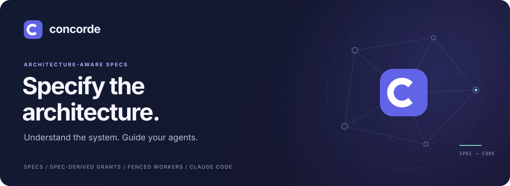

# Concorde



**Specs that harness your agents.**

Concorde is spec-harnessed agent development. Your project's Specs divide it into Modules and say
what each one is responsible for; Concorde turns that division of responsibility into the harness
of every AI agent that works on the project: the context it is given and the files it may read and
write. Your Claude Code session, the main agent, splits the work into tasks, and every worker it
launches through Concorde, on pi or on Claude Code, runs inside the harness its task's Modules
define.

New here? Start with **[Using Concorde](using-concorde.md)**.

## From responsibility to harness

1. **The Specs divide the responsibility.** Every Module states its purpose, its words, how it is
   used, and how it is designed: how it is built, how it works with other Modules and which files
   realize it.
2. **The division derives the harness.** A task binds some Modules and has one of eight task types:
   `understand`, `specify`, `implement`, `test`, `review-spec`, `review-code`, `code-to-spec` for
   describing code written before its Specs, and `review-architecture` for judging how the Modules
   divide the project from every Module's Specs. From those alone
   Concorde computes the worker's context, the Specs, the pinned documentation and source of the
   external dependencies they include, the implementation files and tools it needs, and its grant,
   every path it may know by name, read or write. Everything else is denied.
3. **The host enforces and verifies.** The grant is compiled into the worker's own settings. After
   the worker stops, the host audits what it changed, runs the project's checks itself and keeps
   what it verified apart from what the worker claims.
4. **Failures travel up as an error chain.** A level that cannot handle an error adds a detailed
   link saying why and keeps what it received underneath, so the main agent, and you when a
   decision is yours, see the whole path.

Change the Specs and the harness changes with them: there is no separate permission file to keep
in step.

## What you get

- **Architecture-aware Specs.** Module documents explain purpose, terminology, use and design,
  inside a Module and between Modules, to a reader who does not know the code, and tests declare the scenarios they
  verify. You understand the project from them; an agent receives the same text as its context.
  This site is built from them.
- **Just the context a task needs.** A worker sees what its Modules declare, one level deep, and
  no more. It never infers a missing promise from the code: it stops with a Spec gap, and the Spec
  is changed first. Only a codebase adopted after its code was written is described from its code,
  once, by the brownfield workflow, which reports doubtful intent as open questions.
- **Workers fenced by their own settings.** A Claude Code worker gets generated deny rules (which
  also bind its Bash sandbox), a write hook and a sandbox without network; a pi worker gets
  Concorde's permission extension on the same sandbox engine. Both have a cleared environment and
  a private configuration, and the host audits every round against the grant. These guard against
  drift and mistakes, not a malicious actor.
- **Verified, not trusted.** Every Operation returns one JSON result where `host_evidence` is kept
  apart from `worker`, which is only a claim, and every failure carries an error chain.
- **Tasks that can run side by side.** Each task is a branch with its own worktree, a record and a
  decision log. Tasks whose Modules and shared files do not overlap run at once in task sessions;
  `concorde task merge` merges them one at a time and validates the result again.
- **Spec tooling that stands alone.** `concorde spec-validation`, `concorde grant` and the stdio MCP
  server `concorde spec-mcp` answer from the Specs of one worktree without calling a model, so any
  agent can ask what a task may touch.

## One task from idea to merge

The main agent agrees the direction with you, then hands the work to a task session, even when
there is only one task; it decides ordinary questions itself and escalates only decisions with
major impact.

1. **Discuss and open.** Agree the change and open a task: a branch and worktree for the Modules
   it touches. The main agent starts a task session in that worktree, which carries the task
   through the next steps; the main agent never works inside the worktree itself.
2. **Understand and specify.** The task session runs `understand` to assess and plan, optionally
   `plan_review` to have its plan reviewed, and `specify` when the Spec must change first.
3. **Implement and test.** It runs `implement` and `test`; the host audits every write and runs
   the configured checks itself.
4. **Validate, deliver, merge.** `task-validation` previews readiness, `delivery` validates the
   whole task again and commits it, and the main agent's `concorde task merge` merges the branch,
   with the task's decision log, and closes the task.

The task session and the main agent talk in Claude Code messages, but each side records what it
says first, `concorde task report` and `concorde task answer`, in the task's record and decision
log, so a lost message loses nothing, and a task's merge or close answers every report still
unanswered. When the main agent's session name changes, as after a resume, it lists the tasks not
ended that name its former name with `concorde task list --main <former> --state
open,active,delivered,merging` and rebinds each with `concorde task rebind`; a task session whose
message reached nobody waits for that with `concorde task wait <task> --rebound <former>`.

A question that changes nothing, such as how a Module works today, needs no task: `understand`,
`spec_panel` and `code_review` also run from the primary worktree without one.

## Install into a Git project

Use Python 3.11+ and [uv](https://docs.astral.sh/uv/) on Linux with bubblewrap, a logged-in Claude
Code for the main agent and a configured [pi](https://github.com/earendil-works/pi) for workers that
run on pi. The installer places the
runtime, the `concorde` command, the Protocol copy and the main agent's guidance; it never writes
your Specs. It installs every part of Concorde, or with `--parts spec` (or any other list of parts)
only those and the parts they depend on.

```bash
git clone https://github.com/FTOD/concorde.git
cd concorde
python3 scripts/concorde.py build
python3 scripts/install-concorde.py /absolute/path/to/project

cd /absolute/path/to/project
.concorde/bin/concorde init --propose --name "My project"
```

[Using Concorde](using-concorde.md) continues from here.

## Commands

In an installed project the command is `.concorde/bin/concorde`; Operations and execution commands
print one JSON result. Run them inside a task's worktree, whose workspace binding names the task.

| Command                                                 | Use                                                                                 |
| ------------------------------------------------------- | ----------------------------------------------------------------------------------- |
| `concorde spec-validation`                              | Check every structural rule of the Specs.                                           |
| `concorde grant --modules <ids> --type <task type>`     | Print the grant of a task type for some Modules.                                    |
| `concorde spec-mcp`                                     | Run the local stdio MCP server rooted at the project.                               |
| `concorde project-mcp`                                  | Run the project MCP server: tasks, traces and locks as tools, with waking.          |
| `concorde task wait`                                    | Block until a task reaches a state or is rebound, a run ends or a lock is released. |
| `concorde task open\|list\|show\|session\|merge\|close` | Manage tasks: branch, worktree, record, decision log, task sessions, merges.        |
| `concorde task escalate`                                | Add the main agent's link on top of an error chain and record it.                   |
| `concorde task report\|answer`                          | Record a task session's report, or the main agent's answer, before the message.     |
| `concorde task rebind`                                  | Point a task's task sessions at the main agent's new session name.                  |
| `concorde run <operation>`                              | Run one Operation in the current workspace and print its result.                    |
| `concorde task-validation\|delivery\|scaffold`          | Run one execution command in the current workspace and print its result.            |
| `concorde issues report\|list\|show\|close`             | Record problems a task will not fix, so they survive it.                            |
| `concorde init --propose\|--apply`                      | Propose and apply a project's first Spec.                                           |
| `concorde docsite --propose\|--apply`                   | Scaffold a documentation site for the project's Specs.                              |

| Operation         | Result and boundary                                                                                                                  |
| ----------------- | ------------------------------------------------------------------------------------------------------------------------------------ |
| `understand`      | An assessment of the Modules and, when asked, a plan; reads Specs and only the names of code.                                        |
| `plan_review`     | (optional) Findings and a verdict on a plan the task session wrote; reads Specs and code.                                            |
| `specify`         | A change of the bound Modules' own Spec documents; structural validation afterwards.                                                 |
| `implement`       | A code change within the bound Modules' realization; configured checks with resume rounds.                                           |
| `test`            | The host's check results interpreted by a read-only worker.                                                                          |
| `spec_panel`      | Findings, recorded as Issues, and a verdict on the bound Modules' Specs, from a panel of reviewers, architects and a chair.          |
| `code_review`     | Findings, recorded as Issues, and a verdict on the task's code changes or, with `--scope module`, on each named Module's whole code. |
| `general`         | Free-form work under the grant of the task type `--type` names, and an independent review of the result against the instruction.     |
| `task-validation` | (command) Readiness: structural validation and the configured checks of the changed Modules.                                         |
| `delivery`        | (command) The validated commit of the task's change on the task branch.                                                              |

## Explore

- [Module documents](https://ftod.github.io/concorde/specs/concorde/module): how Concorde itself is
  built, described with Concorde.
- [Spec Protocol](https://ftod.github.io/concorde/protocol): the rules every Spec follows.
- [Source repository](https://github.com/FTOD/concorde).
