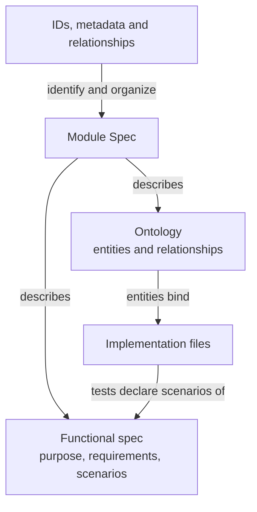

# Spec Protocol

Concorde Spec Protocol 4.0.0 defines a standard for describing software: what a component is for,
how it behaves in its usage scenarios, which entities make it up and how those entities relate to
each other and to the files that realize them. Its purpose is to make that meaning explicit enough
for people and tools to reach a consistent understanding.

The standard defines one kind of specification. A **Module Spec** has a functional half and an
architecture half. The functional half states the Module's **purpose**, its Module-level
**requirements** and its testable **scenarios**. The architecture half is the Module's
**Ontology**: its **entities** and their **relationships**; entities may bind the implementation
files that realize them, as exact files or as directory prefixes, and tests among those files
declare the scenarios they verify. **Spec management** gives Modules stable identities, explicit
document collections, addressable definitions and unambiguous relationships.

Spec management also defines [Spec and Context](spec-management/spec-and-context.md): which
entities can be queried, how their Spec context files are determined from explicit declarations,
and how a Module's implementation context follows from its entity file bindings.

## Information and its representation

The boxes below name project information and the forms used to represent it. Arrows state what
each form describes, references or organizes. They do not model the Protocol itself as software.

Document membership determines which authored texts supply a Module Spec. Entity file bindings
connect the Spec to its realization without making source files part of the Spec.

## Reading the standard

1. [Principles](principles.md): the specification model, completeness and conformance.
2. [Module specifications](module.md): purpose, requirements, scenarios, Ontology, composition,
   implementation files and scenario verification.
3. [Spec management](spec-management.md): identities, metadata, membership and declarations,
   including [Spec and Context](spec-management/spec-and-context.md).
4. [Required format](format.md): mandatory file, identifier, section and structured-block syntax.
5. Templates: [Module](templates/module.md) and [Scenario fragment](templates/scenario.md).

These are chapters of one standard. The terms Module, scenario, requirement and entity describe
the software being specified; they do not classify the standard or its chapters. The Protocol text
is independent of the format it defines and needs no project Spec registration.

## How the standard is used

A project Spec records intended behavior and architecture. It constrains later design decisions
and provides a contract against which an implementation can be assessed. It does not imply that
every implementation decision has already been made or that the existing code satisfies the Spec.

Explicit contract boundaries, document membership and entity file bindings also provide the
information that development tools use to construct agent context and determine the scope of a
task. Execution permissions additionally depend on the tool's roles, task phases and
authorization rules.

Concorde Framework is one implementation of this standard. Its own software Specs follow the
Protocol. Its configuration versions, storage adapters, agent workflows, enforcement and publishing
tools are defined separately from the standard. A project does not need those particular tools to
understand the specification language.
