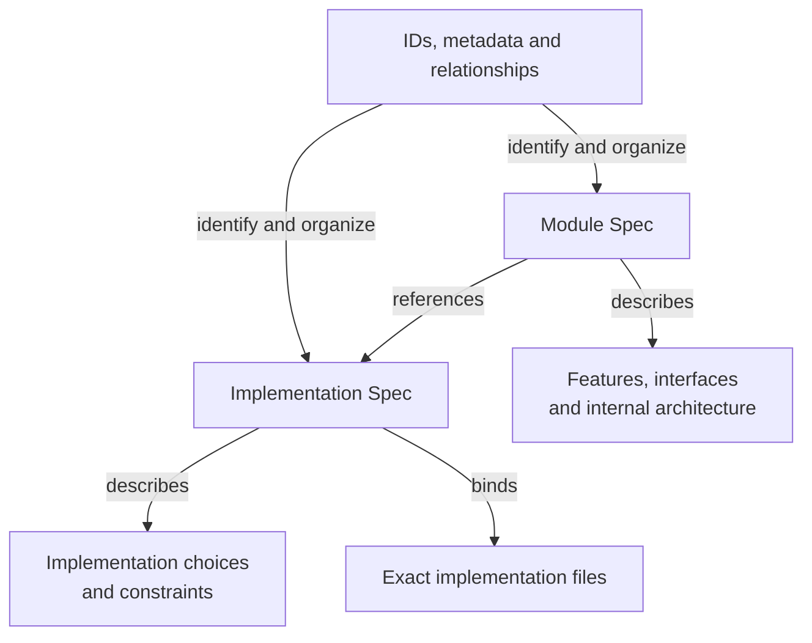

# Spec Protocol

Concorde Spec Protocol 2.1.0 defines a standard for describing software: what it promises, how its
responsibilities fit together, and how those contracts relate to implementation. Its purpose is
to make that meaning explicit enough for people and tools to reach a consistent understanding.

The standard distinguishes two kinds of specification. A **Module Spec** describes a software
responsibility, its observable capabilities and interfaces, and its internal architecture. An
**Implementation Spec** describes how software contracts are realized and binds that description
to exact implementation files. **Spec management** gives these specifications stable identities,
explicit document collections and unambiguous relationships.

Spec management also defines [Spec and Context](spec-management/spec-and-context.md): which entities
can be queried, how their Spec context files are determined from explicit declarations, and how a
Module's implementation context follows from its implementation references.

## Information and its representation

The boxes below name project information and the forms used to represent it. Arrows state what
each form describes, references or organizes. They do not model the Protocol itself as software.

Document membership determines which authored texts supply each Spec. Implementation references
connect the two kinds without merging their document collections.

## Reading the standard

1. [Principles](principles.md): the specification model, completeness and conformance.
2. [Module specifications](module.md): capabilities, interfaces, architecture and composition.
3. [Implementation specifications](implementation.md): realization, file ownership and reuse.
4. [Spec management](spec-management.md): identities, metadata, membership and declarations,
   including [Spec and Context](spec-management/spec-and-context.md).
5. [Required format](format.md): mandatory file, identifier and structured-block syntax.
6. Templates: [Module](templates/module.md), [Implementation](templates/implementation.md) and
   [Feature fragment](templates/feature.md).

These are chapters of one standard. The terms Module, feature and interface describe the software
being specified; they do not classify the standard or its chapters. The Protocol text is independent
of the format it defines and needs no project Spec registration or Module/Feature declarations.

## How the standard is used

A project Spec records intended behavior and architecture. It constrains later design decisions
and provides a contract against which an implementation can be assessed. It does not imply that
every implementation decision has already been made or that the existing code satisfies the Spec.

Explicit contract boundaries, document membership and file bindings also provide information that
development tools can use to construct agent context and determine the scope of a task. Execution
permissions additionally depend on the tool's roles, task phases and authorization rules.

Concorde Framework is one implementation of this standard. Its own software Specs follow the
Protocol. Its configuration versions, storage adapters, agent workflows, enforcement and publishing
tools are defined separately from the standard. A project does not need those particular tools to
understand the specification language.
