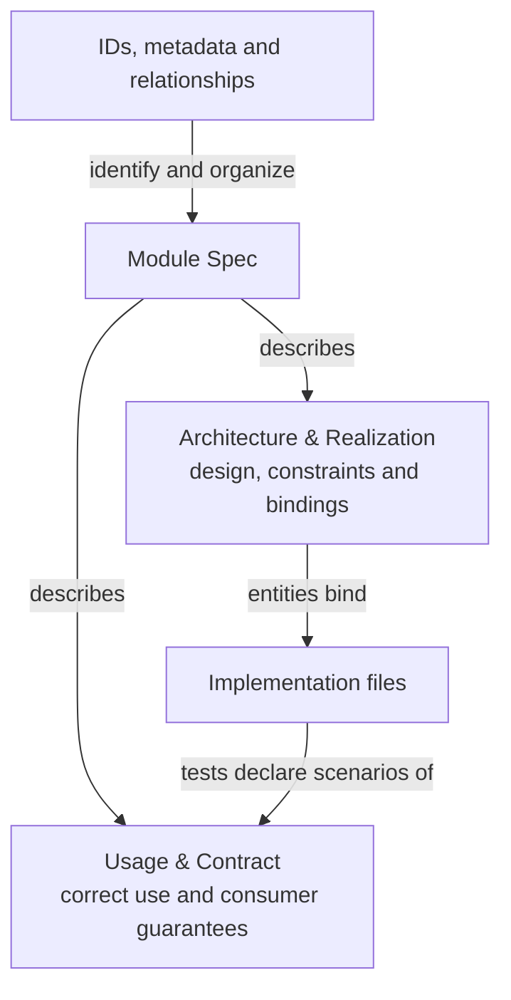

# Spec Protocol

Concorde Spec Protocol 6.0.0 defines a standard for describing software: what a component is for,
how it behaves in its usage scenarios, which entities make it up and how those entities relate to
each other and to the files that realize them. Its purpose is to make that meaning explicit enough
for people and tools to reach a consistent understanding.

The standard defines one kind of specification with two reader-oriented parts. A **Module Spec**
starts with **Usage & Contract**: who should use the responsibility, when and how to use it, and
what results, effects and failure behavior consumers can rely on. **Architecture & Realization**
then explains how the design fulfills those promises, including internal constraints, collaborators,
state, entities, relationships and implementation bindings. Requirements and testable scenarios make
both external guarantees and internal obligations precise; an inventory is not a substitute for a
usable explanation. **Spec management** supplies stable identities, explicit document collections
and unambiguous relationships. Tests in bound implementation files declare the scenarios they verify.

Spec management also defines [Spec and Context](spec-management/spec-and-context.md): which entities
can be queried, how their Spec context files are determined from explicit declarations, and how a
Module's implementation context follows from its entity file bindings.

## Information and its representation

The boxes below name project information and the forms used to represent it. Arrows state what each
form describes, references or organizes. They do not model the Protocol itself as software.

Unique document ownership and explicit Module-level references determine the complete Spec context
through a nonrecursive union of full files. Ordinary Markdown links remain navigation when
published. Entity file bindings connect the Spec to its realization without making source files part
of the Spec.

## Reading the standard

1. [Principles](principles.md): the specification model, completeness and conformance.
2. [Module specifications](module.md): usage documentation and consumer contracts, design and
   internal constraints, composition, implementation bindings and scenario verification.
3. [Spec management](spec-management.md): identities, ownership, references and interface declarations,
   including [Spec and Context](spec-management/spec-and-context.md).
4. [Required format](format.md): mandatory file, identifier, section and structured-block syntax.
5. Templates: [Module](templates/module.md) and [Scenario fragment](templates/scenario.md).

These are chapters of one standard. The terms Module, scenario, requirement and entity describe the
software being specified; they do not classify the standard or its chapters. The Protocol text is
independent of the format it defines and needs no project Spec registration.

## Upgrading from the four-section format

Version 6 changes authored document structure incompatibly. Reorganize existing Module collections
around the two reader-oriented parts, write the missing usage and design explanations, and move
internal constraints to their appropriate part. Preserve definition IDs, document ownership and
canonical agreements; moving a definition alone is not a new behavior or interface version. Update
links if locators change, and reconcile explicit references if files are split. Do not recover missing
contract meaning by reading implementation code.

A format migration is explicit, not an installer's silent relabeling of old sections. Changed Spec
bytes and the accepted Protocol binding require fresh context and dependent evidence. The migration
introduces no new registry relationship, query kind, part-scoped context filter or execution grant.

## How the standard is used

A project Spec records intended behavior and architecture. It constrains later design decisions and
provides a contract against which an implementation can be assessed. It does not imply that every
implementation decision has already been made or that the existing code satisfies the Spec.

Explicit contract boundaries, document ownership and references and entity file bindings also
provide the information that development tools use to construct agent context and determine the
scope of a task. Execution permissions additionally depend on the tool's roles, task phases and
authorization rules.

Concorde Framework is one implementation of this standard. Its own software Specs follow the
Protocol. Its configuration versions, storage adapters, agent workflows, enforcement and publishing
tools are defined separately from the standard. A project does not need those particular tools to
understand the specification language.
