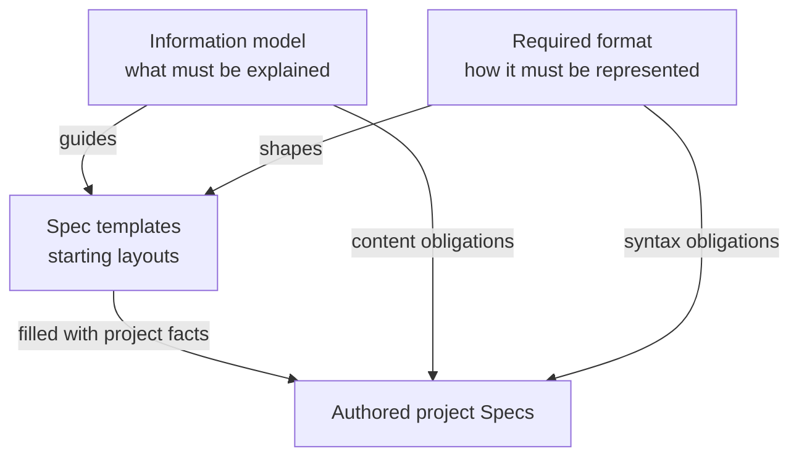

# Required format

This chapter defines the mandatory representation of project Spec documents. The information
model determines what a Spec must explain; these format rules determine how its identity,
membership and structured declarations are expressed. Templates provide starting layouts for
satisfying both. The Protocol chapters and template examples are not themselves project Specs.



## Markdown documents and entry names

Every registered Spec document MUST be a nonempty Markdown file with a `.md` extension. Paths
MUST identify explicit project-relative files, using `/` separators without absolute paths or
`.` and `..` components. A file path is a locator, not its stable identity.

A Module MUST register exactly one local `module.md` reading entry and its complete document
collection. Its collection MUST include an `Architecture` heading at level 1, 2 or 3 outside code
fences. The heading is a literal section marker; it does not establish that the architecture is
complete. Other prose and titles may use the project's language.

Features and interfaces may be grouped together or described across the collection. Their stable
IDs MUST appear with their definitions in the local documents named by their declarations.
The templates use separate Features and Interfaces sections for clarity, but those particular
headings, their order and their heading levels are not mandatory.

An Implementation Spec MUST register its own nonempty document collection and an explicit,
nonempty file binding. No particular Implementation document basename is required. Its bound
file list and realization responsibilities MUST be explicit; the template's headings are suggested
ways of presenting that information.

## Identifier spelling

Module, Implementation, document, feature, interface and structured contract IDs MUST match:

```text
^[a-z][a-z0-9]*(?:[.-][a-z0-9-]+)*$
```

IDs use lowercase ASCII letters, digits, dots and hyphens. Prefixes such as `module.` and
`document.` aid reading but do not establish ownership. Identity uniqueness and ownership follow
the rules in Spec management. A structured contract ID is reused by its provided and required
declarations; it does not identify a new physical document each time.

## Required document declaration

Every registered physical Spec document MUST contain exactly one `concorde-document` fenced JSON
block. Use the literal opening and closing fence lines shown here, at the start of their lines:

```concorde-document
{
  "id": "document.inventory.contract",
  "targets": ["module.inventory"],
  "main_visible": true
}
```

The object has exactly `id`, `targets` and `main_visible`. `id` is a stable document ID. `targets`
is a nonempty array of distinct registered owner IDs and MUST equal the document's complete
registered membership. `main_visible` is a JSON boolean, not a string or an ownership rule.

The template places this declaration first so it is easy to find; its physical position is not
otherwise prescribed. Additional presentation metadata cannot replace or contradict the block.
All structured blocks in this chapter use valid JSON with unique object keys, not YAML or
JavaScript expressions. Field names and named fences are case-sensitive; indentation inside JSON
objects and arrays is not significant.

## Dependency declarations

A Module with direct dependencies or children MUST describe each distinct provider exactly once
across its collection in `concorde-dependencies` blocks. Each block contains a nonempty JSON array.
Each entry has exactly these fields:

- `target_id`: the referenced Module ID.
- `responsibility`: a nonempty string describing what the provider supplies.
- `selection_condition`: a nonempty string describing when the collaboration applies.
- `relied_upon_promises`: a nonempty array of distinct, nonempty promise strings.

The provider set MUST equal the union of direct dependencies and children. A Module with neither
omits the block. If one provider is both a child and a used capability, one entry describes that
local relationship. Spec management gives a complete example of the JSON representation.

## Structured contract declarations

When declaring a structured provided or required interface agreement, use a `concorde-contract`
fenced JSON block containing exactly `id`, `version`, `role`, `peer`, `schema`, `semantics` and
`example`. `version` is a positive integer. `role` is `provided` or `required`. `peer` identifies
the counterpart Module or uses `external:<name>` for an external participant. `semantics` is a
nonempty local explanation, and `example` MUST conform to `schema`.

The schema representation and its supported vocabulary must be explicit, as described in Spec
management. A storage adapter's schema support does not replace an interface's behavioral promises.

## Templates and unresolved content

The context file set is derived from the existing document memberships and declared authored
diagram sources. A feature or interface declaration identifies its owner and defining local
document; that document field is a location, not a context filter. A prose Context section may
explain the derived file set, but MUST NOT override those declarations or introduce an independent
context file list. Spec and Context, under Spec management, defines the selection rules.

The canonical starters are the Module template, Implementation template and Feature fragment
under this standard's Templates section. Square-bracket placeholders stand for facts the author
must supply. Template instructions, sample IDs and sample paths are not adopted project facts.

Authors MAY rearrange suggested sections or split them across registered documents while preserving
mandatory syntax and the complete information contract. A Feature fragment is inserted into its
owning Module collection; it does not create another Spec kind. If saved as a separate document,
it needs its own document declaration and explicit membership.

Unresolved facts MUST be identified as unresolved. A template with placeholders is a draft, not
an assertion of complete behavior or existing implementation. Copying the layout does not establish
semantic conformance.

These rules govern authored Spec documents. A tool's registry serialization, configuration file,
rendering engine and execution workflow remain separately defined implementation choices.
