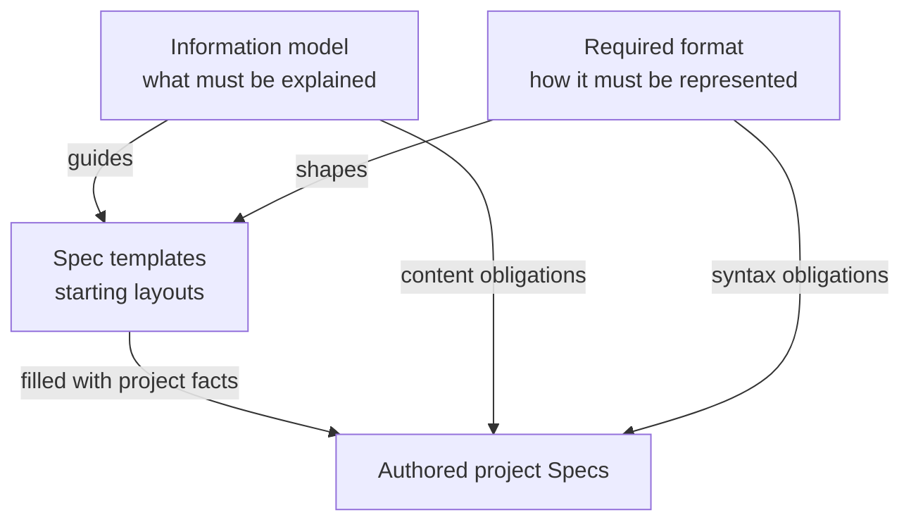

# Required format

This chapter defines the mandatory representation of project Spec documents. The information model
determines what a Spec must explain; these format rules determine how its identity, ownership,
references, four mandatory parts and structured declarations are expressed. Templates provide
starting layouts for satisfying both. The Protocol chapters and template examples are not themselves
project Specs.



## Markdown documents and entry names

Every registered Spec document MUST be a nonempty Markdown file with a `.md` extension. Paths MUST
identify explicit project-relative files, using `/` separators without absolute paths or `.` and
`..` components. A file path is a locator, not its stable identity.

A Module MUST register exactly one local `module.md` reading entry and its complete document
collection. Fenced code blocks are opaque: headings, list items and declarations inside a fence are
not interpreted by the rules below.

## The four mandatory sections

The `module.md` reading entry MUST contain these four ATX headings, at level 1, 2 or 3, with exactly
this text, outside code fences and in this order:

```text
Purpose
Requirements
Scenarios
Ontology
```

Each section extends to the next heading of the same or a higher level. The **Purpose** section MUST
contain nonempty prose only: no headings, list items, tables or fenced blocks. The **Requirements**
section introduces the Module's requirements and the **Scenarios** section its scenarios; their
definitions MAY appear there or in other single-owner documents of the collection.

The **Ontology** section MUST contain two ATX subsections, each exactly once and in this order, at a
level deeper than the Ontology heading:

```text
Entities
Relationships
```

The **Entities** subsection MUST contain at least one `concorde-entities` block. The
**Relationships** subsection MUST contain at least one Mermaid flowchart fence that satisfies the
diagram rules below. Other prose and titles may use the project's language, and further sections MAY
follow.

## Identifier spelling

Module, document, scenario, requirement, entity and structured contract IDs MUST match:

```text
^[a-z][a-z0-9]*(?:[.-][a-z0-9-]+)*$
```

IDs use lowercase ASCII letters, digits, dots and hyphens. Scenario IDs MUST additionally begin with
`scenario.` and requirement IDs with `req.`; these prefixes let a reader and a tool recognize the
definitions below without a registry entry. Other prefixes such as `module.`, `document.` and
`entity.` aid reading but do not establish ownership. Identity uniqueness and ownership follow the
rules in Spec management. A structured contract ID has one definition and may be used by many
participant bindings.

## Required document declaration

Every registered physical Spec document MUST contain exactly one `concorde-document` fenced JSON
block. Use the literal opening and closing fence lines shown here, at the start of their lines:

```concorde-document
{
  "id": "document.inventory.contract",
  "owner": "module.inventory",
  "main_visible": true
}
```

The object has exactly `id`, `owner` and `main_visible`. `owner` is one registered Module ID and
MUST agree with the sole registration under `documents`. `main_visible` is a boolean. Neither
`targets` nor document-level `references` is admitted.

## Module reference declarations

Each Module registration MUST contain `references`, an array (possibly empty) of closed objects with
exactly `kind` and `id`. `kind` is `module` or `document`; `id` is a stable registered ID of that
kind. Paths, fragments and display names are not reference identities. Reference pairs must be
unique, must not select self or an owned document, and must resolve. References to a Module and one
of its documents may overlap; inclusion is deduplicated and all provenance retained. `documents`
remains the nonempty list of solely owned document paths. Tools may choose their registry encoding,
but MUST preserve these declarations and the one-level resolution meaning.

The template places this declaration first so it is easy to find; its physical position is not
otherwise prescribed. Additional presentation metadata cannot replace or contradict the block. All
structured blocks in this chapter use valid JSON with unique object keys, not YAML or JavaScript
expressions. Field names and named fences are case-sensitive; indentation inside JSON objects and
arrays is not significant.

## Requirement definitions

A requirement is defined by an ATX heading at level 2 to 5 whose text is the requirement ID, a
spaced dash and the title, followed by its statement:

```markdown
### req.checkout.single-order — One order per submission

The system SHALL create at most one order for a successfully submitted checkout request.

A retried submission is answered from the existing order; see the repeated-submission scenario.
```

The dash MAY be `—`, `–` or `-`, surrounded by spaces. The requirement section extends to the next
heading of any level and MUST NOT contain a nested heading. Its **statement** is the first paragraph
of prose after the heading: one sentence that contains the uppercase word `SHALL` or `SHALL NOT`
exactly once. A statement with two occurrences expresses two behaviors and MUST be split into two
requirements. Further paragraphs, list items and fenced blocks after the statement are explanatory
and are not interpreted; a list item that begins with a requirement ID is an error, because a
requirement is never a list item.

Requirement definitions MUST be located in a document registered to exactly one Module; that Module
is the requirement's owner. Ordinary headings MAY group requirements; a group has no identity. A
requirement MUST NOT be defined inside a scenario section.

## Scenario definitions

A scenario is defined by an ATX heading at level 2 to 5 whose text is the scenario ID, a spaced dash
and the title:

```markdown
### scenario.checkout.submit — Successful checkout

- GIVEN a customer has a valid cart
- AND valid delivery and payment information
- WHEN the customer submits checkout
- THEN the system creates one order
- AND returns the order identifier
- BUT does not charge the payment method twice
```

The dash MAY be `—`, `–` or `-`, surrounded by spaces. The scenario section extends to the next
heading of any level. Its steps are list items whose text begins with one of the uppercase keywords
`GIVEN`, `WHEN`, `THEN`, `AND` or `BUT` followed by a space. Steps MUST appear in the order GIVEN,
WHEN, THEN: the first step is GIVEN or WHEN, every scenario has at least one WHEN and at least one
THEN, `AND` and `BUT` continue the preceding kind of step, and a keyword MUST NOT return to an
earlier kind. Every list item in a scenario section MUST be a step. Prose paragraphs MAY appear
anywhere in the section and are not interpreted.

Scenario definitions MUST be located in a document registered to exactly one Module; that Module is
the scenario's provider. Ordinary headings MAY group scenarios; a group has no identity. A scenario
section MUST NOT contain a nested heading.

## Identity anchors and links

The identity of a scenario or requirement is the anchor of its heading, and the identity of an
entity or canonical structured contract is an anchor in the document that declares it. A local
Markdown link whose fragment is such an identity addresses that definition:

```markdown
See [successful checkout](checkout/module.md#scenario.checkout.submit) and
[one order per submission](#req.checkout.single-order).
```

The path part locates the defining document relative to the linking document; a link with only a
fragment addresses the current document. A link whose fragment is a scenario, requirement, entity or
structured contract ID MUST point at the document that defines that ID, and a fragment that has the
shape of such an ID but names no definition is an error. A publisher MUST expose these identities as
anchors, whatever slug it derives for other headings. Fragments that are not IDs address ordinary
headings as the renderer defines and are not interpreted.

## Entity declarations

A Module declares its entities in `concorde-entities` fenced JSON blocks located in its single-owner
documents; the reading entry's Entities subsection holds at least one. Each block is a nonempty JSON
array whose entries have exactly the required fields `id`, `title`, `kind` and `responsibility`, and
any of the optional fields `files`, `pending` and `target_id`:

- `id`: the entity's stable ID.
- `title`: a nonempty string, unique within the Module; the diagram node label.
- `kind`: a nonempty free-text string.
- `responsibility`: a nonempty string.
- `files`: a nonempty array of distinct project-relative entries that realize the entity. An entry
  ending in `/` is a directory prefix and binds every regular file below it; any other entry is
  an exact file.
- `pending`: an array of distinct entries, each also present in `files`, declared but not yet
  created.
- `target_id`: the ID of a child or used Module the entity stands for; not combined with `files`.

Spec management gives a complete example. A listed entry MUST NOT be a registered Spec document, a
generated output or a project-control record, and a directory prefix MUST NOT contain a registered
Spec document. Within one Module each entry appears under one entity and a file covered by several
entries belongs to the most specific one; the union of a Module's entity entries MUST equal its
inventory `files`. Every child and used Module MUST have exactly one entity with its `target_id`.

## Relationship diagrams

The reading entry's Relationships subsection contains one or more Mermaid fences (` ```mermaid `)
whose first line begins with `flowchart` or `graph`. Together their node labels MUST be exactly
the Module's own entity titles, excluding definitions in referenced foreign documents, and every edge MUST carry a label. A node's label is the text inside
its shape delimiters; when the label spans several lines with `<br/>`, the first line is the
title. A node that is referenced without a defining shape has its identifier as its label. Edges
are labeled either as `A -->|label| B` or as `A -- label --> B`, for any of the arrow styles
Mermaid supports. Accessible `accTitle` and `accDescr` lines, `subgraph` groupings, comments,
directions and style statements are permitted and not interpreted. Mermaid fences elsewhere in the
collection are not interpreted by these rules.

## Dependency declarations

A Module with direct dependencies or children MUST describe each distinct provider exactly once
across its collection in `concorde-dependencies` blocks. Each block contains a nonempty JSON array.
Each entry has exactly these fields:

- `target_id`: the referenced Module ID.
- `responsibility`: a nonempty string describing what the provider supplies.
- `selection_condition`: a nonempty string describing when the collaboration applies.
- `relied_upon_promises`: a nonempty array of distinct, nonempty promise strings.

The provider set MUST equal the union of direct dependencies and children. A Module with neither
omits the block. If one provider is both a child and a used capability, one entry describes that
local relationship. Spec management gives a complete example of the JSON representation.

## Structured contract declarations

A `concorde-contract` fenced JSON block is the unique definition of a structured interface. It
contains exactly `id`, `version`, `schema`, `semantics` and `example`. `version` is a positive
integer; `semantics` is a nonempty string; `schema` declares its offline vocabulary and `example`
conforms to it. The definition anchor is its ID. Related prose and scenarios supply inputs, outputs,
errors, effects and compatibility. There is no `role` or `peer` in a definition.

A `concorde-contract-binding` fenced JSON block contains exactly `id`, `version`, `role`, `peer`,
`selection_condition`, `relied_upon_guarantees` and `obligations`. ID/version select a definition
included in the participant's context. Role is `provided` or `required`; peer is a registered Module
ID or `external:<name>`. Selection condition is a nonempty string and both lists are nonempty arrays
of distinct nonempty strings. They use ordinary Markdown links to canonical guarantees and state
local duties or reactions without copying common definitions. A binding creates no definition
anchor. Internal peer bindings must be complementary and version-equal. See [Spec
management](spec-management.md) for ownership and change semantics.

## Verification declarations

A test declares the scenario it verifies inside the test itself, by the scenario's ID. The Protocol
fixes the direction and the identity: the declaration lives with the test, names one or more
scenario IDs, and never appears in a Spec document. The syntax of the declaration is defined by the
development tool for each language it supports; a tool that supports a language MUST publish that
syntax and MUST read the declarations without executing the tests. A declared ID that names no
scenario is an error.

## Templates and unresolved content

The context file set is derived from the owning document registrations and Module references. A
scenario or requirement definition identifies its owner through its defining document; that location
is not a context filter. A prose section MAY explain the derived file set, but MUST NOT override
those declarations or introduce an independent context file list. Spec and Context, under Spec
management, defines the selection rules.

The canonical starters are the Module template and the Scenario fragment under this standard's
Templates section. Square-bracket placeholders stand for facts the author must supply. Template
instructions, sample IDs and sample paths are not adopted project facts.

Authors MAY rearrange optional sections or split requirements, scenarios and entities across
registered single-owner documents while preserving the mandatory syntax, the four mandatory sections
of the reading entry and the complete information contract. A Scenario fragment is inserted into its
owning Module collection; it does not create another Spec kind. If saved as a separate document, it
needs its own document declaration and explicit ownership registration.

Unresolved facts MUST be identified as unresolved. A template with placeholders is a draft, not an
assertion of complete behavior or existing implementation. Copying the layout does not establish
semantic conformance.

These rules govern authored Spec documents. A tool's registry serialization, configuration file,
rendering engine and execution workflow remain separately defined implementation choices.
