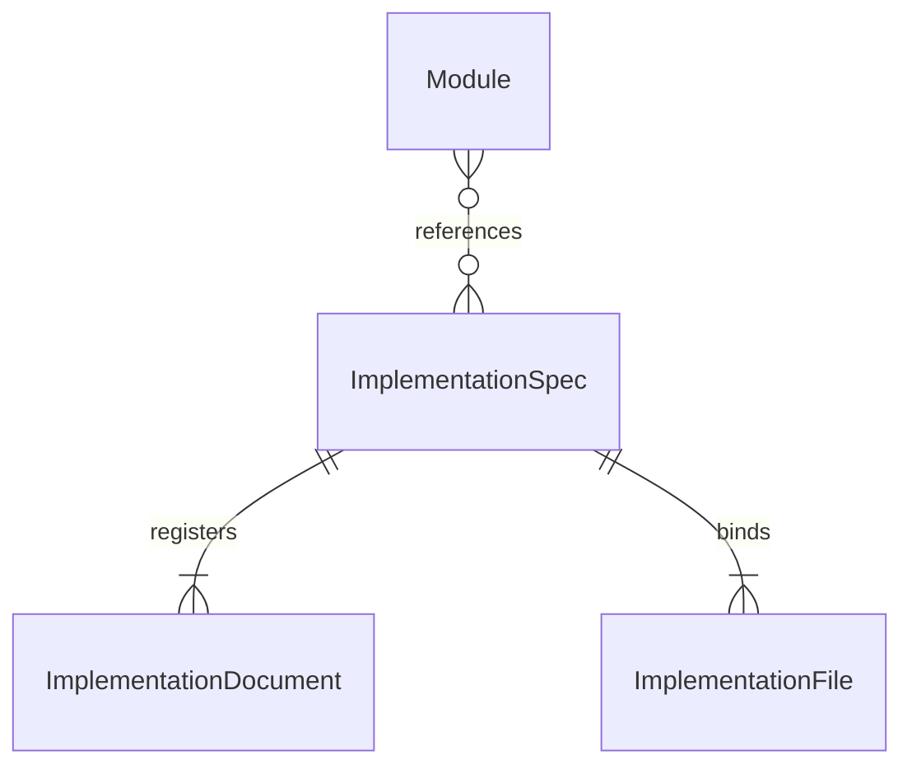

# Implementation specifications

An Implementation Spec describes a concrete realization of software contracts and identifies the
exact files that realize it. A Module describes the responsibility and promises; an Implementation
Spec explains how a realization fulfills them.

## Required description

An Implementation Spec MUST describe the responsibilities of its bound files, their implementation
interfaces and dependencies, relevant constraints and the verification appropriate to that
realization. It SHOULD explain significant choices and the invariants they preserve.

Public promises remain in the Module contract. An Implementation Spec may explain a data structure,
algorithm, internal callable interface or persistence mechanism, but MUST NOT supply public meaning
missing from the Module Spec or silently change its promised behavior.

## Exact file ownership

An Implementation Spec MUST bind a nonempty set of explicit project-relative file paths. A binding
names a file, not a directory, wildcard or rule that implicitly owns future files. The registered
binding and the Implementation Spec's stated ownership MUST agree.

Bound files may include code, tests, configuration or authored runtime assets. Generated views,
project-control records and the project Spec documents themselves are not implementation source
bindings. A declared file MAY be pending creation; such a declaration describes an intended output,
not evidence that the implementation already exists.

Every implementation file in the specified software has exactly one authoritative Implementation
Spec owner. One owner MAY bind several files. Moving or renaming a file changes its explicit
binding, but does not by itself change a Module's identity, responsibility or parent.

## Reuse across Modules

Module-to-Implementation references are many-to-many. For example, Import and Export may both
reference one Encoding Implementation Spec that binds `src/encoding.py` and its tests. The file
has one authoritative owner even though it serves two Module contracts.

The circle means zero is allowed, the bar means one, and the fork means many. A Module may
reference multiple realizations; an Implementation Spec may be registered before it has consumers.
Every Implementation Spec still has at least one document and one declared file. Each bound file
has exactly one owner. Document membership and file binding are separate relationships.

Reusing implementation does not require inventing a shared Module. A shared Module is appropriate
when there is a separately provided capability with its own contract; a reusable realization may
simply serve existing Module contracts. Reuse also does not copy the file binding into each
consumer or give the implementation an additional structural parent.

## Traceability and compatibility

The declared references and file bindings MUST make it possible to determine which realizations
serve a Module, which Implementation Spec owns a file and which Modules use that realization.
Reverse lookups are derived from those declarations, not additional ownership relationships.

A realization shared by several Modules must fulfill each using Module's relied-upon contract.
Compatibility with one consumer does not imply compatibility with every consumer. This is a
contract obligation; the particular test runner, review process or change workflow used to assess
it belongs to the development environment.

Implementation documents form their own explicitly registered collection. They MUST NOT also be
members of a Module Spec collection. A Module references the Implementation Spec's identity;
that reference does not merge their documents or grant execution permissions.
