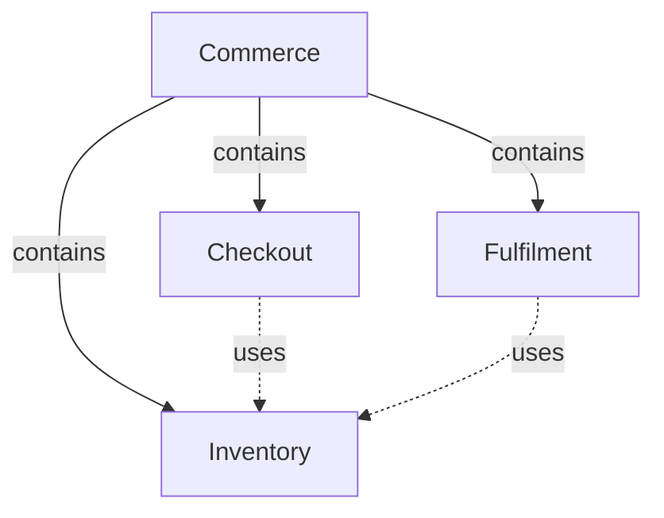

# Module specifications

A Module specifies one responsibility for consumers and implementers. It need not correspond to a
physical software unit. The complete content includes reading and associated machine declarations;
the Protocol defines which information must remain readable. A publisher organizes that reading
without becoming another authority over the specification.

## Reading content

A developer must be able to understand the responsibility, use it correctly and maintain its
realization without assembling meaning from an inventory or knowing project internals. Reading
begins with Purpose, Terminology, Usage, Design and Relationships. The entry and its explanatory topic companions have role `module`.
Precise requirements, scenarios and canonical interface agreements belong in owned role
`implementation` companions, never in the entry or topic pages. Both roles remain reading content
and together form one complete Module specification; neither role is a separate owner or context.
A Module may use several implementation documents rather than one oversized specification file.

### Purpose

State what the Module is for, who relies on it and where its promises stop. Use short plain prose,
not an inventory, table or code block. A directory or package name does not establish responsibility.
A composite Module may delegate all realization and bind no implementation files of its own.

### Terminology

Introduce the concepts a reader needs before use and design. Use a `Term` / `Meaning / definition`
table, not an entity inventory. Give a concept one canonical definition; a later page links the term
directly to that table and names the source. It may also repeat or faithfully restate the meaning so
the reader can understand the page without jumping away. For example, if Inventory defines Reservation
as "Stock held before checkout", a Checkout topic can use:

| Term | Meaning / definition |
| --- | --- |
| [Reservation](inventory.md#terminology) | Stock held before checkout. Source: Inventory. |

This illustrative link stands for the project's actual defining document. The imported row is a
reading aid, not a second authority: preserve the source's meaning and constraints, and check affected
restatements when that source changes. Link-only imports are also permitted. Explain Checkout's own
duty to handle a rejected request in Usage, not by extending the imported term's definition.
Required defining units must still be explicitly included in context; a local restatement cannot
replace them. This allowance does not duplicate formal obligations, interface contracts or schemas.
Avoid circular or forwarding chains, and do not require a reader to know a private class to understand
its domain concept.

### Usage

Explain audience, use conditions, prerequisites, relevant concepts and actual entry points. Follow
representative input through results and effects before advanced recovery. Include a concrete
illustration where abstraction would otherwise obscure the user's decision. Then explain errors, repeated invocation,
cancellation and compatibility where applicable. An unsupported behavior must be identified rather
than invented. A logical responsibility can participate in a workflow or conceptual agreement
without having a callable public API.

Usage is canonical explanatory prose, not a second summary with weaker promises. Link to precise
requirements, scenarios and interface definitions. A consumer should not need a repository lock's
implementation details to learn that concurrent publication is serialized or rejected.

### Design

Explain why responsibility decomposition, state, control/data graph, collaboration and failure
containment fulfill the guarantees. Connect each significant choice to a problem it prevents;
a sequence of class or function names is not an explanation. Record significant choices and required internal constraints,
distinguishing them from incidental current code and unresolved implementation. Links to guarantees
are preferable to restating them as new obligations.

Entity meaning belongs within these explanations: a reservation record, boundary actor, interface
or program is introduced where understanding it matters. Entity identity and implementation
bindings belong in metadata, not a standalone entity-inventory chapter. Several entities may share
one coherent explanation with distinct identity anchors; that explanation must actually explain
all of them. Merely placing anchors above unrelated prose does not establish completeness.

### Relationships

Explain the collaborations and the scope of each relationship diagram. Directed edges have
meaningful labels, preferably verbs. Nodes resolve to local entity titles, including local entities
representing used or child Modules. A diagram may select a subset of the inventory or split a topic
into several scoped views. It must not invent entities or import every internal entity of an
included provider. An omitted inventory node is not by itself a missing contract.

The diagrams are authored Mermaid flowcharts in registered reading documents. A reading entry's
Relationships section contains the principal relationship view; prose explains conditions,
invariants and reactions that the edges cannot convey. Further behavioral diagrams can illustrate
state and execution without becoming another relationship inventory. Explain a conceptual view in
ordinary terms and identify it as conceptual. Exact executable nodes, state channels, reducers and
machine-checked topology belong in implementation-role units, linked from this explanation. A rendering, export or
navigation tree is derived, not an independent authority.

## Precise obligations

Define these only in implementation-role units owned directly by the Module. Topic names can group
related definitions but do not own them. Module Specs explain the important guarantees and link to
these canonical definitions; readers should not need to read every acceptance case to understand
the Module. Do not move coherent topic explanations wholesale merely because they once contained
formal definitions.

### Requirements

A requirement has a stable identity, a title and one decidable statement containing SHALL or
SHALL NOT exactly once. It expresses a Module-wide obligation, not one scenario's private rule.

```markdown
### req.checkout.single-order — One order per submission

Checkout SHALL create at most one order for a successfully admitted request.
```

One sentence with two SHALL occurrences must be split. "The response SHALL be fast" is not
decidable; an explicit bound can be. Internal structural or technology constraints can be normative
requirements just as external guarantees can. Their location does not weaken them or change their
owner. Explanatory prose and links may follow the statement. Ordinary headings may group definitions.

### Scenarios

A scenario is one concrete situation and the unit tests verify. GIVEN establishes preconditions,
WHEN names the trigger, THEN specifies the promised result. AND and BUT continue the preceding kind.

```markdown
### scenario.checkout.submit — Successful checkout

- GIVEN a customer has a valid cart and delivery details
- WHEN the customer submits it
- THEN Checkout creates one order
- AND returns its identifier
- BUT does not charge the payment method twice
```

Success, failure, partial results, retries and concurrency deserve their own scenarios when their
outcomes differ. A situation's additional guarantees belong in its own steps or explanation, not
in attached requirements. A Module-wide obligation is defined once as a requirement and linked.
Scenarios may verify internal transitions as well as boundary invocations. Group headings have no
identity and do not create new context-query kinds.

### Interfaces

An interface is an entity: an API, command, protocol, event or file boundary. Its canonical readable
agreement explains inputs, outputs, effects, failures, compatibility and repeat behavior, with related
scenarios. A structured contract may use a readable schema and example; structured syntax is not a
reason to classify useful contract content as machine-only metadata.

A shared interface's canonical definition occupies an owned implementation-role companion referenced by many Modules. It retains
one definition and one owner. Participant metadata names ID, version, role and peer and points to
local readable participation conditions, relied-upon guarantees and obligations. It does not copy
the canonical schema or common semantics, and does not override that agreement.

## Composition and dependencies

Composition states the Module's single structural parent. Parent links are acyclic. A parent
explains how its children fulfill the containing responsibility. Dependency states which separately
identified provider a Module uses. It does not imply ownership, deployment, directory nesting,
shared source code or additional context.



Every direct child and used Module has one local entity with its provider identity. The local
reading states that provider's responsibility, selection/use conditions and canonical promises
relied upon, plus local duties and failure reactions. Metadata links the declared provider to that
explanation. A uses arrow or a link to the provider alone is insufficient. A shared provider keeps
one identity and is not owned by any of its consumers. Dependencies may cross hierarchy levels;
the sibling arrangement shown above is an example, not a universal hierarchy constraint.

## Realization and external knowledge

Entity metadata may bind exact files and directory prefixes. Directory entries retain their slash
and bind future files under the tool's deterministic exclusions. Within a Module, the most specific
entry determines the owning entity; several Modules may list one realization without merging their
contracts. The registry's file listing equals the union of entity entries, entry for entry.
A missing intended entry can be pending. No reading or metadata member of a document unit can be
implementation, and a listed directory cannot contain either member.

Tests are bound implementation, but the test-to-scenario declaration is authored in the test,
not in reading prose. Derived verification coverage is evidence, never another source of promises.
A pending marker is removed after its realization exists; until then it is an intention.

Vendored library/service/tool documentation or source is declared separately as external reference
material at a known revision. It must exist, cannot overlap the Module's implementation listing or
any document unit, and supplies no promise absent from the Spec. Context selection and execution
permissions remain separate: listing names does not grant file contents or network access.

## Completeness

The selected complete context makes every owned and explicitly included unit available with both
members intact. Its readable subset must supply the meaning needed by the selected task. A schema,
heading, diagram or correctly registered file set is not proof of sufficient meaning. Honest drafts
name unknowns. Missing necessary meaning remains a gap until explicit authored changes repair it;
source code, recursive references and publisher summaries cannot silently supply the missing contract.
