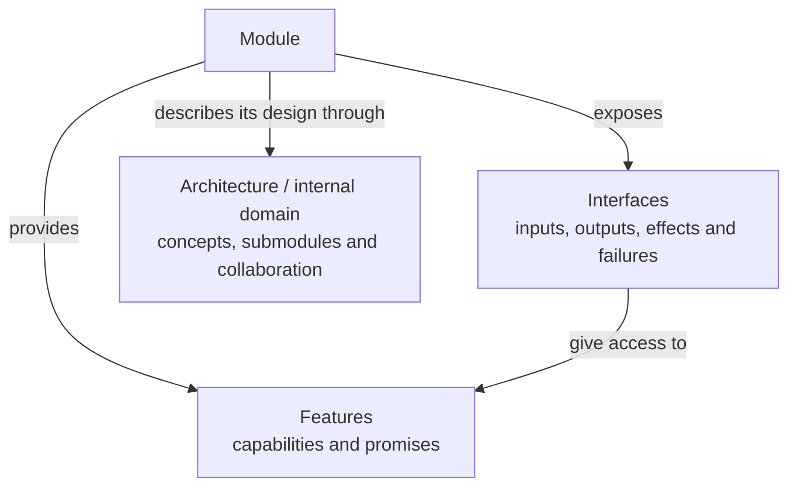
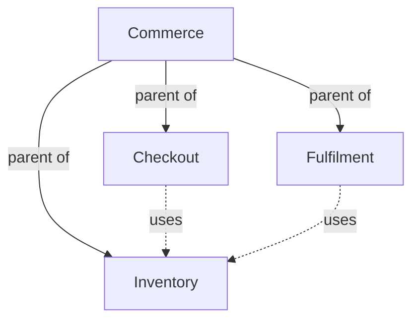

# Module specifications

A Module Spec describes one cohesive software responsibility through its features, interfaces and
internal architecture. It answers what the Module provides, how it is used, and how its internal
parts support those promises.

These are related views of one responsibility. An interface can support several features, and a
feature can be available through several interfaces; neither becomes a separate Spec collection.

## Features

A feature is an observable capability supplied by the Module. Its description MUST explain the
conditions in which it applies, the outcome it promises, relevant constraints and failure behavior.
The consumer may be a person or another software component.

For example, a Reservation Module may provide the capability to reserve available inventory.
The promise includes what counts as available, when a reservation becomes effective and what
happens if capacity is exhausted. A name such as "reservation support" alone does not establish
those semantics.

Features have stable identities owned by their providing Module. A feature is a part of that
Module's contract; identifying a feature does not create a separate Module or a smaller Spec
collection. Features and interfaces need not have a one-to-one relationship.

## Interfaces

An interface is an explicitly described means of using a capability. It may be an API, function,
command, file, protocol, event or another exchange. A Module Spec MUST explain:

- Inputs, preconditions and accepted values.
- Outputs and their meaning, including completion conditions.
- Effects and relevant state changes.
- Errors, partial outcomes and failure conditions.
- Compatibility expectations and applicable retry or idempotency behavior.

For an interface that creates a reservation, a complete contract could explain the item and
quantity inputs, the resulting reservation identity, when inventory becomes unavailable, the
failure returned for insufficient capacity and what a repeated request does. A signature or data
schema alone does not explain those promises. Examples SHOULD clarify ambiguous or significant
behavior without substituting for the contract.

## Architecture and internal domain

Architecture is the Module's internal design. Its description MUST explain the relevant concepts,
responsibilities, directed relationships and collaborations, together with the rules, state
transitions and completion or failure conditions needed to understand the behavior.

Submodules follow this same definition. Domain concepts such as a reservation or account, and
external actors such as a customer, MAY appear in the model without becoming software Modules.
A leaf Module may be realized directly by implementation files. A composite Module may also have
coordination code of its own.

For nontrivial internal structure, a Module SHOULD include an architecture diagram showing its
actual responsibilities, connections and external boundaries. A simple Module MAY explain its
architecture in prose and briefly state why a diagram would add little. A diagram and the prose
MUST describe a consistent model. The Protocol does not prescribe a drawing tool, visual theme,
rendering format or page layout.

## Composition and dependencies

Structural composition answers which Module contains another. Each Module has at most one parent;
the parent explains how its children collaborate to fulfill the containing contract. A Module MAY
have no parent. Parent relationships cannot form a cycle.

A dependency answers which separately identified capability a Module uses. A `uses` relationship
is directed from consumer to provider and does not imply structural ownership. Its meaning is
independent of deployment topology, directory nesting or shared source files.

For example, if Checkout and Fulfilment both use Inventory, Inventory remains one Module with one
parent. Under a common Commerce parent, all three are siblings. Neither consumer gains Inventory
as an additional child. Each consumer describes the Inventory promises it relies on; Commerce
describes how its children compose the larger system.

Solid arrows show structural parentage. Dashed arrows show capability use. Inventory has one
structural parent even though two consumers depend on it. Each consumer keeps its relied-upon
Inventory promises in its own Spec.

For every direct dependency and child, the Module Spec MUST state the provider's stable identity,
responsibility, when it is used or selected, and the promises relied upon. The structured
`concorde-dependencies` declaration records this local agreement. Merely naming a provider or
linking to its Spec is insufficient.

## Completeness and contract boundaries

The Module's complete registered collection MUST make its promised behavior and architecture
understandable on their own. Authors MAY split topics across documents. The `module.md` reading
entry introduces the responsibility and leads through the collection; it does not replace the
remaining registered documents.

An implementation reference explains which realization serves the Module, but it cannot provide
a missing public promise. A dependency statement records what the consumer relies on without
importing the provider's internal design. An unresolved dependency promise is therefore a gap in
the consuming Module's contract, even if the provider or source code already describes a behavior.

## Relationship to implementation

A Module MAY reference several Implementation Specs. Several Modules MAY reference the same one.
These references identify realizations of the Module's contract without changing its composition
or document membership. Architectural responsibilities belong in the Module Spec; exact source
bindings and implementation choices belong in the referenced Implementation Specs.
