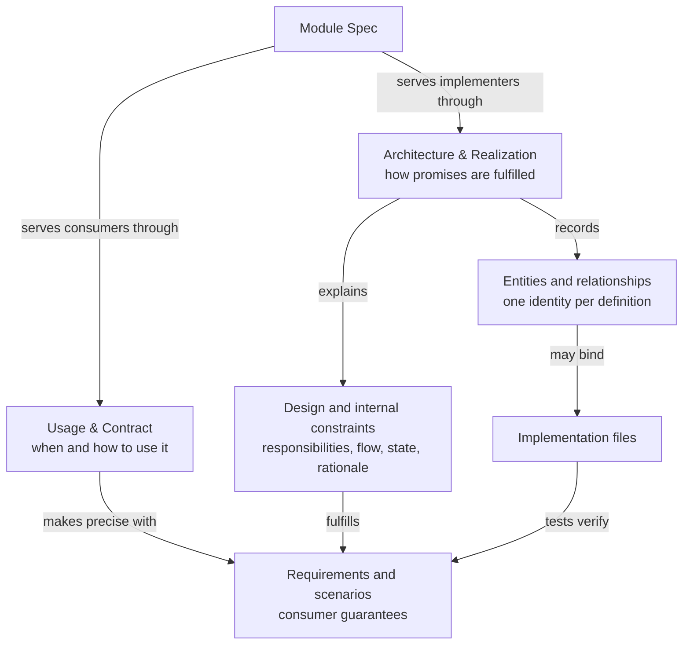
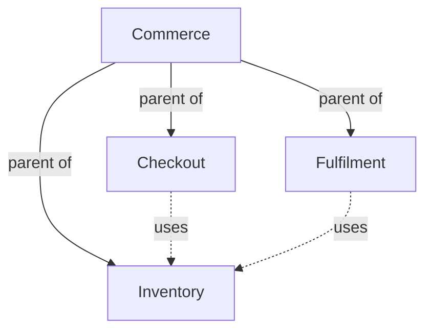

# Module specifications

A Module Spec describes one cohesive software responsibility in two parts. **Usage & Contract**
serves consumers: what it is for, when and how to use it, and what they can rely on.
**Architecture & Realization** serves implementers: how responsibilities, state, collaborations and
implementation bindings fulfill those promises. These are two readings of one consistent Spec,
not separate authorities or a documentation summary competing with the contract.

A Module is a unit of specification, not a unit of implementation. It need not correspond to a
package, directory, process, service or other physical unit: its realization may be spread across
several such units, shared with other Modules, or supplied entirely by its children, and a Module
whose promises are met wholly by its children binds no files of its own. Its boundary is what its
purpose, requirements, scenarios and entities declare; the file bindings of its entities record
where that responsibility is realized and do not define it.



## Usage & Contract

A consumer must be able to understand correct use without reconstructing internal machinery.
Explain the audience, scope and non-goals, the concepts the consumer must understand, when this
responsibility applies, prerequisites, entry points and representative use, results and effects,
and failure and repeat behavior. State cancellation and compatibility behavior where applicable;
if unsupported, say so. A logical Module may be used through a composed workflow or a conceptual
agreement rather than a callable API.

This is the canonical usage documentation, not a second shortened copy of formal behavior.
Introduce the normal path before unusual cases. Use ordinary explanations and examples to make
requirements and scenarios navigable. Link to canonical shared definitions rather than repeating
schemas. A consumer should not have to know a repository lock's implementation to learn that
concurrent publication is rejected or serialized.

### Purpose

The purpose is a short plain-prose statement of what the Module is for, who uses it and the boundary
of its promises. It contains no lists, tables or structured blocks. It is the first thing a reader
sees and the sentence a parent Module or consumer can rely on when it names this Module's
responsibility.

### Requirements

A requirement is a promise the Module as a whole makes. It has a stable identity, a title and a
statement: one sentence containing SHALL or SHALL NOT. Requirements are the coarse statement of what
the Module must do; they belong to the Module, never to one scenario.

```markdown
### req.checkout.single-order — One order per submission

The system SHALL create at most one order for a successfully submitted checkout request.
```

Each requirement obeys three rules:

- **One behavior.** A statement expresses exactly one obligation. "The system SHALL create at most
  one order and SHALL notify the customer" is two requirements.
- **Decidable.** A reader can judge the statement true or false for the Module. "The checkout
  SHALL be fast" is not decidable; "The checkout SHALL answer within two seconds" is.
- **Stable and unique.** The identity names the requirement for its whole life. The title and the
  prose around the statement may change; the identity does not.

A requirement may prescribe technology or structure: "Checkout control flow SHALL be a LangGraph
graph" is valid, but belongs in Architecture & Realization unless consumers must depend on that
technology at the boundary. External guarantees stay here. Explanatory prose may follow a statement,
and requirements MAY be grouped under ordinary headings for reading. Placement never weakens an
internal constraint or changes its Module ownership.

### Scenarios

A scenario describes one concrete situation in which the Module is used and how the Module must
react. It has a stable identity, a title and a sequence of steps:

- **GIVEN** steps state the preconditions and the state of the world.
- **WHEN** steps state the trigger: what an actor or a collaborator does.
- **THEN** steps state the observable outcome the Module promises.
- **AND** and **BUT** continue the previous kind of step.

For example, a Checkout Module may promise:

```markdown
### scenario.checkout.submit — Successful checkout

- GIVEN a customer has a valid cart
- AND valid delivery and payment information
- WHEN the customer submits checkout
- THEN the system creates one order
- AND returns the order identifier
- BUT does not charge the payment method twice
```

A scenario is the unit of verification: it is specific enough that a set of tests can exercise it.
Whatever the situation must additionally guarantee, such as a limit, an invariant that holds
afterwards or a thing that must not happen, is written into the scenario's own steps or into prose
inside its section. A scenario does not carry requirements of its own; a promise that holds across
situations belongs in a Module-level requirement in the appropriate reader-oriented part.

Error paths, partial outcomes and repeated invocations are scenarios of their own. A scenario in
which the same checkout is submitted twice states what the second submission does; a scenario in
which payment is declined states what is created and what is returned. A name such as "checkout
support" alone does not establish those promises.

Scenarios MAY be grouped under ordinary headings for reading; a group has no identity. A consumer
Module's relied-upon promises SHOULD cite the provider's scenario or requirement identities when
they exist, so that both Modules refer to the same promise.

An interface is a means of using the Module: an API, function, command, file, protocol or event. It
has one entity identity in the architecture inventory, while this part explains its use and the
scenarios triggered through it state its inputs,
preconditions, outputs, effects, errors, compatibility expectations and retry or idempotency
behavior. When an interface exchanges a structured value, a structured contract declaration records
the agreed shape; the declaration does not replace the scenarios.

## Architecture & Realization

### Design

Explain how the Module fulfills its external contract: its internal responsibility decomposition,
control and data flow, state lifecycle, dependency choices, failure containment and relevant design
rationale. Connect these decisions to the guarantees they realize using links, not restatements.
Distinguish required constraints, changeable design choices and unresolved realization work.
The Spec is intended design, not a transcript of the code or a claim of implementation conformance.

Internal requirements and scenarios use the same stable-ID syntax as external ones. For example,
"publication SHALL hold the repository lock during its ref update" is an internal constraint;
"a conflict leaves the destination unchanged" is external behavior. Define each once. An internal
verification scenario may exercise an internal state transition instead of a consumer invocation.
Tests declare either kind by ID in the same way.

Entities and relationships support this explanation but do not replace it. The inventory may name
domain concepts and actors as well as implementation programs; their consumer-facing meaning is
explained in Usage & Contract, without defining those identities again.

### Entities

An entity is a named thing the Module consists of or interacts with at its boundary. Its description
states its stable identity, its title, its kind and its responsibility. The kind is free text:
submodule, program, file, record, concept, interface, external actor or any term the project uses.
An entity that is a submodule or a used Module names that Module's registered identity. An entity
that is realized by code lists the files or directories that realize it.

For example, a Checkout Module may consist of an order form (an interface entity used by the
customer), a checkout service (a program entity binding its source and tests), an order record (a
concept entity) and the Inventory Module it uses (a used-Module entity). The customer is an external
actor at the boundary.

Every child Module and every used Module MUST appear as an entity of the containing or consuming
Module, so that the architecture inventory shows the composition and dependency the registry records. Domain
concepts such as a reservation or account, and external actors such as a customer, MAY appear as
entities without becoming software Modules.

### Relationships

The relationships connect the entities. Each relationship is a directed edge from one entity to
another with a free-text label, which SHOULD be a verb: the checkout service "reserves stock
through" Inventory, the order form "submits to" the checkout service, the checkout service "writes"
the order record. The set of labeled edges, drawn as a diagram, is the Module's relationship model. A
diagram MUST name exactly the Module's entities and label every edge; the prose around it explains
invariants, state transitions and completion or failure conditions the edges cannot show.

A leaf Module may be realized directly by its entities' files. A composite Module may have
coordination code of its own, bound by one of its entities, or none at all. The Protocol prescribes
the Mermaid flowchart form defined in the Required format chapter; it does not prescribe a visual
theme or page layout.

## Composition and dependencies

Structural composition answers which Module contains another. Each Module has at most one parent;
the parent explains how its children collaborate to fulfill the containing contract. A Module MAY
have no parent. Parent relationships cannot form a cycle.

A dependency answers which separately identified capability a Module uses. A `uses` relationship is
directed from consumer to provider and does not imply structural ownership. Its meaning is
independent of deployment topology, directory nesting or shared source files.

For example, if Checkout and Fulfilment both use Inventory, Inventory remains one Module with one
parent. Under a common Commerce parent, all three are siblings. Neither consumer gains Inventory as
an additional child. Each consumer describes the Inventory promises it relies on; Commerce describes
how its children compose the larger system.



Solid arrows show structural parentage. Dashed arrows show capability use. Inventory has one
structural parent even though two consumers depend on it. Each consumer keeps its relied-upon
Inventory promises in its own Spec.

For every direct dependency and child, the Module Spec MUST state the provider's stable identity,
responsibility, when it is used or selected, and the promises relied upon. The structured
`concorde-dependencies` declaration records this local agreement. Merely naming a provider or
linking to its Spec is insufficient.

## Implementation files

An entity MAY bind project-relative files: code, tests, configuration or authored runtime assets. A
listing entry is either an exact file path or a directory prefix written with a trailing slash, such
as `src/inventory/`. A directory prefix binds every regular file below it at any depth, including
files created later; a tool MAY exclude dependency installations, caches and build outputs from that
expansion by an explicit deterministic rule. Generated views, project-control records and the
project Spec documents themselves are not implementation files, and a directory prefix MUST NOT
contain a registered Spec document.

Within one Module a file belongs to one entity. When a Module's entries overlap, the most specific
entry owns the file: an exact file beats a directory, and `src/inventory/ledger/` beats
`src/inventory/`. Several Modules MAY list the same file or directory: for example, Import and
Export may both list `src/encoding.py` under an entity of their own when one encoding realization
serves both contracts. The file then has several using Modules, and a change to it must be assessed
against each of their contracts. Compatibility with one consumer does not imply compatibility with
every consumer.

A declared entry MAY be marked pending while the file or directory does not yet exist. The marker
records an intended output. Once it exists the marker SHOULD be removed; a development tool MAY
remove it automatically when it delivers the change that created it. Moving or renaming a file
changes its listing, but does not by itself change a Module's identity, purpose or parent.

The declared listings MUST make it possible to determine which files realize a Module and which
Modules list a file. Reverse lookups are derived from those declarations, not additional ownership
relationships.

A Module that builds on an external capability, such as a library, MAY declare the vendored
documentation or source of that capability as an external reference in its registration (see
Spec management). Such material is not an implementation file: it does not realize the Module,
it MUST exist, it MUST NOT be a Spec document and it MUST NOT overlap the Module's own file
listing. Several Modules MAY reference the same material. Which phases may read its contents is a
development tool's decision; the declaration itself only records what the Module relies on.

## Scenario verification

Tests are implementation files bound by entities like any other file. The Spec never lists tests: a
scenario states the situation and the promised reaction, and a test states which scenario it
verifies by naming that scenario's identity in the form the development tool recognizes. From those
declarations a tool derives, for every scenario, the set of tests that verify it and reports
scenarios that no test declares.

This direction keeps the contract free of test locations and keeps the mapping where it can be
maintained with the code. The derived coverage is evidence about the tests, not a part of the Spec:
a scenario without a declared test is still a promise, and a declared test does not by itself prove
the scenario is met.

## Completeness and contract boundaries

The Module's resolved context MUST make its purpose, requirements, scenarios, entities and
relationships understandable. Authors split owned topics across documents and explicitly include
canonical provider definitions using the Module registration's references. The owned `module.md`
entry introduces both reader-oriented parts; companion documents carry one or both as appropriate.
It does not replace any owned or referenced file. These reading boundaries do not change context
resolution: all explicitly selected files remain complete. A consumer SHOULD rely on provider
Usage & Contract definitions, not on incidental implementation choices; a document reference can
select a separately owned provider interface document when that is the complete needed agreement.

Ownership remains with the defining Module. Referenced entities do not enter the consumer's main
diagram or implementation binding union. The consumer describes its role, collaboration conditions,
relied-upon guarantees and reactions locally, with ordinary links to included definitions instead of
copies. Shared interfaces may occupy an ordinary owned document with many referencing consumers.
Neither links nor included Modules' references expand context. Missing required meaning remains a
gap until explicit declarations and definitions repair it; implementation code cannot fill it.
