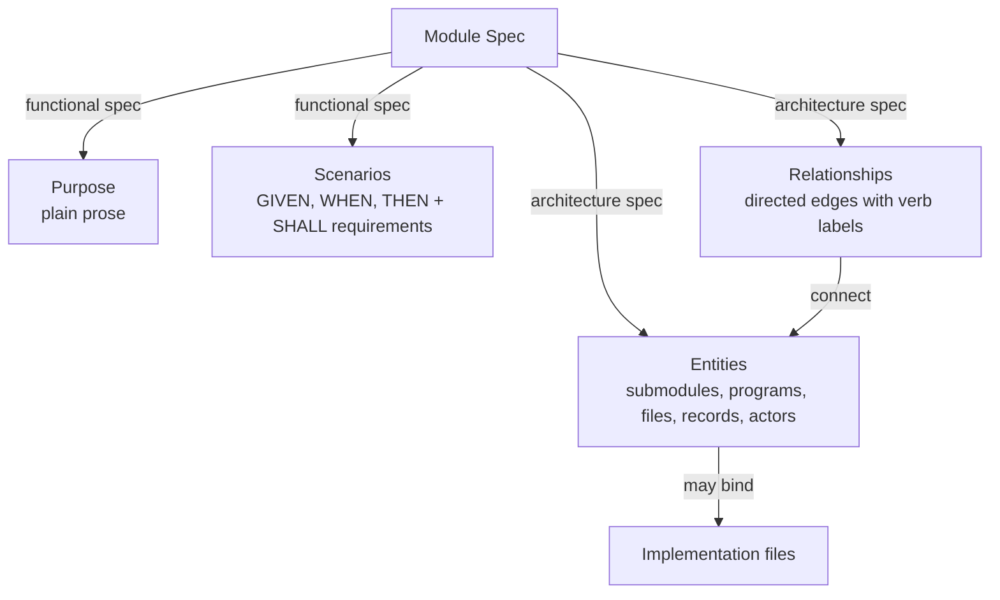
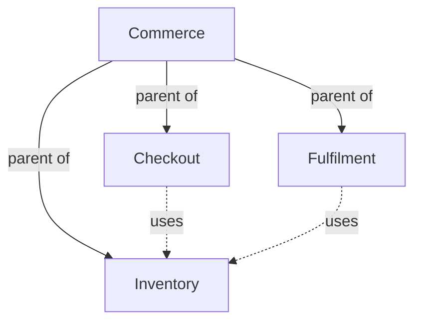

# Module specifications

A Module Spec describes one cohesive software responsibility in four parts. Its purpose and
scenarios say what the Module promises; its entities and relationships say how the Module is
built. Together they answer what the Module is for, how it reacts in each situation it is used
in, what it consists of and how those parts collaborate.



## Purpose

The purpose is a short plain-prose statement of what the Module is for, who uses it and the
boundary of its promises. It contains no lists, tables or structured blocks. It is the first thing
a reader sees and the sentence a parent Module or consumer can rely on when it names this Module's
responsibility.

## Scenarios and requirements

A scenario describes one situation in which the Module is used and how the Module must react.
It has a stable identity, a title and a sequence of steps:

- **GIVEN** steps state the preconditions and the state of the world.
- **WHEN** steps state the trigger: what an actor or a collaborator does.
- **THEN** steps state the observable outcome the Module promises.
- **AND** and **BUT** continue the previous kind of step.

For example, a Checkout Module may promise:

```markdown
### scenario.checkout.submit — Successful checkout

- GIVEN a customer has a valid cart
- AND valid delivery and payment information
- WHEN the customer submits checkout
- THEN the system creates one order
- AND returns the order identifier
```

Error paths, partial outcomes and repeated invocations are scenarios of their own. A scenario in
which the same checkout is submitted twice states what the second submission does; a scenario in
which payment is declined states what is created and what is returned. A name such as "checkout
support" alone does not establish those promises.

A **requirement** is a single sentence containing SHALL or SHALL NOT, with its own stable identity.
A requirement written inside a scenario constrains that scenario; a requirement written outside
any scenario constrains the whole Module. Requirements state what a scenario cannot express as
steps: limits, invariants, compatibility and non-functional obligations.

```markdown
- req.checkout.single-order: The system SHALL create at most one order for a successfully
  submitted checkout request.
```

Scenarios MAY be grouped under ordinary headings for reading; a group has no identity. A consumer
Module's relied-upon promises SHOULD cite the provider's scenario or requirement identities when
they exist, so that both Modules refer to the same promise.

An interface is a means of using the Module: an API, function, command, file, protocol or event.
It appears as an entity in the architecture spec, and the scenarios triggered through it state its
inputs, preconditions, outputs, effects, errors, compatibility expectations and retry or
idempotency behavior. When an interface exchanges a structured value, a structured contract
declaration records the agreed shape; the declaration does not replace the scenarios.

## Entities

An entity is a named thing the Module consists of or interacts with at its boundary. Its
description states its stable identity, its title, its kind and its responsibility. The kind is
free text: submodule, program, file, record, concept, interface, external actor or any term the
project uses. An entity that is a submodule or a used Module names that Module's registered
identity. An entity that is realized by code lists the exact files that realize it.

For example, a Checkout Module may consist of an order form (an interface entity used by the
customer), a checkout service (a program entity binding its source and tests), an order record
(a concept entity) and the Inventory Module it uses (a used-Module entity). The customer is an
external actor at the boundary.

Every child Module and every used Module MUST appear as an entity of the containing or consuming
Module, so that the architecture spec shows the composition and dependency the registry records.
Domain concepts such as a reservation or account, and external actors such as a customer, MAY
appear as entities without becoming software Modules.

## Relationships and architecture

The architecture spec relates the entities. Each relationship is a directed edge from one entity
to another with a free-text label, which SHOULD be a verb: the checkout service "reserves stock
through" Inventory, the order form "submits to" the checkout service, the checkout service
"writes" the order record. The set of labeled edges, drawn as a diagram, is the Module's
architecture. A diagram MUST name exactly the Module's entities and label every edge; the prose
around it explains invariants, state transitions and completion or failure conditions the edges
cannot show.

A leaf Module may be realized directly by its entities' files. A composite Module may also have
coordination code of its own, bound by one of its entities. The Protocol prescribes the Mermaid
flowchart form defined in the Required format chapter; it does not prescribe a visual theme or
page layout.

## Composition and dependencies

Structural composition answers which Module contains another. Each Module has at most one parent;
the parent explains how its children collaborate to fulfill the containing contract. A Module MAY
have no parent. Parent relationships cannot form a cycle.

A dependency answers which separately identified capability a Module uses. A `uses` relationship
is directed from consumer to provider and does not imply structural ownership. Its meaning is
independent of deployment topology, directory nesting or shared source files.

For example, if Checkout and Fulfilment both use Inventory, Inventory remains one Module with one
parent. Under a common Commerce parent, all three are siblings. Neither consumer gains Inventory
as an additional child. Each consumer describes the Inventory promises it relies on; Commerce
describes how its children compose the larger system.



Solid arrows show structural parentage. Dashed arrows show capability use. Inventory has one
structural parent even though two consumers depend on it. Each consumer keeps its relied-upon
Inventory promises in its own Spec.

For every direct dependency and child, the Module Spec MUST state the provider's stable identity,
responsibility, when it is used or selected, and the promises relied upon. The structured
`concorde-dependencies` declaration records this local agreement. Merely naming a provider or
linking to its Spec is insufficient.

## Implementation files

An entity MAY bind exact project-relative files: code, tests, configuration or authored runtime
assets. Generated views, project-control records and the project Spec documents themselves are
not implementation files. A binding names a file, not a directory, wildcard or rule that
implicitly owns future files.

Within one Module a file belongs to one entity. Several Modules MAY list the same file: for
example, Import and Export may both list `src/encoding.py` under an entity of their own when one
encoding realization serves both contracts. The file then has several using Modules, and a change
to it must be assessed against each of their contracts. Compatibility with one consumer does not
imply compatibility with every consumer.

A declared file MAY be marked pending while it does not yet exist. The marker records an intended
output. Once the file exists the marker SHOULD be removed; a development tool MAY remove it
automatically when it delivers the change that created the file. Moving or renaming a file
changes its listing, but does not by itself change a Module's identity, purpose or parent.

The declared listings MUST make it possible to determine which files realize a Module and which
Modules list a file. Reverse lookups are derived from those declarations, not additional
ownership relationships.

## Completeness and contract boundaries

The Module's complete registered collection MUST make its purpose, scenarios, entities and
relationships understandable on their own. Authors MAY split topics across documents. The
`module.md` reading entry holds the four mandatory parts and leads through the collection; it does
not replace the remaining registered documents.

A file binding explains which code realizes the Module, but it cannot provide a missing promise.
A dependency statement records what the consumer relies on without importing the provider's
internal design. An unresolved dependency promise is therefore a gap in the consuming Module's
contract, even if the provider or source code already describes a behavior.
