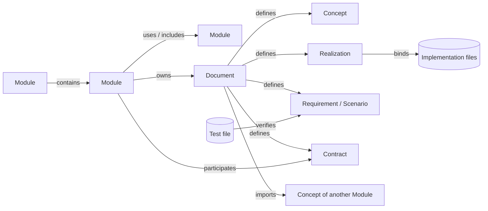

# Spec Protocol principles

Concorde Spec Protocol 11.0.0 defines how a project describes itself as a set of Modules, what each
Module promises, and how the Modules and their files relate. The Protocol applies to project Specs,
including those of software implementing the Protocol. The standard's own chapters need not
describe themselves as Modules.

## Two purposes

The Protocol exists for two purposes. Every rule in it serves at least one of them, and each
chapter says how its rules do.

1. **Understanding.** A human grasps the backbone of the project quickly from its specification:
   its parts, what each is for, how they fit together and how the main flows run. The ultimate goal
   is that a human never needs to read the code to understand the project; the specification is
   enough.
2. **Boundaries.** A harness running an AI task can derive from the specification exactly what the
   task may read and what it may write. Different tasks need different boundaries, so the Protocol
   defines the sets that boundaries are composed from, not one fixed boundary.

The two support each other. A boundary is only useful if what lies inside it is understandable, and
a Module that a human can understand as one responsibility is also the natural unit of a task.

Four failures undermine these purposes, and the rules of the Protocol are designed against them:

1. **Inferred promises.** A reader concludes that something is promised because a file, a
   directory, a name, a link or an adjacent paragraph suggested it. Nothing promised it.
2. **Meaning drift.** The same word denotes different things in different documents, silently.
3. **Authority creep.** Permission to read something becomes permission to change it, or a
   relationship becomes an execution grant.
4. **Fabricated evidence.** Coverage or conformance is claimed by the promise itself rather than by
   anything that ran.

## The model at a glance

A project's specification is **one graph**. Its nodes are the things the specification declares;
its edges are the relations between them. Everything else in the Protocol is either how the graph
is written down, or something computed from it.

**Nodes.** Seven types, defined in [Node types](model.md):

| Node | What it is |
| --- | --- |
| Module | One responsibility. The unit of ownership, of context and of task boundaries |
| Document | A Markdown reading file paired with its JSON metadata; the unit a Module owns |
| Concept | A named meaning a reader must understand; its title is a term |
| Realization | A binding of implementation files to the Module |
| Requirement | One Module-wide `SHALL` obligation |
| Scenario | One concrete situation in `GIVEN`/`WHEN`/`THEN` steps |
| Contract | The versioned agreement for a shared interface |

**Edges.** Thirteen typed, directed relation types, defined in [Relations](relations.md): `owns`,
`defines`, `contains` and `uses` state who is responsible for what; `includes` selects extra
reading; `binds` joins the specification to code; `imports`, `narrows`, `supersedes`, `contrasts`
and `relates` connect meanings and architecture; `participates` and `verifies` tie contracts and
tests to promises.

**Where the graph is written.** Every node and edge is declared exactly once, in a document owned
by the Module responsible for it: in its reading, by a fixed syntax, or in its metadata. A Module's
own relations are in its entry's metadata; the project registry mirrors them for a global view.

**What is computed from the graph.** Nothing below is declared; all of it is derived:

- **Context** — what a reader of a Module may read. See [Context](context.md).
- **Scope** — what a task bound to a Module may be given to write. See
  [Boundaries](boundaries.md).
- **Boundary** — the read and write sets a harness assigns to one task.
- **Views** — diagrams, indexes and pages a human reads. See [Views](views.md).
- **Checks** — decidable rules that the graph is well formed. See [Checks](checks.md).

A few more words are used throughout:

| Term | Meaning |
| --- | --- |
| Declared | Written in the specification: a node or relation stated at its declaration site |
| Derived | Computed from declarations, never written by hand |
| Declaration | The single place where a node or relation is stated |
| Owner | The Module entitled to change a node; every node has exactly one |
| Entry | A Module's `module.md` document, the start of reading it and the home of its own relations |
| Reading | The Markdown member of a document, written for humans |
| Metadata | The JSON member of a document, holding identities and declarations |
| Registry | The project-wide index of Modules, a checked mirror of their entries |

## Axioms

### A1. Every node has one identity, one owner and one explanation

Every declared node MUST have a stable project-wide identity, exactly one owning Module, and
nonempty explanatory prose in the document that defines it. A declaration without an explanation is
invalid, not merely incomplete. Identity survives title and path changes.

*Serves both:* a reader always finds the explanation, and a harness always knows whose write set a
node lies in.

### A2. Every relation is typed, directional and declared exactly once

A relation MUST have a registered type, an explicit source and target, and one declaration site
fixed by its type. The same fact MUST NOT be declarable in two places; the only permitted copy is
a mirror the Protocol names, the project registry, whose equality with the declarations is
checked. A filename, path, title, link, prose sentence, unchecked diagram or directory
neighbourhood MUST NOT create a relation.

*Serves both:* nothing is promised by accident, and boundaries depend only on declarations.

### A3. Reading, writing and proving stay separate

Read sets and write sets are derived from different declarations. Being able to read a document
never makes it writable: a provider's Specs are readable by its consumers and writable only within
the provider's own scope. Realization bindings put file **names** in the read side; contents
become readable or writable only through a task boundary. Evidence is never produced by
specification content.

*Serves boundaries:* this is the rule against authority creep.

### A4. Every relation declares what context it grants and what it requires

A relation type MUST declare `context_grants` and `context_requires`. For every Module, everything
its declared relations require MUST be granted by its declared relations. The reconciliation is a
structural check, defined in [Context](context.md).

*Serves both:* a reader of a Module has every definition its Spec relies on, and a harness that
grants the Module's read set grants a self-sufficient one.

### A5. Evidence originates from what ran, never from what was promised

An evidence relation MUST be declared by the artifact that executes, not by the specification that
the artifact verifies. A specification MUST NOT declare its own coverage.

*Serves both:* a reader can trust that coverage was not merely claimed, and coverage cannot be
claimed from inside the write set of the Module whose promises it covers.

### A6. Views are derived or checked

A published diagram, index or navigation tree is derived from declared relations. A diagram
written in reading is either **checked**, asserting only declared relations, or **illustrative**, explicitly
marked and excluded from the model. See [Views](views.md).

*Serves understanding:* pictures a human relies on cannot silently diverge from the model.

### A7. No inference, no recursion

The model is assertional. Every check operates on declared relations only. No relation is
transitive, symmetric or invertible unless its type says so; derived indexes are never a source of
obligations. Context expansion is one level and never recursive.

*Serves boundaries:* every set is computable and every member is attributable to a declaration.

## Conformance

A conformance claim identifies its Protocol version and distinguishes three claims that cannot
substitute for one another:

- **Structural conformance.** Identities, ownership, pairing, declaration sites, cardinalities,
  checked views and the context reconciliation all hold. This is machine-decidable; see
  [Checks](checks.md). It is what makes boundaries computable.
- **Semantic sufficiency.** The readable content explains the responsibility, its correct use, its
  design and its obligations to the intended reader. This is what makes the specification
  understandable, and it is not machine-decidable.
- **Implementation conformance.** The realization satisfies the requirements and scenarios. This is
  established by evidence, never by structure.

Passing structural checks MUST NOT be reported as either of the other two. Missing meaning is an
attributed gap; a reader MUST NOT read outside its boundary, or infer a promise from source code, to
repair it.

## What the Protocol does not define

Which boundary a particular task receives and how a harness enforces it. Docsite pages, navigation,
themes and interaction. The serialization and location of the project registry, tool
configuration, worker wire formats and context delivery. These are separate agreements; a change
in any of them is not a Protocol version change.
