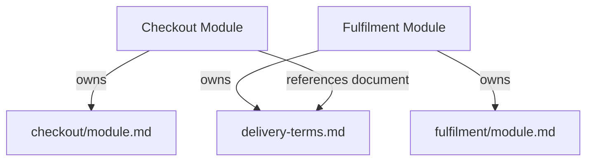
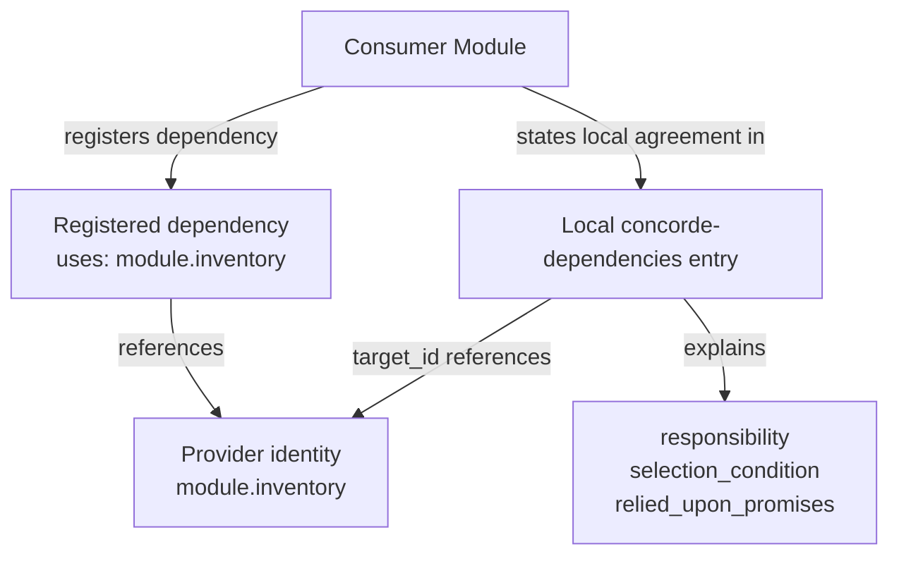

# Spec management

Spec management defines how specifications are identified, grouped and related. Its purpose is to
make an authored contract unambiguous regardless of where its documents are stored or how a tool
publishes them. A registry is the explicit inventory of these declarations; its storage format and
the configuration used to locate it are separate from the meanings defined here.

This chapter explains the meaning of the declarations. The Required format chapter specifies their
mandatory syntax, and the Protocol templates provide authoring starters for them.

## Spec and Context

[Spec and Context](spec-management/spec-and-context.md) defines the queryable entities and the
deterministic mapping from a query identity to its complete Spec file set. Module queries select
their own contracts; scenario queries select the providing Module's complete context. The rules use
explicit identity, unique ownership and Module references. A Module's implementation context is
resolved separately from its entity file bindings.

## Stable identities

Modules, physical Spec documents, scenarios, requirements and entities MUST have stable identities,
unique across those categories within a project. An identity is distinct from a title or file path.
Renaming a title or relocating a document does not by itself change what it identifies.

Scenarios, requirements and entities each belong to one providing Module. Their definitions MUST be
located in documents that belong to that Module alone. Their project-wide unique IDs identify
locally owned parts of a contract; they do not make those parts independent document collections.

An identity is also the anchor of its definition. A link to the defining document whose fragment is
the identity, such as `inventory/module.md#req.inventory.no-oversell`, reaches that definition
wherever the document is published. The path locates the document and may change when the document
moves; the fragment is the stable part. A link is navigation and grants nothing.

For example, `module.inventory`, `scenario.inventory.reserve`, `req.inventory.no-oversell`,
`entity.inventory.stock-ledger` and `document.inventory.contract` identify a Module, one of its
scenarios, one of its requirements, one of its entities and a document describing it. The particular
prefixes in these examples aid recognition; ownership follows the explicit declarations and document
ownership.

## Document ownership, references and reading entries

Every Module registers a nonempty `documents` collection with exactly one local `module.md` reading
entry. Registering a physical document establishes its sole owner. Multiple ownership, unregistered
documents and aliases of a physical file are invalid. Reading order and visibility are presentation
attributes; all selected files are included in full.

The Module registration also declares `references`, a distinct list of typed stable identities:

```json
{
  "id": "module.checkout",
  "documents": ["checkout/module.md", "checkout/scenarios.md"],
  "references": [
    {"kind": "module", "id": "module.inventory"},
    {"kind": "document", "id": "document.delivery-terms"}
  ]
}
```

This is a partial registration example, not a second context list. A Module reference includes all
documents owned by that Module; a document reference includes just that file. It does not include
the referenced Module's own references. A reference MUST resolve to its declared kind; duplicate
reference pairs and references to the selecting Module or its own documents are invalid. Overlapping
Module/document references are allowed and produce one copy with all inclusion reasons. Cycles
between Modules' references are permitted because resolution never recurses.



Delivery terms can define Fulfilment-owned requirements, scenarios, entities and interfaces.
Checkout reads them without acquiring those definitions, the remaining Fulfilment context, its
implementation files, or authority to edit the terms.

## Document metadata

Every registered physical Spec document MUST contain exactly one JSON `concorde-document` block:

```concorde-document
{
  "id": "document.inventory.contract",
  "owner": "module.inventory",
  "main_visible": true
}
```

`id` identifies the document. `owner` MUST equal the sole Module whose `documents` registers it.
`main_visible` is a boolean controlling the main reading view only. Metadata does not declare
references: the Module registration is their sole authority. The example is syntax, not a
declaration that this Protocol chapter belongs to Inventory.

## Relationship declarations

An inventory MUST distinguish these relationships:

- **Composition:** a Module's `parent` is another Module identity or absent. It establishes the
  single-parent, acyclic structure described by the Module model.
- **Dependency:** a Module's `uses` references identify the Modules whose capabilities it consumes.
  These are directed references and do not confer structural ownership.
- **File listing:** a Module's `files` identify the implementation files its entities bind, as
  exact files or directory prefixes. The inventory value MUST equal the union of the Module's
  entity file declarations, entry for entry.
- **Document ownership:** a Module's `documents` identify the documents it alone owns.
- **Context inclusion:** a Module's `references` identify other Modules or registered documents
  to include once, without following their references. These do not imply any other relationship.

All references MUST resolve to the appropriate kind of entity. File paths and display titles MUST
NOT be used to infer undeclared parentage, dependencies or file ownership.

## Local dependency promises

Every direct dependency and child MUST be described in the containing or consuming Module's own
collection with a JSON `concorde-dependencies` declaration. Each entry has four fields:

```concorde-dependencies
[
  {
    "target_id": "module.inventory",
    "responsibility": "Maintain available stock and reservations.",
    "selection_condition": "When checkout needs to reserve the requested quantity.",
    "relied_upon_promises": [
      "[Reservation outcome](inventory/module.md#scenario.inventory.reserve), used to decide whether checkout can proceed."
    ]
  }
]
```

`target_id` identifies the provider. `responsibility` describes what it supplies.
`selection_condition` explains when this collaboration applies; it is not an agent-routing command.
`relied_upon_promises` is a nonempty list of the guarantees the consumer or parent relies on; a
promise SHOULD be a Markdown link to a canonical provider definition with a local explanation of why
it is needed. Required definitions MUST be present in the resolved context through explicit
references; a prose link alone does not load them. Consumer obligations and failure reactions stay
local; the provider schema and common behavior MUST NOT be copied into a second authority. The set
of provider identities MUST agree with the Module's direct dependency and child relationships. A
relationship edge alone does not supply these behavioral promises.



Both representations identify the same provider: one records the relationship, the other supplies
its local meaning. For composition, the child's `parent` reference and the parent's local child
declaration must likewise agree. Following either relationship does not expand context.

## Entity declarations

A Module declares its entities in JSON `concorde-entities` blocks within its own single-owner
documents. Each entry identifies one entity:

```concorde-entities
[
  {
    "id": "entity.inventory.stock-ledger",
    "title": "Stock ledger",
    "kind": "program",
    "responsibility": "Keeps the available quantity per item and applies reservations atomically.",
    "files": ["src/inventory/ledger/", "tests/inventory/test_ledger.py"],
    "pending": ["tests/inventory/test_ledger.py"]
  },
  {
    "id": "entity.inventory.warehouse",
    "title": "Warehouse",
    "kind": "used module",
    "target_id": "module.warehouse",
    "responsibility": "Reports physical stock counts that the ledger reconciles against."
  }
]
```

`id` is the entity's stable identity. `title` names the entity in prose and diagrams and is unique
within the Module. `kind` is free text. `responsibility` states what the entity does or represents.
`files` lists the entries that realize the entity, each an exact file or a directory prefix with a
trailing slash; `pending` names the subset of those entries that are declared but not yet created.
`target_id` identifies a child or used Module the entity stands for; such an entity lists no files,
because those files belong to that Module. An entity without `files` and without `target_id` is a
concept, record, interface or actor.

Within one Module each entry appears under one entity, and a file covered by several entries of the
Module belongs to the most specific one. The union of a Module's entity entries is its
implementation file listing and MUST equal the inventory's `files` for that Module, entry for entry.
Every child and every used Module MUST be represented by an entity with the corresponding
`target_id`, and every `target_id` MUST name a child or used Module. Listing a file grants nothing
by itself; a development tool decides which phases may read or change listed files.

## Structured interface agreements

An interface remains an entity of its owning Module. Its definition MAY occupy a separate owned
document referenced by any number of Modules. Each structured contract ID has exactly one canonical
`concorde-contract` definition, with `id`, `version`, `schema`, `semantics` and `example`. `version`
is a positive integer and `example` MUST satisfy `schema`. Definitions are unique across the
project's identity categories; a binding uses an existing ID without defining it again.

The owning document centralizes the structure, meaning, inputs and outputs, errors, side effects,
compatibility and related scenarios. Those behaviors MAY be stated by ordinary Markdown links to
other canonical definitions only when all necessary definitions occur in each consuming context.
There is no recursive inclusion or special link syntax. The schema's supported vocabulary MUST be
explicit and offline; schema references cannot load Spec files or remote resources.

Each participant declares a `concorde-contract-binding` with `id`, `version`, `role`, `peer`,
`selection_condition`, `relied_upon_guarantees` and `obligations`. Role is `provided` or `required`;
peer is a Module ID or `external:<name>`. Both guarantee and obligation lists are nonempty strings.
Guarantees SHOULD link to the canonical definition/scenarios and explain their local use. Bindings
MUST NOT repeat schema, example or common semantics. Consumers retain their own use conditions,
obligations and error reactions. The defining owner need not be every provider, but every
participant MUST include the exact definition version in its resolved context.

For an internal peer, the counterpart MUST declare a complementary role for the same ID/version and
identify the participant as peer. External peers need no project-owned counterpart. A binding cannot
override a definition. Multiple providers may implement one canonical contract; contradictory
bindings or duplicate participant/peer/role bindings are errors. Structural matching does not prove
behavioral compatibility.

Changing the canonical agreement requires review of its owner and all contexts that include its
document, whether through Module or document references. Byte or inclusion changes invalidate their
dependent context/review identities. A behavior or schema change increments the contract version and
updates affected bindings atomically; editorial changes still invalidate byte-bound evidence.
Ownership transfer preserves IDs and atomically reconciles registrations, metadata, links, bindings
and affected references. Publication shows the definition once with owner and consumer links,
without transcluding it into consumer pages.

## Relationship diagrams

A Module's relationships are authored as Mermaid flowchart fences inside its registered Markdown
documents. The fences in the Relationships subsection of the reading entry's Ontology are the
authoritative relationship model: their nodes MUST be exactly the owning Module's entity titles,
excluding included foreign entities and every edge MUST carry a label. Further diagrams in other
registered documents MAY illustrate behavior or detail. An inline fence is part of its containing
document and adds no file to the collection. Rendered diagrams, indexes and navigation views derive
from the registered documents and MUST NOT create a second authority for the contract or change
ownership or context inclusion.

## Scenario verification index

A tool MAY derive a verification index from the Module's implementation files: for every scenario,
the tests that declare its identity. The index is derived from the tests alone, in the declaration
syntax the tool defines; no Spec document contributes to it and no Spec document lists a test. It is
implementation metadata beside the reverse file index, reported as coverage evidence, and it does
not change identities, ownership, references or the contract.

## Versions and consistency

A project identifies the Protocol version its specifications follow. This is distinct from the
versions of its own interface agreements and any registry serialization used by a tool. Tools may
additionally identify exact revisions or content digests for reproducibility.

Identities, ownership, references, interface bindings, local dependency promises, entity
declarations and file listings MUST describe one consistent model. A structured declaration cannot
override contradictory prose, and prose cannot silently add a relationship missing from the explicit
inventory.
