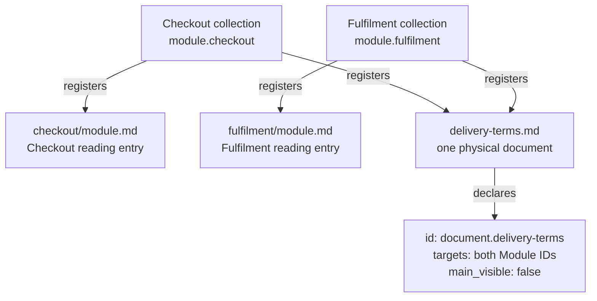
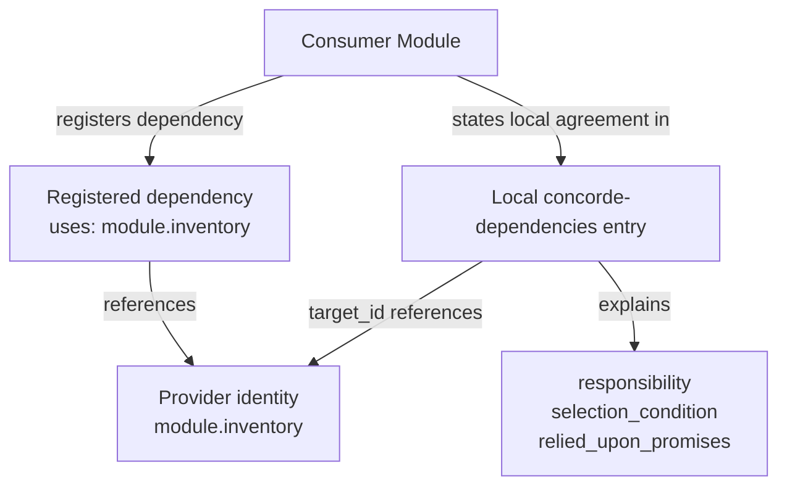

# Spec management

Spec management defines how specifications are identified, grouped and related. Its purpose is to
make an authored contract unambiguous regardless of where its documents are stored or how a tool
publishes them. A registry is the explicit inventory of these declarations; its storage format and
the configuration used to locate it are separate from the meanings defined here.

This chapter explains the meaning of the declarations. The Required format chapter specifies
their mandatory syntax, and the Protocol templates provide authoring starters for them.

## Spec and Context

[Spec and Context](spec-management/spec-and-context.md) defines the queryable entities and the
deterministic mapping from a query identity to its complete Spec file set. Module queries select
their own contracts; scenario queries select the providing Module's complete context. The rules
use explicit identity, ownership and document membership. A Module's implementation context is
resolved separately from its entity file bindings.

## Stable identities

Modules, physical Spec documents, scenarios, requirements and entities MUST have stable
identities, unique across those categories within a project. An identity is distinct from a title
or file path. Renaming a title or relocating a document does not by itself change what it
identifies.

Scenarios, requirements and entities each belong to one providing Module. Their definitions MUST
be located in documents that belong to that Module alone. Their project-wide unique IDs identify
locally owned parts of a contract; they do not make those parts independent document collections.

An identity is also the anchor of its definition. A link to the defining document whose fragment
is the identity, such as `inventory/module.md#req.inventory.no-oversell`, reaches that definition
wherever the document is published. The path locates the document and may change when the
document moves; the fragment is the stable part. A link is navigation and grants nothing.

For example, `module.inventory`, `scenario.inventory.reserve`, `req.inventory.no-oversell`,
`entity.inventory.stock-ledger` and `document.inventory.contract` identify a Module, one of its
scenarios, one of its requirements, one of its entities and a document describing it. The
particular prefixes in these examples aid recognition; ownership follows the explicit
declarations and document membership.

## Document collections and reading entries

Every Module MUST register a nonempty collection of Markdown documents and exactly one local
`module.md` reading entry. That entry belongs only to its Module. Additional documents MAY be
shared by explicitly registering the same physical document in each participating Module's
collection. Shared content must be meaningful and consistent in every collection that includes it.

Membership determines the complete Spec. Neither a hyperlink nor a directory walk changes it.
Document order and a reading entry help navigation; they do not make other members optional.



The example gives each Module a complete two-document collection. The shared document is a member
of both, but neither Module acquires the other's reading entry. Display visibility does not alter
that membership. Paths locate documents; the document ID supplies stable identity. Because the
shared document has two owners, it cannot define scenarios, requirements or entities; those
definitions live in single-owner documents.

## Document metadata

Every registered physical Spec document MUST contain exactly one JSON `concorde-document` block:

```concorde-document
{
  "id": "document.inventory.contract",
  "targets": ["module.inventory"],
  "main_visible": true
}
```

`id` identifies the physical document. `targets` is a nonempty list containing exactly the Module
identities whose collections register that document, without duplicates. Both sides of the
membership declaration MUST agree. An explicitly shared document lists all referring Modules.

`main_visible` is a boolean indicating whether the document is included in a main reading view.
It is presentation metadata: false does not remove the document from the complete contract or
make its contents less authoritative. A publisher decides how to present such views without
changing the registered collection.

The block above is an example of the syntax required in project Specs. It is not a declaration
that this Protocol chapter belongs to the example Module.

## Relationship declarations

An inventory MUST distinguish these relationships:

- **Composition:** a Module's `parent` is another Module identity or absent. It establishes the
  single-parent, acyclic structure described by the Module model.
- **Dependency:** a Module's `uses` references identify the Modules whose capabilities it consumes.
  These are directed references and do not confer structural ownership.
- **File listing:** a Module's `files` identify the implementation files its entities bind, as
  exact files or directory prefixes. The inventory value MUST equal the union of the Module's
  entity file declarations, entry for entry.
- **Document membership:** a Module's `documents` identify its complete registered collection.

All references MUST resolve to the appropriate kind of entity. File paths and display titles MUST
NOT be used to infer undeclared parentage, dependencies or file ownership.

## Local dependency promises

Every direct dependency and child MUST be described in the containing or consuming Module's own
collection with a JSON `concorde-dependencies` declaration. Each entry has four fields:

```concorde-dependencies
[
  {
    "target_id": "module.inventory",
    "responsibility": "Maintain available stock and reservations.",
    "selection_condition": "When checkout needs to reserve the requested quantity.",
    "relied_upon_promises": [
      "scenario.inventory.reserve: a successful reservation makes the requested quantity unavailable to later reservations.",
      "Insufficient stock returns a failure without creating a reservation."
    ]
  }
]
```

`target_id` identifies the provider. `responsibility` describes what it supplies.
`selection_condition` explains when this collaboration applies; it is not an agent-routing command.
`relied_upon_promises` is a nonempty list of the guarantees the consumer or parent relies on; a
promise MAY begin with the provider's scenario or requirement identity. The set of provider
identities MUST agree with the Module's direct dependency and child relationships. A relationship
edge alone does not supply these behavioral promises.



Both representations identify the same provider: one records the relationship, the other supplies
its local meaning. For composition, the child's `parent` reference and the parent's local child
declaration must likewise agree. Following either relationship does not expand document membership.

## Entity declarations

A Module declares its entities in JSON `concorde-entities` blocks within its own single-owner
documents. Each entry identifies one entity:

```concorde-entities
[
  {
    "id": "entity.inventory.stock-ledger",
    "title": "Stock ledger",
    "kind": "program",
    "responsibility": "Keeps the available quantity per item and applies reservations atomically.",
    "files": ["src/inventory/ledger/", "tests/inventory/test_ledger.py"],
    "pending": ["tests/inventory/test_ledger.py"]
  },
  {
    "id": "entity.inventory.warehouse",
    "title": "Warehouse",
    "kind": "used module",
    "target_id": "module.warehouse",
    "responsibility": "Reports physical stock counts that the ledger reconciles against."
  }
]
```

`id` is the entity's stable identity. `title` names the entity in prose and diagrams and is unique
within the Module. `kind` is free text. `responsibility` states what the entity does or represents.
`files` lists the entries that realize the entity, each an exact file or a directory prefix with a
trailing slash; `pending` names the subset of those entries that are declared but not yet created.
`target_id` identifies a child or used Module the entity stands for; such an entity lists no files,
because those files belong to that Module. An entity without `files` and without `target_id` is a
concept, record, interface or actor.

Within one Module each entry appears under one entity, and a file covered by several entries of
the Module belongs to the most specific one. The union of a Module's entity entries is its
implementation file listing and MUST equal the inventory's `files` for that Module, entry for entry.
Every child and every used Module MUST be represented by an entity with the corresponding
`target_id`, and every `target_id` MUST name a child or used Module. Listing a file grants nothing
by itself; a development tool decides which phases may read or change listed files.

## Structured interface agreements

An interface may exchange structured values. A JSON `concorde-contract` block records an explicit
provided or required agreement for such a value. It has these fields:

- `id`: the stable identity of the exchanged contract.
- `version`: a positive integer identifying the contract version.
- `role`: `provided` or `required` from the declaring Module's perspective.
- `peer`: the counterpart's Module identity, or `external:<name>` for an external participant.
- `schema`: the declared structure of the value.
- `semantics`: a nonempty local explanation of its meaning.
- `example`: a value conforming to the declared schema.

A required agreement with an internal provider MUST match that provider's contract identity,
version and schema. Local semantic promises must also be compatible. Matching fields alone does
not establish that agreement. Contract identity is shared across its provided and required
declarations; those declarations are not duplicate Module, scenario, entity or document
identities. The prose around a declaration SHOULD relate it to the interface entity that
exchanges the value and to the scenarios in which it is exchanged.

The schema representation and supported vocabulary must be explicit to its consumers. A schema
or example does not replace the scenarios that state inputs, effects, errors and compatibility.

## Relationship diagrams

A Module's relationships are authored as Mermaid flowchart fences inside its registered Markdown
documents. The fences in the Relationships subsection of the reading entry's Ontology are the
authoritative relationship model: their nodes MUST be exactly the Module's entity titles and
every edge MUST carry a label. Further diagrams in other registered documents MAY illustrate
behavior or detail. An inline fence is part of its containing document and adds no file to the
collection. Rendered diagrams, indexes and navigation views derive from the registered documents
and MUST NOT create a second authority for the contract or change its membership.

## Scenario verification index

A tool MAY derive a verification index from the Module's implementation files: for every
scenario, the tests that declare its identity. The index is derived from the tests alone, in the
declaration syntax the tool defines; no Spec document contributes to it and no Spec document lists
a test. It is implementation metadata beside the reverse file index, reported as coverage
evidence, and it does not change identities, membership or the contract.

## Versions and consistency

A project identifies the Protocol version its specifications follow. This is distinct from the
versions of its own interface agreements and any registry serialization used by a tool.
Tools may additionally identify exact revisions or content digests for reproducibility.

Identities, collection membership, local dependency promises, entity declarations and file
listings MUST describe one consistent model. A structured declaration cannot override
contradictory prose, and prose cannot silently add a relationship missing from the explicit
inventory.
