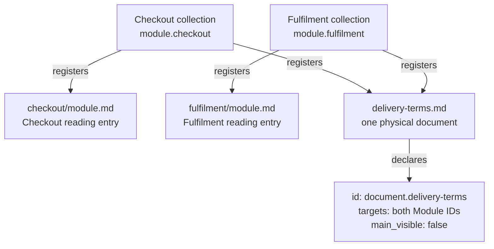
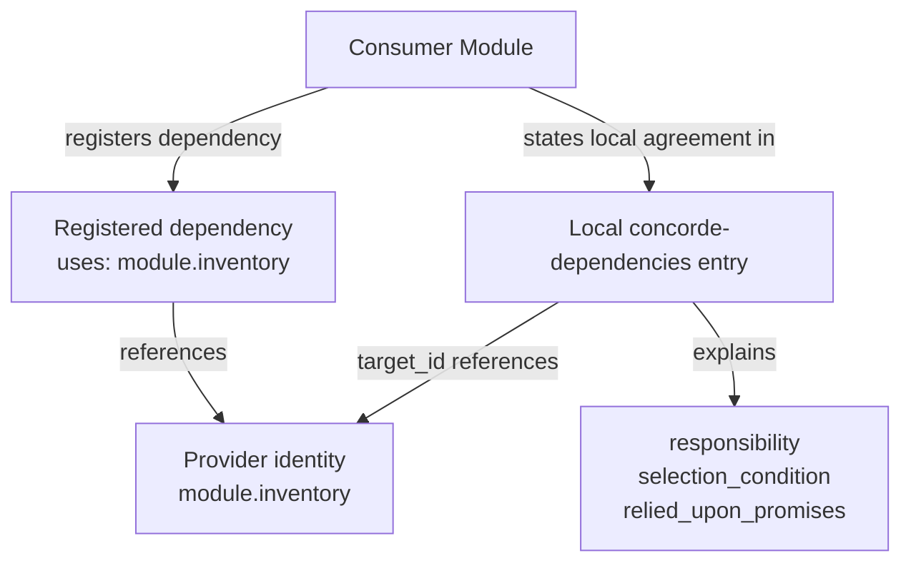

# Spec management

Spec management defines how specifications are identified, grouped and related. Its purpose is to
make an authored contract unambiguous regardless of where its documents are stored or how a tool
publishes them. A registry is the explicit inventory of these declarations; its storage format and
the configuration used to locate it are separate from the meanings defined here.

This chapter explains the meaning of the declarations. The Required format chapter specifies
their mandatory syntax, and the Protocol templates provide authoring starters for them.

## Spec and Context

[Spec and Context](spec-management/spec-and-context.md) defines the queryable entities and the
deterministic mapping from a query identity to its complete Spec file set. Module queries select
their own contracts; Feature and Interface queries select the providing Module's complete context.
The rules use explicit identity, ownership, document membership and authored-source declarations.
Implementation queries select their own Spec collections. Understanding one realization against
a particular Module contract requires an explicit Module/Implementation pairing.

## Stable identities

Modules, Implementation Specs, physical Spec documents, features and interfaces MUST have stable
identities, unique across those categories within a project. An identity is distinct from a title
or file path. Renaming a title or relocating a document does not by itself change what it identifies.

Features and interfaces each belong to one providing Module. Their definitions MUST be located in
that Module's registered collection. Their project-wide unique IDs identify locally owned parts
of a contract; they do not make those parts independent document collections.

For example, `module.inventory`, `feature.inventory.reserve` and `document.inventory.contract`
identify a Module, one of its features and a document describing it. The particular prefixes in
these examples do not determine ownership; the explicit declarations do.

## Document collections and reading entries

Every Module MUST register a nonempty collection of Markdown documents and exactly one local
`module.md` reading entry. That entry belongs only to its Module. Additional documents MAY be
shared by explicitly registering the same physical document in each participating Module's
collection. Shared content must be meaningful and consistent in every collection that includes it.

An Implementation Spec also registers a nonempty Markdown collection. Its documents belong to
that Implementation Spec alone and MUST NOT also be Module documents. Reuse is expressed by
referencing its identity, not by duplicating ownership or registering its documents as Module text.

Membership determines the complete Spec. Neither a hyperlink nor a directory walk changes it.
Document order and a reading entry help navigation; they do not make other members optional.



The example gives each Module a complete two-document collection. The shared document is a member
of both, but neither Module acquires the other's reading entry. Display visibility does not alter
that membership. Paths locate documents; the document ID supplies stable identity.

## Document metadata

Every registered physical Spec document MUST contain exactly one JSON `concorde-document` block:

```concorde-document
{
  "id": "document.inventory.contract",
  "targets": ["module.inventory"],
  "main_visible": true
}
```

`id` identifies the physical document. `targets` is a nonempty list containing exactly the Module
or Implementation Spec identities whose collections register that document, without duplicates.
Both sides of the membership declaration MUST agree. An explicitly shared Module document lists
all referring Modules; an Implementation document lists its single owning Implementation Spec.

`main_visible` is a boolean indicating whether the document is included in a main reading view.
It is presentation metadata: false does not remove the document from the complete contract or
make its contents less authoritative. A publisher decides how to present such views without
changing the registered collection.

The block above is an example of the syntax required in project Specs. It is not a declaration
that this Protocol chapter belongs to the example Module.

## Relationship declarations

An inventory MUST distinguish these relationships:

- **Composition:** a Module's `parent` is another Module identity or absent. It establishes the
  single-parent, acyclic structure described by the Module model.
- **Dependency:** a Module's `uses` references identify the Modules whose capabilities it consumes.
  These are directed references and do not confer structural ownership.
- **Realization:** a Module's `implementations` references identify its Implementation Specs.
  Several Modules may reference the same realization.
- **File binding:** an Implementation Spec's `files` identify its exact implementation files,
  with one authoritative owner per file.
- **Document membership:** a specification's `documents` identify its complete registered collection.

All references MUST resolve to the appropriate kind of entity. Feature and interface declarations
also identify their defining local document. File paths and display titles MUST NOT be used to
infer undeclared parentage, dependencies or ownership.

## Local dependency promises

Every direct dependency and child MUST be described in the containing or consuming Module's own
collection with a JSON `concorde-dependencies` declaration. Each entry has four fields:

```concorde-dependencies
[
  {
    "target_id": "module.inventory",
    "responsibility": "Maintain available stock and reservations.",
    "selection_condition": "When checkout needs to reserve the requested quantity.",
    "relied_upon_promises": [
      "A successful reservation makes the requested quantity unavailable to later reservations.",
      "Insufficient stock returns a failure without creating a reservation."
    ]
  }
]
```

`target_id` identifies the provider. `responsibility` describes what it supplies.
`selection_condition` explains when this collaboration applies; it is not an agent-routing command.
`relied_upon_promises` is a nonempty list of the guarantees the consumer or parent relies on.
The set of provider identities MUST agree with the Module's direct dependency and child
relationships. A relationship edge alone does not supply these behavioral promises.



Both representations identify the same provider: one records the relationship, the other supplies
its local meaning. For composition, the child's `parent` reference and the parent's local child
declaration must likewise agree. Following either relationship does not expand document membership.

## Structured interface agreements

An interface may exchange structured values. A JSON `concorde-contract` block records an explicit
provided or required agreement for such a value. It has these fields:

- `id`: the stable identity of the exchanged contract.
- `version`: a positive integer identifying the contract version.
- `role`: `provided` or `required` from the declaring Module's perspective.
- `peer`: the counterpart's Module identity, or `external:<name>` for an external participant.
- `schema`: the declared structure of the value.
- `semantics`: a nonempty local explanation of its meaning.
- `example`: a value conforming to the declared schema.

A required agreement with an internal provider MUST match that provider's contract identity,
version and schema. Local semantic promises must also be compatible. Matching fields alone does
not establish that agreement. Contract identity is shared across its provided and required
declarations; those declarations are not duplicate Module, feature or document identities.

The schema representation and supported vocabulary must be explicit to its consumers. A schema
or example does not replace the interface's inputs, effects, errors or compatibility semantics.
Interfaces that do not exchange structured values still require complete usage contracts.

## Architecture sources and derived views

When a diagram contributes to a Spec, its authored source MUST be explicitly identified together
with its kind and title. Readers must be able to relate it to the same Module's written model.
Rendered diagrams, indexes and navigation views derive from the registered sources and MUST NOT
create a second authority for the contract or change its membership.

## Versions and consistency

A project identifies the Protocol version its specifications follow. This is distinct from the
versions of its own interface agreements and any registry serialization used by a tool.
Tools may additionally identify exact revisions or content digests for reproducibility.

Identities, collection membership, local dependency promises, implementation references and file
bindings MUST describe one consistent model. A structured declaration cannot override contradictory
prose, and prose cannot silently add a relationship missing from the explicit inventory.
