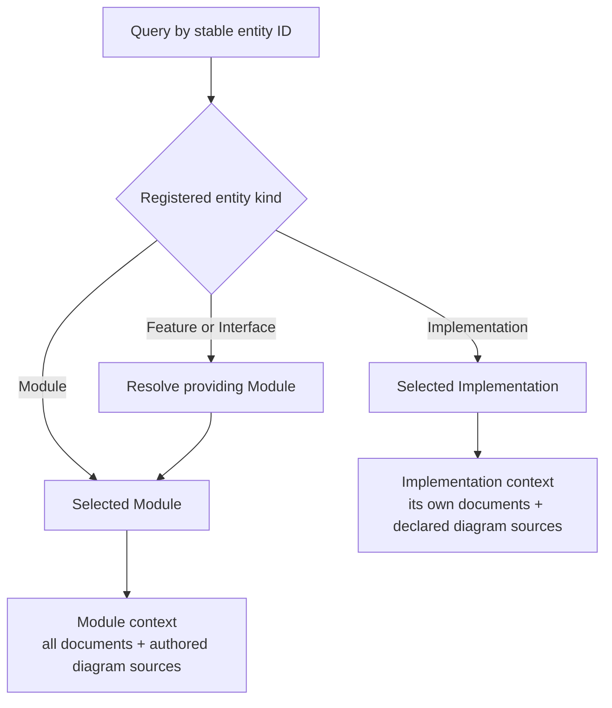

# Spec and Context

A Spec defines both a software contract and the project files needed to understand that contract.
**Spec context** is the complete set of authored Spec files selected by a queryable entity.
Module contract context and Implementation description context are distinct cases of that rule.
This is part of Spec management: identity selects the subject, membership selects the files, and
the specification model determines what those files must explain.

This chapter defines project-Spec context. The Protocol text, a reader's question and a tool's
operational instructions are separate inputs. Context membership describes the information boundary;
it does not by itself grant file-write, command or network permissions.

## Queryable entities

A Spec query selects a semantic entity by its registered stable ID. The supported query domain
is explicit:

| Entity kind | Identity resolves to | Spec collection selected |
| --- | --- | --- |
| Module | That Module | Its complete Module Spec. |
| Feature | Its providing Module and local feature definition | The providing Module's complete Spec. |
| Interface | Its providing Module and local interface definition | The providing Module's complete Spec. |
| Implementation | That registered realization | Its own complete Implementation Spec. |

A Feature or Interface has exactly one providing Module. The lookup MUST use the explicit
registration, not an ID prefix, document path or directory. Its defining document locates the
requested definition but does not select a smaller collection. The queried entity remains the
focus; the owning Module determines contract membership.

Document IDs, diagram sources, headings and file paths identify artifacts or locations rather
than additional semantic query kinds. A document lookup may retrieve an artifact, but it does not
silently choose a Module context. This matters for shared documents with several referring Modules.

## Selecting an entity versus mentioning it

An explicit query selects an entity and resolves its context. An ID mentioned inside an already
selected Spec is a relationship or navigation reference; it does not invoke another query.
A dependency declaration or hyperlink therefore does not recursively load the provider's Spec.
An explicit query of that provider is a separate entity selection with its own context.



## Entity to Specs, then Specs to files

Resolution has two deterministic steps. First select the authoritative Spec collection for the
entity. Then expand only that collection's explicit document and authored-source memberships.
A Module or Implementation has one authoritative Spec collection; a Feature or Interface selects
its providing Module's collection. These are existing identities and memberships, not another
kind of Spec or a separately authored context list.

Let `D(S)` be a selected Spec's complete registered Markdown collection and `A(S)` its explicitly
declared separate authored diagram sources, empty when none are declared. Then:

```text
Context(M) = D(M) union A(M)
Context(feature F) = Context(owner(F))
Context(interface T) = Context(owner(T))
Context(implementation R) = D(R) union A(R)
```

Given the same valid declarations and the same query identity, the resulting file set MUST be
the same. It is determined from identity, ownership, document membership and authored-source
declarations, without model judgment, keyword search or interpretation of prose links.

A deterministic resolver for the four query kinds follows this rule:

```text
resolve_spec_files(inventory, entity_id):
    entity = lookup_unique_registered_entity(inventory, entity_id)
    if entity.kind in {Module, Implementation}:
        spec = authoritative_spec_of(entity)
    else if entity.kind in {Feature, Interface}:
        spec = authoritative_spec_of(registered_providing_module(entity))
    else:
        fail: unsupported Spec query kind
    require valid ownership and matching membership declarations
    return sorted(unique(documents(spec) + authored_diagram_sources(spec)))
```

`sorted` orders the canonical project-relative path strings. This provides reproducible output
without changing the set; the `module.md` reading entry and registered reading order remain
separate navigation information. A resolver may present a richer result, but MUST preserve this
entity-to-file mapping.

For Module, Feature and Interface queries, the following membership rules apply:

- Include `module.md` and every additional registered document in full. A reading entry, feature
  definition, excerpt or summary does not replace the complete collection.
- Include explicitly shared documents once per physical file in the selected context. Sharing a
  document does not include the other documents of its co-owning Modules.
- Include registered documents whose `main_visible` value is false. Visibility affects presentation,
  not the information needed to understand the contract.
- Include explicitly declared authored diagram sources. An inline diagram is already part of its
  containing Markdown document; it does not add another file. A rendered view does not add another
  authored authority.
- Use the exact registered paths. Directory neighbors, parent or child collections, `uses` targets,
  ordinary links and Implementation references do not add files implicitly.

The inventory metadata needed to resolve identities, ownership and membership accompanies this
selection. Reading those declarations does not mean loading every Spec named in the inventory.
Every additional file needed to supply contract meaning MUST be an explicit document member or
a declared authored diagram source. A file's own links do not create recursive membership.

## Example: one feature, the complete Module context

Suppose `feature.checkout.reserve` belongs to `module.checkout` and is defined in
`checkout/reservations.md`. Checkout registers three documents and one separate diagram source:

| Declared file | Why it is included |
| --- | --- |
| `checkout/module.md` | The Module's reading entry and overall responsibility. |
| `checkout/reservations.md` | The selected feature and its usage promises. |
| `shared/delivery-terms.md` | An explicitly shared member, even with `main_visible: false`. |
| `checkout/diagrams/overview.svg` | The explicitly declared authored architecture source. |

A request about `module.checkout` and a request about `feature.checkout.reserve` both include these
four files. The focus changes; the file set does not. The diagram filename illustrates a declared
source, not a required drawing format or a Framework renderer contract.

If Checkout uses Inventory, `inventory/module.md` is not added by that dependency. Checkout must
state the Inventory guarantees it relies on locally. If a sibling Module also registers the delivery
terms, that sibling's remaining documents are not added either. A linked README and source files
such as `src/reservations.py` likewise do not become contract context through those relationships.

## Implementation queries and explicit combinations

An Implementation query selects that realization's complete registered Spec documents and any
explicitly declared authored diagram sources. It does not include bound source files, the Specs
of its using Modules or other implementations. Those
relationships remain explicit metadata; they do not trigger more queries.

For example, `implementation.reservations` may register `implementations/reservations.md` and be
referenced by Checkout. Querying that Implementation alone includes its registered document.
Querying how it realizes Checkout requires explicitly selecting both entities and checking that
Checkout references that Implementation:

```text
Context(module M, implementation R) = Context(M) union Context(R)
Precondition: R is explicitly referenced by M.
```

In the Checkout example, this combination includes the four Module files plus the Implementation
Spec document. It still excludes `src/reservations.py`. An Implementation used by several Modules
does not acquire an implicit preferred Module; the requested pairing must name the Module.

An execution request MAY separately authorize an extension with exact implementation files.
Each such addition must be attributable to an explicitly selected Implementation and its binding.
Declared files pending creation remain identified as pending, not represented as already available
contents. This extension does not import another using Module's collection or confer authority
to change it. The development environment defines the applicable execution and permission rules;
ordinary Spec queries retain the deterministic file sets above.

## Completeness and unresolved references

A resolved context MUST identify the requested entity and kind, the providing Module for a
Feature or Interface, any explicit Module/Implementation pairing, and the exact included file set.
It SHOULD identify the source revisions or digests when a consumer needs to reproduce the same
understanding; stable entity IDs alone do not identify unchanged text.

An unknown identity, ambiguous owner, inconsistent membership or unavailable required file prevents
a claim that the context has been completely resolved. A reader MUST NOT silently substitute a
nearby file, omit a required member or guess an owner from a path. A shared document reference alone
does not choose which Module is the subject; that subject must be explicit.

Complete file membership also does not prove complete meaning. If the selected files lack a
required promise, the Module Spec has a semantic gap. Reading a provider's Spec or implementation
cannot silently repair that contract boundary.
