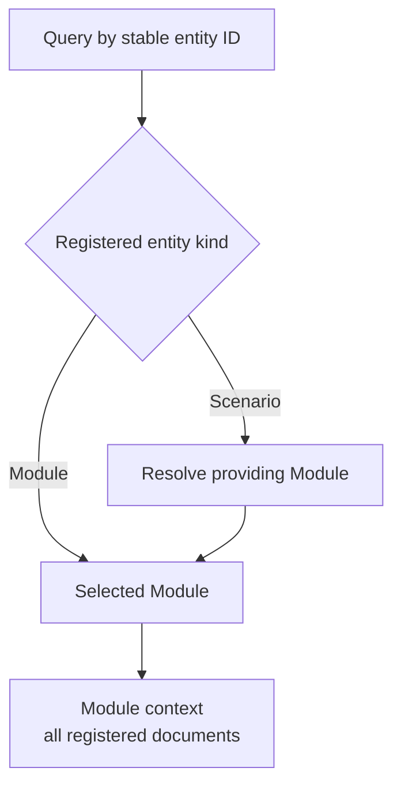

# Spec and Context

A Spec defines both a software contract and the project files needed to understand that contract.
**Spec context** is the complete set of authored Spec files selected by a queryable entity.
A Module additionally has an **implementation context**, defined at the end of this chapter, which
is resolved from its entity file bindings and is never part of its Spec context.
This is part of Spec management: identity selects the subject, membership selects the files, and
the specification model determines what those files must explain.

This chapter defines project-Spec context. The Protocol text, a reader's question and a tool's
operational instructions are separate inputs. Context membership describes the information boundary;
it does not by itself grant file-write, command or network permissions.

## Queryable entities

A Spec query selects a semantic entity by its registered stable ID. The supported query domain
is explicit:

| Entity kind | Identity resolves to | Spec collection selected |
| --- | --- | --- |
| Module | That Module | Its complete Module Spec. |
| Scenario | Its providing Module and local scenario definition | The providing Module's complete Spec. |

A scenario has exactly one providing Module: the sole owner of the document that defines it. The
lookup MUST use that explicit membership, not an ID prefix, document path or directory. Its
defining document locates the requested definition but does not select a smaller collection. The
queried scenario remains the focus; the owning Module determines contract membership.

Requirement IDs, entity IDs, document IDs, headings and file paths identify parts, artifacts or
locations rather than additional semantic query kinds. A document lookup may retrieve an artifact,
but it does not silently choose a Module context. This matters for shared documents with several
referring Modules.

## Selecting an entity versus mentioning it

An explicit query selects a Module or scenario and resolves its context. An ID mentioned inside an
already selected Spec is a relationship or navigation reference; it does not invoke another query.
A dependency declaration, an entity with a `target_id` or a hyperlink therefore does not
recursively load the provider's Spec. An explicit query of that provider is a separate selection
with its own context.



## Entity to Spec, then Spec to files

Resolution has two deterministic steps. First select the authoritative Spec collection for the
entity. Then expand only that collection's explicit document membership. A Module has one
authoritative Spec collection; a scenario selects its providing Module's collection. These are
existing identities and memberships, not another kind of Spec or a separately authored context
list.

Let `D(M)` be a selected Module's complete registered Markdown collection. Then:

```text
Context(M) = D(M)
Context(scenario S) = Context(owner(S))
```

Given the same valid declarations and the same query identity, the resulting file set MUST be
the same. It is determined from identity, ownership and document membership, without model
judgment, keyword search or interpretation of prose links.

A deterministic resolver for the two query kinds follows this rule:

```text
resolve_spec_files(inventory, entity_id):
    entity = lookup_unique_registered_entity(inventory, entity_id)
    if entity.kind is Module:
        module = entity
    else if entity.kind is Scenario:
        module = sole_owner_of_defining_document(entity)
    else:
        fail: unsupported Spec query kind
    require valid ownership and matching membership declarations
    return sorted(unique(documents(module)))
```

`sorted` orders the canonical project-relative path strings. This provides reproducible output
without changing the set; the `module.md` reading entry and registered reading order remain
separate navigation information. A resolver may present a richer result, but MUST preserve this
entity-to-file mapping.

The following membership rules apply:

- Include `module.md` and every additional registered document in full. A reading entry, scenario
  definition, excerpt or summary does not replace the complete collection.
- Include explicitly shared documents once per physical file in the selected context. Sharing a
  document does not include the other documents of its co-owning Modules.
- Include registered documents whose `main_visible` value is false. Visibility affects presentation,
  not the information needed to understand the contract.
- Inline diagrams are part of their containing Markdown documents; they add no files, and a
  rendered view adds no authored authority.
- Use the exact registered paths. Directory neighbors, parent or child collections, `uses` targets,
  ordinary links and listed implementation files do not add files implicitly.

The inventory metadata needed to resolve identities, ownership and membership accompanies this
selection. Reading those declarations does not mean loading every Spec named in the inventory.
Every additional file needed to supply contract meaning MUST be an explicit document member.
A file's own links do not create recursive membership.

## Example: one scenario, the complete Module context

Suppose `scenario.checkout.submit` belongs to `module.checkout` and is defined in
`checkout/scenarios.md`. Checkout registers three documents:

| Declared file | Why it is included |
| --- | --- |
| `checkout/module.md` | The Module's reading entry with its four mandatory parts. |
| `checkout/scenarios.md` | The selected scenario and its neighbors. |
| `shared/delivery-terms.md` | An explicitly shared member, even with `main_visible: false`. |

A request about `module.checkout` and a request about `scenario.checkout.submit` both include these
three files. The focus changes; the file set does not.

If Checkout uses Inventory, `inventory/module.md` is not added by that dependency. Checkout must
state the Inventory guarantees it relies on locally. If a sibling Module also registers the delivery
terms, that sibling's remaining documents are not added either. A linked README and listed files
such as `src/reservations.py` likewise do not become contract context through those relationships.

## Implementation context

**Implementation context** is the Protocol term for the implementation knowledge that belongs to a
Module: the files its entities bind, each identified as existing or pending. Let `F(E)` be the
files bound by entity `E`, that is its exact entries together with every regular file below its
directory prefixes that the tool's explicit exclusion rule does not remove, and `entities(M)` the
entities declared by Module `M`. Then:

```text
ImplementationContext(M) = union over E in entities(M) of F(E)
ImplementationContext(scenario S) = ImplementationContext(owner(S))
```

Implementation context is determined from the entity declarations alone, without model judgment
or interpretation of prose links; expanding a directory prefix is a deterministic listing of the
files below it, not a judgment about them. It is disjoint from `Context(M)`: the Module's own Spec
collection is never part of it, and a file shared with another Module never adds
that Module's contract. Those other users remain metadata identified by the reverse index.
Declared files pending creation are identified as pending rather than represented as available
contents. A Module whose entities bind no files has an empty implementation context; that is a
statement about the declarations, not evidence that no realization exists.

The file names in a Module's implementation context are visible wherever the Module's entity
declarations are visible, because those declarations are part of the Spec context. File contents
are a separate grant. A tool MAY authorize a phase-specific subset of the implementation context,
such as file names without contents for planning or read-only contents for review, but MUST NOT
add files outside it. The union of `Context(M)` and `ImplementationContext(M)` is the maximal file
set a Module-bound task may receive without a new explicit selection. The development environment
defines which phases receive which subset and the applicable permissions; a Spec query never
includes file contents implicitly.

## Completeness and unresolved references

A resolved context MUST identify the requested entity and kind, the providing Module for a
scenario and the exact included file set. It SHOULD identify the source revisions or digests when
a consumer needs to reproduce the same understanding; stable entity IDs alone do not identify
unchanged text.

An unknown identity, ambiguous owner, inconsistent membership or unavailable required file prevents
a claim that the context has been completely resolved. A reader MUST NOT silently substitute a
nearby file, omit a required member or guess an owner from a path. A shared document reference alone
does not choose which Module is the subject; that subject must be explicit.

Complete file membership also does not prove complete meaning. If the selected files lack a
required promise, the Module Spec has a semantic gap. Reading a provider's Spec or the bound
implementation files cannot silently repair that contract boundary.
