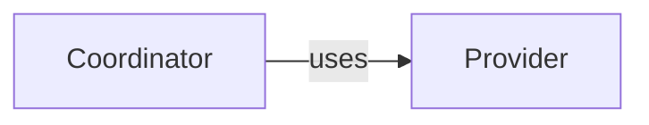

# Module template

Register `module.md` as the reading entry of one Module and author its paired `module.md.json`.
The pair has one document ID and owner. This starter illustrates the [required format](../format.md),
not business facts, semantic completeness or a required website layout.

## Reading member: module.md

````markdown
# [Module title]

## Purpose

[State the responsibility, consumers and scope in short plain prose.]

## Usage

[Explain when and how to use it, prerequisites and actual entry points, representative inputs and
results, effects and relevant errors, repetition, cancellation and compatibility. A logical Module
need not invent an API. Link to precise definitions rather than duplicating them.]

## Design

<a id="entity.example.coordinator"></a>

[Explain how the coordinator's responsibility, state and control/data flow fulfill the guarantees.
Record required internal constraints and significant choices. Do not substitute a file inventory.]

## Relationships

[Explain this view's collaboration scope and what its arrows do not show.]



### Provider collaboration

<a id="entity.example.provider"></a><a id="example.provider-agreement"></a>

[Explain the provider's responsibility, when it is selected and which included canonical guarantees
this Module relies on. Link to those guarantees, and state local duties and failure reactions.]

## Requirements

### req.example.promise — [Requirement title]

[One decidable sentence containing SHALL or SHALL NOT exactly once.]

## Scenarios

### scenario.example.situation — [Scenario title]

- GIVEN [the precondition]
- WHEN [the trigger]
- THEN [the promised outcome]
- BUT [an outcome that must not happen]

## Unresolved information

[Name missing behavior/design and the steps it blocks, or state that no such gaps are known.]
````

The example's anchors identify canonical readable explanations. Adjacent anchors **on the same
standalone line** can identify entities and agreements explained together without repeating prose.
An entity not relevant to this diagram can remain in the metadata and be explained elsewhere in
the owned reading. A diagram must not invent entities or import every included provider's internals.

## Metadata member: module.md.json

```json
{
  "schema_version": 1,
  "document": {"id": "document.example.module", "owner": "module.example"},
  "entities": [
    {"id": "entity.example.coordinator", "title": "Coordinator", "kind": "program",
     "meaning": "#entity.example.coordinator", "files": ["src/example/"]},
    {"id": "entity.example.provider", "title": "Provider", "kind": "used module",
     "meaning": "#entity.example.provider", "target_id": "module.provider"}
  ],
  "dependencies": [
    {"target_id": "module.provider", "meaning": "#example.provider-agreement"}
  ],
  "bindings": []
}
```

Replace example identities and paths with actual facts. A missing intended implementation entry
needs a `pending` marker; a real provider is registered as a use or child. The registry file union
must equal the entity entries, and necessary definitions enter context through explicit Module
references. A Markdown link does not include its target. Remove inapplicable declarations instead
of inventing a provider, file or interface merely to fill this starter.

## Companion documents and interfaces

A companion has its own metadata pair and sole owner but no mandatory entry sections. Put precise
scenarios or interface definitions there when this improves reading. Register the reading path in
its owner's collection; consumers reference its document ID or the owner's Module ID.

A readable structured agreement is defined once:

````markdown
```concorde-contract
{
  "id": "contract.example.request",
  "version": 1,
  "schema": {
    "type": "object",
    "properties": {"request_id": {"type": "string", "minLength": 1}},
    "required": ["request_id"],
    "additionalProperties": false
  },
  "semantics": "[Explain the agreed value and its use.]",
  "example": {"request_id": "example-1"}
}
```

[Describe the offline schema vocabulary, inputs, results, effects, failures, compatibility and
related scenarios. Schema shape alone is not a behavioral agreement.]

### Local participation {#example.participation}

[State use conditions, relied-upon guarantees and obligations, with ordinary links to the included
canonical definition. Do not copy its schema or common semantics.]
````

Its participant metadata selects the existing definition:

```json
{
  "id": "contract.example.request", "version": 1, "role": "required",
  "peer": "module.provider", "meaning": "#example.participation"
}
```

Place that record in the companion's `bindings` array. Internal peers need complementary roles;
external peers use `external:<name>`. Tests declare scenario IDs in their own code, not in reading.
Changing either source member invalidates dependent context/review identities. Neither a metadata
record nor this template grants access to implementation or undeclared external material.
