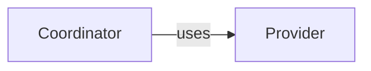

# Module template

Register `module.md` as the reading entry of one Module and author its paired `module.md.json`.
The pair has one document ID and owner. This starter illustrates the [required format](../format.md),
not business facts, semantic completeness or a required website layout.

## Reading member: module.md

````markdown
# [Module title]

## Purpose

[State the responsibility, consumers and scope in short plain prose.]

## Terminology

| Term | Meaning / definition |
| --- | --- |
| Coordinator | [Define this page's new concept in familiar language.] |
| [Provider term](provider.md#terminology) | [Optionally repeat or faithfully restate the canonical meaning without changing its constraints.] Source: Provider. |

[Imported terms retain direct canonical links and source attribution. Include each defining unit
explicitly even when its meaning is repeated here; check restatements when the source changes.
A source-only row is also permitted. This allowance is not for copying formal contracts or schemas.]

## Usage

[Start with one normal interaction and its outcome, then important failures and what to do next.
Use a concrete illustration when it helps. Explain when and how to use it, prerequisites and actual entry points, representative inputs and
results, effects and relevant errors, repetition, cancellation and compatibility. A logical Module
need not invent an API. Link to precise definitions rather than duplicating them.]

## Design

<a id="entity.example.coordinator"></a>

[Explain why the coordinator's responsibility, state and control/data graph fulfill the guarantees.
Connect choices to the problems they prevent. Link to exact APIs, byte rules and executable Graph
catalogs in implementation-role companions rather than reproduce them here. Do not substitute a file inventory.]

## Relationships

[Explain this view's collaboration scope and what its arrows do not show.]



### Provider collaboration

<a id="entity.example.provider"></a><a id="example.provider-agreement"></a>

[Explain the provider's responsibility, when it is selected and which included canonical guarantees
this Module relies on. Link to those guarantees, and state local duties and failure reactions.]

## Precise specifications

[Explain the important guarantees above and link to the Module's owned requirements, scenarios
and interface contracts. Do not define formal obligations in this entry or explanatory topic pages.]

## Unresolved information

[Name missing behavior/design and the steps it blocks, or state that no such gaps are known.]
````

The example's anchors identify canonical readable explanations. Adjacent anchors **on the same
standalone line** can identify entities and agreements explained together without repeating prose.
An entity not relevant to this diagram can remain in the metadata and be explained elsewhere in
the owned reading. A diagram must not invent entities or import every included provider's internals.

## Metadata member: module.md.json

```json
{
  "schema_version": 2,
  "document": {"id": "document.example.module", "owner": "module.example", "role": "module"},
  "entities": [
    {"id": "entity.example.coordinator", "title": "Coordinator", "kind": "program",
     "meaning": "#entity.example.coordinator", "files": ["src/example/"]},
    {"id": "entity.example.provider", "title": "Provider", "kind": "used module",
     "meaning": "#entity.example.provider", "target_id": "module.provider"}
  ],
  "dependencies": [
    {"target_id": "module.provider", "meaning": "#example.provider-agreement"}
  ],
  "bindings": []
}
```

Replace example identities and paths with actual facts. A missing intended implementation entry
needs a `pending` marker; a real provider is registered as a use or child. The registry file union
must equal the entity entries, and necessary definitions enter context through explicit Module
references. A Markdown link does not include its target. Remove inapplicable declarations instead
of inventing a provider, file or interface merely to fill this starter.

## Companion documents and interfaces

A companion has its own metadata pair and sole Module owner. Explanatory topics start with a brief
orientation followed by a Terminology table, but do not repeat the whole entry template.
Use role `module` for explanatory topics such as Registry or Publication. Use role `implementation`
for the Module's requirements, scenarios and precise interfaces. Never place formal definitions in
explanatory topics. Register every reading path in the same owner's collection; consumers reference
its document ID or the owner's Module ID. A split requires explicit references to the units now
containing relied-upon definitions; following Markdown links does not include them.

For example, `requirements.md` has schema-2 metadata:

```json
{
  "schema_version": 2,
  "document": {"id": "document.example.requirements", "owner": "module.example", "role": "implementation"},
  "entities": [], "dependencies": [], "bindings": []
}
```

Its reading member can define:

```markdown
# Example requirements

### req.example.promise — [Requirement title]

[One decidable sentence containing SHALL or SHALL NOT exactly once.]
```

Use the [scenario fragment](scenario.md) in another registered implementation-role unit, or in the
same unit when this keeps the Module's precise specification readable. A canonical structured
agreement is also defined once in an implementation-role unit:

````markdown
```concorde-contract
{
  "id": "contract.example.request",
  "version": 1,
  "schema": {
    "type": "object",
    "properties": {"request_id": {"type": "string", "minLength": 1}},
    "required": ["request_id"],
    "additionalProperties": false
  },
  "semantics": "[Explain the agreed value and its use.]",
  "example": {"request_id": "example-1"}
}
```

[Describe the offline schema vocabulary, inputs, results, effects, failures, compatibility and
related scenarios. Schema shape alone is not a behavioral agreement.]

### Local participation {#example.participation}

[State use conditions, relied-upon guarantees and obligations, with ordinary links to the included
canonical definition. Do not copy its schema or common semantics.]
````

Its participant metadata selects the existing definition:

```json
{
  "id": "contract.example.request", "version": 1, "role": "required",
  "peer": "module.provider", "meaning": "#example.participation"
}
```

Place that record in the companion's `bindings` array. Internal peers need complementary roles;
external peers use `external:<name>`. Tests declare scenario IDs in their own code, not in reading.
Changing either source member invalidates dependent context/review identities. Neither a metadata
record nor this template grants access to implementation or undeclared external material.
