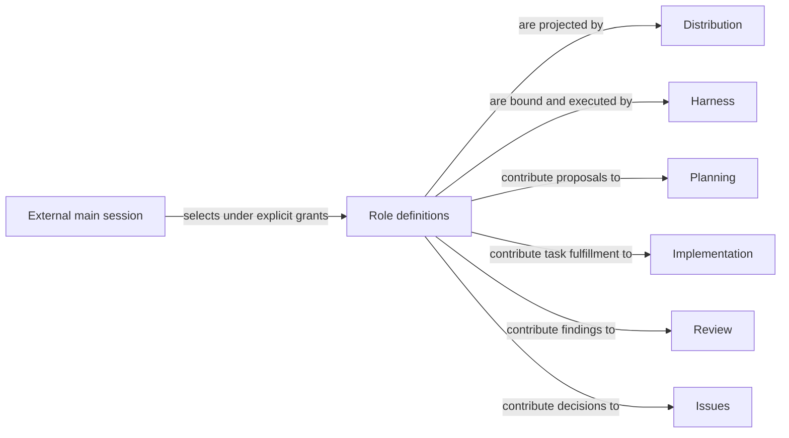

# Agents

## Purpose

Agents defines the callable Pi roles that reason about a task, author bounded work or independently test it. It lets a caller choose the right role without knowing implementation directories, and gives every role one canonical definition. It owns role behavior and interaction, not the business rules for accepting plans, implementation, reviews or Issue dispositions, nor the machinery that launches and checks a session.

## Terminology

| Term | Meaning / definition |
| --- | --- |
| Domain role | A terminal Pi role doing one phase against one Host-frozen Module context. |
| Outer task role | A sibling task delegate with an explicit task/worktree grant, rather than a domain stage schema. |
| Registration | Making a role available for Pi discovery; this alone grants no task authority and proves no execution. |
| [Agent](../module.md#terminology) | A callable native Pi role. Source: Concorde Framework. |
| [Workflow](../module.md#terminology) | Defined in Concorde Framework. |
| [Operation](../module.md#terminology) | Defined in Concorde Framework. |
| [Grant](../module.md#terminology) | Defined in Concorde Framework. |

## Usage

Choose a domain role through the capability that owns the task: context-assessor for sufficiency, planner for a plan, task-author for acceptance tasks, programmer for accepted implementation work, spec-reviewer or code-reviewer for independent findings, and issue-solver for the next bounded Issue decision. The Host prepares the exact native call; a caller invokes it unchanged and inspects independent acceptance, not just the model's proposal. Plan, review and Issue-solving workflows order these calls without turning their roles into Operations.

For example, `concorde-plan` first asks context-assessor whether a retry task has enough specified meaning. Only an accepted sufficient assessment admits planner. A missing retry policy stops the dependent step; neither role searches code to invent it. Planning still owns what counts as an acceptable plan. The [domain role contracts](roles.md) explain all seven roles' inputs, outputs and limits without replacing those domain promises.

For source maintenance, main instead selects maintenance-worker with an explicit candidate and authoring grant. When independent testing is selected, main hands the stopped candidate to a fresh tester with exact local runtime provenance. These two are actual Pi Agents too, but neither receives a fabricated domain WorkerProfile or automatically narrowed single-Module stage input. Tester is also available in consumer installations; maintenance-worker is source-only. The [outer collaboration contract](outer.md) explains their use and continuation. Main itself is the external user Pi session supported by source coordinator instructions, not a tenth registered Agent.

## Design

Role definitions separate durable role identity from invocation authority. The canonical inventory has seven domain roles and two outer task roles. Domain implementation lives under `agents/`, with instruction assets under `prompts/native/`; outer profiles live under the same Agents namespace and use `prompts/outer/`. These are authored implementation assets, not extra registered project Specs. There is one definition per role, not independently authored catalogs for source, consumer and invocation use.

Domain roles are projected into invocation-owned capsules by Harness. Their fresh conversations prevent a predecessor's assumptions from becoming evidence. Outer roles are registered as project Pi agents by Distribution and receive explicit task grants. Their longer stage continuation supports coherent authoring without changing frozen launch instructions. A source-only scope is a distribution condition, not a reason to omit a role from this Module.

The external main session chooses high-level work packages, exclusive ownership, workflows, component and integration gates, continuation and independent testing. Coordinator support instructs this existing session; it does not create another model, planner Operation or scheduler. No role delegates tasks, moves worktrees or acquires main's integration authority.

## Relationships

This conceptual view separates role definitions, their projection and their execution. Business owners retain the acceptance rules to which the roles contribute; a role's presence in a workflow grants no wider context.

### Harness

[Harness](../harness/module.md) owns context delivery, actual tools, invocation identity, terminal ceilings, error propagation, independent native completion checks and enforced check/tester subprocess isolation. Agents supplies role ceilings and follows the [context boundary](../harness/context.md) and [execution limits](../harness/execution.md). Missing or stale bindings stop dependent work; native file/network policy is not OS confinement. Agents does not implement a parallel launcher or acceptance service.

### Distribution

[Distribution](../distribution/build.md) renders, registers, installs and freshness-checks the definitions supplied here. Agents declares role family and source-only/distributed scope; Distribution must not supply a second behavioral authority. A missing or stale projection blocks selection, never causes an ambient fallback. [Installation](../distribution/installation.md) retains receipt/collision ownership and Pi-only deployment.

### Business owners

[Planning](../planning/module.md) owns sufficiency, plans, task acceptance and revision/repair rules. Its three roles return proposals to those rules, never bypass them or claim downstream implementation completion.

[Implementation](../implementation/module.md) owns task admission, fulfillment and partial-work recovery. Programmer preserves those task identities and reports work within the grant; its answer alone cannot mark ready.

[Review](../review/module.md) owns coverage, findings, affected consumers, currentness and aggregation. Reviewers provide independent evidence under that contract; they do not repair findings or count skipped coverage as success.

[Issues](../issues/module.md) owns immutable observations, decision admission, verification and disposition. Issue-solver contributes a bounded decision; no role closes an Issue merely by asserting success.

## Precise specifications

[Role contracts](roles.md), [requirements](requirements.md) and [scenarios](scenarios.md) define identity, family, output and failure obligations. [Outer collaboration](outer.md) explains source-main coordination and author/tester continuation. Distribution and Harness retain the mechanisms rather than duplicating them here.
