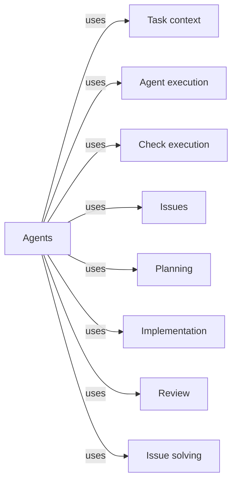

# Agents

## Purpose

Agents defines, once and in one place, every model-backed agent that Concorde's capabilities run:
the context assessor, planner, task author, programmer, spec reviewer, code reviewer and issue
solver. For each Agent it states what the Agent is for, which tools it has, which parts of a
Module's context it reads and whether it writes implementation, its instructions, the result it
returns and the entry point of the Agent hook that its provider implements. Task context binds these
definitions to a call and Agent execution runs them; the providers under Operations rely on them to
know which Agent does their model work. Agents does not launch, sandbox or accept anything, and it
does not decide whether a result is right: plans and tasks are accepted by Planning, implementation
by Implementation, reviews by Review and Issue decisions by Issue solving. The user session and the
Task subagents it launches, such as the tester, are not Agents; the Pi session configures them.

## Terminology

| Term | Definition |
| --- | --- |
| Agent | A fresh, terminal Pi agent with one canonical Concorde definition that performs one model step of a capability for one Module and returns a proposal the Host checks before accepting it. |
| Agent definition | The one source of an Agent: its name, instructions, tools, the context it reads and what it may write, its time limit, its typed input and result, and the entry point of its Agent hook. |
| [Host](../vocabulary.md#concept.concorde.host) | |
| [Capability](../vocabulary.md#concept.concorde.capability) | |
| [Task subagent](../vocabulary.md#concept.concorde.task-subagent) | |
| [Agent call](../harness/execution/module.md#concept.execution.agent-call) | |
| [Proposal](../harness/execution/module.md#concept.execution.proposal) | |
| [Agent hook](../harness/execution/module.md#concept.execution.agent-hook) | |
| [Agent binding](../harness/context/module.md#concept.context.agent-binding) | |
| [Stage input](../harness/context/module.md#concept.context.stage-input) | |
| [Configured check](../harness/checks/module.md#concept.checks.configured-check) | |
| [Issue report](../issues/module.md#concept.issues.report) | |
| [Assessment](../planning/module.md#concept.planning.assessment) | |
| [Plan](../planning/module.md#concept.planning.plan) | |
| [Task](../planning/module.md#concept.planning.task) | |
| [Completion](../implementation/module.md#concept.implementation.completion) | |
| [Finding](../review/module.md#concept.review.finding) | |
| [Review result](../review/module.md#concept.review.result) | |
| [Decision](../issue-solving/module.md#concept.issue-solving.decision) | |

Learn Agent and Agent definition first. The Harness words say how a definition is bound and run;
the provider words name what each Agent's result means and who accepts it.

## Usage

<a id="concept.agents.agent"></a>

An **Agent** is always called through a capability, never by typing its name into a prompt. The
user session runs a capability; the Host prepares an exact [Agent call](../harness/execution/module.md#concept.execution.agent-call)
from the Agent's definition; the user session passes that call unchanged to Pi's `subagent` tool.
The Agent starts fresh, reads its capsule and submits one typed result. That result is a
[proposal](../harness/execution/module.md#concept.execution.proposal): the Host checks it against the
current inputs and only then records it, so the user session reads the Host's accepted result, not
the Agent's own words. There are seven Agents:

| Agent | Called by | What it does | What it returns | Tools |
| --- | --- | --- | --- | --- |
| context assessor | `concorde-context-solve`, first step of `concorde-plan` | Decides whether the Module's Spec says enough for the task | An [assessment](../planning/module.md#concept.planning.assessment): sufficient, or a gap, prohibition or contradiction | read, grep, find, ls |
| planner | `concorde-plan`, after a sufficient assessment | Writes a contract-level plan from the Spec alone | A [plan](../planning/module.md#concept.planning.plan) | read, grep, find, ls |
| task author | `concorde-tasks` | Turns the accepted plan into implementation tasks with observable acceptance | New, incomplete [tasks](../planning/module.md#concept.planning.task) | read, grep, find, ls |
| programmer | `concorde-implement` | Changes the Module's own implementation files in the candidate | The tasks, marked complete where fulfilled, which is the Module's [completion](../implementation/module.md#concept.implementation.completion) claim | read, grep, find, ls, edit, write, bash, run_checks |
| spec reviewer | `concorde-spec-review`, Issue verification | Reviews one Module's Specs against representative tasks | A [review result](../review/module.md#concept.review.result) with [findings](../review/module.md#concept.review.finding) | read, grep, find, ls |
| code reviewer | `concorde-code-review`, Issue verification | Reviews the Module's code against its Spec and runs its checks | A review result with findings | read, grep, find, ls, run_checks |
| issue solver | `concorde-issues` with action `solve` | Chooses the next bounded action for one Issue | One [decision](../issue-solving/module.md#concept.issue-solving.decision) | read, grep, find, ls |

For example, `concorde-plan` first runs the context assessor on "add retries to the client". If the
client Module's Spec never says which failures may be retried, the assessor reports that gap and
the planner does not run. Neither Agent looks at code to guess the policy. The developer settles it
in the Spec and calls the capability again, which starts fresh Agents.

Every Agent can read what its capsule holds and file an
[Issue report](../issues/module.md#concept.issues.report) through `report_issue`. Only the
programmer has `edit`, `write` and `bash`. Only the programmer and the code reviewer can ask the
Host to run the Module's [configured checks](../harness/checks/module.md#concept.checks.configured-check)
through `run_checks`; the code reviewer has no shell, so running checks is the only way it can
execute anything. No Agent can delegate, call a capability or start another agent.

<a id="concept.agents.definition"></a>

**Agent definitions.** Each Agent has one **Agent definition**, the `DEFINITION` record of the
package `agents/<name>/`. It names the Agent's instructions (`agents/<name>/spec.md`, rendered after
the shared native rules in `prompts/native/<name>.md`; the two reviewers also include one shared
text on review scope and result shape), its workspace (a private capsule, or the candidate itself
for the Agents that work on code), the parts of the Module's context it reads, whether it writes
implementation, the [stage inputs](../harness/context/module.md#concept.context.stage-input) it
accepts and requires, its typed input and result and the result fields it may fill, its tools, its
default time limit, and the `module:attribute` entry point of its
[Agent hook](../harness/execution/module.md#concept.execution.agent-hook) in the provider. The
package `agents` lists the seven definitions. [Agent definitions](definitions.md) gives every field
and every Agent's exact values.

To change what an Agent does, edit its instructions; to change what it may use, edit its definition.
Both change the instruction or definition digest that Task context binds into every call, so a
call prepared before the edit is refused as stale instead of running under the old terms. A new
Agent needs a definition here and a hook in its provider; nothing in the Harness changes.

Errors surface through the capability that ran the Agent. A failed, cancelled, timed-out or invalid
run stays a failure even if the Agent made progress; the programmer's partial edits stay in the
candidate. Repeating a step always starts a fresh Agent with freshly admitted inputs.

## Design

### One definition, many uses

<a id="realization.agents.inventory"></a>

The central choice is that an Agent's identity and its limits are stated once, and every other part
of Concorde derives from that statement instead of keeping its own copy. The **Agent inventory**,
the `agents` package, lists the seven definitions. Task context turns a definition into an
[Agent binding](../harness/context/module.md#concept.context.agent-binding) for one call, Agent
execution's launch preflight allows exactly the tools the definition lists, the build renders the
instructions it names, and model selection keys its per-Agent overrides by its name. A launch with
more tools than the definition, or a proposal with fields the definition does not allow, is
refused rather than tolerated, so a capability cannot quietly give an Agent more than its definition
says.

### What the definitions declare, and what is not enforced

<a id="realization.agents.definitions"></a>

The **Agent definitions** are the seven definition packages with their instructions and the shared
native rules. They declare the most an Agent may use, and the Harness enforces part of it:

- The tool list is enforced at launch. An Agent without `edit`, `write` or `bash` cannot change a
  file through Pi's tools, which is why only the programmer, whose definition writes
  implementation, has them, and why the code reviewer checks code through `run_checks` inside the
  read-only check boundary instead of a shell.
- Which files an Agent reads or writes with those tools is not enforced. File scope, network and
  credential limits are written into its instructions. A reader's file tools accept any path the
  developer's user can read, and the programmer's `bash` reaches any path and could run Concorde's
  launcher.
- The result is enforced: whatever an Agent claims, the Host checks and its provider accepts.

Agents are fresh and terminal on purpose. A fresh conversation cannot carry a previous step's
assumptions forward as if they were evidence, and an Agent without delegation cannot widen its own
grant by handing work to another agent. That no definition may list a delegating tool is this
Module's [req.agents.terminal](definitions.md#req.agents.terminal).

### Why hooks are named, not imported

Each definition names its provider's Agent hook by an entry-point string rather than importing it.
The Harness can then run any Agent without importing any provider, and a provider can change how
its Agent's results are prepared and accepted without touching this Module or the Harness. The
instructions an Agent follows and the rules its result is checked against therefore live with
different owners on purpose: the instructions here, the acceptance with the provider.

<a id="realization.agents.tests"></a>

The **Agent tests** load every definition, compare the inventory with its metadata and prepare a
call for each Agent to check the tools it receives. They show what Agents are given, not that a
model follows its instructions.

## Relationships

```mermaid
flowchart LR
    accTitle: How Agent definitions are used
    accDescr: The inventory lists the definitions; each definition is bound by Task context, its Agent runs as an Agent call, and it names its provider's Agent hook.
    inventory[Agent inventory]
    definitions[Agent definitions]
    agent[Agent]
    definition[Agent definition]
    binding[Task context / Agent binding]
    call[Agent execution / Agent call]
    hook[Agent execution / Agent hook]
    inventory -->|lists| definitions
    definitions -->|declare| definition
    definition -->|defines| agent
    definition -->|is bound as| binding
    agent -->|runs as| call
    definition -->|names| hook
```



The providers under Operations also use this Module: each implements the Agent hooks its Agents'
definitions name. Agents relies on the providers only for what its Agents must return, never for
how a result is accepted.

<a id="uses-context"></a>

**Task context** turns a definition into the [Agent binding](../harness/context/module.md#concept.context.agent-binding)
of one call and composes the capsule from the context parts the definition reads, including the
[stage inputs](../harness/context/module.md#concept.context.stage-input) it accepts. Agents relies on
it to bind each call to exactly the definition's tools, effects and instruction digest, and writes
its definitions in the record format that binding reads. A definition the binding rejects cannot be
called; Agents' duty is to declare honest limits.

<a id="uses-execution"></a>

**Agent execution** runs each Agent as an [Agent call](../harness/execution/module.md#concept.execution.agent-call)
and treats its structured output as a [proposal](../harness/execution/module.md#concept.execution.proposal).
It resolves the [Agent hook](../harness/execution/module.md#concept.execution.agent-hook) each
definition names. Agents' instructions tell each Agent to submit once with the issued invocation
identity and never to claim acceptance; a rejected or failed result is reported by the capability,
not repaired by the Agent.

<a id="uses-checks"></a>

**Check execution** runs the [configured checks](../harness/checks/module.md#concept.checks.configured-check)
behind `run_checks`. The programmer and the code reviewer rely on it for check results that the
checks themselves could not have altered; an unavailable boundary fails the tool, and the
instructions treat that as missing evidence, never as a pass.

<a id="uses-issues"></a>

**Issues** receives what an Agent files through `report_issue`, in the
[report](../issues/interface.md#contract.issues.report) format, and keeps it as an
[Issue report](../issues/module.md#concept.issues.report). Agents' instructions tell each Agent to
report a missing or conflicting promise once and cite the receipt in its result instead of
inventing an answer. A receipt grants the reporting Agent no additional authority.

<a id="uses-planning"></a>

**Planning** owns what an [assessment](../planning/module.md#concept.planning.assessment), a
[plan](../planning/module.md#concept.planning.plan) and a [task](../planning/module.md#concept.planning.task)
are, the [implementation task](../planning/workflow.md#contract.planning.implementation-task)
contract, and when each is accepted. The context assessor, planner and task author produce
proposals in those terms; the programmer keeps each task's identity and acceptance unchanged. None
of them decides acceptance.

<a id="uses-implementation"></a>

**Implementation** owns what the programmer's [completion](../implementation/module.md#concept.implementation.completion)
claim means and when it is accepted. The programmer's instructions tell it to mark a task complete
only when fulfilled and to leave the rest as they are.

<a id="uses-review"></a>

**Review** owns the [review result](../review/contracts.md#contract.review.result) contract,
what a [review result](../review/module.md#concept.review.result) and a
[finding](../review/module.md#concept.review.finding) mean, and how results are aggregated. The two
reviewers report findings in those terms and never repair them; an incomplete review stays
incomplete.

<a id="uses-issue-solving"></a>

**Issue solving** owns what a [decision](../issue-solving/module.md#concept.issue-solving.decision)
about one Issue means and what follows from it. The issue solver returns exactly one decision and
closes nothing itself.
