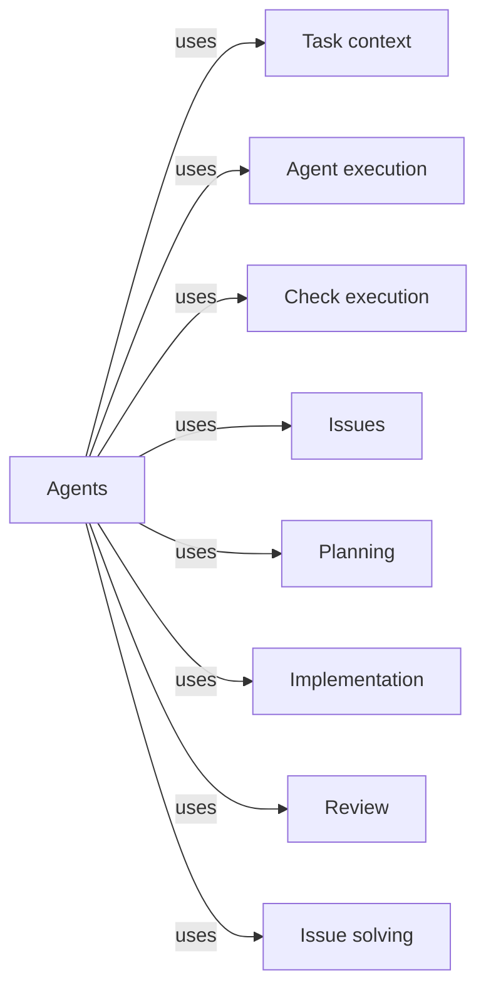

# Agents

## Purpose

Agents defines, once and in one place, every model-backed agent that Concorde's capabilities run:
the context assessor, planner, task author, programmer, spec reviewer, code reviewer and issue
solver. For each Agent it states what the Agent is for, which tools it has, which parts of a
Module's context it reads and whether it writes implementation, its instructions, the result it
returns and the entry point of the Agent hook that its provider implements. Task context binds these
definitions to a call and Agent execution runs them; the providers under Operations rely on them to
know which Agent does their model work. Agents does not launch, sandbox or accept anything, and it
does not decide whether a result is right: plans and tasks are accepted by Planning, implementation
by Implementation, reviews by Review and Issue decisions by Issue solving. The user session and the
Task subagents it launches, such as the tester, are not Agents; the Pi session configures them.

## Terminology

| Term | Definition |
| --- | --- |
| Agent | A fresh, terminal Pi agent with one canonical Concorde definition that performs one model step of a capability for one Module and returns a proposal the Host checks before accepting it. |
| Agent definition | The one source of an Agent: its name, instructions, tools, the context it reads and what it may write, its time limit, its typed input and result, and the entry point of its Agent hook. |
| [Host](../vocabulary.md#concept.concorde.host) | |
| [Capability](../vocabulary.md#concept.concorde.capability) | |
| [Task subagent](../vocabulary.md#concept.concorde.task-subagent) | |
| [Agent call](../harness/execution/module.md#concept.execution.agent-call) | |
| [Proposal](../harness/execution/module.md#concept.execution.proposal) | |
| [Agent hook](../harness/execution/module.md#concept.execution.agent-hook) | |
| [Agent binding](../harness/context/module.md#concept.context.agent-binding) | |
| [Stage input](../harness/context/module.md#concept.context.stage-input) | |
| [Configured check](../harness/checks/module.md#concept.checks.configured-check) | |
| [Issue report](../issues/module.md#concept.issues.report) | |
| [Assessment](../planning/module.md#concept.planning.assessment) | |
| [Plan](../planning/module.md#concept.planning.plan) | |
| [Task](../planning/module.md#concept.planning.task) | |
| [Completion](../implementation/module.md#concept.implementation.completion) | |
| [Finding](../review/module.md#concept.review.finding) | |
| [Review result](../review/module.md#concept.review.result) | |
| [Decision](../issue-solving/module.md#concept.issue-solving.decision) | |

## Usage

<a id="concept.agents.agent"></a>

An **Agent** is always called through a capability: the Host prepares an exact
[Agent call](../harness/execution/module.md#concept.execution.agent-call) from its definition, the
user session passes it unchanged to Pi's `subagent` tool, and the Agent starts fresh, reads its
capsule and submits one typed result, a [proposal](../harness/execution/module.md#concept.execution.proposal)
the Host checks before recording. The seven Agents:

| Agent | Called by | Returns |
| --- | --- | --- |
| context assessor | `concorde-context-solve`, first step of `concorde-plan` | An [assessment](../planning/module.md#concept.planning.assessment) |
| planner | `concorde-plan` after a sufficient assessment | A [plan](../planning/module.md#concept.planning.plan) |
| task author | `concorde-tasks` | New, incomplete [tasks](../planning/module.md#concept.planning.task) |
| programmer | `concorde-implement` | The tasks marked complete where fulfilled, a [completion](../implementation/module.md#concept.implementation.completion) claim |
| spec reviewer | `concorde-spec-review`, Issue verification | A [review result](../review/module.md#concept.review.result) with [findings](../review/module.md#concept.review.finding) |
| code reviewer | `concorde-code-review`, Issue verification | A review result with findings |
| issue solver | `concorde-issues` action `solve` | One [decision](../issue-solving/module.md#concept.issue-solving.decision) |

Every Agent has `read`, `grep`, `find`, `ls` and `report_issue`, through which it files an
[Issue report](../issues/module.md#concept.issues.report). Only the programmer has `edit`, `write`
and `bash`. The programmer and the code reviewer also have `run_checks` for the Module's
[configured checks](../harness/checks/module.md#concept.checks.configured-check); the code reviewer
has no shell. No Agent can delegate, call a capability or start another agent.

<a id="concept.agents.definition"></a>

**Agent definitions.** Each Agent's **Agent definition** is the `DEFINITION` of `agents/<name>/`:
its instructions (`agents/<name>/spec.md` after the shared rules in `prompts/native/<name>.md`), its
workspace, the context parts it reads and whether it writes implementation, the
[stage inputs](../harness/context/module.md#concept.context.stage-input) it accepts, its typed input
and result, its tools, its time limit, and the entry point of its provider's
[Agent hook](../harness/execution/module.md#concept.execution.agent-hook).
[Agent definitions](definitions.md) gives every field and value. Edit the instructions to change
what an Agent does and the definition to change what it may use; a new Agent needs a definition
here and a hook in its provider. A failed, cancelled or invalid run surfaces through its capability
and stays a failure (the programmer's partial edits remain); a repeat starts a fresh Agent.

## Design

One definition per Agent is the single source that binding, launch preflight, rendering and model
selection derive from, so nothing can grant an Agent more than it declares. The tool list and the
result are enforced; which files an Agent's tools reach, and its network and credentials, are not:
readers can read any path the user can, and the programmer's `bash` reaches any path and could run
Concorde's launcher. Agents are fresh and terminal; no definition may list a delegating tool
([req.agents.terminal](definitions.md#req.agents.terminal)). Hooks are named by entry point so the
Harness imports no provider. [In depth](design.md) gives the reasons.

<a id="realization.agents.inventory"></a>

The **Agent inventory**, the `agents` package, lists the seven definitions and is what every
consumer reads to learn which Agents exist.

<a id="realization.agents.definitions"></a>

The **Agent definitions** are the seven definition packages with their instructions and the shared
native rules.

<a id="realization.agents.tests"></a>

The **Agent tests** load every definition, compare the inventory with its metadata and check the
tools each prepared call receives; they do not show that a model follows its instructions.

## Relationships

```mermaid
flowchart LR
    accTitle: How Agent definitions are used
    accDescr: The inventory lists the definitions; each definition is bound by Task context, its Agent runs as an Agent call, and it names its provider's Agent hook.
    inventory[Agent inventory]
    definitions[Agent definitions]
    agent[Agent]
    definition[Agent definition]
    binding[Task context / Agent binding]
    call[Agent execution / Agent call]
    hook[Agent execution / Agent hook]
    inventory -->|lists| definitions
    definitions -->|declare| definition
    definition -->|defines| agent
    definition -->|is bound as| binding
    agent -->|runs as| call
    definition -->|names| hook
```



The providers under Operations also use this Module: each implements the Agent hooks its Agents'
definitions name. Agents relies on the providers only for what its Agents must return, never for
how a result is accepted.

<a id="uses-context"></a>

**Task context** turns a definition into the [Agent binding](../harness/context/module.md#concept.context.agent-binding)
of one call and composes the capsule from the context parts the definition reads, including the
[stage inputs](../harness/context/module.md#concept.context.stage-input) it accepts. Agents relies on
it to bind each call to exactly the definition's tools, effects and instruction digest, and writes
its definitions in the record format that binding reads. A definition the binding rejects cannot be
called; Agents' duty is to declare honest limits.

<a id="uses-execution"></a>

**Agent execution** runs each Agent as an [Agent call](../harness/execution/module.md#concept.execution.agent-call)
and treats its structured output as a [proposal](../harness/execution/module.md#concept.execution.proposal).
It resolves the [Agent hook](../harness/execution/module.md#concept.execution.agent-hook) each
definition names. Agents' instructions tell each Agent to submit once with the issued invocation
identity and never to claim acceptance; a rejected or failed result is reported by the capability,
not repaired by the Agent.

<a id="uses-checks"></a>

**Check execution** runs the [configured checks](../harness/checks/module.md#concept.checks.configured-check)
behind `run_checks`. The programmer and the code reviewer rely on it for check results that the
checks themselves could not have altered; an unavailable boundary fails the tool, and the
instructions treat that as missing evidence, never as a pass.

<a id="uses-issues"></a>

**Issues** receives what an Agent files through `report_issue`, in the
[report](../issues/interface.md#contract.issues.report) format, and keeps it as an
[Issue report](../issues/module.md#concept.issues.report). Agents' instructions tell each Agent to
report a missing or conflicting promise once and cite the receipt in its result instead of
inventing an answer. A receipt grants the reporting Agent no additional authority.

<a id="uses-planning"></a>

**Planning** owns what an [assessment](../planning/module.md#concept.planning.assessment), a
[plan](../planning/module.md#concept.planning.plan) and a [task](../planning/module.md#concept.planning.task)
are, the [implementation task](../planning/workflow.md#contract.planning.implementation-task)
contract, and when each is accepted. The context assessor, planner and task author produce
proposals in those terms; the programmer keeps each task's identity and acceptance unchanged. None
of them decides acceptance.

<a id="uses-implementation"></a>

**Implementation** owns what the programmer's [completion](../implementation/module.md#concept.implementation.completion)
claim means and when it is accepted. The programmer's instructions tell it to mark a task complete
only when fulfilled and to leave the rest as they are.

<a id="uses-review"></a>

**Review** owns the [review result](../review/contracts.md#contract.review.result) contract,
what a [review result](../review/module.md#concept.review.result) and a
[finding](../review/module.md#concept.review.finding) mean, and how results are aggregated. The two
reviewers report findings in those terms and never repair them; an incomplete review stays
incomplete.

<a id="uses-issue-solving"></a>

**Issue solving** owns what a [decision](../issue-solving/module.md#concept.issue-solving.decision)
about one Issue means and what follows from it. The issue solver returns exactly one decision and
closes nothing itself.
