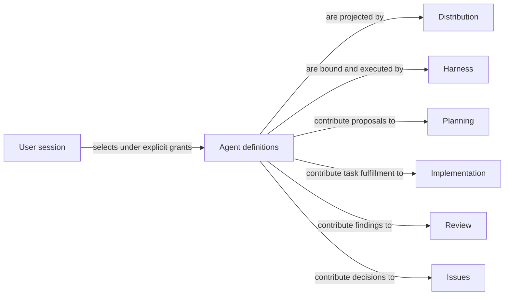

# Agents

## Purpose

Agents defines the callable Pi Agents that reason about a task, author bounded work or independently test it. It lets a caller choose the right Agent without knowing implementation directories, and gives every Agent one canonical definition. It owns Agent behavior and interaction, not the business rules for accepting plans, implementation, reviews or Issue dispositions, nor the machinery that launches and checks a session.

## Terminology

| Term | Meaning / definition |
| --- | --- |
| [Agent](../module.md#terminology) | A callable native Pi agent with one canonical Concorde definition, either a Domain Agent or a Task subagent. Source: Concorde Framework. |
| Domain Agent | A terminal Agent doing one phase against one Host-frozen Module context. |
| [Task subagent](../module.md#terminology) | A fresh one-layer delegate of the user session, owning one complete task in one fixed worktree without further task delegation. Source: Concorde Framework. |
| [User session](../module.md#terminology) | The external Pi session that talks to the user, understands needs and coordinates; it is not a registered Agent. Source: Concorde Framework. |
| Registration | Making an Agent available for Pi discovery; this alone grants no task authority and proves no execution. |
| [Workflow](../module.md#terminology) | Defined in Concorde Framework. |
| [Operation](../module.md#terminology) | Defined in Concorde Framework. |
| [Grant](../module.md#terminology) | Defined in Concorde Framework. |

## Usage

Choose a Domain Agent through the capability that owns the task: context-assessor for sufficiency, planner for a plan, task-author for acceptance tasks, programmer for accepted implementation work, spec-reviewer or code-reviewer for independent findings, and issue-solver for the next bounded Issue decision. The Host prepares the exact native call; a caller invokes it unchanged and inspects independent acceptance, not just the model's proposal. Plan, review and Issue-solving workflows order these calls without turning their Agents into Operations.

For example, `concorde-plan` first asks context-assessor whether a retry task has enough specified meaning. Only an accepted sufficient assessment admits planner. A missing retry policy stops the dependent step; neither Agent searches code to invent it. Planning still owns what counts as an acceptable plan. The [Domain Agent contracts](contracts.md) explain all seven Domain Agents' inputs, outputs and limits without replacing those domain promises.

For source maintenance, the user session instead selects maintenance-worker with an explicit candidate and authoring grant. When independent testing is selected, the user session hands the stopped candidate to a fresh tester with exact local runtime provenance. These two are actual Pi Agents too, but neither receives a fabricated domain WorkerProfile or automatically narrowed single-Module stage input. Tester is also available in consumer installations; maintenance-worker is source-only. The [Task subagent collaboration contract](task-subagents.md) explains their use and continuation. The user session itself is the external Pi session supported by source coordinator instructions, not a tenth registered Agent.

## Design

Agent definitions separate durable Agent identity from invocation authority. The canonical inventory has seven Domain Agents and two Task subagents. Domain implementation lives under `agents/`, with instruction assets under `prompts/native/`; Task subagent profiles live under the same Agents namespace and use `prompts/task-subagent/`, and the source user session's coordinator instructions live under `prompts/user-session/`. These are authored implementation assets, not extra registered project Specs. There is one definition per Agent, not independently authored catalogs for source, consumer and invocation use.

Domain Agents are projected into invocation-owned capsules by Harness. Their fresh conversations prevent a predecessor's assumptions from becoming evidence. Task subagents are registered as project Pi agents by Distribution and receive explicit task grants. Their longer stage continuation supports coherent authoring without changing frozen launch instructions. A source-only scope is a distribution condition, not a reason to omit an Agent from this Module.

The user session chooses high-level work packages, exclusive ownership, workflows, component and integration gates, continuation and independent testing. Coordinator support instructs this existing session; it does not create another model, planner Operation or scheduler. No Agent delegates tasks, moves worktrees or acquires the user session's integration authority.

## Relationships

This conceptual view separates Agent definitions, their projection and their execution. Business owners retain the acceptance rules to which the Agents contribute; an Agent's presence in a workflow grants no wider context.

### Harness

[Harness](../harness/module.md) owns context delivery, actual tools, invocation identity, terminal ceilings, error propagation, independent native completion checks and enforced check/tester subprocess isolation. Agents supplies Agent ceilings and follows the [context boundary](../harness/context.md) and [execution limits](../harness/execution.md). Missing or stale bindings stop dependent work; native file/network policy is not OS confinement. Agents does not implement a parallel launcher or acceptance service.

### Distribution

[Distribution](../distribution/build.md) renders, registers, installs and freshness-checks the definitions supplied here. Agents declares Agent family and source-only/distributed scope; Distribution must not supply a second behavioral authority. A missing or stale projection blocks selection, never causes an ambient fallback. [Installation](../distribution/installation.md) retains receipt/collision ownership and Pi-only deployment.

### Business owners

[Planning](../planning/module.md) owns sufficiency, plans, task acceptance and revision/repair rules. Its three Agents return proposals to those rules, never bypass them or claim downstream implementation completion.

[Implementation](../implementation/module.md) owns task admission, fulfillment and partial-work recovery. Programmer preserves those task identities and reports work within the grant; its answer alone cannot mark ready.

[Review](../review/module.md) owns coverage, findings, affected consumers, currentness and aggregation. Reviewers provide independent evidence under that contract; they do not repair findings or count skipped coverage as success.

[Issues](../issues/module.md) owns immutable observations, decision admission, verification and disposition. Issue-solver contributes a bounded decision; no Agent closes an Issue merely by asserting success.

## Precise specifications

[Agent contracts](contracts.md), [requirements](requirements.md) and [scenarios](scenarios.md) define identity, family, output and failure obligations. [Task subagent collaboration](task-subagents.md) explains source user session coordination and author/tester continuation. Distribution and Harness retain the mechanisms rather than duplicating them here.
