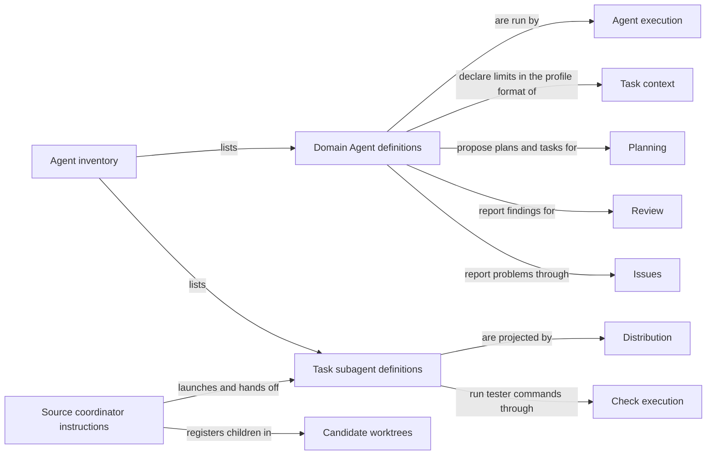

# Agents

## Purpose

Agents defines every model-backed agent that Concorde can call, once, in one place. For each Agent
it states what the Agent is for, what it receives, what it may use, what it returns and where it
must stop. Two groups rely on these definitions: the Harness, which runs Domain Agents inside the
capabilities, and the user session, which launches Task subagents for source maintenance and
independent testing. Agents does not decide whether an Agent's answer is accepted: plans and tasks
are accepted by Planning, implementation by Implementation, reviews by Review and Issue decisions
by Issues. It also does not launch, sandbox or install anything; the Harness runs Agents and
Distribution projects their definitions into Pi. The user session itself is not an Agent.

## Terminology

| Term | Definition |
| --- | --- |
| Agent | A callable Pi agent with one canonical Concorde definition, either a Domain Agent or a Task subagent. |
| Domain Agent | An Agent that performs one step of a capability for one Module as a fresh, terminal worker whose answer the Host checks before accepting it. |
| Agent definition | The one source of an Agent: its name, instructions, tools, limits and, for a Domain Agent, its input and result types. |
| [User session](../vocabulary.md#concept.concorde.user-session) | |
| [Task subagent](../vocabulary.md#concept.concorde.task-subagent) | |
| [Capability](../vocabulary.md#concept.concorde.capability) | |
| [Host](../vocabulary.md#concept.concorde.host) | |
| [Worker](../vocabulary.md#concept.concorde.worker) | |
| [Evidence](../vocabulary.md#concept.concorde.evidence) | |
| [Grant](../harness/context/module.md#concept.context.grant) | |
| [Workflow](../harness/execution/module.md#concept.execution.workflow) | |
| [Candidate](../harness/worktrees/module.md#concept.worktrees.candidate) | |
| [Plan](../planning/module.md#concept.planning.plan) | |
| [Task](../planning/module.md#concept.planning.task) | |
| [Finding](../review/module.md#concept.review.finding) | |
| [Issue](../issues/module.md#concept.issues.issue) | |

There are two families of Agent. Domain Agents do the model steps inside capabilities; Task
subagents are the two Agents a user session can hand a whole task to. Learn Agent and Domain Agent
first; the imported words say who accepts what an Agent produces.

## Usage

An **Agent** is a Pi agent with a Concorde definition. Nobody calls an Agent by typing its name
into a prompt. A Domain Agent is always called through a capability, and a Task subagent is always
launched by the user session with an explicit task. There are nine Agents:

| Agent | Family | Called by | What it does | What it returns |
| --- | --- | --- | --- | --- |
| context-assessor | Domain | `concorde-context-solve`, first step of `concorde-plan` | Decides whether the Module's Spec says enough for the task | `sufficient`, or a gap, prohibition or contradiction |
| planner | Domain | `concorde-plan`, after sufficiency is accepted | Writes a contract-level plan from the Spec alone | A plan |
| task-author | Domain | `concorde-tasks` | Turns the accepted plan into implementation tasks with observable acceptance | New, incomplete tasks |
| programmer | Domain | `concorde-implement` | Changes the Module's own implementation files in the candidate | The tasks, marked complete where fulfilled |
| spec-reviewer | Domain | `concorde-spec-review`, Issue verification | Reviews one Module's Specs against representative tasks | Findings, no findings, or incomplete |
| code-reviewer | Domain | `concorde-code-review`, Issue verification | Reviews the Module's code against its Spec | Findings, no findings, or incomplete |
| issue-solver | Domain | `concorde-issues` with action `solve` | Chooses the next bounded action for one Issue | One Issue decision |
| maintenance-worker | Task subagent | the source user session | Changes Concorde's own sources in one candidate | Committed work and a handoff report |
| tester | Task subagent | the user session | Tests a stopped candidate independently, read-only | Observations, failures and retained evidence |

**Using a Domain Agent.** The user session never builds a Domain Agent call itself. It runs a
capability; the Host freezes the Module's context into a capsule and returns an exact native call;
the user session passes that call unchanged to Pi's `subagent` tool. The Agent starts fresh, reads
the capsule's `context.json` and the documents it lists, and submits a typed result. That result is
a proposal. The Host checks it against the current inputs and only then records it, so the user
session reads the Host's accepted result, not the Agent's own words.

For example, `concorde-plan` first runs context-assessor on "add retries to the client". If the
client Module's Spec never says which failures may be retried, the assessor reports that gap and
the plan step does not run. Neither Agent looks at code to guess the policy. The developer settles
it in the Spec and the capability is called again, which starts fresh Agents.

Every Domain Agent can read the context the Host prepared and report problems through
`report_issue`. Only the programmer can write, edit and run shell commands, and only the programmer
and the code-reviewer can ask the Host to run the Module's configured checks. No Domain Agent can
delegate, call a capability or start another agent. Pi enforces the tool list, but which files an
Agent reads or writes with those tools is a rule in its instructions, not operating-system
confinement. The configured checks themselves do run in an enforced read-only sandbox.

**Using a Task subagent.** The user session launches `maintenance-worker` or `tester` through
pi-subagents with an explicit task, a candidate worktree and, for the tester, the exact candidate
Pi entry to test. Each starts with fresh context and none of the session's own instructions,
catalogs or Skills. The maintenance-worker is the only writer in its candidate until it stops;
the tester keeps everything read-only and returns failures instead of repairing them. The
maintenance-worker exists only in Concorde's source checkout; consumer projects receive the tester
alone. [Task subagents and the user session](task-subagents.md) explains the full flow, including
the source user session's coordinator instructions.

**Agent definitions.** Each Agent has one **Agent definition**. For a Domain Agent this is a
Python profile under `agents/<name>/` that names its instructions, phase, input and result types,
admitted inputs, effects, tools and time limit, plus a short native prompt under `prompts/native/`.
For a Task subagent it is a profile naming its prompt, tools and explicit Pi extensions. The
inventory in `agents/__init__.py` lists them all, and the paired metadata of
[Agent interfaces](contracts.md) records the same inventory so that a package check can refuse any
drift. [Agent interfaces](contracts.md) gives each Agent's exact inputs, outputs and limits.

Errors surface through the capability that ran the Agent. A failed, cancelled, timed-out or invalid
run stays a failure even if the Agent made progress; the programmer's partial edits stay in the
candidate. Repeating a step always starts a fresh Agent with freshly admitted inputs.

## Design

The central choice is to separate an Agent's identity from its authority. A definition says what
an Agent is and the most it may ever use; the Harness grants less per call, from the Module's
Specs. So a new capability cannot quietly give an Agent more tools, and registering an Agent in Pi
proves nothing about what it may do or whether it ran.

The **Agent inventory** is one Python package, `agents`, that lists the seven Domain Agents and the
Task subagent profiles. Everything that needs to know which Agents exist reads it: the build
renders instructions from it, the Host resolves profiles from it, and package validation compares
it with the `concorde.agents` metadata. The source-only maintenance-worker lives in `agents/source/`,
which installed packages omit, so a consumer's inventory simply has eight Agents instead of hiding
a ninth.

**Domain Agent definitions** reuse the Harness's worker profile format, because the Harness is what
checks a call against them. Each Domain Agent's instructions are two files rendered together: a
short native prompt that states the transport rules (read `context.json`, submit the structured
result with the issued invocation identity, a proposal is not acceptance), and a longer role text in
`agents/<name>/spec.md` that states the job. The two reviewers share one included text on review
scope and result shape. Domain Agents are fresh and terminal on purpose: a fresh conversation
cannot carry a previous step's assumptions forward as if they were evidence, and a terminal Agent
cannot widen its own grant by delegating.

**Task subagent definitions** are deliberately not worker profiles. A Task subagent owns a whole
task in a candidate, so it has no single-Module stage input and no typed result; its limits come
from its tools, its explicit extensions and the grant the user session gives it. The tester's
`test_command` tool runs commands in the Harness's read-only sandbox with disposable scratch, and
the maintenance-worker's extension blocks the `subagent` and `concorde` tools and refuses to work
outside a Concorde source checkout.

The **Source coordinator instructions** tell the source user session how to decompose work,
register candidates, bind and release children, choose independent testing and collect TODO notes.
They are instructions for an existing session, not a tenth Agent, a planner or a scheduler.
Distribution appends them to the source user session only; children load explicit extension lists
and never receive them, and consumer installations do not contain them.

Two source-only Pi extensions support these sessions: the maintenance extension gives the
maintenance-worker its session tools, and the brief-lifecycle extension injects the current task
brief once after Pi has actually compacted a source user session or maintenance-worker. The tester
loads neither.

**Open questions.** `prompts/workers/common.md` states rules for the diagnostic Pi RPC worker path
(a `submit_result` tool), and the build keeps it as a checked prompt root, but no rendered
instruction file currently includes it; whether any worker still receives it could not be
determined.

## Relationships

The capabilities that call Domain Agents belong to the providers under Operations; those providers
use this Module, not the other way round. Each provider owns the acceptance rules for what its
Agents return.

**Task context** freezes the Module context a Domain Agent reads and compiles each call's
[Grant](../harness/context/module.md#concept.context.grant). Agents relies on it for the worker
profile format and for granting each call no more than its definition allows. Agents' duty is to
declare honest ceilings; when a profile is invalid, the Harness refuses to prepare the call.

**Agent execution** runs Domain Agents as native Pi calls, alone or as steps of a
[Workflow](../harness/execution/module.md#concept.execution.workflow), and admits their results.
Agents relies on it to start each Agent fresh, apply the time limit and model selection, and treat
the structured output as a proposal. Agents' instructions tell each Agent to bind the issued
invocation identity and never to claim acceptance; a rejected or failed result is reported by the
capability, not repaired by the Agent.

**Check execution** runs the configured checks behind `run_checks` and the tester's `test_command`
in an operating-system read-only sandbox, and exports selected reports as evidence. Agents relies on
it for the only enforced isolation any Agent has. If isolation is unavailable the command fails, and
the tester's instructions treat that as a blocker, never as permission to use an unrestricted shell.

**Candidate worktrees** creates each [Candidate](../harness/worktrees/module.md#concept.worktrees.candidate)
and keeps the primary status store. The coordinator instructions rely on its `status` command to
register a candidate, bind the launched child and release it. If registration or binding cannot be
verified, the instructions stop dependent work.

**Planning** owns what a [Plan](../planning/module.md#concept.planning.plan) and a
[Task](../planning/module.md#concept.planning.task) are and when they are accepted. The
context-assessor, planner and task-author produce proposals for those rules; the programmer keeps
each task's identity and acceptance unchanged. None of them decides acceptance.

**Review** owns review coverage, result aggregation and what a
[Finding](../review/module.md#concept.review.finding) means. The two reviewers report findings for
it and never repair them; an incomplete review stays incomplete.

**Issues** owns the durable [Issue](../issues/module.md#concept.issues.issue) record and the
`report_issue` tool every Domain Agent uses. The issue-solver returns one decision; Issues and the
Host decide whether that decision closes anything. A report receipt grants the reporting Agent no
additional authority.

**Distribution** renders Domain Agent instructions into the build, projects the Task subagents into
`.pi/agents/`, appends the coordinator instructions to the source user session, and installs only
the distributed Agents into consumer projects. It also provides the Pi extensions the Task
subagents load. Agents relies on it to take the definitions as they are; a missing or stale
projection blocks selection instead of falling back to another copy.
