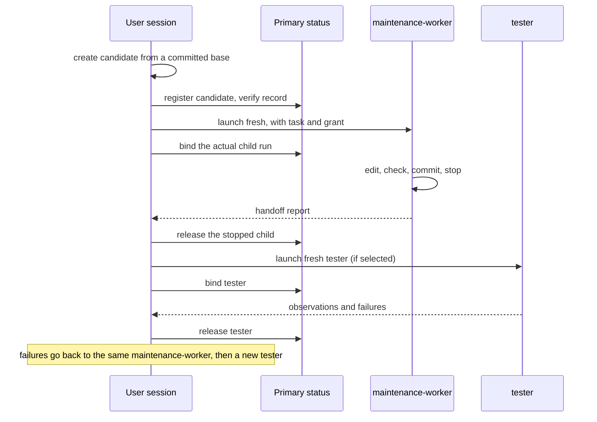

# Task subagents and the user session

This topic explains how a user session hands whole tasks to the two Task subagents, and what the
source user session's coordinator instructions add when the project is Concorde's own checkout.
The exact tools, fields and commands are in [Agent interfaces](contracts.md#task-subagent-interfaces).

## Terminology

| Term | Definition |
| --- | --- |
| [User session](../vocabulary.md#concept.concorde.user-session) | |
| [Task subagent](../vocabulary.md#concept.concorde.task-subagent) | |
| [Evidence](../vocabulary.md#concept.concorde.evidence) | |
| [Candidate](../harness/worktrees/module.md#concept.worktrees.candidate) | |
| [Worktree](../harness/worktrees/module.md#concept.worktrees.worktree) | |
| [Issue](../issues/module.md#concept.issues.issue) | |

## Two Task subagents

A Task subagent is a sibling of the user session, not a step inside a capability. It receives a
whole task and works until it reports back.

- **maintenance-worker** changes Concorde's own sources in one candidate worktree. It reads the
  Protocol principles and the complete Specs it affects, edits sources, Specs and the registry
  directly, runs its own checks, commits verified work and stops. It exists only in the source
  checkout.
- **tester** tests a stopped candidate independently. It keeps every governing file read-only, runs
  commands only through `test_command`, and returns failures to the user session instead of fixing
  them. It is installed in consumer projects too, as a generic tester without any source-only
  instructions.

Both start fresh: no inherited project or global instructions, no Skills, no Concorde catalog, and
no `subagent` tool. Neither creates or moves worktrees, merges, pushes or cleans up. Their own
self-checks are never independent evidence; only the tester's observations are, and only for the
exact revision and scope it tested.

## The source maintenance flow

In Concorde's source checkout, the user session loads the coordinator instructions and acts as the
coordinator. It owns a lightweight decomposition of the work: packages, dependencies, which Module
or file each writer owns, the gates between them, and when to test. This is not a Concorde plan
and uses no planner. A normal change runs like this:

Three rules hold the flow together:

1. **Register before launch.** Every candidate has a record in the primary `.concorde/status/`
   store before its maintenance-worker starts. The user session binds the child's actual run
   identity right after launch and rereads the record to verify it. Run evidence, notes and
   pi-subagents mission records never replace this record.
2. **One writer at a time.** Before a tester or a resumed maintenance-worker takes over, the user
   session verifies that the current child has stopped, releases exactly that child, then binds the
   next.
   A failed release or bind blocks the handoff; there is never concurrent ownership.
3. **Frozen launch grants.** A running child keeps the instructions and grant it was launched
   with. The user session may change prompts, profiles or workflows in its own tree, but that never
   changes an active sibling. New instructions govern only sessions that load them.

The user session keeps the same maintenance-worker through an unfinished stage and its feedback
cycle; a small milestone is not a reason to restart. After a completed stage whose goals or context
changed, it may launch a fresh maintenance-worker after a durable handoff: the current brief,
accepted decisions, exact HEAD and dirty state, artifacts, checks, risks and next step. Independent
components may run in parallel in separate candidates; shared files or contracts need an explicit
owner and an integration barrier, and component passes alone do not prove the combination works.

Independent testing is an explicit choice: none, targeted or full, with a stated scope and reason.
The tester receives the exact candidate-built Pi entry, catalog and runtime to test; a missing or
stale candidate artifact blocks testing instead of falling back to the primary or a global
installation. Integration into the primary branch and cleanup of candidates each need the
developer's explicit authorization, and only the user session records them.

## Checks and context lifecycle

Both the coordinator and the maintenance-worker choose checks by what changed: formatting, static
and targeted checks for local edits; affected integration for a coherent change; one full Python
suite and the build gates at the final stable input. A stage handoff alone needs no full suite, and
a commit of an already checked tree needs only HEAD checks. Evidence is repeated only after a
relevant input changed or a check failed, with the reason recorded.

The maintenance-worker keeps a short current task brief in its progress messages, and the source
user session keeps one with the `update_task_brief` tool. After Pi actually compacts a session, a
lifecycle extension injects that brief once. A request to replace a child for lack of room must
report measured context use; cumulative token counts or document sizes alone do not show that a
session is exhausted.

## Collecting TODO notes

The source user session can also just talk: answer questions, read sources and clarify a change
without starting any maintenance. When a discussion reaches a concrete, actionable conclusion whose
goal, scope and expected behaviour are settled, and the developer asks for or approves it, the user
session records it as one Markdown note under `.concorde/todos/`. The directory is the list. An
existing note for the same change is updated instead of duplicated, and each note keeps the
reasoning, decisions, alternatives, boundaries and examples, not just a title.

A request that is still unsettled gets a question back: keep clarifying, or save it as an
[Issue](../issues/module.md#concept.issues.issue)? Nothing is recorded until the developer chooses.
Moving a mature Issue into a TODO note copies its background first, verifies the note, and only then
deletes the Issue; a failure at any point keeps the source. Recording a note never changes
implementation or Specs, never creates a candidate and never starts a child. These instructions
exist only for the source user session.

## In a consumer project

A consumer installation has no coordinator instructions and no maintenance-worker. Its user session
can still launch the generic `tester` with the same isolation, selecting the project's installed
Concorde entry explicitly. Everything else in this topic applies only to Concorde's own checkout.
