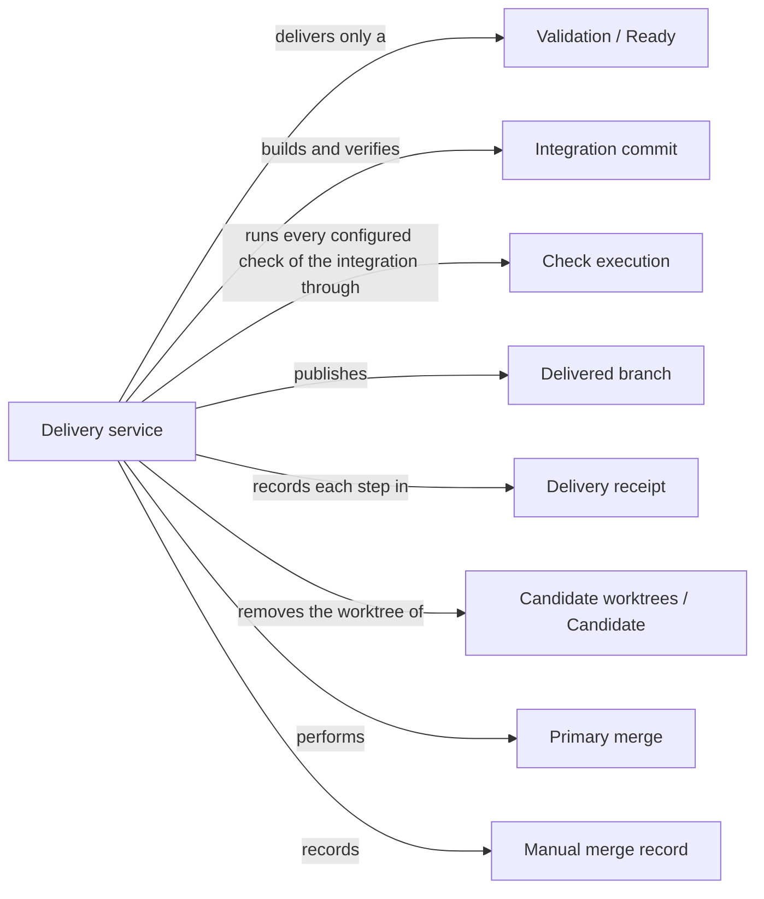

# Delivery

## Purpose

Delivery turns a ready change into something others can take: a separate Git branch holding the
verified integration of the candidate with the current primary branch. By default it then removes
the candidate's worktree. Updating the primary branch itself is a second, explicitly authorized
request from the primary worktree. This split lets the developer tell a checked proposal from an
accepted change of the main line. Delivery also records a merge the developer performed with
ordinary Git, so the change's history stays complete when Delivery did not do the merge. Delivery
runs no model and no sandbox; it verifies, publishes, cleans up and records. It does not decide
whether a change should be accepted, it never builds the project, and it never discards anyone's
uncommitted edits.

## Terminology

| Term | Definition |
| --- | --- |
| Integration commit | The commit that combines a candidate with the current head of the primary branch, verified before anything is published. |
| Delivered branch | The branch `concorde/delivered/<change_id>` that delivery creates for a change without checking it out or advancing the primary branch. |
| Primary merge | The separate, explicitly requested step that fast-forwards the primary branch to a verified merge of a delivered branch. |
| Delivery receipt | The record in a change's status that tells branch publication, worktree cleanup and primary merge apart, so each can be recovered without repeating the others. |
| Manual merge record | The record in a change's status of a merge into the primary branch that the developer performed with ordinary Git and Delivery only observed. |
| [Developer](../vocabulary.md#concept.concorde.developer) | |
| [Capability](../vocabulary.md#concept.concorde.capability) | |
| [User session](../vocabulary.md#concept.concorde.user-session) | |
| [Task subagent](../vocabulary.md#concept.concorde.task-subagent) | |
| [Host](../vocabulary.md#concept.concorde.host) | |
| [Evidence](../vocabulary.md#concept.concorde.evidence) | |
| [Candidate](../harness/worktrees/module.md#concept.worktrees.candidate) | |
| [Worktree](../harness/worktrees/module.md#concept.worktrees.worktree) | |
| [Primary worktree](../harness/worktrees/module.md#concept.worktrees.primary-worktree) | |
| [Change status](../harness/worktrees/module.md#concept.worktrees.change-status) | |
| [Configured check](../harness/checks/module.md#concept.checks.configured-check) | |
| [Ready](../validation/module.md#concept.validation.ready) | |

The integration commit is what is verified; the delivered branch is where it is published; the
primary merge is the later, separate promotion; the receipt records how far each has gone. A manual
merge record replaces all of these when the developer integrated the candidate with Git directly.

## Usage

<a id="concept.delivery.integration-commit"></a><a id="concept.delivery.delivered-branch"></a>

**Delivering a change.** When Validation has marked a change ready, the user session, or a Task
subagent working in one of the two participating worktrees, calls `concorde-deliver` with the
change's `change_id`. The request may come from the candidate's own worktree or from the primary
worktree, and nowhere else. For example, after `change.retry-limit` became ready, the user session
calls `concorde-deliver` with `{"change_id": "change.retry-limit"}`. The Host:

1. checks that the requesting session belongs to a participating worktree and is not a nested
   capability invocation, a request issued by another capability's run rather than directly by a
   session;
2. checks that the candidate's files are still exactly the validated tree and reruns Validation's
   completion check in the candidate;
3. confirms any pending file entries whose files now exist and commits that confirmation, with any
   other uncommitted deliverable file, on top of the candidate's branch;
4. builds the integration commit of the candidate and the current primary head and verifies it in
   a temporary detached worktree: Spec validation and every configured check of every Module;
5. saves the delivery receipt, then creates the delivered branch `concorde/delivered/change.retry-limit`;
6. removes the candidate's worktree and its local state.

The primary branch, its index and its files are untouched, even when the primary worktree has local
edits. Pass `keep_worktree: true` to keep the candidate's worktree instead; the choice is remembered
for later cleanup retries unless a retry states `keep_worktree: false`. After removal, the session
that ran in the candidate cannot continue there; later requests for the change come from the primary
worktree with the same `change_id`.

<a id="concept.delivery.primary-merge"></a>

**Merging into the primary branch.** To update the primary branch, a session in the primary
worktree sends a second request with `merge_primary: true`, after the developer has explicitly
authorized the merge. The Host checks that delivery and cleanup are complete, that the delivered
branch is unchanged and that the primary worktree has no local or untracked changes, builds the
merge of the delivered branch with the latest primary head, verifies it the same way, and
fast-forwards the primary branch to it. A delivery request without `merge_primary: true` never
merges into the primary branch.

The Host checks where the request comes from, not who sent it: it must start in the primary
worktree and must not be a nested capability invocation. It cannot tell the developer's user session
from a Task subagent working in the primary worktree, since both issue requests directly; the
developer's authorization is a rule the user session follows, not something the Host verifies. By
convention one writer owns the primary worktree at a time; the Host enforces only the repository
lock.

<a id="concept.delivery.receipt"></a>

**Results and failures.** The response reports outcome `delivered`, the delivery receipt as an
artifact, the checks of the last verification, and which pending files were confirmed and which are
still pending. When a gate fails, Delivery stops with an error, publishes nothing and leaves the
primary branch and worktree as they were: the change is not ready or changed after validation
(`incomplete_change`, `stale_evidence`), the candidate conflicts with the primary branch
(`merge_conflict`), the integration fails Spec validation (`invalid_merge`) or its checks
(`failed_merge_checks`), the delivered branch already exists without a receipt
(`stale_delivery`), or the request comes from elsewhere (`delivery_session_required`,
`primary_session_required`). A failure before publication marks the change `blocked` in phase
`deliver` with the error code as its outcome; it can be delivered again once the cause is fixed.

**Resolving a conflict.** A conflict found while delivering is resolved in the change's own
candidate worktree: merge the primary branch into it there, validate again and deliver again. A
conflict found during a primary merge is resolved in a new candidate created from the primary
branch, because the original candidate has normally been removed by then; that new change is
validated and delivered in its turn.

**Retrying.** Retrying is always safe: a retry after a failed cleanup only finishes the cleanup,
and a retry after an interrupted primary merge only records the merge that already happened. A
`describe-policy` request explains what delivery would do without doing anything.

<a id="concept.delivery.manual-merge"></a>

**Recording an ordinary-Git merge.** Some changes are integrated by the developer with ordinary
Git instead of `concorde-deliver`, for example source-maintenance candidates of Concorde itself.
After the developer has explicitly authorized such a merge and it has succeeded, the user session
records it from the primary worktree with the project CLI:

```sh
python3 scripts/concorde.py status --change-id "$change_id" --manual-merge "$commit" --cleanup pending
```

The Host verifies that the commit is in the primary branch's history and contains the candidate's
commit, and that the candidate has no uncommitted deliverable files; it then records the manual
merge, marks the change `merged` and records the cleanup outcome (`pending`, `retained` or
`removed`, where `removed` requires the candidate's worktree to be gone). A later
`--cleanup removed` without `--manual-merge` only updates the cleanup outcome of the recorded
merge. Recording never performs, authorizes or undoes a merge.

## Design

<a id="realization.delivery.service"></a>

**Three recorded transitions.** Publication, cleanup and primary merge are separate transitions,
each recorded in the delivery receipt before the Git reference it changes. This ordering is what
makes recovery safe. If the process stops after publishing the branch, the receipt shows the
publication happened and a retry goes straight to cleanup; if it stops after the primary merge, a
retry sees the merge commit on the primary branch and only records it. Recovery always looks at the
actual Git state rather than assuming that a missing acknowledgement means nothing happened.

**Verify the actual integration.** The primary branch may have moved since the candidate was
validated, so verification runs on the integration, not on the candidate alone. The integration
commit is built with `git merge-tree` without touching any worktree, checked out into a temporary
detached worktree for verification, and published with a create-only reference update. Before and
after each verification the Host confirms that neither the candidate nor the primary head moved.

**No build step.** Delivery verifies with the Host's own Concorde package and never runs a build
or any other program from the integrated tree outside Check execution's boundary. Running the
integrated tree's own code as the Host would execute unverified code with the Host's authority. A
project that needs build freshness verified configures a check for it, which then runs in the
check boundary like any other check.

**No sandbox, deliberately.** Delivery's own Git work (merging trees, creating commits, moving
references, adding and removing worktrees) runs with the Host's full authority; only the configured
checks it has run are confined, by Check execution. Nothing enforces that the Host's Git operations
stay within the change's branches: containment rests on the fixed sequence of steps and the
refusals above. This is a deliberate choice, because every step is Host code, not model output.

**The session check is Delivery's own first step.** Delivery's capability declaration asks
admission to bind the request to the primary worktree without a candidate; Delivery then checks
the requesting session itself, from the request's starting worktree, session root and nesting as
admission records them. Keeping the check inside Delivery keeps admission free of provider rules.

**One lock, cooperative.** All transitions and manual merge records run under the repository lock,
which also serializes the status writes of other Host requests. The lock orders Concorde's own
writers but cannot stop someone running Git directly, which is why the single-writer convention
matters.

**Delivery never discards edits.** A primary merge refuses a primary worktree with local changes,
and cleanup refuses to remove a candidate worktree whose files changed after delivery; that worktree
is kept for inspection.

**Observed, not performed.** A manual merge record states facts the Host can verify from Git:
ancestry of the merge and the candidate commit. It cannot know how the merge was made or whether
it was authorized; that stays the developer's responsibility.

The delivery transitions currently live in `src/concorde/harness/worktree_delivery.py`; they and
the manual-merge recording belong under `src/concorde/delivery/`.

<a id="realization.delivery.tests"></a>

The delivery tests drive real Git repositories with linked worktrees through publication, cleanup,
retries, conflicts, primary merges and manual merge records.

## Relationships



The picture shows one delivery, its later primary merge and a manual merge record. Admission and
Spec tooling are explained below.

<a id="uses-validation"></a>

**Validation** decides whether a change is [ready](../validation/module.md#concept.validation.ready)
and provides the [completion contract](../validation/records.md#contract.validation.completion).
Delivery requires the change to be ready with a recorded validated tree and runs the completion
check in the candidate before building anything; any answer other than complete stops delivery
before a branch changes. Because that check covers every Module a multi-Module change edits in its
one candidate, delivering the candidate is the single step that lands all of them together;
Delivery never delivers part of a candidate.

<a id="uses-harness-worktrees"></a>

**Candidate worktrees** owns the [worktrees](../harness/worktrees/module.md#concept.worktrees.worktree),
the [primary worktree](../harness/worktrees/module.md#concept.worktrees.primary-worktree) and the
[change status](../harness/worktrees/module.md#concept.worktrees.change-status) of
[candidates](../harness/worktrees/module.md#concept.worktrees.candidate), with the repository lock
and the deliverable tree snapshot. Delivery finds the candidate through the worktree inventory,
stores the receipt and the manual merge record in the change status, records the cleanup state as
`pending`, `retained`, `removed` or `not_needed`, and removes or keeps the worktree. The change
status survives the removal of the worktree. A concurrent status change stops the transition.

<a id="uses-harness-admission"></a>

**Request admission** receives `concorde-deliver` requests. Delivery's
[capability declaration](../harness/admission/module.md#concept.admission.capability-declaration)
states that the request is bound to the primary worktree and never relayed into a candidate, and
that Delivery checks the requesting session itself. Admission records, in the
[capability request](../harness/admission/module.md#concept.admission.capability-request), the
worktree the request started in, its session root and whether it is nested, and wraps the answer in
the [result envelope](../harness/admission/module.md#concept.admission.result-envelope).

<a id="uses-harness-checks"></a>

**Check execution** runs every [configured check](../harness/checks/module.md#concept.checks.configured-check)
of the integrated checkout in its [read-only check boundary](../harness/checks/module.md#concept.checks.read-only-boundary)
and returns one [check result](../harness/checks/module.md#concept.checks.check-result) per check.
Any result other than `passed` stops delivery with `failed_merge_checks`; an unavailable boundary
stops it with `check_sandbox_unavailable`.

<a id="uses-spec"></a>

**Spec tooling** runs the [structural checks](../spec/module.md#concept.spec.structural-check) on
the integrated checkout and confirms pending realization entries through a
[file transaction](../spec/module.md#concept.spec.file-transaction). A structural error stops
delivery with `invalid_merge`.
