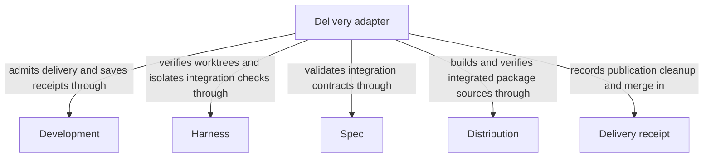

```concorde-document
{
  "id": "document.delivery.module",
  "owner": "module.delivery",
  "main_visible": true
}
```

# Delivery

## Purpose

Delivery stages a verified candidate on an independent branch, cleans up its source worktree and separately merges into the primary branch when explicitly authorized. It serves participating outer sessions and consumes current evidence without owning the flow that produced the candidate.

## Requirements

### req.development.single-primary-writer — Only one agent writes to primary

At most one agent SHALL own writes in the primary worktree at a time.

### req.development.primary-writes-serialized — Repository lock serializes primary writes

The host SHALL serialize shared lifecycle writes and final primary merges with the repository lock.

## Scenarios

### scenario.development.deliver-branch — Publish an independent delivery branch

- GIVEN a ready change selected by `change_id`, requested from its source or the primary worktree
- WHEN `concorde-deliver` runs
- THEN the host verifies participation, candidate evidence and actual integration, then publishes an independent `concorde/delivered/<change_id>` branch and removes the source worktree unless `keep_worktree:true`
- AND default delivery leaves the primary branch, index and project files unchanged

### scenario.development.deliver-merge-primary — Explicit primary merge

- GIVEN an already delivered receipt and an explicit user-authorized `merge_primary:true` request from the primary worktree's owning session
- WHEN the host processes that request
- THEN it verifies current integration against the latest primary commit and merges the delivered branch, recording its own commit, tree and checks separately from staging evidence
- BUT a generic delivery request without `merge_primary:true` never merges into the primary branch

See [only one agent writes to primary](#req.development.single-primary-writer) and
[repository lock serializes primary writes](#req.development.primary-writes-serialized).

### scenario.development.deliver-session-rejected — Delivery refused from an unrelated worktree

- GIVEN a session whose worktree is neither the change's selected source nor the primary worktree
- WHEN it requests delivery or final merging for that change
- THEN the host refuses it with `delivery_session_required` or `primary_session_required`
- AND no branch is published or merged

### scenario.development.deliver-conflict — Integration conflict blocks final merge

- GIVEN the candidate's actual integration against the latest primary commit fails its configured checks or conflicts
- WHEN final merging runs
- THEN the host blocks the merge with `merge_conflict` or `failed_merge_checks`, preserves the delivered branch, and leaves the primary branch, index and project files unchanged

The detailed contract is [Participating-session delivery](delivery.md).

## Ontology

### Entities

```concorde-entities
[
  {
    "id": "entity.delivery.adapter",
    "title": "Delivery adapter",
    "kind": "shared program",
    "responsibility": "Delivery stages a verified candidate on an independent branch, cleans up its source worktree and separately merges into the primary branch when explicitly authorized. It serves participating outer sessions and consumes current evidence without owning the flow that produced the candidate.",
    "files": [
      "capabilities/deliver.py",
      "tests/concorde/harness/test_worktree_lifecycle.py"
    ]
  },
  {
    "id": "entity.delivery.development",
    "title": "Development",
    "kind": "used module",
    "target_id": "module.development",
    "responsibility": "Admit participating delivery sessions and explicit primary-merge intent, and persist publication, cleanup and merge receipts."
  },
  {
    "id": "entity.delivery.harness",
    "title": "Harness",
    "kind": "used module",
    "target_id": "module.harness",
    "responsibility": "Inspect participating worktree identities and supply shared worktree mechanics and isolated execution of integration checks."
  },
  {
    "id": "entity.delivery.spec",
    "title": "Spec",
    "kind": "used module",
    "target_id": "module.spec",
    "responsibility": "Resolve changed Spec consumers and shared-file users and validate the actual integrated registry and document state."
  },
  {
    "id": "entity.delivery.distribution",
    "title": "Distribution",
    "kind": "used module",
    "target_id": "module.distribution",
    "responsibility": "Build merged Concorde sources in the integration checkout and validate their package and projection freshness."
  },
  {
    "id": "entity.delivery.receipt",
    "title": "Delivery receipt",
    "kind": "record",
    "responsibility": "Independent publication, cleanup and separately authorized primary-merge evidence."
  }
]
```

### Relationships



## Dependencies and composition

```concorde-dependencies
[
  {
    "target_id": "module.development",
    "responsibility": "Admit participating delivery sessions and explicit primary-merge intent, and persist publication, cleanup and merge receipts.",
    "selection_condition": "When staging the selected change, resuming cleanup or processing a separately authorized primary merge.",
    "relied_upon_promises": [
      "[Host admission](../development/interfaces.md#capability-execution-boundary); Recheck admitted intent and returned identities before accepting host state; a rejected result cannot advance the dependent step."
    ]
  },
  {
    "target_id": "module.harness",
    "responsibility": "Inspect participating worktree identities and supply shared worktree mechanics and isolated execution of integration checks.",
    "selection_condition": "When verifying the source and primary participants, integrating their candidate or running configured merge checks.",
    "relied_upon_promises": [
      "[Isolated configured-check execution](../harness/execution.md#configured-deterministic-checks); Supply the registered command and timeout; keep raw diagnostics in host records and refuse checks when isolation is unavailable.",
      "[Worktree identity](../harness/permissions.md#policy-compilation-and-rendering); reject mismatched participants before integration or cleanup."
    ]
  },
  {
    "target_id": "module.spec",
    "responsibility": "Resolve changed Spec consumers and shared-file users and validate the actual integrated registry and document state.",
    "selection_condition": "Before accepting candidate or integration evidence and confirming declared pending entries.",
    "relied_upon_promises": [
      "[Owner and context resolution](../spec/registry.md#stable-id-spec-context-queries); Reconstruct current resolutions after input changes; unresolved ownership, missing required definitions or stale revisions block dependent use.",
      "[Structural validation](../spec/structure.md#scenario.spec.validate-success); require consistent registered state without claiming semantic completeness."
    ]
  },
  {
    "target_id": "module.distribution",
    "responsibility": "Build merged Concorde sources in the integration checkout and validate their package and projection freshness.",
    "selection_condition": "When the actual integration tree contains concorde.json and therefore represents a Concorde package checkout.",
    "relied_upon_promises": [
      "[Integration build and package validation](../distribution/build.md); Require the integrated checkout's own fresh build and validation; a build failure prevents delivery."
    ]
  }
]
```

## Realization and reuse limits

This Module and its consumers are siblings under Concorde Framework. Declared files explicitly
share the existing adapter realization with Development; no new runtime package, public Skill,
Agent grant or configurable arbitrary flow is created by this Spec boundary. Host admission,
phase artifacts and permissions remain mandatory. A new flow requires declared composition and
an implementation of its sequencing, artifact admission, recovery and completion policies before
it can execute. The existing host package still realizes common dispatch and provider internals.
