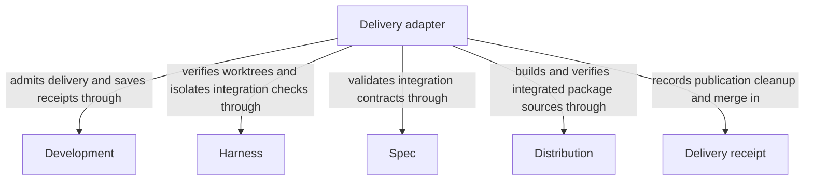

# Delivery

## Purpose

Delivery publishes a verified candidate as an independent branch and normally removes its source worktree. Updating the primary branch is a separate, explicitly authorized step. Developers use this boundary to distinguish a checked proposal from an accepted primary-branch change.

## Terminology

| Term | Meaning / definition |
| --- | --- |
| Delivered branch | The independent branch published by delivery without advancing the primary checked-out branch. |
| Delivery receipt | The saved record distinguishing branch publication, source cleanup and any later primary merge. |
| [Candidate](../module.md#terminology) | Defined in Concorde Framework. |
| [Ready](../module.md#terminology) | Defined in Concorde Framework. |
| [Delivery](../module.md#terminology) | Defined in Concorde Framework. |
| [Worktree](../module.md#terminology) | Defined in Concorde Framework. |
| [Evidence](../module.md#terminology) | Defined in Concorde Framework. |
| [Host](../module.md#terminology) | Defined in Concorde Framework. |

## Usage

Request `concorde-deliver` with the ready candidate's change_id from either its source worktree
or the primary worktree. A third-worktree session cannot initiate that delivery. Default delivery
verifies current evidence and actual integration, publishes `concorde/delivered/<change_id>`, and
**removes the source worktree**. It does not advance primary or modify its index or project files.
Supply `keep_worktree:true` explicitly to retain the source. A source session must end after
removal; retries then use the primary session and recorded change ID.

Merging primary is a separate `merge_primary:true` request after delivery, authorized explicitly
and issued by the sole primary writer. Conflicts, local primary edits, failed checks or stale evidence
block the transition; unrelated edits are never discarded. Receipts distinguish publication, cleanup and
merge: cleanup retries do not republish and accepted merge retries do not merge again. The producer
need not be dev-loop, but every candidate must meet the same evidence gates.

For example, ready means a proposed change has passed its required gates. Delivering it makes a
separate verified branch available; neither state means it is already merged into the main development
line. Before a later primary merge, the host checks integration again because primary may have advanced.

## Design

Delivery treats branch publication, cleanup and primary merging as distinct receipted transitions.
It verifies actual integration in a temporary detached worktree and uses create-only publication
for the independent branch. The repository lock serializes shared lifecycle metadata and final
primary transactions; it is a cooperative host constraint, not permission for competing direct
writers. [Integration verification](execution-reference.md#delivery-integration-verification) explains package builds
and current-consumer checks.

Recording retention and recovery state before destructive transitions permits cleanup retries
without republishing and merge recovery without repeating an accepted update. Recovery verifies
actual state rather than assuming that a missing acknowledgement means nothing happened. Consumer evidence
and pending-entry confirmation remain currentness gates, not inferred success from a branch name.

`deliver` runs as a single deterministic node that calls no model: the `deliver` leaf of the
[dispatch Graph](../development/execution-reference.md#graphs-operation-dispatch-graph-dispatch-graph),
entered directly from operation selection without target admission, because the change identity
already names the candidate. No development, specification or Issue Graph has an edge into it.

## Relationships

This view shows the providers needed to verify and record delivery, not an automatic merge into
primary. [Development Module](../development/module.md) admits the participating session and requested transition; [Harness Module](../harness/module.md) supplies
worktree mechanics and isolated checks; [Spec Module](../spec/module.md) validates integrated contracts and affected users.
[Distribution Module](../distribution/module.md) is involved when the integration is a Concorde package checkout that needs its own
build. The Delivery receipt keeps publication, cleanup and explicitly authorized primary merging
distinct, so a successful earlier transition cannot stand in for a later one.

### Development

Admit participating delivery sessions and explicit primary-merge intent, and persist publication, cleanup and merge receipts.

This collaboration applies when staging the selected change, resuming cleanup or processing a separately authorized primary merge.

- [Host admission](../development/interfaces.md#operation-execution-boundary); Recheck admitted intent and returned identities before accepting host state; a rejected result cannot advance the dependent step.

### Harness

Inspect participating worktree identities and supply shared worktree mechanics and isolated execution of integration checks.

This collaboration applies when verifying the source and primary participants, integrating their candidate or running configured merge checks.

- [Isolated configured-check execution](../harness/execution-reference.md#execution-configured-deterministic-checks); Supply the registered command and timeout; keep raw diagnostics in host records and refuse checks when isolation is unavailable.
- [Worktree identity](../harness/execution-reference.md#permissions-policy-compilation); reject mismatched participants before integration or cleanup.

### Spec

Resolve changed Spec consumers and shared-file users and validate the actual integrated registry and document state.

This collaboration applies before accepting candidate or integration evidence and confirming declared pending entries.

- [Owner and context resolution](../spec/contracts.md#registry-stable-id-spec-context-queries); Reconstruct current resolutions after input changes; unresolved ownership, missing required definitions or stale revisions block dependent use.
- [Structural validation](../spec/scenarios.md#scenario.spec.validate-success); require consistent registered state without claiming semantic completeness.

### Distribution

Build merged Concorde sources in the integration checkout and validate their package and projection freshness.

This collaboration applies when the actual integration tree contains concorde.json and therefore represents a Concorde package checkout.

- [Integration build and package validation](../distribution/build.md); Require the integrated checkout's own fresh build and validation; a build failure prevents delivery.

## Precise specifications

The Delivery Module owns the exact obligations and interface details in [requirements](requirements.md), [scenarios](scenarios.md) and the
[execution and record contracts](execution-reference.md#delivery-delivery-operation).
These companions are part of the same complete Module specification, not separate topic owners.
