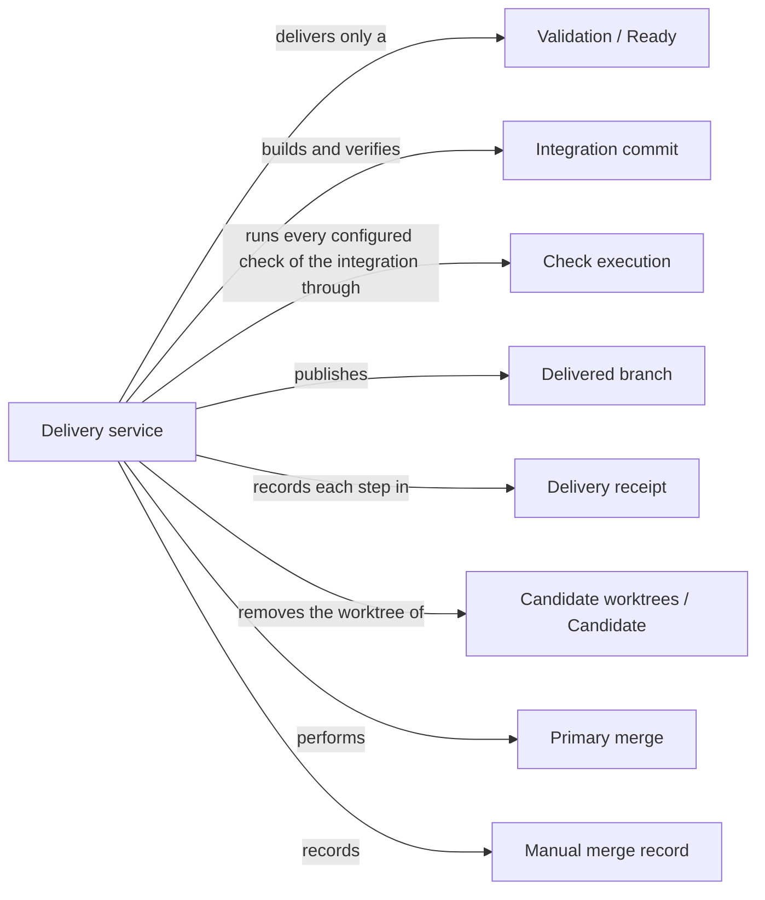

# Delivery

## Purpose

Delivery turns a ready change into something others can take: a separate Git branch holding the
verified integration of the candidate with the current primary branch. By default it then removes
the candidate's worktree. Updating the primary branch itself is a second, explicitly authorized
request from the primary worktree. This split lets the developer tell a checked proposal from an
accepted change of the main line. Delivery also records a merge the developer performed with
ordinary Git, so the change's history stays complete when Delivery did not do the merge. Delivery
runs no model and no sandbox; it verifies, publishes, cleans up and records. It does not decide
whether a change should be accepted, it never builds the project, and it never discards anyone's
uncommitted edits.

## Terminology

| Term | Definition |
| --- | --- |
| Integration commit | The commit that combines a candidate with the current head of the primary branch, verified before anything is published. |
| Delivered branch | The branch `concorde/delivered/<change_id>` that delivery creates for a change without checking it out or advancing the primary branch. |
| Primary merge | The separate, explicitly requested step that fast-forwards the primary branch to a verified merge of a delivered branch. |
| Delivery receipt | The record in a change's status that tells branch publication, worktree cleanup and primary merge apart, so each can be recovered without repeating the others. |
| Manual merge record | The record in a change's status of a merge into the primary branch that the developer performed with ordinary Git and Delivery only observed. |
| [Developer](../vocabulary.md#concept.concorde.developer) | |
| [Capability](../vocabulary.md#concept.concorde.capability) | |
| [User session](../vocabulary.md#concept.concorde.user-session) | |
| [Task subagent](../vocabulary.md#concept.concorde.task-subagent) | |
| [Host](../vocabulary.md#concept.concorde.host) | |
| [Evidence](../vocabulary.md#concept.concorde.evidence) | |
| [Candidate](../harness/worktrees/module.md#concept.worktrees.candidate) | |
| [Worktree](../harness/worktrees/module.md#concept.worktrees.worktree) | |
| [Primary worktree](../harness/worktrees/module.md#concept.worktrees.primary-worktree) | |
| [Change status](../harness/worktrees/module.md#concept.worktrees.change-status) | |
| [Configured check](../harness/checks/module.md#concept.checks.configured-check) | |
| [Ready](../validation/module.md#concept.validation.ready) | |

The integration commit is what is verified; the delivered branch is where it is published; the
primary merge is the later, separate promotion; the receipt records how far each has gone. A manual
merge record replaces all of these when the developer integrated the candidate with Git directly.

## Usage

<a id="concept.delivery.integration-commit"></a><a id="concept.delivery.delivered-branch"></a>

**Delivering a change.** When Validation has marked a change ready, the user session, or a Task
subagent working in the candidate's worktree or the primary worktree, calls `concorde-deliver` with
the change's `change_id`, for example `{"change_id": "change.retry-limit"}`. The Host checks that
the request comes from one of those two worktrees and is not a nested capability invocation (a
request issued by another capability's run rather than directly by a session), confirms the
candidate still matches its validated tree and reruns Validation's completion check, commits any
pending-entry confirmation, builds the integration commit of the candidate with the current primary
head and verifies it in a temporary detached worktree: Spec validation and every configured check of
every Module. It then saves the delivery receipt, creates `concorde/delivered/change.retry-limit`
and removes the candidate's worktree, unless `keep_worktree: true` asked to keep it. The primary
branch, its index and its files are untouched. Later requests for the change come from the primary
worktree with the same `change_id`.

<a id="concept.delivery.primary-merge"></a>

**Merging into the primary branch.** After the developer has explicitly authorized it, a session in
the primary worktree sends a second request with `merge_primary: true`. The Host requires delivery
and cleanup to be complete, the delivered branch unchanged and the primary worktree free of local
and untracked changes, verifies the merge with the latest primary head the same way, and
fast-forwards the primary branch. The Host checks where the request starts and that it is not
nested; it cannot tell the developer's user session from a Task subagent in the primary worktree,
so the authorization is a rule the user session follows, not something the Host verifies.

<a id="concept.delivery.receipt"></a>

**Results, failures and retries.** The response reports outcome `delivered`, the receipt as an
artifact, the last verification's checks and which pending files were confirmed or are still
pending. A failed gate, such as `incomplete_change`, `stale_evidence`, `merge_conflict`,
`invalid_merge`, `failed_merge_checks` or `delivery_session_required`, publishes nothing and leaves
the primary worktree as it was; before publication it marks the change `blocked` in phase `deliver`.
A conflict found while delivering is resolved in the change's own candidate worktree, which is then
validated and delivered again; a conflict found during a primary merge is resolved in a new
candidate created from the primary branch, because the original candidate has normally been
removed. Retrying is always safe: a retry after publication only finishes cleanup, and a retry
after an interrupted primary merge only records it. `describe-policy` explains delivery without
doing anything. The complete errors and transitions are in [Delivery interface](records.md).

<a id="concept.delivery.manual-merge"></a>

**Recording an ordinary-Git merge.** When the developer integrates a candidate with ordinary Git,
as for source-maintenance candidates of Concorde itself, the user session records the observed
merge from the primary worktree after it succeeded:

```sh
python3 scripts/concorde.py status --change-id "$change_id" --manual-merge "$commit" --cleanup pending
```

The Host verifies that the commit is in the primary branch's history and contains the candidate's
commit, records the manual merge, marks the change `merged` and records the cleanup outcome.
Recording never performs, authorizes or undoes a merge.

## Design

<a id="realization.delivery.service"></a>

The delivery service records publication, cleanup and primary merge as three separate transitions,
each in the receipt before the Git reference it changes, so recovery reads the actual Git state and
never repeats a step. It verifies the actual integration with the latest primary head, not the
candidate alone. It runs no build or other program of the integrated tree outside Check execution's
boundary, because that would execute unverified code with the Host's authority; a project that
needs build freshness configures a check. Delivery's own Git work runs with the Host's full
authority and no sandbox, deliberately: every step is Host code, and containment rests on the fixed
sequence and its refusals. The session check is Delivery's own first step, so admission holds no
provider rule. All transitions run under the cooperative repository lock, and Delivery never
discards uncommitted edits. The reasons are explained in [Delivery design](design.md).

<a id="realization.delivery.tests"></a>

The delivery tests drive real Git repositories with linked worktrees through publication, cleanup,
retries, conflicts, primary merges and manual merge records.

## Relationships



<a id="uses-validation"></a>

**Validation** decides whether a change is [ready](../validation/module.md#concept.validation.ready)
and provides the [completion contract](../validation/records.md#contract.validation.completion).
Delivery requires a ready change with a validated tree and runs the completion check in the
candidate before building anything; any other answer stops delivery before a branch changes.
Because the check covers every Module the candidate edits, Delivery never delivers part of a
candidate.

<a id="uses-harness-worktrees"></a>

**Candidate worktrees** owns the [worktrees](../harness/worktrees/module.md#concept.worktrees.worktree),
the [primary worktree](../harness/worktrees/module.md#concept.worktrees.primary-worktree) and the
[change status](../harness/worktrees/module.md#concept.worktrees.change-status) of
[candidates](../harness/worktrees/module.md#concept.worktrees.candidate), with the repository lock
and the deliverable tree snapshot. Delivery finds the candidate through the worktree inventory,
stores the receipt and the manual merge record in the change status, records the cleanup state as
`pending`, `retained`, `removed` or `not_needed`, and removes or keeps the worktree. The change
status survives the removal of the worktree. A concurrent status change stops the transition.

<a id="uses-harness-admission"></a>

**Request admission** receives `concorde-deliver` requests. Delivery's
[capability declaration](../harness/admission/module.md#concept.admission.capability-declaration)
states that the request is bound to the primary worktree and never relayed into a candidate, and
that Delivery checks the requesting session itself. Admission records, in the
[capability request](../harness/admission/module.md#concept.admission.capability-request), the
worktree the request started in, its session root and whether it is nested, and wraps the answer in
the [result envelope](../harness/admission/module.md#concept.admission.result-envelope).

<a id="uses-harness-checks"></a>

**Check execution** runs every [configured check](../harness/checks/module.md#concept.checks.configured-check)
of the integrated checkout in its [read-only check boundary](../harness/checks/module.md#concept.checks.read-only-boundary)
and returns one [check result](../harness/checks/module.md#concept.checks.check-result) per check.
Any result other than `passed` stops delivery with `failed_merge_checks`; an unavailable boundary
stops it with `check_sandbox_unavailable`.

<a id="uses-spec"></a>

**Spec tooling** runs the [structural checks](../spec/module.md#concept.spec.structural-check) on
the integrated checkout and confirms pending realization entries through a
[file transaction](../spec/module.md#concept.spec.file-transaction). A structural error stops
delivery with `invalid_merge`.
