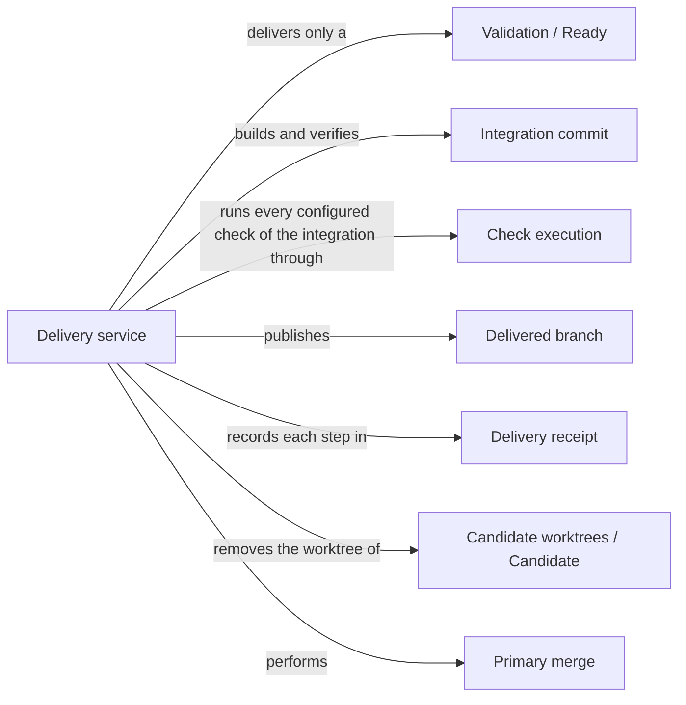

# Delivery

## Purpose

Delivery turns a ready candidate into something others can take: a separate Git branch holding the
verified change combined with the current primary branch. By default it then removes the
candidate's worktree. Updating the primary branch itself is a second, explicitly authorized request
from the primary worktree's own session. This split lets the developer tell a checked proposal from
an accepted change of the main line. Delivery runs no model; it verifies, publishes, cleans up and
records. It does not decide whether a change should be accepted, and it never discards anyone's
uncommitted edits.

## Terminology

| Term | Definition |
| --- | --- |
| Integration commit | The commit that combines a candidate with the current head of the primary branch, verified before anything is published. |
| Delivered branch | The branch `concorde/delivered/<change_id>` that delivery creates for a change without checking it out or advancing the primary branch. |
| Primary merge | The separate, explicitly requested step that fast-forwards the primary branch to a verified merge of a delivered branch. |
| Delivery receipt | The record in a change's status that tells branch publication, worktree cleanup and primary merge apart, so each can be recovered without repeating the others. |
| [Capability](../vocabulary.md#concept.concorde.capability) | |
| [User session](../vocabulary.md#concept.concorde.user-session) | |
| [Task subagent](../vocabulary.md#concept.concorde.task-subagent) | |
| [Host](../vocabulary.md#concept.concorde.host) | |
| [Evidence](../vocabulary.md#concept.concorde.evidence) | |
| [Candidate](../harness/worktrees/module.md#concept.worktrees.candidate) | |
| [Worktree](../harness/worktrees/module.md#concept.worktrees.worktree) | |
| [Ready](../validation/module.md#concept.validation.ready) | |

## Usage

When Validation has marked a candidate ready, the user session, or a Task subagent working in one
of the two participating worktrees, calls `concorde-deliver` with the change's `change_id`. The
request may come from the candidate's own worktree or from the primary worktree, and nowhere else.
For example, after `change.retry-limit` became ready, the user session calls `concorde-deliver` with
`{"change_id": "change.retry-limit"}`. The Host:

1. checks that the candidate's files are still exactly the validated tree and reruns the completion
   check;
2. confirms, in the candidate's Specs, any pending file entries whose files now exist that
   validation has not already confirmed;
3. builds the integration commit of the candidate and the current primary head, and verifies it in
   a temporary detached worktree: Spec validation and every configured check of the project, after
   running the integrated checkout's own build when it is a Concorde package;
4. saves the delivery receipt, then creates the delivered branch `concorde/delivered/change.retry-limit`;
5. removes the candidate's worktree and its local state.

The primary branch, its index and its files are untouched, even when the primary worktree has local
edits. Pass `keep_worktree: true` to keep the candidate's worktree instead. After removal, the
session that ran in it cannot continue; later requests for the change come from the primary
worktree with the same `change_id`.

To update the primary branch, the primary worktree's own session sends a second request with
`merge_primary: true`, after the developer has explicitly authorized the merge. The Host checks that
the delivered branch is unchanged and the primary worktree has no local changes, builds the merge of
the delivered branch with the latest primary head, verifies it again the same way, and fast-forwards
the primary branch to it. A generic delivery request never merges into the primary branch. By
convention one writer owns the primary worktree at a time; the Host enforces only the repository lock.

The response reports outcome `delivered`, the delivery receipt as an artifact, the checks of the
last verification, and which pending files were confirmed and which are still pending. When a gate
fails, Delivery stops with an error, publishes nothing and leaves the primary branch and worktree
as they were: the candidate is not ready or changed after validation (`incomplete_change`,
`stale_evidence`), it conflicts with the primary branch (`merge_conflict`), the integration fails
its build or validation (`invalid_merge`) or its checks (`failed_merge_checks`), the delivered branch
already exists without a receipt (`stale_delivery`), or the request comes from a third worktree
(`delivery_session_required`). The candidate is then marked blocked in the delivery phase and can be
delivered again once the cause is fixed. A conflict is resolved in a new candidate
worktree. Retrying is always safe: a retry after a failed cleanup only finishes the cleanup, and a
retry after an interrupted primary merge only records it. A `keep_worktree` choice is remembered for
later cleanup retries unless a retry states `keep_worktree: false`. A `describe-policy` request
explains what delivery would do without doing it.

## Design

The delivery service treats publication, cleanup and primary merge as three separate transitions,
each recorded in the delivery receipt before the Git reference it changes. This ordering is what
makes recovery safe. If the process stops after publishing the branch, the receipt shows the
publication happened and a retry goes straight to cleanup; if it stops after the primary merge, a
retry sees the merge commit on the primary branch and only records it. Recovery always looks at the
actual Git state rather than assuming that a missing acknowledgement means nothing happened.

Verification happens on the actual integration, not on the candidate alone, because the primary
branch may have moved since the candidate was validated. The integration commit is built with
`git merge-tree` without touching any worktree, checked out into a temporary detached worktree for
verification, and published with a create-only reference update. When the integrated tree is a
Concorde package checkout, the Host runs that checkout's own build first, because the change may
alter the build itself; a build failure blocks delivery. Before and after each verification the
Host confirms that neither the candidate nor the primary head moved.

All transitions run under the repository lock, which also serializes the status writes of other
Host requests. The lock is cooperative: it orders Concorde's own writers but cannot stop someone
running Git directly, which is why the single-writer convention matters.

Delivery never discards edits. A primary merge refuses a primary worktree with local changes, and
cleanup refuses to remove a candidate worktree whose files changed after delivery; that worktree is
kept for inspection.

The delivery tests drive real Git repositories with linked worktrees through staging, cleanup,
retries, conflicts and primary merges.

## Relationships

The picture shows one delivery and its later primary merge. Admission, Spec tooling and Distribution are
explained below.

**Validation** decides whether a candidate is [ready](../validation/module.md#concept.validation.ready).
Delivery requires the candidate's status to be ready with a recorded validated tree, and reruns
Validation's [completion check](../validation/requirements.md#req.validation.completion-gates)
before building anything. A failure there stops delivery before any branch changes.

**Candidate worktrees** owns the [worktrees](../harness/worktrees/module.md#concept.worktrees.worktree)
and status records of [candidates](../harness/worktrees/module.md#concept.worktrees.candidate), the
repository lock and the file tree snapshot. Delivery finds the candidate's worktree through the
worktree inventory, stores the delivery receipt in the change's status record, and removes or keeps
the worktree. The status record also shows the cleanup state as `pending`, `retained` or
`removed`, and it survives the removal of the worktree.

**Request admission** receives `concorde-deliver` requests. It binds each one to the primary
worktree once Delivery's session check has accepted the requesting session: the session's worktree
must be the change's source or the primary, the Concorde runtime serving it must not come from a
third worktree of the same repository, it may be at most one delegation level deep, and the primary
worktree must be on a branch.

**Check execution** runs every configured check of the integrated checkout in its read-only
sandbox. Any check that does not pass stops delivery with `failed_merge_checks`.

**Spec tooling** validates the integrated checkout's Specs and confirms pending realization entries whose
files now exist. The confirmation becomes part of the delivered candidate: if it changes the
candidate's Specs, Delivery commits it in the candidate before building the integration commit.

**Distribution** owns Concorde's build. When the integrated tree contains `concorde.json`, Delivery
runs that tree's own `scripts/concorde.py build` in a fresh process, keeps its log and build
manifest in the Host's run records, and validates the integration with the freshly built package.
A build failure stops delivery with `invalid_merge`.
