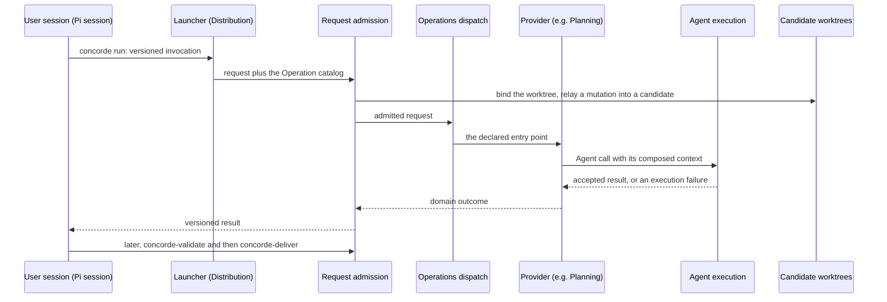

# Framework design

This topic explains the reasons behind the Framework's significant choices, which the
[Framework entry](module.md#design) states briefly, and follows one capability call through the
Modules. It is written for a reader who wants to understand why Concorde is shaped as it is; a
reader who only needs to use a Module can stop at that Module's entry.

## The Spec is the shared truth

Concorde is built around one idea: the Spec, not the code, is the shared source of truth between
the developer and the agents. Specs are written under the Spec Protocol, so both humans and tools
can read them. Every other choice follows from making that safe and practical: context and
permission are computed from the Specs, a model's answer is checked against them, and a missing
promise stops work instead of being inferred from code. A developer who wants to know what a Module
does reads its entry; a model that works on the Module receives the same entry.

## Four kinds of context

Each Agent call receives its Spec context, implementation context, capability context and task
context, defined in the [shared vocabulary](vocabulary.md#concept.concorde.context). Each is
derived from declarations, so the same request gets the same context, and a change to any input
yields a new one. A planner reasons from Specs and file names only; a programmer additionally
receives the contents of its own Module's files; nobody receives a provider's code in place of its
Spec. Keeping the kinds apart is what lets a boundary be explained: a reader can say for every item
which declaration put it there.

## Permission and what is enforced

A task's write set is the bound Module's own documents or its own implementation files, never both
for a model step, and a code-writing Agent never edits Specs. Enforcement is deliberately partial
and stated plainly by the [Harness](harness/module.md): results are always checked by the Host, but
a native worker's reads are not confined to its context, a programmer's edits and shell are not
confined to its implementation scope, a Module's Spec scope is not enforced during model steps, and
a worker with a shell is not prevented from calling the launcher. Concorde relies on the Host's
acceptance checks and on evidence bound to exact inputs, not on confinement, for its guarantees.

## Two control-flow mechanisms

Simple flows are pi workflows: authored workflow scripts that pi-subagents runs, whose Host steps
call back into the deterministic Host; each is explained by a step table in its owner's Spec.
Richer flows are LangGraph Graphs built only with the Graph API (`StateGraph`, with nodes and edges
declared before compilation). The Functional API is forbidden because it hides control flow in
ordinary Python, leaving nothing for a Graph Spec or a reader to inspect. Every Graph has a Graph
Spec in its owner's Spec, kept equal to the compiled Graph by a check.

## Why the dependencies are layered

A Module's Spec context contains its providers' Specs, so an upward dependency makes a
foundation's context, and every task on it, large; and a foundation that imports its users changes
whenever any of them does. The [layering rules](module.md#dependency-layering) therefore let
Modules rely on each other only from the outside in. Where a lower Module must reach code of a
higher one, the dependency is inverted instead of imported: Request admission defines the
capability declaration that Operations provides, Agent execution defines the hook interfaces that
providers implement, and Spec tooling defines a typed-value registration that each owner uses for
its own record schemas. Every `uses` names exactly the promises it relies on, which keeps each
selection to the provider's entry and the documents defining those promises. Mutual `uses` among
Operations' providers is allowed, because each still sees only the exact promises it lists.

## Candidates, evidence and delivery

Every mutating capability runs in a candidate worktree, so the primary branch stays untouched until
the developer decides. Evidence records the exact inputs it examined; when any of them changes, the
evidence stops applying and the candidate stops being ready. Delivery is a separate request, and
merging into the primary branch is yet another, because publishing a checked proposal and
accepting a change of the main line are different decisions.

## One call through the Modules

The sequence below is an illustration, not a declaration; each arrow in it is declared by the
calling Module's own `uses`.

The user session's tool sends a versioned invocation to the launcher, which hands it with the
Operation catalog to Request admission. Admission checks the request against the capability's
declaration and binds the worktree, relaying a mutation from the primary worktree into a new
candidate. Dispatch calls the provider's declared entry point; the provider composes each Agent
call's context and runs it through Agent execution, which returns either a result the Host accepted
or an execution failure. The provider maps what happened into its domain outcome, and admission
returns the versioned result. Validation and delivery are later, separate calls.

## How Concorde's own Specs are written

Concorde describes itself under the same Protocol, so this project is also the reference example of
a Concorde project. Each Module has one folder under `specs/concorde/`, Harness children below
`specs/concorde/harness/`, with an entry `module.md`, optional explanatory topics and implementation
documents for requirements, scenarios, contracts, Graph Specs and workflow step tables. Identities
follow `<kind>.<module-short>.<name>`, where the short name is the last segment of the Module
identity. A Module need not be a directory: realizations may bind files anywhere in the checkout.
An entry stays short because every consumer receives it whole; longer explanations such as this one
live in topics that no relation selects.

## Open questions

The four context kinds are defined at the root, but the Harness is still being reorganized to
deliver them as one composed record per call. Whether the public stage capabilities should also be
offered as one chained Operation is open and owned by Operations.
