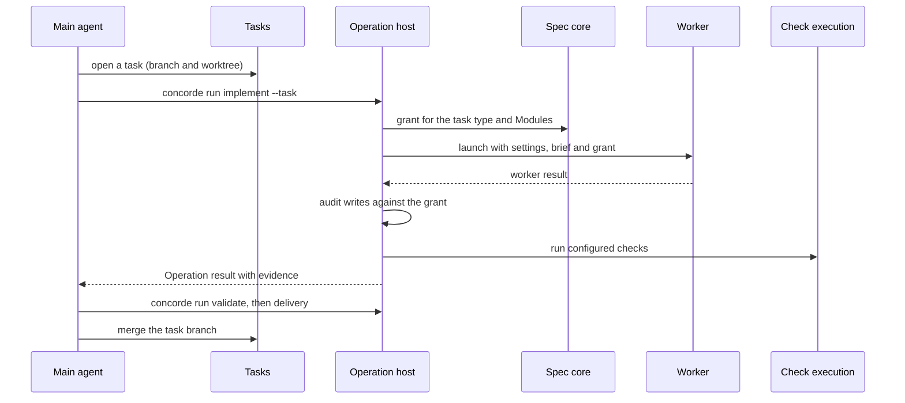

# Framework design

This topic explains the reasons behind the Framework's significant choices, which the
[Framework entry](module.md#design) states briefly, and follows one task through the Modules. It
is written for a reader who wants to understand why Concorde is shaped as it is; a reader who only
needs to use a Module can stop at that Module's entry.

## The Spec is the shared truth

Concorde is built around one idea: the Spec, not the code, is the shared source of truth between
the developer and the agents. Specs are written under the Spec Protocol, so both humans and tools
can read them. Every other choice follows from making that safe and practical: what a worker may
read and write is computed from the Specs, a worker's answer is checked by the host rather than
trusted, and a missing promise stops work instead of being inferred from code.

## Two tiers of agents

The main agent is the developer's Claude Code session. It has the global view and the developer's
trust, so Concorde does not restrict it. Workers are the opposite: each has one bounded task, no
human to ask, and a boundary derived from the Specs. Keeping the tiers apart is what lets a large
change be split into small, checkable steps without the developer supervising each one.

A third tier, a per-task leader session between the main agent and the workers, was considered and
deferred. With Operations run from the main agent, the main agent already has everything a leader
would add, and one fewer layer of messaging means one fewer place for an error to be lost.

## Tasks are branches

A task is a branch with its own worktree. Parallel work happens only between worktrees, so two
tasks never write the same checkout. Each task keeps a record and a decision log in the primary
worktree, so the main agent can resume, report and merge without relying on its own memory.

## Operations are host steps plus workers

An Operation is a small, fixed sequence of deterministic host steps around zero or more workers.
The host computes the grant, prepares the worker, audits the worker's writes, runs the checks
itself and records the run. The control flow is plain Python with a step table in the owning
Module's Spec; neither LangGraph nor an agent-side workflow engine is used, because the sequences
are short and must be readable and testable as code.

When a check fails, the host resumes the same worker with the failure, up to a fixed number of
rounds. These automatic rounds repair code only. A Spec gap, a boundary the worker needs to cross,
or a failed deterministic Spec check stops the Operation and returns its error chain, because
deciding what the Spec should promise belongs to the developer and the main agent.

## Errors travel as a chain

Every level of Concorde handles some errors and must pass the others up: Workers resumes a worker
for a failing check but not for a Spec gap, an Operation reruns nothing, the main agent decides
ordinary questions but not the project's direction. An error that is passed up as a bare code or
a one-line summary loses exactly what the next level needs to decide, and an error that each level
re-describes in its own words drifts from what actually happened. So every level that cannot
handle an error adds one link and keeps the rest: its own detailed account, the specific reason it
cannot handle the error, the options it sees, and the errors it received as causes, unchanged. The
reasons come from a small fixed set, such as a missing permission, a decision reserved to a higher
level or used-up rounds, so a reader can see at a glance which level could act with more authority.

The chain is structured data with one [contract](contracts.md#contract.concorde.error), not a
convention of prose. Workers fill in their part of it in their result, the host checks it against
its schema, and the main agent adds its own link with a command rather than paraphrasing, so the
developer receives the whole path from the failing check or the worker's missing promise up to the
question they are asked.

## Grants come from the task's own Specs

A grant is computed from the Specs in the task's worktree, never from the primary's. A task that
changes a Spec therefore gives the next step of the same task a boundary that matches the changed
Spec. The grant is frozen when a worker starts, so a concurrent Spec change cannot widen a running
worker. A worker never requests its own grant.

## Enforcement and its limits

A worker is a separate `claude -p` process with its own settings, its own configuration directory
and the run directory as its working directory. Three layers derived from one grant confine it:
deny rules keep the file tools away from everything outside the grant, a small write hook makes the
writable paths the only ones Edit and Write may touch, and the Bash sandbox confines shell
commands, including their reads, writes and network. After the worker stops, the host compares the
worktree's changes with the grant, so any write that slipped through is caught.

These layers were chosen after testing what Claude Code actually enforces: its sandbox confines
only Bash, its permission rules cannot express "only these files are writable", and a hook alone
covers only the tools it governs. They guard against a worker drifting out of its scope or making a
mistake. They do not stop a malicious actor: the Claude process and the hook are not themselves
sandboxed. Wrapping the whole worker in an outer OS sandbox is future work.

## One task through the Modules

The sequence below is an illustration, not a declaration; each arrow in it is declared by the
calling Module's own `uses`.

