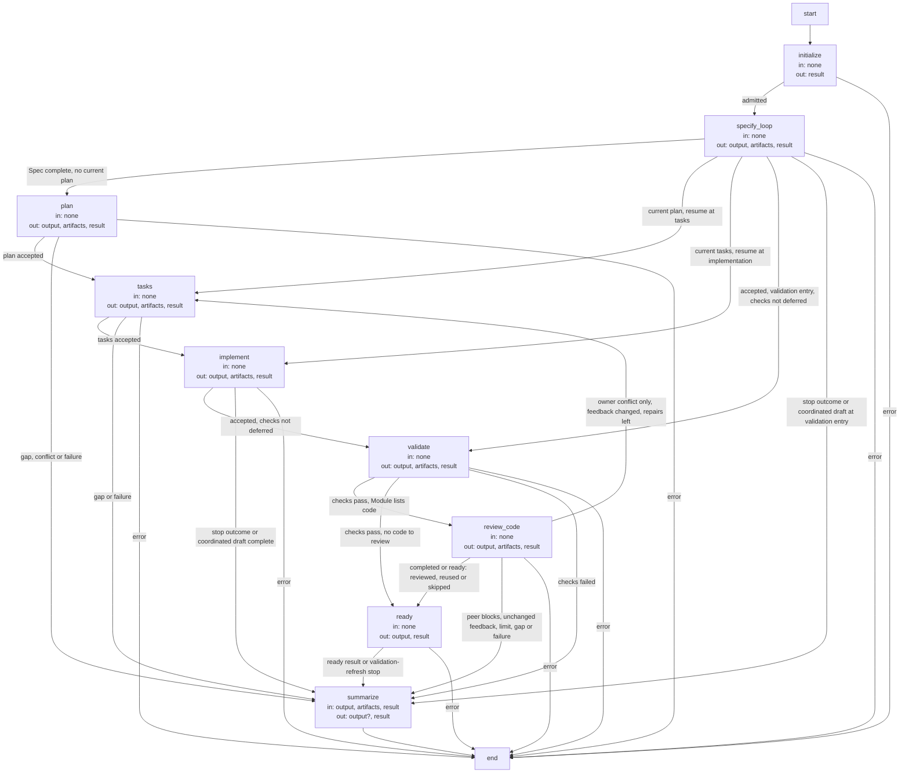

# Development Graph execution and record contracts

These are the precise implementation agreements and executable Graph specifications owned by the
[Development Graph Module](module.md). Explanatory topics introduce their purposes; exact identities, limits
and transitions are retained here as the single detailed contract.

## Terminology

| Term | Meaning / definition |
| --- | --- |
| [Graph](../module.md#terminology) | Defined in Concorde Framework. |
| [Spec](../module.md#terminology) | Defined in Concorde Framework. |
| [Candidate](../module.md#terminology) | Defined in Concorde Framework. |
| [Ready](../module.md#terminology) | Defined in Concorde Framework. |
| [Evidence](../module.md#terminology) | Defined in Concorde Framework. |
| [Blocker](../module.md#terminology) | Defined in Concorde Framework. |
| [Worktree](../module.md#terminology) | Defined in Concorde Framework. |
| [Host](../module.md#terminology) | Defined in Concorde Framework. |
| [Worker](../module.md#terminology) | Defined in Concorde Framework. |
| [Module](../module.md#terminology) | Defined in Concorde Framework. |
| [Grant](../module.md#terminology) | Defined in Concorde Framework. |
| [Snapshot](../module.md#terminology) | Defined in Concorde Framework. |
| [Spec context](../harness/context.md#terminology) | Defined in What information a worker receives. |
| [Task context](../harness/context.md#terminology) | Defined in What information a worker receives. |
| [Protocol binding](../spec/values.md#terminology) | Defined in Identities and versions. |
| [Acceptance task](../planning/tasks.md#terminology) | Defined in Making work verifiable. |
| [Reserved task ID](../planning/tasks.md#terminology) | Defined in Making work verifiable. |
| [Review coverage](../review/module.md#terminology) | Defined in Review. |
| [Operation](../module.md#terminology) | Defined in Concorde Framework. |
| [Harness](../module.md#terminology) | Defined in Concorde Framework. |
| [Delivery](../module.md#terminology) | Defined in Concorde Framework. |
| [Skill](../module.md#terminology) | Defined in Concorde Framework. |

## Development Graph and revision loops {#development-development-graph-and-revision-loops}

A developer supplies intended behavior and constraints for one top-level candidate change.
`concorde-specify-loop` independently routes, authors or revises, and reviews the Spec. It ends
with a completed Spec result, retaining blockers and review evidence in the candidate worktree.
`concorde-dev-loop` calls that operation, then coordinates context assessment, planning, tasks,
implementation and checks. The same task and change can continue from specify-loop into dev-loop
without repeating accepted authoring or current reviews. `specify=false` skips authoring; `run_reviews=false` records review
skips where no earlier requirement exists. The specification graph can complete independently; dev-loop adds its own development lifecycle.
Its successful output is a ready candidate, not an automatic merge.

[Planning task acceptance](../planning/execution-reference.md) and
[Implementation completion](../implementation/execution-reference.md) define the provider boundaries.

#### Explicit task-scope recovery {#development-explicit-task-scope-recovery}

An explicit `repair_task_scope:{tasks_digest}` request repairs this phase error on an existing
incomplete task list. The digest is SHA-256 of canonical JSON bytes (sorted keys, compact
separators, ASCII escaping), prefixed `sha256:`. It must match the current list and admitted intent;
unresolved gaps, a completed list or a pending code-review repair reject the request.
The normal Graph enters tasks after the required Spec review. A fresh task author receives only
its complete Module Spec, plan, prior tasks, reserved IDs and Host-generated `implementation_boundary` feedback.
It preserves software acceptance and returns new incomplete tasks with new IDs. The Host saves the
original list, request digest and implementation revision in task history, invalidates checks and
implementation evidence and continues implementation, validation and independent code review.
After a Protocol binding or Spec revision, required Spec review runs on the current inputs first.
The task author revalidates the preserved plan against that complete current Spec. A meaning
change requiring a new plan returns conflicting or a Spec gap; successful boundary repair binds
the replacement tasks to the current Spec revision and retains the old revision in history.
Replaying a digest already consumed by that target resumes the replacement tasks without
reauthoring them. Invalid or failed author output never replaces the old list. This is an explicit
recovery entry, not another automatic retry edge or authority to edit Specs or bypass a gate.

For an already coordinated list, scope repair preserves its component target set. A changed
component's derived task text is rebound only after the replacement list is accepted; its previous
coordination record remains in task history. The Host clears that component's implementation
completion and the enclosing finalization stamps, while retaining current Spec reconciliation and
unchanged participants. The child's normal loop sees the new intent and obtains fresh review,
planning, tasks, implementation and validation as needed; the Host does not rewrite its old tasks
as complete. Existing component contract gaps must be resolved before rebinding, and a change of
component routing is rejected without replacing the list. Ordinary intent changes outside this
explicit recovery still fail their original stale-context checks.

#### Failure and recovery {#development-failure-and-recovery}

Candidate creation precedes routing. A change ID identifies a worktree, not a completed route.
An unbound candidate resumes router selection using the recorded task and constraints; optional
saved target/focus hints only steer that selection. Older records without a saved target hint
remain valid. Once bound, the recorded owner supplies an omitted target or focus and omitted
constraints, while explicit incompatible intent is rejected. Standalone reviews without a change
ID still route their own review task. Trusted child routes retain their own admitted task context
and cannot replace the root owner. Recovery resolves current contracts and retains all existing
stage, review and readiness gates; it does not add a topology repair transition.

A known prohibition is unsupported, a contradiction is conflicting, a missing runtime value is
invalid input, and tool failure is failed. None automatically means Spec incomplete. A gap names
the unresolved question, blocked step and needed contract; target and snapshot identity accompany it.
Context solving diagnoses from the exact existing collection and never expands permissions.

A Module task may coordinate its own code, direct submodules and explicitly used Modules.
The Module planner sees only the Module collection and derives exact component IDs from its local
dependency metadata and local readable agreements. Before planning, deterministic context solving rejects any
missing direct registry relationship as a Module-owned Spec gap and reports inconsistent entries as
conflicting. Each component
receives its own explicit task, local authoring invocation and fast loop. All affected
consumer/provider contract views must agree before any component implementation begins. Component
ancestry and scope membership never grant extra reads. Successful component revisions are checked
again before Module delivery.

Checks use deterministic argv declared by project configuration. [Harness Module](../harness/module.md) enforces read-only project
access for the entire check process tree and gives each check external temporary/cache/report space;
unsupported enforcement blocks execution. [Harness admission](../harness/admission.md) persists output outside that sandbox, and
raw logs stay out of later Spec-only sessions. A stale Spec, changed task intent, modified
code, failed check or missing completion blocks delivery and preserves the candidate worktree. Resuming a
change reuses its target records and typed artifacts but starts a fresh agent session. The host does not copy unrelated
conversation or free-form predecessor output into context.

#### Candidate lifecycle and review policy {#development-candidate-lifecycle-and-review-policy}

`concorde-dev-loop` calls `concorde-specify-loop` for specify (default `specify=true`; `specify=false` skips Spec authoring
when the target's current Spec already suffices) and Spec review, then runs plan, tasks, implement, deterministic
validation and code review, then verifies readiness. It uses the same public contracts as standalone
operations. `run_reviews` defaults to `true`; `run_reviews=false` records an explicit skip for each
review mode instead of running it, and cannot cancel a review already required for this change. Every
invocation ends at ready and never invokes deliver.
It stops on the first non-successful outcome and preserves the change worktree, except that a
code-owning target's blocking code review first attempts a declared, bounded repair. The only
automatic revision edge is `review_code -> tasks`: task authoring receives the current completed
tasks and the blocking `concorde-review-result` as `stage_inputs`, and the resulting repair tasks
and their implementation are checked and code-reviewed again like any other change. Only the
owner's own blocking findings select this repair: when a changed-file peer's code review blocks,
the Graph stops and preserves that peer's result for separately routed work, because the peer's
contract is outside this owner's planning context. This repair is bounded by a declared
`max_repair_iterations` policy, which `concorde-dev-loop` declares as two, recorded per target when
the loop first runs for it under
`change["graph"][target_id]["policy"]` in `.concorde/worktree.json`; the same record keeps the
current `repair_iteration`, the last blocking-feedback fingerprint and an attributed history of
selected transitions (development.md's "AI and human feedback", G4). Repeated unchanged blocking
feedback is guarded by code: new records carry the formal `source` value `code-driven` or
`model-driven`, while retaining their descriptive legacy `trigger` label. A repair selected from
review findings is model-driven; unchanged-feedback and limit stops are code-driven. Repeated unchanged blocking
feedback across a repair attempt, or exhausting the declared limit, stops the Graph instead of
retrying forever: the change `status` becomes `waiting` (a human decision or a Spec/code change is
needed) or `limit_exhausted` respectively, and the wire `outcome` remains `conflicting`. Elsewhere, a
Spec gap (`spec_incomplete`) stops the Graph with status `waiting`, a failed deterministic check
stops it with status `failed`, and another blocking/unsupported outcome stops it with status
`blocked`. A human directly changing the Spec or the implementation between invocations resets the
recorded repair count instead of silently continuing a stale repair attempt. Preserving the change
worktree on a stop and resuming a current plan/tasks/implementation phase on a repeat instead of
discarding completed component work otherwise remain unchanged.
Module implementation coordinates independently selected participating component contexts. The host
records each author before launch and after success or blocking. Already authored draft Spec bytes
remain in the candidate when a later component blocks. Cross-component validation runs after every
affected local author finishes; it cannot prevent resuming an incomplete reconciliation. No component
code changes before this agreement. Component development loops report completion to the same owning change.

`concorde-specify-loop` (including when called by `concorde-dev-loop`) skips Spec authoring only after a host-accepted authoring result for
the same target, task, focus and constraints. Standalone review records, including failed or
unrelated reviews, cannot substitute for authoring. A completed Module still revisits its recorded
component coordination: stronger review requirements propagate before completed component work is
reused, and missing or stale component reviews run before readiness.

Standard development requires both reviews for a Module whose entities list implementation files,
regardless of recorded component work; a Module whose entities list no implementation files requires
only Spec review, and its recorded components carry their own code reviews.
`run_reviews` defaults to true and applies to both modes; `run_reviews=false` is the explicit opt-out.
Requirements and the exact review intent are saved per target in the existing worktree state; an
enabled requirement survives retries with run_reviews=false. Skips have separate records and never
satisfy a required gate. A standalone review with a different task/focus/constraints remains a run
artifact and cannot replace another intent's lifecycle-required review. Code review runs after checks
but before the single ready transition; a failed/incomplete/blocking review cannot be bypassed by
standalone validation or delivery.

A repeated loop preserves current plans/tasks and completed components. It reuses a review only after
checking its artifact digest, exact current inputs, successful coverage and absence of blocking
findings/gaps. Changed Spec invalidates its dependent plan/reviews and rebuilds context; changed code
invalidates code review/check evidence. Explicitly required reviews also apply to directly authored
candidates without inventing plans. Review does not edit files, run repair steps or deliver changes.

Common [gap history](../issues/execution-reference.md#review-and-gaps-attributed-issue-blockers-and-host-history) retains attributed blockers and accepts resolution only after current successful output. The graph stops dependent work until those conditions hold.

A change's `status` may also become `cancelled` or `limit_exhausted` after an executor outcome of
the same name (`execution_cancelled`/`execution_limit`), distinguishing a cancelled or time-limited
agent process from an ordinary `blocked`/`failed` outcome; the candidate is preserved for repair or
resumption in every case. A development loop stopping for a necessary Spec gap, or for blocking
code-review feedback that repeats unchanged across a bounded repair attempt, records status
`waiting` instead of the generic `blocked`: both name a concrete point where a human decision or a
Spec/code change is needed before the loop can usefully resume.
During dev-loop, the initial Module Spec review is local. Component reviews occur in separately coordinated component loops after reconciliation, and all writers finish before final shared-consumer checks.

### Design {#development-design}

#### Development Graph (`development_graph`) {#development-development-graph-development-graph}

The development Graph is the LangGraph Graph `concorde-dev-loop` executes after target admission.
It follows the [Graph Spec convention](../harness/execution-reference.md#graphs-and-loops-graph-specs):
its State, Nodes and Edges are stated below, and the diagram is kept equal to the compiled Graph by
the configured Graph Spec check. Spec authoring and Spec review belong to the independently
callable [specification Graph](../specify-loop/execution-reference.md#specify-loop-specification-graph-specify-graph),
which the `specify_loop` node composes; delivery is a separately invoked operation after `ready`.

**State.** `output` (the last stage's typed response data, including its outcome), `artifacts`
(review artifact references accumulated across stages under a merge reducer that keeps the
newest reference per artifact id), `result` (a terminal failure envelope when a guard caught an
error), `route` (declared but not used to select successors in this Graph).
`output`, `result` and `route` use replacement updates; only `artifacts` has a merge reducer.
A stage writes response **data** to `output`; `summarize` replaces it with the typed response
wrapper. Node `in`/`out` below name Graph channels, not child-operation requests or file effects.
`none` means no Graph channel is read: these nodes obtain their inputs from the admitted `run`
and Host-bound candidate records, not from the preceding node's `output`. Every guarded node also
writes `result=None` on success or a failure envelope on error. The candidate record in
`.concorde/worktree.json` carries the durable state every stage reads and advances: the bound
owner and intent, the plan, the task list and history, the implementation digest, check evidence,
review requirements and results, gap history and the
per-target graph record with its repair iteration and last feedback fingerprint.

**Nodes.**

| Node | Executes | in | out |
| --- | --- | --- | --- |
| `initialize` | Deterministic: enters the Graph; Host setup has already bound the task, resume stage and repair policy. | none | result |
| `specify_loop` | Calls the specification Operation's Graph through admission: authoring (unless skipped or accepted) and independent Spec review. Host-bound current evidence selects the resume stage. | none | output, artifacts, result |
| `plan` | Calls the planning Operation's Graph: context assessment, then a planner; persists the plan in the candidate. | none | output, artifacts, result |
| `tasks` | Calls the task author with the stored plan, reserved IDs and any blocking review; persists accepted tasks. | none | output, artifacts, result |
| `implement` | Calls implementation with stored tasks and granted code: one programmer or component coordination; records completed tasks and changed files. | none | output, artifacts, result |
| `validate` | Calls deterministic validation for the owner and changed-file peers; records checks without marking ready yet. | none | output, artifacts, result |
| `review_code` | Independent owner and changed-file peer reviews, or reuse/explicit skip; records review evidence and any bounded repair decision. | none | output, artifacts, result |
| `ready` | Verifies current stored evidence, refreshing validation if Issue bytes changed, then marks the candidate ready or returns the validation stop. | none | output, result |
| `summarize` | Wraps the last response data with accumulated artifact references and review coverage; leaves output unchanged if result is already a failure. | output, artifacts, result | output?, result |

**Edges.** Every node except `summarize` chooses its own successor: it returns a LangGraph
`Command` naming the next node together with its State update, and its declared destinations bound
that choice. `initialize` enters `specify_loop`. The outcome of `specify_loop` also selects where a
resumed candidate re-enters: `plan`, or `tasks`, `implement` or `validate` when current evidence
already covers the earlier stages. A successful stage hands over to the next one; `validate` skips
`review_code` when the Module lists no code to review. Any stop routes to `summarize`, which writes
the response, and a guard-caught error goes straight to `__end__`. Only `review_code` may route back
to `tasks`: the automatic repair edge, bounded by the declared `max_repair_iterations` and the
unchanged-feedback rule. `Command.goto`, not the `route` channel, selects all of these stage
transitions; `Command.update` supplies the channel deltas in the table. An accepted stage means
`output.outcome` is `completed` or `ready`. For coordinated drafts, the Host's
`defer_component_checks` also selects `summarize` after successful `implement`, or after successful
`specify_loop` when the resume entry is `validate`; final shared checks belong to the coordinator.
The repair edge requires the owner's conflicting code findings, no blocking peer findings, a
changed feedback digest and remaining recorded repair budget. Explicit skips and reused reviews
can also advance: advancing does not claim a fresh review ran. The `ready` edge to `summarize`
also carries a failed refresh of validation; it does not always mean readiness succeeded.

#### AI and human feedback {#development-ai-and-human-feedback}

Author, assessor, planner, task author, implementation and reviewer invocations MUST resolve their
own Operation execution profiles and effective Harnesses. Shared Graph state contains admitted outputs and
feedback, not their private transcripts. Review findings identify the input revision and the
required repair. A code defect selects an implementation repair and another review; a necessary
Spec gap selects a clarification or authorized Spec-authoring path before implementation resumes.

The Graph MUST record which AI finding or human decision selected a transition. Repeated unchanged
blocking feedback waits for new information or stops at the declared limit. Human changes to intent
create a revised task and invalidate dependent plans and evidence. Human acceptance required for
another transition remains explicit; a reviewer cannot grant it. `ready` ends this Graph, while
user-authorized delivery remains a separate operation.

#### Coordinated implementation and final consumer checks {#development-coordinated-implementation-and-final-consumer-checks}

A coordinating Module can have both its own code tasks and separately bound submodule or dependency
tasks. Its original plan and task identity remain intact; local code tasks do not recursively open
a new development loop for the same Module. Each child is specified, planned and implemented from
its own complete Module contract and the implementation files its own entries bind.

Within a coordinated change, nested loops finish explicit code drafts. The enclosing coordinator
waits for all writers, including its own coordination code, before checking the final candidate.
This permits a shared implementation to change without requiring unfinished consumers to pass
prematurely. Finalization checks each recorded component and all affected implementation users in
separate contexts, records current checks/reviews and rejects missing or stale evidence before ready.
The host-only defer_component_checks flag controls this sequencing; it is not a request field or
a way for a caller to bypass final validation or delivery checks.

Once all writers finish, the host performs bounded finalization through each component’s normal
validation and code-review repair loop. A repair that changes shared files invalidates earlier
consumer evidence; finalization repeats for all participants until their implementation revisions
are stable. Incompatible contracts or exhausted repair attempts leave the candidate incomplete.

## Realization and reuse limits

This Module and its consumers are siblings under Concorde Framework. Its behavior is realized in
its own package `src/concorde/dev_loop/`, bound by its adapter entity together with its `operations/` declaration; this Spec boundary
creates no public Skill, Agent grant or configurable arbitrary graph. Host admission, phase
artifacts and permissions remain mandatory. A new graph requires declared composition and an
implementation of its sequencing, artifact admission, recovery and completion policies before it
can execute. [Harness admission](../harness/admission.md) realizes the common entry and invocation
host, and [Operations](../operations/execution-reference.md#graphs-dispatch-graphs) the dispatch
that reaches this provider.
