# Development Flow

## Purpose

Development Flow composes sibling providers to carry one intended change through Spec preparation, planning, tasks, implementation, validation and independent code review to a ready candidate. It owns that sequence, candidate lifecycle, bounded repair and stop policy, while each provider owns its own reusable contract.

## Usage

Choose `concorde-dev-loop` for one intended change through specification, planning, task authoring,
implementation, validation and code review. Supply task and constraints; optional target/focus
hints help initial routing. New primary-worktree mutations return a committed-base worktree
handoff and require a fresh owning session there. Resume with the recorded change identity and
compatible intent; a bound candidate does not reroute to another owner.

Both `specify` and `run_reviews` default true. `specify=false` skips authoring, not missing-contract
gates; `run_reviews=false` records explicit skips but cannot cancel reviews already required.
Success is a ready candidate, never automatic delivery. Necessary Spec gaps, failed checks and
execution failures preserve progress and stop dependent work. Blocking code review has one bounded
repair path; unchanged feedback or exhausted budget stops it. Explicit task-scope recovery is a
separate digest-bound action. See [development and recovery](development.md), including coordination
and the completion policy, before resuming partial work.

## Design

The [development Flow](development.md#development-flow-development_flow) composes sibling providers
through explicit state and routing edges. Specification preparation owns its author/reviewer work;
plan and task artifacts feed implementation, checks precede code review, and current evidence gates
the single ready transition. Durable candidate state records intent, progress, repair policy and
feedback identity so resume can choose the first stage whose inputs need renewal.

Only blocking code review can select the automatic tasks/implementation repair edge. Component
writers retain separate contexts; finalization waits for all writers, then repeats current
consumer checks while shared implementations change. Those internal scheduling rules fulfill the
ready-only, bounded-repair and evidence-preservation promises without importing private transcripts.

## Relationships

This is a responsibility and collaboration view; the detailed development Flow defines execution
order and routing. The adapter composes sibling providers rather than owning copies of their
contracts: Query and Routing selects the owner, Specification Flow prepares its Spec, Planning
produces tasks, Implementation fulfills them, and Validation and Review supply current evidence.
Development retains the candidate and repair state, Harness isolates invocations, and Spec resolves
participants and affected users. The Repair policy constrains feedback-driven transitions; reaching
a ready Development candidate does not invoke Delivery.

## Requirements

### req.development.explicit-skip-sticky — Review skips cannot cancel required reviews

A `run_reviews=false` retry SHALL NOT cancel a Spec or code review already required for this change
by an earlier enabled invocation.

### req.development.repair-edge-only — Code-review repair is the only automatic edge

`review_code -> tasks` SHALL be the development Flow's only automatic revision edge.

### req.development.non-repair-stops-graph — Other outcomes stop the graph for a decision

Every other non-successful outcome SHALL stop the graph for a human decision or an explicit Spec or
code change.

## Scenarios

### scenario.development.resume-unbound — Resume a handoff before target selection

- GIVEN the host created a candidate and returned a session handoff before routing or binding an owner
- WHEN a fresh host in that worktree resumes the development loop with the recorded change identity and original task
- THEN it validates the worktree identity and preserved intent, restores omitted constraints and focus hints, and performs real router discovery and single-target selection before binding the owner
- AND a supplied target hint never substitutes for routing authority
- AND both specify modes and both review modes use this same admission, with one successful route selection before the first development stage

### scenario.development.resume-bound — Restore a bound candidate without rerouting

- GIVEN a candidate has a persisted owner, task, constraints and focus
- WHEN a fresh host resumes that change
- THEN it restores omitted target, constraints and focus from the recorded owner and resolves the current complete Module contract without rerouting
- AND explicit conflicting target, task, constraints or focus returns incompatible_handoff with the conflicting field before any Agent runs, preserving the candidate state
- AND a missing change returns missing_change, an inconsistent owner returns invalid_worktree_state, and a mismatched change or worktree identity is refused before routing or execution
- AND trusted internal routes may select separately admitted components without replacing the top-level owner, while a child target differing from its host route is rejected
- AND existing stage admission, review requirements, file permissions and current-candidate freshness checks still apply

### scenario.development.dev-loop-ready — A change reaches a ready candidate

- GIVEN a developer supplies one intended change with its task and constraints
- WHEN `concorde-dev-loop` calls `concorde-specify-loop` for Spec authoring (unless `specify=false`) and Spec review, then runs planning, tasks, implementation, deterministic checks and code review in order
- THEN every stage completes successfully and the candidate reaches status `ready` with current evidence for every affected Module
- AND the loop stops there and never itself invokes delivery

### scenario.development.dev-loop-spec-gap — Development waits for a necessary Spec repair

- GIVEN a stage discovers a necessary missing or ambiguous contract
- WHEN that stage reports a Spec gap
- THEN the loop stops with status `waiting` and preserves the candidate worktree
- AND unrelated independent work may continue, and resuming after an explicit Spec repair does not repeat already-accepted authoring for the same task, focus and constraints

### scenario.development.task-scope-repair — Recover an implementation phase boundary error

- GIVEN an existing incomplete task list whose acceptance requires later Host actions
- WHEN a normal dev-loop request binds that list's canonical digest with repair_task_scope
- THEN a fresh task author receives the admitted plan, prior tasks and typed semantic boundary feedback
- AND no implementation contents or raw test logs enter that author's context
- AND accepted replacement tasks start incomplete, preserve software acceptance and use new IDs
- AND the original list remains in history and implementation precedes validation and required code review
- AND only current successful evidence reaches ready, while a replay resumes without reauthoring
- AND stale digests, unresolved gaps and invalid replacements cannot bypass the existing gates

### scenario.development.dev-loop-repair — Bounded automatic repair after blocking code review

- GIVEN a code-owning target's code review returns blocking findings
- WHEN the loop selects its automatic revision edge from code review back to task authoring
- THEN task authoring receives the current completed tasks and the blocking `concorde-review-result@2` as `stage_inputs`, and the resulting repair tasks and their implementation are checked and code-reviewed again like any other change
- AND this repair is bounded by the target's declared `max_repair_iterations` policy

See [code-review repair is the only automatic edge](#req.development.repair-edge-only) and
[other outcomes stop the graph for a decision](#req.development.non-repair-stops-graph).

### scenario.development.dev-loop-repair-exhausted — Repeated feedback or an exhausted limit stops the loop

- GIVEN a repair attempt reproduces the same blocking-feedback fingerprint as the previous attempt, or the declared repair limit is exhausted
- WHEN the loop would otherwise select another automatic repair
- THEN it stops instead of retrying: unchanged feedback records status `waiting` and an exhausted limit records status `limit_exhausted`, and both keep the wire `outcome` `conflicting`
- AND a human directly changing the Spec or the implementation between invocations resets the recorded repair count instead of continuing a stale attempt

### scenario.development.dev-loop-coordinated — A Module coordinates its own and dependency tasks

- GIVEN a Module task has both local code tasks and separately bound submodule or used-Module tasks
- WHEN implementation runs
- THEN each component is specified, planned and implemented from its own complete Module contract and the files its own entries bind, and the coordinator waits for every writer, including its own coordination code, before checking the final candidate
- AND a repair that changes a file listed by several Modules invalidates the already-recorded evidence of every listing Module, and finalization repeats until every participant is stable

The detailed contract is [Ready-only bounded development](development.md).

## Internal constraints

### req.development.specify-loop-composition — Spec preparation has one reusable entry

The development Flow SHALL compose concorde-specify-loop for its Spec authoring and review stages.

```mermaid
flowchart TB
    accTitle: Development Flow entities and dependencies
    accDescr: Development Flow records one candidate and bounded repair policy while sibling providers route intent, prepare Specs, plan tasks, implement code, validate the candidate and independently review code.
    e0["Development Flow adapter"]
    e1["Development"]
    e2["Harness"]
    e3["Spec"]
    e4["Query and Routing"]
    e5["Specification Flow"]
    e6["Planning"]
    e7["Implementation"]
    e8["Validation"]
    e9["Review"]
    e0 -->|maintains candidate progress through| e1
    e0 -->|binds fresh stage invocations through| e2
    e0 -->|resolves participants and affected consumers through| e3
    e0 -->|selects the change owner through| e4
    e0 -->|prepares and reviews Specs through| e5
    e0 -->|obtains plans and acceptance tasks from| e6
    e0 -->|implements accepted tasks through| e7
    e0 -->|validates the current candidate through| e8
    e0 -->|reviews code and receives repair feedback from| e9
    domain_candidate["Development candidate"]
    e0 -->|advances and preserves| domain_candidate
    domain_repair["Repair policy"]
    e0 -->|selects bounded transitions under| domain_repair
```

## Dependencies and composition

### Development

Admit or resume the change intent, maintain candidate and component progress and record bounded repair transitions and evidence.

This collaboration applies at flow entry, each accepted stage result, a stopping outcome and a current-state resume.

- [Host admission](../development/interfaces.md#capability-execution-boundary); Recheck admitted intent and returned identities before accepting host state; a rejected result cannot advance the dependent step.

### Harness

Bind each routed or composed Agent invocation to a fresh complete context and its phase-specific authority.

This collaboration applies when discovery or a composed stage launches an Agent; stage grants remain separate across repairs and reviews.

- [Complete context selection](../harness/context.md#contract.context.selection); Supply only mode-admitted inputs and require a matching completion; unavailable enforcement stops execution without a wider grant.

### Spec

Resolve the owner, declared components and all old/candidate Spec consumers and shared implementation users.

This collaboration applies when binding the root or a component and when invalidating evidence or finalizing the candidate.

- [Owner and context resolution](../spec/registry.md#stable-id-spec-context-queries); Reconstruct current resolutions after input changes; unresolved ownership, missing required definitions or stale revisions block dependent use.

### Query and Routing

Select one root owner for a new or still-unbound change while preserving recorded intent and constraints.

This collaboration applies when the candidate has no persisted owner; a bound resume does not reroute.

- [Explicit discovery and routing](../query-routing/query-and-routing.md); Preserve submitted task and constraints; accept only admitted selections and stop on gaps, ambiguity or discovery limits.

### Specification Flow

Prepare or review the selected Spec and return current accepted Spec-stage evidence before development continues.

This collaboration applies at the Spec preparation entry with the admitted specify and run_reviews flags, reusing only current accepted work.

- [Spec-stage completion](../specify-loop/specify-loop.md); Continue only after current successful Spec preparation; retain explicit skips and stop on blockers.

### Planning

Assess current sufficiency, produce the accepted plan and derive new implementation tasks or admitted repair tasks.

This collaboration applies after successful Spec preparation when a current plan or tasks are missing, or when a permitted repair returns to tasks.

- [Current plan admission](../planning/plan.md); Pass current intent and accepted artifacts; a gap, stale plan or rejected task list prevents implementation.
- [Task admission and identity history](../planning/tasks.md); provide the plan and reserved IDs, and admit feedback only for a permitted repair.

### Implementation

Fulfill accepted local tasks or coordinate separately admitted participants within their own implementation grants.

This collaboration applies when current incomplete tasks require code work and component contract reconciliation permits it.

- [Exact task fulfillment](../implementation/implementation.md); Supply exact current tasks and their grant; incomplete tasks or failed execution cannot satisfy finalization.

### Validation

Collect deterministic Spec and configured code evidence for the affected candidate and evaluate existing readiness gates.

This collaboration applies after the relevant writers finish and during finalization before the ready decision.

- [Candidate checks and readiness gates](../validation/validation.md); Require current evidence for every affected participant; failures or stale required evidence prevent ready.

### Review

Independently review current code and return coverage, findings and gaps for the flow's bounded repair or stop decision.

This collaboration applies after implementation checks when code review is enabled or already required, including final component review.

- [Independent review](../review/review.md); Supply the exact review intent and current scope; incomplete coverage, gaps or blocking findings cannot satisfy the required gate.

## Realization and reuse limits

This Module and its consumers are siblings under Concorde Framework. Declared files explicitly
share the existing adapter realization with Development; no new runtime package, public Skill,
Agent grant or configurable arbitrary flow is created by this Spec boundary. Host admission,
phase artifacts and permissions remain mandatory. A new flow requires declared composition and
an implementation of its sequencing, artifact admission, recovery and completion policies before
it can execute. The existing host package still realizes common dispatch and provider internals.
