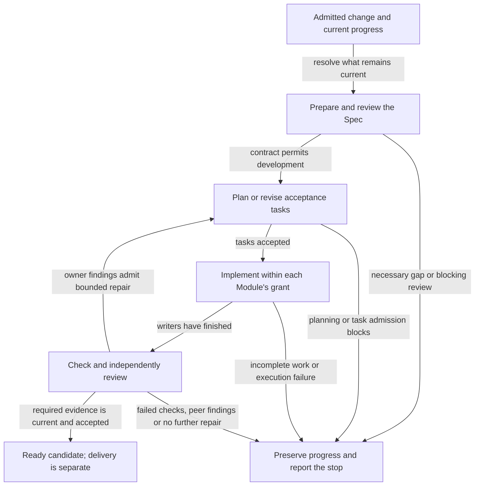
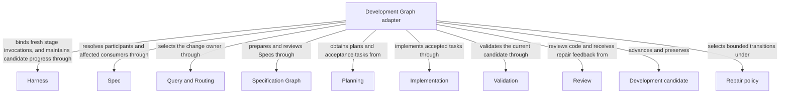

# Development Graph

## Purpose

Development Graph takes one intended change through specification, planning, implementation and verification. It coordinates the contributing Modules and preserves progress when work stops. Success is a ready candidate; delivery and primary merging are separate choices.

## Terminology

| Term | Meaning / definition |
| --- | --- |
| [Graph](../module.md#terminology) | Defined in Concorde Framework. |
| [Spec](../module.md#terminology) | Defined in Concorde Framework. |
| [Candidate](../module.md#terminology) | Defined in Concorde Framework. |
| [Ready](../module.md#terminology) | Defined in Concorde Framework. |
| [Evidence](../module.md#terminology) | Defined in Concorde Framework. |
| [Blocker](../module.md#terminology) | Defined in Concorde Framework. |
| [Worktree](../module.md#terminology) | Defined in Concorde Framework. |
| [Delivery](../module.md#terminology) | Defined in Concorde Framework. |
| [Module](../module.md#terminology) | Defined in Concorde Framework. |

## Usage

Choose `concorde-dev-loop` for one intended change through specification, planning, task authoring,
implementation, validation and code review. Supply task and constraints; optional target/focus
hints help initial routing. A new change requested from the primary worktree runs in a
committed-base candidate worktree the host creates, and the result names that candidate; the
requesting session stays in place. Resume with the recorded change identity and compatible
intent, from the primary worktree or inside the candidate; a bound candidate does not reroute to
another owner.
[Specification Graph](../specify-loop/module.md) can run first on its own; development reuses its
accepted work for the same task when inputs remain unchanged.

For example, adding retries first needs a clear rule for retryable failures. A missing rule pauses
the dependent work. Once specified, planning describes the change, implementation fulfills its tasks,
and checks and review assess the result. A stopped attempt retains the candidate and its progress.

Both `specify` and `run_reviews` default true. `specify=false` skips authoring, not missing-contract
gates; `run_reviews=false` records explicit skips but cannot cancel reviews already required.
Success is a ready candidate, never automatic delivery. Necessary Spec gaps, failed checks and
execution failures preserve progress and stop dependent work. Blocking code review has one bounded
repair path; unchanged feedback or exhausted budget stops it. Explicit task-scope recovery is a
separate digest-bound action. A Spec gap needs clarification; a failed check needs inspection;
an incompatible task or changed input needs fresh admission. These stops do not all mean that the
Spec is incomplete. Other non-successful outcomes wait for a decision or explicit correction.

## Design

The [development Graph](execution-reference.md#development-development-graph-development-graph) composes sibling providers
through explicit state and routing edges. Specification preparation owns its author/reviewer work;
plan and task artifacts feed implementation, checks precede code review, and current evidence gates
the single ready transition. Durable candidate state records intent, progress, repair policy and
feedback identity so resume can choose the first stage whose inputs need renewal.

`concorde-dev-loop` runs as two Graphs in turn. First,
[target admission](../operations/execution-reference.md#graphs-target-admission-graph-target-graph)
binds the recorded owner or routes a new change. The development Graph then runs its stages as
nodes. `initialize`, `validate`, `ready` and `summarize` are deterministic host steps.
`specify_loop` and `plan` are the specification and
[planning](../planning/execution-reference.md#plan-planning-graph-plan-graph) Graphs used as single
steps. `tasks` is one task-author worker and `implement` one programmer worker, each run as an
[Operation node](../harness/execution-reference.md#host-operation-node-operation-node); a composite
Module implements through the
[component coordination Graph](../implementation/execution-reference.md#graphs-component-coordination-graph-coordination-graph)
instead. `review_code` runs a code-reviewer for the owner and for each Module sharing a changed file.
Each stage names its own successor, and a stop passes through `summarize`.

Only the owner's own blocking code review can select the automatic tasks/implementation repair
edge, and `concorde-dev-loop` allows at most two such repairs. A changed-file peer's blocking review
stops the loop, because that peer's contract is not this owner's to plan against. Component
writers retain separate contexts; finalization waits for all writers, then repeats current
consumer checks while shared implementations change. Those internal scheduling rules fulfill the
ready-only, bounded-repair and evidence-preservation promises without importing private transcripts.

Authoring decides intended meaning, implementation fulfills it, and independent review challenges
that result. Keeping their authority and conversations separate helps prevent a worker from silently
weakening the contract to fit its own code. An explicit delivery decision follows readiness.

### Flow overview

This conceptual view follows a change from intent to a ready candidate; the boxes group work,
not executable nodes. Specification and implementation use separate authority so a code change
cannot silently redefine its contract. Resume reuses only current accepted work. A code-free
Module has no code-review step, and explicit review skips remain distinct from passing reviews.

For exact node inputs/outputs, State channels, resume choices and repair conditions, open the
[full Development Graph Spec](execution-reference.md#development-development-graph-development-graph).

## Relationships

This is a responsibility and collaboration view; the detailed development Graph defines execution
order and routing. The adapter composes sibling providers rather than owning copies of their
contracts: [Query and Routing](../query-routing/module.md) selects the owner, [Specification Graph](../specify-loop/module.md) prepares its Spec, [Planning](../planning/module.md)
produces tasks, [Implementation Module](../implementation/module.md) fulfills them, and [Validation Module](../validation/module.md) and [Review](../review/module.md) supply current evidence.
[Harness admission](../harness/admission.md) retains the candidate and repair state, [Harness Module](../harness/module.md) isolates invocations, and [Spec Module](../spec/module.md) resolves
participants and affected users. The Repair policy constrains feedback-driven transitions; reaching
a ready Development candidate does not invoke Delivery.

### Harness

Bind each routed or composed Agent invocation to a fresh complete context and its phase-specific authority.

This collaboration applies when discovery or a composed stage launches an Agent; stage grants remain separate across repairs and reviews.

Admit or resume the change intent, maintain candidate and component progress and record bounded repair transitions and evidence.

This collaboration applies at graph entry, each accepted stage result, a stopping outcome and a current-state resume.

- [Complete context selection](../harness/contracts.md#contract.context.selection); Supply only mode-admitted inputs and require a matching completion; unavailable enforcement stops execution without a wider grant.
- [Host admission](../harness/admission.md#operation-execution-boundary); Recheck admitted intent and returned identities before accepting host state; a rejected result cannot advance the dependent step.

### Spec

Resolve the owner, declared components and all old/candidate Spec consumers and shared implementation users.

This collaboration applies when binding the root or a component and when invalidating evidence or finalizing the candidate.

- [Owner and context resolution](../spec/contracts.md#registry-stable-id-spec-context-queries); Reconstruct current resolutions after input changes; unresolved ownership, missing required definitions or stale revisions block dependent use.

### Query and Routing

Select one root owner for a new or still-unbound change while preserving recorded intent and constraints.

This collaboration applies when the candidate has no persisted owner; a bound resume does not reroute.

- [Explicit discovery and routing](../query-routing/module.md#usage); Preserve submitted task and constraints; accept only admitted selections and stop on gaps, ambiguity or discovery limits.

### Specification Graph

Prepare or review the selected Spec and return current accepted Spec-stage evidence before development continues.

This collaboration applies at the Spec preparation entry with the admitted specify and run_reviews flags, reusing only current accepted work.

- [Spec-stage completion](../specify-loop/module.md#usage); Continue only after current successful Spec preparation; retain explicit skips and stop on blockers.

### Planning

Planning assesses current sufficiency, produces the accepted plan and derives new implementation tasks or admitted repair tasks.

This collaboration applies after successful Spec preparation when a current plan or tasks are missing, or when a permitted repair returns to tasks.

- [Current plan admission](../planning/plan.md); Pass current intent and accepted artifacts; a gap, stale plan or rejected task list prevents implementation.
- [Task admission and identity history](../planning/tasks.md); provide the plan and reserved IDs, and admit feedback only for a permitted repair.

### Implementation

Fulfill accepted local tasks or coordinate separately admitted participants within their own implementation grants.

This collaboration applies when current incomplete tasks require code work and component contract reconciliation permits it.

- [Exact task fulfillment](../implementation/module.md#usage); Supply exact current tasks and their grant; incomplete tasks or failed execution cannot satisfy finalization.

### Validation

Collect deterministic Spec and configured code evidence for the affected candidate and evaluate existing readiness gates.

This collaboration applies after the relevant writers finish and during finalization before the ready decision.

- [Candidate checks and readiness gates](../validation/module.md#usage); Require current evidence for every affected participant; failures or stale required evidence prevent ready.

### Review

Review independently reviews current code and returns coverage, findings and gaps for the graph's bounded repair or stop decision.

This collaboration applies after implementation checks when code review is enabled or already required, including final component review.

- [Independent review](../review/module.md#usage); Supply the exact review intent and current scope; incomplete coverage, gaps or blocking findings cannot satisfy the required gate.

## Precise specifications

The Development Graph Module owns the exact obligations and interface details in [requirements](requirements.md), [scenarios](scenarios.md) and the
[execution and record contracts](execution-reference.md#development-development-graph-and-revision-loops).
These companions are part of the same complete Module specification, not separate topic owners.
