```concorde-document
{
  "id": "document.development.development",
  "targets": [
    "module.development"
  ],
  "main_visible": true
}
```
# Development Agent Graph and revision loops

A developer supplies intended behavior and constraints for one top-level candidate change.
`concorde-dev-loop` coordinates Spec authoring, review, context assessment, planning, tasks,
implementation and checks. `specify=false` skips authoring; `run_reviews=false` records review
skips where no earlier requirement exists. These are configurations of one development lifecycle.
Its successful output is a ready candidate, not an automatic merge.

## Stages and outcomes


With reviews enabled, the development loop follows these transitions. Explicit skips retain
their own evidence states; delivery is a separately invoked capability after Ready.

```mermaid
stateDiagram-v2
  accTitle: Development, repair and separately authorized delivery
  accDescr: Development reaches Ready after current checks and configured reviews. Contract gaps wait for a Spec revision and code defects select bounded repair. Separate delivery stages a branch; merging it into the primary branch requires another explicit request.
  [*] --> Specified
  Specified --> SpecReviewed: independent Spec review
  SpecReviewed --> Gap: necessary contract missing
  Gap --> Specified: explicitly author missing contract
  SpecReviewed --> Planned: review current and context sufficient
  Planned --> Tasks: plan accepted
  Tasks --> Implemented: acceptance fulfilled
  Tasks --> Gap: necessary contract missing
  Implemented --> Checked: checks pass on current bytes
  Checked --> CodeReviewed: independent code review
  CodeReviewed --> Ready: required evidence current and no blockers
  CodeReviewed --> Tasks: code defect needs repair
  Ready --> Delivered: separate delivery verifies and stages a branch
  Delivered --> PrimaryMerged: explicit primary-session merge request
  Implemented --> Tasks: failure needs implementation work
  Delivered --> [*]
  PrimaryMerged --> [*]
```




## AI and human feedback

Author, assessor, planner, task author, implementation and reviewer invocations MUST resolve their
own Agent definitions and effective Harnesses. Shared Graph state contains admitted outputs and
feedback, not their private transcripts. Review findings identify the input revision and the
required repair. A code defect selects an implementation repair and another review; a necessary
Spec gap selects a clarification or authorized Spec-authoring path before implementation resumes.

The Graph MUST record which AI finding or human decision selected a transition. Repeated unchanged
blocking feedback waits for new information or stops at the declared limit. Human changes to intent
create a revised task and invalidate dependent plans and evidence. Human acceptance required for
another transition remains explicit; a reviewer cannot grant it. `ready` ends this Graph, while
user-authorized delivery remains a separate capability.

## Failure and recovery

Candidate creation precedes routing. A change ID identifies a worktree, not a completed route.
An unbound handoff resumes coordinator selection using the recorded task and constraints; optional
saved target/focus hints only steer that selection. Older records without a saved target hint
remain valid. Once bound, the recorded owner supplies an omitted target or focus and omitted
constraints, while explicit incompatible intent is rejected. Standalone reviews without a change
ID still route their own review task. Trusted child routes retain their own admitted task context
and cannot replace the root owner. Recovery resolves current contracts and retains all existing
stage, review and readiness gates; it does not add a topology repair transition.

A known prohibition is unsupported, a contradiction is conflicting, a missing runtime value is
invalid input, and tool failure is failed. None automatically means Spec incomplete. A gap names
the unresolved question, blocked step and needed contract; target and snapshot identity accompany it.
Context solving diagnoses from the exact existing collection and never expands permissions.

A Module task may coordinate its own code, direct submodules and explicitly used Modules.
The Module planner sees only the Module collection and derives exact component IDs from its local
`concorde-dependencies` declarations. Before planning, deterministic context solving rejects any
missing direct registry relationship as a Module-owned Spec gap and reports inconsistent entries as
conflicting. Each component
receives its own explicit task, local authoring invocation and fast loop. All affected
consumer/provider contract views must agree before any component implementation begins. Component
ancestry and scope membership never grant extra reads. Successful component revisions are checked
again before Module delivery.

Checks use deterministic argv declared by project configuration. Harness enforces read-only project
access for the entire check process tree and gives each check external temporary/cache/report space;
unsupported enforcement blocks execution. Development persists output outside that sandbox, and
raw logs stay out of later Spec-only sessions. A stale Spec, changed task intent, modified
code, failed check or missing completion blocks delivery and preserves the candidate worktree. Resuming a
change reuses its target records and typed artifacts but starts a fresh agent session. The host does not copy unrelated
conversation or free-form predecessor output into context.

## Coordinated implementation and final consumer checks

A coordinating Module can have both its own code tasks and separately bound submodule or dependency
tasks. Its original plan and task identity remain intact; local code tasks do not recursively open
a new development loop for the same Module. Each child is specified, planned and implemented from
its own complete Module contract and the implementation files its own entries bind.

Within a coordinated change, nested loops finish explicit code drafts. The enclosing coordinator
waits for all writers, including its own coordination code, before checking the final candidate.
This permits a shared implementation to change without requiring unfinished consumers to pass
prematurely. Finalization checks each recorded component and all affected implementation users in
separate contexts, records current checks/reviews and rejects missing or stale evidence before ready.
The host-only defer_component_checks flag controls this sequencing; it is not a request field or
a way for a caller to bypass final validation or delivery checks.

Once all writers finish, the host performs bounded finalization through each component’s normal
validation and code-review repair loop. A repair that changes shared files invalidates earlier
consumer evidence; finalization repeats for all participants until their implementation revisions
are stable. Incompatible contracts or exhausted repair attempts leave the candidate incomplete.
