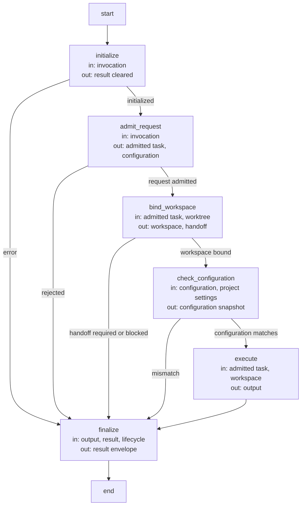
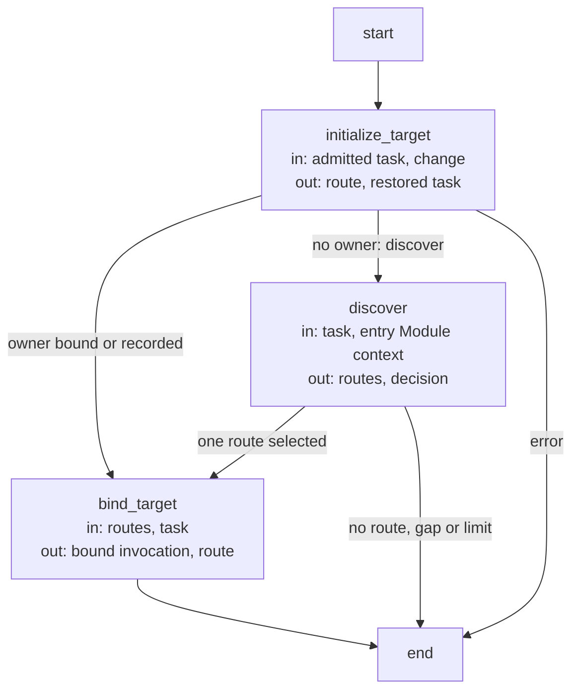
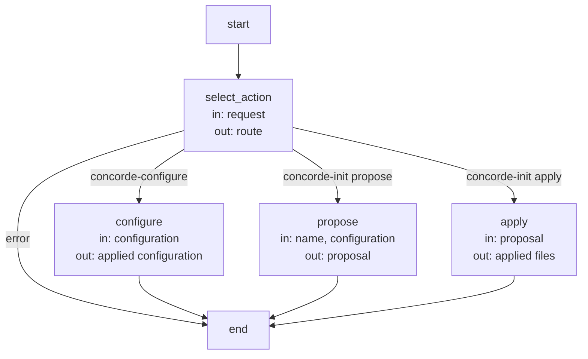
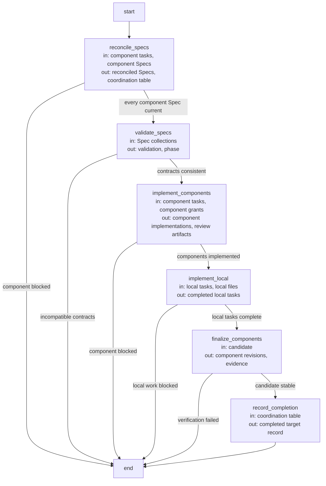
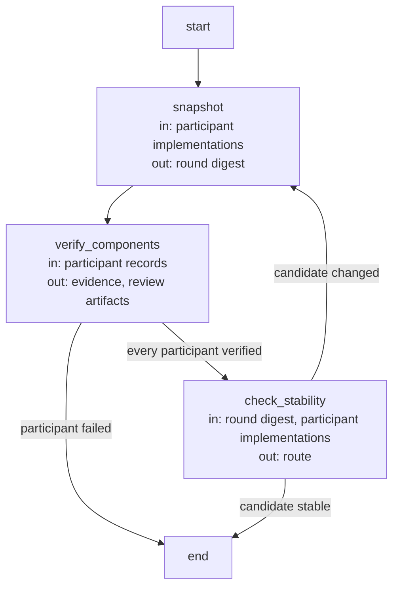

# Development execution and record contracts

These are the precise implementation agreements and executable Graph specifications owned by the
[Development Module](module.md). Explanatory topics introduce their purposes; exact identities, limits
and transitions are retained here as the single detailed contract.

## Terminology

| Term | Meaning / definition |
| --- | --- |
| [Operation](../module.md#terminology) | Defined in Concorde Framework. |
| [Public operation](module.md#terminology) | Defined in Development operation host. |
| [Internal operation](module.md#terminology) | Defined in Development operation host. |
| [Host](../module.md#terminology) | Defined in Concorde Framework. |
| [Graph](../module.md#terminology) | Defined in Concorde Framework. |
| [Worker](../module.md#terminology) | Defined in Concorde Framework. |
| [Worker profile](../harness/module.md#terminology) | Defined in Harness. |
| [Skill](../module.md#terminology) | Defined in Concorde Framework. |
| [Context](../module.md#terminology) | Defined in Concorde Framework. |
| [Grant](../module.md#terminology) | Defined in Concorde Framework. |
| [Snapshot](../module.md#terminology) | Defined in Concorde Framework. |
| [Spec context](../harness/context.md#terminology) | Defined in What information a worker receives. |
| [Task context](../harness/context.md#terminology) | Defined in What information a worker receives. |
| [Candidate](../module.md#terminology) | Defined in Concorde Framework. |
| [Worktree](../module.md#terminology) | Defined in Concorde Framework. |
| [Ready](../module.md#terminology) | Defined in Concorde Framework. |
| [Evidence](../module.md#terminology) | Defined in Concorde Framework. |
| [Issue](../module.md#terminology) | Defined in Concorde Framework. |
| [Blocker](../module.md#terminology) | Defined in Concorde Framework. |
| [Disposition](../issues/lifecycle.md#terminology) | Defined in Solving a recorded problem. |
| [Review coverage](../review/module.md#terminology) | Defined in Review. |

## Operation registry {#operations-operation-registry}

A **Operation** is an executable entity that can be used as a LangGraph node. It declares its
input State, output State updates, effects and usage conditions. Its implementation can be
ordinary deterministic code, a model invocation or a compiled LangGraph subgraph. These are
implementation choices, not separate entity kinds. A Graph is a graph that composes Operations;
a compiled Graph can itself be used as an Operation node.

**Operation** is the canonical executable identity. The former **Operation** name and the
parallel **Agent** executable registry are retired. A worker is a runtime process executing a
model-backed Operation, not another definition of what the Operation does. A model execution
profile records instructions, tools, context/effect limits, children and timeout on that Operation.
Lowercase *operation* still describes an ordinary action such as a filesystem or Git operation.
A helper function need not be registered merely because Python permits calling it from a node.

#### State and runtime boundaries {#operations-state-and-runtime-boundaries}

Each entry under `operations/` declares `STATE` and `run(state, runtime)`. The State contract
provides LangGraph input and output schemas. Model nodes consume the admitted task-context fields
and return validated result fields. Existing host-backed graph adapters consume request-data
fields and return a `result` channel containing the complete operation envelope, preserving
blocked, failed, cancelled and successful outcomes rather than flattening them into success data.
`REQUEST` and `RESPONSE` remain the versioned transport schemas of those existing host adapters;
they are not a second executable interface for model nodes.

A node receives only its declared input channels and returns only its output update, never a copy
of the entire parent State. Each graph declares reducers when parallel writers need to merge a
shared channel. Compatible compiled graphs can be embedded directly; incompatible channels require
an explicit adapter. Parent State membership is not permission to read files or implementation
contents. Frozen contexts and the executor's independent permission checks still apply.

Hosts, model launchers and project configuration are trusted `Runtime.context`, not writable State
channels or task-controlled callable objects. Model State validation checks both the wire shape and
the profile's phase, admitted artifacts, outcome and populated result fields. The worker executor
also rechecks its byte-bound instructions and effective authority before launching a process.

The existing `agent` record fields, `concorde-agent-stage-*` wire identities, generated instruction
paths under `generated/agents/`, stable Spec anchors and historical event names are compatibility
spellings. They identify the executing model Operation and do not recreate an Agent registry.

#### Current host adapter {#operations-current-host-adapter}

Each public Operation has exactly one Skill invoking `scripts/run-operation.py <skill>`.
Non-public Operations have no Skill or direct launcher entry. [Distribution Module](../distribution/module.md) owns the Skill
sources and projection; Development owns shared admission and dispatch. A Skill is an instruction
artifact for the developer's external runtime, not the worker's task context or a node kind.

| Operation | Public | Context selection | Deterministic | Uses | Behavior |
| --- | --- | --- | --- | --- | --- |
| main | true | discover | false | answerer, router, topology-designer, topology-author | Answer from selected Specs or prepare and apply accepted topology |
| dev-loop | true | discover | false | router, specify-loop, review, plan, tasks, implement, validate | Develop one change to a ready candidate |
| specify-loop | true | discover | false | router, specify, review | Complete Spec authoring and review before implementation |
| issues | true | bound | false | issue-solver, dev-loop, specify, review, validate | Inspect, report, reopen or solve a selected Issue without delivery |
| init | true | none | true | — | Propose and apply explicit initialization |
| configure | true | none | true | — | Apply model settings and explicit Protocol acceptance |
| validate | true | none | true | — | Run deterministic checks and record readiness |
| deliver | true | none | true | — | Stage a candidate and clean up; merge only when explicitly requested |
| specify | false | bound | false | spec-author | Author the bound target's Spec replacements |
| review | true | discover | false | router, spec-reviewer, code-reviewer | Read-only independent review with version-bound findings |
| context-solve | false | bound | false | context-assessor | Assess information sufficiency without context expansion |
| plan | false | bound | false | context-assessor, planner | Assess sufficiency, generate and persist a plan |
| tasks | false | bound | false | task-author | Derive acceptance tasks from the accepted plan |
| implement | false | bound | false | programmer | Fulfil tasks or coordinate participating components |

The twelve model-backed entries named in this table are themselves private, bound Operations
with `DETERMINISTIC=false` and no composed `USES`. Their detailed task State contracts, tools and
effects are defined in [model execution profiles](../harness/execution-reference.md). A bound
model node can consume a host-frozen discovery context without independently selecting more
Modules. Routing is explicit composition, not an implicit dependency added by a naming convention.

#### Operation properties {#operations-operation-properties}

Every Operation declares:

- **PUBLIC**: a boolean; true requires exactly one public Skill and launcher entry.
- **CONTEXT_SELECTION**: `discover`, `bound` or `none`. Discovery selects complete Module contexts;
  bound consumes an already selected/frozen context; none performs host work without model context.
- **DETERMINISTIC**: a boolean; true means no supported path calls a model, including transitive
  `USES`. It does not promise purity, reproducible filesystem observations or absence of effects.
- **USES**: the directly composed Operation identities. It is the sole composition relation,
  including calls to model nodes. It grants no additional context or write authority.
- **STATE**: the input and output State contract. Runtime schema and effect validation remain
  necessary even when LangGraph accepts the Python type declaration.
- **PROFILE**: optional model execution configuration, or `None`; it has the same identity as its
  Operation and never registers a second executable entity.

`AGENTS` and `CLASS` declarations are rejected. `USES` must name registered entries, be duplicate
free and have no definition cycle in this adapter. Bounded runtime loops and per-target recursive
execution remain graph control flow, not cyclic definition dependencies. Actual ordering, branches,
loops and reducers live in LangGraph, not a duplicate metadata graph. Undeclared composition fails
with `undeclared_operation`; host composition never grants a worker another callable tool.

The single `concorde.operations` metadata inventory records exposure, context selection,
determinism, Skill mapping, direct uses, State type identities and optional profile workspace/tools/
children. Validation compares it with code. There is no independent `concorde.agents` inventory.

### Design {#operations-design}

#### Behavioral ownership and composition limits {#operations-behavioral-ownership-and-composition-limits}

| Operation or action | Canonical behavioral owner |
| --- | --- |
| context-solve, plan, tasks | [Planning](../planning/module.md) |
| implement | [Implementation](../implementation/module.md) |
| specify | [Spec Authoring](../spec-authoring/module.md) |
| review | [Review](../review/module.md) |
| validate | [Validation](../validation/module.md) |
| deliver | [Delivery](../delivery/module.md) |
| main ask and routing | [Query and Routing](../query-routing/module.md) |
| main topology actions | [Topology](../topology/module.md) |
| dev-loop | [Development Graph](../dev-loop/module.md) |
| specify-loop | [Specification Graph](../specify-loop/module.md) |

Module ownership is distinct from node composition. `USES` is the executable composition relation;
registry `uses` describes Module responsibility dependencies. Shared model execution support does
not merge provider contracts. Every phase, target and independent review retains a fresh invocation
and its own grant. Only admitted structured artifacts cross node boundaries.

### Precise specifications {#operations-precise-specifications}

The Development Module owns the exact obligations and interface details in [scenarios](scenarios.md).
These companions are part of the same complete Module specification, not separate topic owners.

## Development host Graphs {#graphs-development-host-graphs}

### Design {#graphs-design}

The Development host executes every operation invocation as LangGraph Graphs. The six Graphs
below are its own: admission, dispatch, target admission, project initialization and
configuration, component coordination and shared-candidate stabilization. The composed Graphs they
dispatch to (discovery, query, topology, planning, specification, development and issues) are
specified by their owning Modules. Each Graph Spec follows the
[Graph Spec convention](../harness/execution-reference.md): nodes execute, edges route, and node
labels state the state read and written. Every diagram is bound to its compiled Graph by
`%% graph:` and kept equal to it by the configured Graph Spec check.

#### Operation admission Graph (`operation_graph`) {#graphs-operation-admission-graph-operation-graph}

State: `invocation` (the admitted `concorde-operation-invocation@3`), `result` (the
`concorde-operation-result@3` envelope, filled by `finalize` or by a guard that caught an
error), `policies` and `events` (the host's policy descriptions and observed events, Studio only),
`expected_workspace`. Every node runs under a guard: an error records the typed failure envelope
in `result` and routes to `finalize`.

| Node | Executes | in | out |
| --- | --- | --- | --- |
| `initialize` | Deterministic: fresh host identity, root invocation id and lifecycle record for this invocation. | invocation | result (cleared) |
| `admit_request` | Deterministic: operation name, mode, configuration and request are validated against the registered contracts; a stale build is refused for model-backed operations. | invocation | admitted task, configuration |
| `bind_workspace` | Deterministic: primary, change or unversioned workspace identity; a mutating primary request prepares a candidate worktree and returns the P10 handoff. | admitted task, worktree | workspace, handoff |
| `check_configuration` | Deterministic: the invocation configuration equals the initialized project settings and the host snapshot. | configuration, project settings | configuration snapshot |
| `execute` | The dispatch Graph (below) as a subgraph. | admitted task, workspace | output |
| `finalize` | Deterministic: status from the output outcome or the recorded error, execution-error propagation, lifecycle progress. | output, result, lifecycle | result |

#### Operation dispatch Graph (`dispatch_graph`) {#graphs-operation-dispatch-graph-dispatch-graph}

State: `route` (the leaf or subgraph selected for the admitted operation), `output` (the
operation's typed response), `result`. The Studio and CLI build one dispatch Graph per public
operation; the diagram shows the complete dispatch topology every entry compiles from.

| Node | Executes | in | out |
| --- | --- | --- | --- |
| `select_operation` | Deterministic: the admitted operation selects its entry leaf or target admission. | admitted task | route |
| `prepare_target` | The target admission Graph (below) as a subgraph: binds or discovers the owning Module and selects the bound leaf. | admitted task, change | route, bound invocation |
| `deliver` | Deterministic: worktree delivery under the repository lock. | change, worktrees | delivery receipt |
| `project` | The project Graph (below): initialization proposal or application, or configuration. | request | proposal or applied files |
| `answer` | The query Graph with the answerer. | question, Module contexts | answer |
| `design_topology` | The query Graph with the topology-designer. | task, Module contexts, registry | topology design |
| `prepare_topology` | The topology preparation Graph. | accepted design | prepared application |
| `apply_topology` | The topology application Graph. | prepared application | applied topology |
| `review` | Deterministic scope over Review invocations: owner and changed-file peers. | bound target, changes | review results |
| `describe_policy` | Deterministic: the exact grants each stage would receive, without launching an Agent. | bound target | policy descriptions |
| `issues` | The Issue management and solving Graph. | bound target, selected Issue | Issue result |
| `specify` | Spec Authoring: one spec-author invocation and the affected-consumer reviews. | bound target, Spec context | replaced Spec documents |
| `plan` | The planning Graph. | bound target, Spec context | plan |
| `tasks` | One task-author invocation and task admission. | plan, reserved ids, review feedback | tasks |
| `implement` | One programmer `implementation` invocation, or component coordination. | tasks, implementation files | completed tasks |
| `validate` | Deterministic checks and readiness gates for the candidate. | candidate | checks, readiness |
| `development_loop` | The development Graph. | bound target, change | ready candidate or stop |
| `specify_loop` | The specification Graph. | bound target, change | Spec completion |
| `context_solve` | One context-assessor invocation. | bound target, Spec context | sufficiency or gaps |

```mermaid
flowchart TB
    %% graph: dispatch_graph
    accTitle: Operation dispatch Graph
    accDescr: The admitted operation selects one entry leaf, or target admission first and then one bound leaf; every leaf ends the Graph with its typed output.
    __start__["start"]
    select_operation["select_operation<br/>in: admitted task<br/>out: route"]
    prepare_target["prepare_target<br/>in: admitted task, change<br/>out: route, bound invocation"]
    deliver["deliver<br/>in: change, worktrees<br/>out: delivery receipt"]
    project["project<br/>in: request<br/>out: proposal or applied files"]
    answer["answer<br/>in: question, Module contexts<br/>out: answer"]
    design_topology["design_topology<br/>in: task, Module contexts, registry<br/>out: topology design"]
    prepare_topology["prepare_topology<br/>in: accepted design<br/>out: prepared application"]
    apply_topology["apply_topology<br/>in: prepared application<br/>out: applied topology"]
    review["review<br/>in: bound target, changes<br/>out: review results"]
    describe_policy["describe_policy<br/>in: bound target<br/>out: policy descriptions"]
    issues["issues<br/>in: bound target, selected Issue<br/>out: Issue result"]
    specify["specify<br/>in: bound target, Spec context<br/>out: replaced Spec documents"]
    plan["plan<br/>in: bound target, Spec context<br/>out: plan"]
    tasks["tasks<br/>in: plan, reserved ids, review feedback<br/>out: tasks"]
    implement["implement<br/>in: tasks, implementation files<br/>out: completed tasks"]
    validate["validate<br/>in: candidate<br/>out: checks, readiness"]
    development_loop["development_loop<br/>in: bound target, change<br/>out: ready candidate or stop"]
    specify_loop["specify_loop<br/>in: bound target, change<br/>out: Spec completion"]
    context_solve["context_solve<br/>in: bound target, Spec context<br/>out: sufficiency or gaps"]
    __end__["end"]
    __start__ --> select_operation
    select_operation -->|concorde-deliver| deliver
    select_operation -->|concorde-init or concorde-configure| project
    select_operation -->|concorde-main ask| answer
    select_operation -->|concorde-main design-topology| design_topology
    select_operation -->|concorde-main accept-topology| prepare_topology
    select_operation -->|concorde-main apply-topology| apply_topology
    select_operation -->|target-bound operation| prepare_target
    select_operation -->|error| __end__
    prepare_target -->|concorde-review| review
    prepare_target -->|describe-policy mode| describe_policy
    prepare_target -->|concorde-issues| issues
    prepare_target -->|concorde-specify| specify
    prepare_target -->|concorde-plan| plan
    prepare_target -->|concorde-tasks| tasks
    prepare_target -->|concorde-implement| implement
    prepare_target -->|concorde-validate| validate
    prepare_target -->|concorde-dev-loop| development_loop
    prepare_target -->|concorde-specify-loop| specify_loop
    prepare_target -->|concorde-context-solve| context_solve
    prepare_target -->|blocked or error| __end__
    deliver --> __end__
    project --> __end__
    answer --> __end__
    design_topology --> __end__
    prepare_topology --> __end__
    apply_topology --> __end__
    review --> __end__
    describe_policy --> __end__
    issues --> __end__
    specify --> __end__
    plan --> __end__
    tasks --> __end__
    implement --> __end__
    validate --> __end__
    development_loop --> __end__
    specify_loop --> __end__
    context_solve --> __end__
```

#### Target admission Graph (`target_graph`) {#graphs-target-admission-graph-target-graph}

State: `route`, `occurrence`, `routes` and `decision` (the discovery subgraph's counters and
routed selection), `output`, `result`.

| Node | Executes | in | out |
| --- | --- | --- | --- |
| `initialize_target` | Deterministic: a recorded change restores its owner and intent; a trusted routed target is checked against the request; an unbound discovering operation enters discovery. | admitted task, change | route, restored task |
| `discover` | The discovery Graph as a subgraph (the router). | task, entry Module context | routes, decision |
| `bind_target` | Deterministic: the single route or restored owner binds the candidate, and the bound leaf is selected. | routes, task | bound invocation, route |

#### Project Graph (`project_graph`) {#graphs-project-graph-project-graph}

State: `route`, `output`, `result`.

| Node | Executes | in | out |
| --- | --- | --- | --- |
| `select_action` | Deterministic: the operation and action select one deterministic operation; describe-policy is refused because proposals are the preview. | request | route |
| `configure` | Deterministic: writes the typed operation configuration into the project settings. | configuration | applied configuration |
| `propose` | Deterministic: the initialization proposal with its base digest and files. | name, configuration | proposal |
| `apply` | Deterministic: applies an unchanged proposal atomically. | proposal | applied files |

#### Component coordination Graph (`coordination_graph`) {#graphs-component-coordination-graph-coordination-graph}

State: `output` (a blocking result, or none while the Graph advances), `route`; the candidate's
target record carries the coordination table (per component: task, Spec and implementation
status, digests, gaps) and the local task list. A composite Module's implementation runs this
Graph when its tasks name submodules or used Modules.

| Node | Executes | in | out |
| --- | --- | --- | --- |
| `reconcile_specs` | Sequential work items: each component runs `concorde-specify` from its own contract until its Spec is current. | component tasks, component Specs | reconciled Specs, coordination table |
| `validate_specs` | Deterministic repository validation across every participant's contract. | Spec collections | validation, phase |
| `implement_components` | Sequential work items: each component runs its own development Graph (`specify=false`) in this candidate. | component tasks, component grants | component implementations, review artifacts |
| `implement_local` | One programmer `implementation` invocation for the composite's own tasks. | local tasks, local files | completed local tasks |
| `finalize_components` | The stabilization Graph (below): every participant's final checks and reviews until the shared candidate is stable. | candidate | component revisions, evidence |
| `record_completion` | Deterministic: tasks marked complete, component revisions and implementation digest recorded. | coordination table | completed target record |

#### Shared candidate stabilization Graph (`stabilization_graph`) {#graphs-shared-candidate-stabilization-graph-stabilization-graph}

State: `output`, `route`; the enclosing coordination holds the participant set and a bounded
remaining-round counter, because a later participant's repair can stale an earlier participant's
evidence.

| Node | Executes | in | out |
| --- | --- | --- | --- |
| `snapshot` | Deterministic: digest of every participant's implementation before this round; an exhausted round budget fails. | participant implementations | round digest |
| `verify_components` | Sequential work items: each participant's final development Graph (`specify=false`, `finalize_components`) runs its checks and required reviews. | participant records | evidence, review artifacts |
| `check_stability` | Deterministic: the candidate digest after verification equals the round digest. | round digest, participant implementations | route |

## Attributed Issue blockers and host history {#review-and-gaps-attributed-issue-blockers-and-host-history}

A problem is recorded once as an Issue, through the [Issues Module](../issues/module.md) host reporting service. Its reporter classifies
it as bug, gap or limitation and supplies evidence within its admitted context. A missing necessary
contract is gap/missing-contract; conflicting contracts and implementation/Spec mismatches have
their respective gap subtypes. Classification alone does not stop a worker or start a repair.

Stage results carry `blockers`: an immutable Issue receipt and a task-local blocked_step. A worker
can report several nonblocking problems and still complete its work; completed/sufficient results
cannot simultaneously claim blockers. Necessary missing contracts use spec_incomplete, other
blocking contradictions can use conflicting, and execution failures remain failed. The [Review Module](../review/module.md) owns
[its independent judgments](../review/execution-reference.md), which reference Issues with severity and
affected_task rather than repeating problem text in findings and gaps.

The host retains candidate `issue_blockers` keyed by change, accepted work scope, Module, phase and Issue identity.
Task text is an observation label, never the problem identity or join key. Root and registered
component/review intents select stable candidate scopes; unrelated standalone work gets its own
scope and cannot block or clear the accepted candidate task. Each relation keeps its exact
report reference, phase input revision, observed contexts and source-ownership/inclusion evidence.
Coordinators forward those references rather than creating another problem or copying it under a
new owner. Replanning cannot strand a dependency solely because its task wording changed.

An unchanged necessary-contract dependency waits for repair. Fresh successful phase assessment
can release the phase's earlier relations after the relevant inputs change; review evidence uses
its independently bound review input identity. Missing original review identity is never inferred
from a later mutable review record. Ordinary code-review defect feedback follows the bounded
repair/review loop rather than the unchanged-contract wait rule. A completed fresh code review can
release such a dependency even when it corrects an earlier judgment without further code changes.
Failed, incomplete and unrelated assessments cannot erase unresolved dependencies. Successful Spec
authoring can release its own phase's dependencies; other affected phases still need reassessment.

Releasing a relation means the current work no longer depends on that problem. It does not close
its Issue, imply delivery or erase history. A workaround can therefore permit work to continue
while the original problem remains open. Issue disposition belongs to an explicitly authorized
solving decision with evidence. Neither an open Issue elsewhere in the project nor an advisory
report is a blanket gate on readiness.

Target-bound snapshots expose only their Module's blocker references, never another Module's
problem text. Discovery may observe aggregate bookkeeping identities but receives no implicit Issue
file grant. A reporter's known provider owner remains distinct from the consumer task and context
that encountered the problem. Fixing that provider requires its own authoring or implementation
boundary. No problem record permits reading outside the admitted context.

Reports are acknowledged during execution and survive cancellation, timeout or invalid final
output. These observations do not establish review coverage or stage success. Description-only
previews launch no reporter. Query workers may explicitly report an Issue, but have no code/Spec
write authority. The former two-step gap-history-to-Reflection capture path is removed.

Review inputs remain bound to Spec, code, task/focus/constraints, configuration, worker instructions,
Protocol/build binding, candidate identity and scoped patches. Changed relevant inputs invalidate
required evidence. A report received after preliminary checks changes deliverable metadata; the
ready node refreshes deterministic validation when the Issue collection changed, then rechecks all
ordinary completion gates. It never rewrites a review as passed because an Issue was closed.
