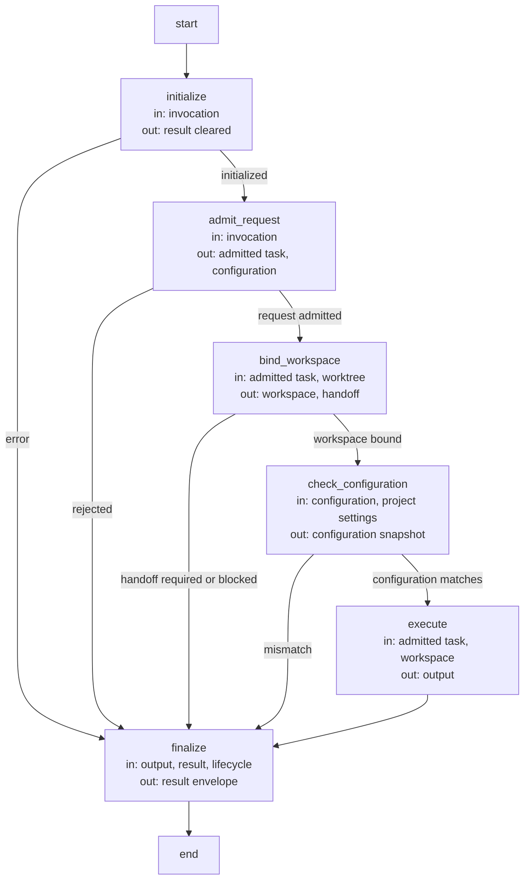
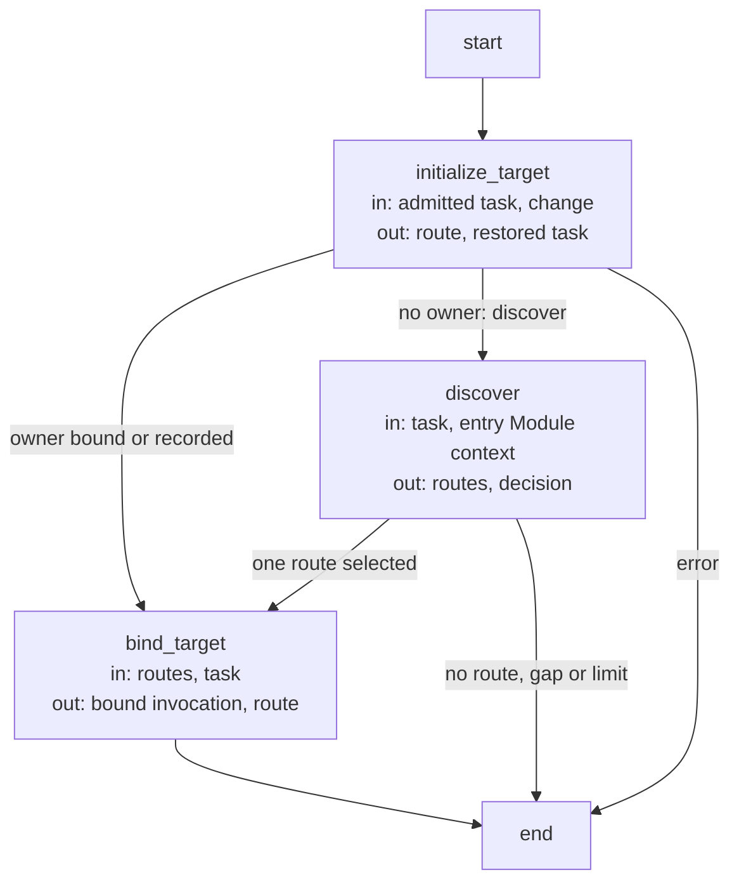
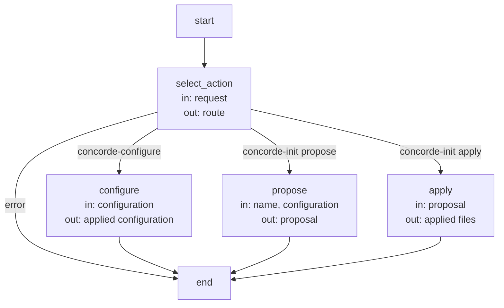
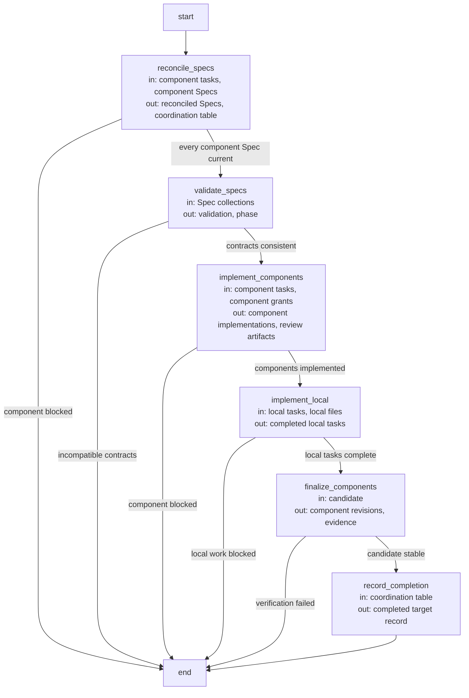
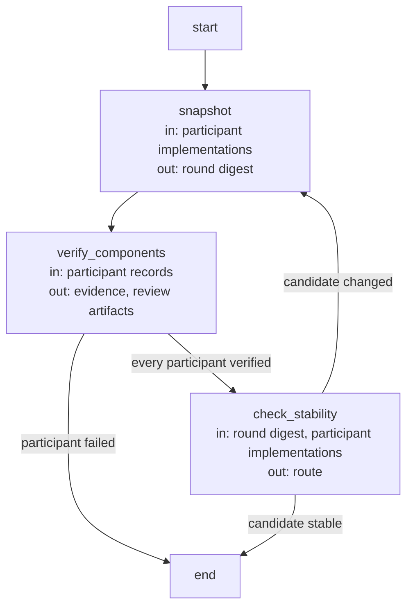

# Development host Flows

## Design

The Development host executes every capability invocation as LangGraph Flows. The six Flows
below are its own: admission, dispatch, target admission, project initialization and
configuration, component coordination and shared-candidate stabilization. The composed Flows they
dispatch to (discovery, query, topology, planning, specification, development and issues) are
specified by their owning Modules. Each Flow Spec follows the
[Flow Spec convention](../harness/graphs-and-loops.md): nodes execute, edges route, and node
labels state the state read and written. Every diagram is bound to its compiled Flow by
`%% flow:` and kept equal to it by the configured Flow Spec check.

### Capability admission Flow (`capability_flow`)

State: `invocation` (the admitted `concorde-capability-invocation@3`), `result` (the
`concorde-capability-result@3` envelope, filled by `finalize` or by a guard that caught an
error), `policies` and `events` (the host's policy descriptions and observed events, Studio only),
`expected_workspace`. Every node runs under a guard: an error records the typed failure envelope
in `result` and routes to `finalize`.

| Node | Executes | in | out |
| --- | --- | --- | --- |
| `initialize` | Deterministic: fresh host identity, root invocation id and lifecycle record for this invocation. | invocation | result (cleared) |
| `admit_request` | Deterministic: capability name, mode, configuration and request are validated against the registered contracts; a stale build is refused for model-backed capabilities. | invocation | admitted task, configuration |
| `bind_workspace` | Deterministic: primary, change or unversioned workspace identity; a mutating primary request prepares a candidate worktree and returns the P10 handoff. | admitted task, worktree | workspace, handoff |
| `check_configuration` | Deterministic: the invocation configuration equals the initialized project settings and the host snapshot. | configuration, project settings | configuration snapshot |
| `execute` | The dispatch Flow (below) as a subflow. | admitted task, workspace | output |
| `finalize` | Deterministic: status from the output outcome or the recorded error, execution-error propagation, lifecycle progress. | output, result, lifecycle | result |

### Capability dispatch Flow (`dispatch_flow`)

State: `route` (the leaf or subflow selected for the admitted capability), `output` (the
capability's typed response), `result`. The Studio and CLI build one dispatch Flow per public
capability; the diagram shows the complete dispatch topology every entry compiles from.

| Node | Executes | in | out |
| --- | --- | --- | --- |
| `select_capability` | Deterministic: the admitted capability selects its entry leaf or target admission. | admitted task | route |
| `prepare_target` | The target admission Flow (below) as a subflow: binds or discovers the owning Module and selects the bound leaf. | admitted task, change | route, bound invocation |
| `deliver` | Deterministic: worktree delivery under the repository lock. | change, worktrees | delivery receipt |
| `project` | The project Flow (below): initialization proposal or application, or configuration. | request | proposal or applied files |
| `answer` | The query Flow with the answerer. | question, Module contexts | answer |
| `design_topology` | The query Flow with the topology-designer. | task, Module contexts, registry | topology design |
| `prepare_topology` | The topology preparation Flow. | accepted design | prepared application |
| `apply_topology` | The topology application Flow. | prepared application | applied topology |
| `review` | Deterministic scope over Review invocations: owner and changed-file peers. | bound target, changes | review results |
| `describe_policy` | Deterministic: the exact grants each stage would receive, without launching an Agent. | bound target | policy descriptions |
| `issues` | The Issue management and solving Flow. | bound target, selected Issue | Issue result |
| `specify` | Spec Authoring: one spec-author invocation and the affected-consumer reviews. | bound target, Spec context | replaced Spec documents |
| `plan` | The planning Flow. | bound target, Spec context | plan |
| `tasks` | One task-author invocation and task admission. | plan, reserved ids, review feedback | tasks |
| `implement` | One programmer `implementation` invocation, or component coordination. | tasks, implementation files | completed tasks |
| `validate` | Deterministic checks and readiness gates for the candidate. | candidate | checks, readiness |
| `development_loop` | The development Flow. | bound target, change | ready candidate or stop |
| `specify_loop` | The specification Flow. | bound target, change | Spec completion |
| `context_solve` | One context-assessor invocation. | bound target, Spec context | sufficiency or gaps |

```mermaid
flowchart TB
    %% flow: dispatch_flow
    accTitle: Capability dispatch Flow
    accDescr: The admitted capability selects one entry leaf, or target admission first and then one bound leaf; every leaf ends the Flow with its typed output.
    __start__["start"]
    select_capability["select_capability<br/>in: admitted task<br/>out: route"]
    prepare_target["prepare_target<br/>in: admitted task, change<br/>out: route, bound invocation"]
    deliver["deliver<br/>in: change, worktrees<br/>out: delivery receipt"]
    project["project<br/>in: request<br/>out: proposal or applied files"]
    answer["answer<br/>in: question, Module contexts<br/>out: answer"]
    design_topology["design_topology<br/>in: task, Module contexts, registry<br/>out: topology design"]
    prepare_topology["prepare_topology<br/>in: accepted design<br/>out: prepared application"]
    apply_topology["apply_topology<br/>in: prepared application<br/>out: applied topology"]
    review["review<br/>in: bound target, changes<br/>out: review results"]
    describe_policy["describe_policy<br/>in: bound target<br/>out: policy descriptions"]
    issues["issues<br/>in: bound target, selected Issue<br/>out: Issue result"]
    specify["specify<br/>in: bound target, Spec context<br/>out: replaced Spec documents"]
    plan["plan<br/>in: bound target, Spec context<br/>out: plan"]
    tasks["tasks<br/>in: plan, reserved ids, review feedback<br/>out: tasks"]
    implement["implement<br/>in: tasks, implementation files<br/>out: completed tasks"]
    validate["validate<br/>in: candidate<br/>out: checks, readiness"]
    development_loop["development_loop<br/>in: bound target, change<br/>out: ready candidate or stop"]
    specify_loop["specify_loop<br/>in: bound target, change<br/>out: Spec completion"]
    context_solve["context_solve<br/>in: bound target, Spec context<br/>out: sufficiency or gaps"]
    __end__["end"]
    __start__ --> select_capability
    select_capability -->|concorde-deliver| deliver
    select_capability -->|concorde-init or concorde-configure| project
    select_capability -->|concorde-main ask| answer
    select_capability -->|concorde-main design-topology| design_topology
    select_capability -->|concorde-main accept-topology| prepare_topology
    select_capability -->|concorde-main apply-topology| apply_topology
    select_capability -->|target-bound capability| prepare_target
    select_capability -->|error| __end__
    prepare_target -->|concorde-review| review
    prepare_target -->|describe-policy mode| describe_policy
    prepare_target -->|concorde-issues| issues
    prepare_target -->|concorde-specify| specify
    prepare_target -->|concorde-plan| plan
    prepare_target -->|concorde-tasks| tasks
    prepare_target -->|concorde-implement| implement
    prepare_target -->|concorde-validate| validate
    prepare_target -->|concorde-dev-loop| development_loop
    prepare_target -->|concorde-specify-loop| specify_loop
    prepare_target -->|concorde-context-solve| context_solve
    prepare_target -->|blocked or error| __end__
    deliver --> __end__
    project --> __end__
    answer --> __end__
    design_topology --> __end__
    prepare_topology --> __end__
    apply_topology --> __end__
    review --> __end__
    describe_policy --> __end__
    issues --> __end__
    specify --> __end__
    plan --> __end__
    tasks --> __end__
    implement --> __end__
    validate --> __end__
    development_loop --> __end__
    specify_loop --> __end__
    context_solve --> __end__
```

### Target admission Flow (`target_flow`)

State: `route`, `occurrence`, `routes` and `decision` (the discovery subflow's counters and
routed selection), `output`, `result`.

| Node | Executes | in | out |
| --- | --- | --- | --- |
| `initialize_target` | Deterministic: a recorded change restores its owner and intent; a trusted routed target is checked against the request; an unbound discovering capability enters discovery. | admitted task, change | route, restored task |
| `discover` | The discovery Flow as a subflow (the router). | task, entry Module context | routes, decision |
| `bind_target` | Deterministic: the single route or restored owner binds the candidate, and the bound leaf is selected. | routes, task | bound invocation, route |

### Project Flow (`project_flow`)

State: `route`, `output`, `result`.

| Node | Executes | in | out |
| --- | --- | --- | --- |
| `select_action` | Deterministic: the capability and action select one deterministic operation; describe-policy is refused because proposals are the preview. | request | route |
| `configure` | Deterministic: writes the typed capability configuration into the project settings. | configuration | applied configuration |
| `propose` | Deterministic: the initialization proposal with its base digest and files. | name, configuration | proposal |
| `apply` | Deterministic: applies an unchanged proposal atomically. | proposal | applied files |

### Component coordination Flow (`coordination_flow`)

State: `output` (a blocking result, or none while the Flow advances), `route`; the candidate's
target record carries the coordination table (per component: task, Spec and implementation
status, digests, gaps) and the local task list. A composite Module's implementation runs this
Flow when its tasks name submodules or used Modules.

| Node | Executes | in | out |
| --- | --- | --- | --- |
| `reconcile_specs` | Sequential work items: each component runs `concorde-specify` from its own contract until its Spec is current. | component tasks, component Specs | reconciled Specs, coordination table |
| `validate_specs` | Deterministic repository validation across every participant's contract. | Spec collections | validation, phase |
| `implement_components` | Sequential work items: each component runs its own development Flow (`specify=false`) in this candidate. | component tasks, component grants | component implementations, review artifacts |
| `implement_local` | One programmer `implementation` invocation for the composite's own tasks. | local tasks, local files | completed local tasks |
| `finalize_components` | The stabilization Flow (below): every participant's final checks and reviews until the shared candidate is stable. | candidate | component revisions, evidence |
| `record_completion` | Deterministic: tasks marked complete, component revisions and implementation digest recorded. | coordination table | completed target record |

### Shared candidate stabilization Flow (`stabilization_flow`)

State: `output`, `route`; the enclosing coordination holds the participant set and a bounded
remaining-round counter, because a later participant's repair can stale an earlier participant's
evidence.

| Node | Executes | in | out |
| --- | --- | --- | --- |
| `snapshot` | Deterministic: digest of every participant's implementation before this round; an exhausted round budget fails. | participant implementations | round digest |
| `verify_components` | Sequential work items: each participant's final development Flow (`specify=false`, `finalize_components`) runs its checks and required reviews. | participant records | evidence, review artifacts |
| `check_stability` | Deterministic: the candidate digest after verification equals the round digest. | round digest, participant implementations | route |

