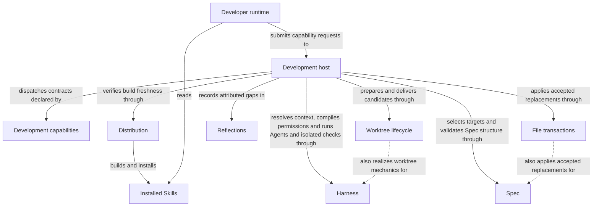

```concorde-document
{
  "id": "document.development.module",
  "targets": [
    "module.development"
  ],
  "main_visible": true
}
```

# Development

## Purpose

Development provides the capability invocation boundary and the deterministic host adapter that Concorde's own tooling runs on: capability admission and dispatch, the coordinator that answers questions and evolves project topology, the development graph that carries one intended change from an authored Spec to a ready candidate, deterministic validation, and delivery. It serves developers and their external agent runtimes submitting requests through installed `concorde-*` Skills, and every other Concorde capability that composes through this same boundary. Its promises end at a ready, delivered or primary-merged candidate; it relies on Harness to run every Agent invocation and isolate configured checks, Spec to resolve and validate project Specs, Reflections to retain gap history, and Distribution to own, build, install and verify instruction projections, including Skills.

## Requirements

### req.development.global-discovery — Coordinator discovers complete Module contexts

A global capability's own coordinator SHALL discover complete Module Spec contexts.

### req.development.stage-no-reselect — Stage capabilities never reselect their context

A stage capability SHALL NOT reselect or expand the frozen context its composing capability gave it.

### req.development.langgraph-control-flow — Control flow is a LangGraph graph

Every capability's control flow SHALL be a LangGraph graph of deterministic steps and Agent
invocations.

### req.development.no-implementation-for-non-code — No implementation contents for non-code phases

A planner, task author or Spec-only reviewer SHALL NOT receive the contents of this Module's or any
other Module's listed implementation files.

### req.development.explicit-skip-sticky — Review skips cannot cancel required reviews

A `run_reviews=false` retry SHALL NOT cancel a Spec or code review already required for this change
by an earlier enabled invocation.

### req.development.single-boundary — Every invocation passes through the host adapter

Every capability invocation SHALL pass through this Module's host adapter, with no direct
agent-to-agent channel bypassing it.

### req.development.distinct-outcomes — Results distinguish admission, domain and execution outcomes

A capability result SHALL distinguish admission, domain and execution outcomes instead of collapsing
them into one generic failure.

### req.development.stage-no-skill — Stage capabilities have no installed Skill

A stage capability SHALL have no installed Skill.

### req.development.stage-in-process-only — Stage capabilities are reachable only in-process

A stage capability SHALL be reachable only in-process from a capability that declares it in its
composition.

### req.development.routing-hint-not-context — Routing hints only steer selection

A target or focus hint SHALL only steer selection.

### req.development.routing-hint-no-grant — Routing hints never grant context

A target or focus hint SHALL NOT itself grant context or replace explicit resolution.

### req.development.repair-edge-only — Code-review repair is the only automatic edge

`review_code -> tasks` SHALL be the development graph's only automatic revision edge.

### req.development.non-repair-stops-graph — Other outcomes stop the graph for a decision

Every other non-successful outcome SHALL stop the graph for a human decision or an explicit Spec or
code change.

### req.development.shared-document-agreement — Shared documents require identical bytes to apply

A document referenced by several candidate targets SHALL be applied only when every referencing
target's author returns identical bytes for it.

### req.development.single-primary-writer — Only one agent writes to primary

At most one agent SHALL own writes in the primary worktree at a time.

### req.development.check-isolation — Configured checks use enforced read-only execution

Development SHALL execute configured checks through Harness's OS-enforced project-read-only executor.

### req.development.primary-writes-serialized — Repository lock serializes primary writes

The host SHALL serialize shared lifecycle writes and final primary merges with the repository lock.

## Scenarios

Scenarios below are grouped by capability. The registered companion documents work out the exact wire shapes and mechanics they reference: [interfaces](interfaces.md) (the wire contracts, error codes and capability boundary), [capabilities](capabilities.md) (the capability registry), [query-and-routing](query-and-routing.md) (the query and routing graph), [development](development.md) (the development graph and its repair edge), [topology](topology.md) (the topology evolution graph), [review-and-gaps](review-and-gaps.md) (the review contract and gap handling) and [delivery](delivery.md) (branch publication and primary merging).

Capability execution and the worktree boundary:

### scenario.development.execute-capability — Successful capability execution

- GIVEN an installed `concorde-*` Skill names one registered global or lifecycle capability
- AND stdin carries a well-formed `concorde-capability-invocation@3` envelope in `execute` mode
- WHEN the host admits the request
- THEN it selects the capability's declared execution graph and obtains every Agent invocation it needs, bound to current instructions, context and compiled authority, from Harness
- AND it returns a `concorde-capability-result@3` with status `succeeded` and the capability's own typed output

See [single boundary](#req.development.single-boundary) and [distinct outcomes](#req.development.distinct-outcomes).

### scenario.development.execute-unregistered — Unregistered or private capability refused

- GIVEN a `capability_id` that names no registered Skill, or a stage capability invoked directly instead of through its composing capability
- WHEN the host admits the request
- THEN it refuses the request with `unknown_capability`
- AND no Agent is launched and no project file changes

See [stage capabilities have no installed Skill](#req.development.stage-no-skill) and
[stage capabilities are reachable only in-process](#req.development.stage-in-process-only).

### scenario.development.execute-blocked-launch — Stale build or unenforceable permission blocks launch

- GIVEN the recorded build manifest no longer matches its sources, or the compiled policy for the bound Agent cannot be enforced by the current integration
- WHEN the host would otherwise launch an Agent for an admitted request
- THEN it blocks the request with `stale_build` or the applicable permission error before any process starts
- AND any existing candidate is preserved unchanged

### scenario.development.describe-policy — Preview a capability's grants without executing it

- GIVEN a request with `mode: describe-policy`
- WHEN the host processes it
- THEN it returns status `described`, naming the bound Agent, Harness, `agent_binding_digest`, `instructions_digest` and effective loop timeout for each previewed stage
- AND no Agent is launched and no project file changes

### scenario.development.worktree-handoff — Mutating request in the primary worktree hands off

- GIVEN a mutating capability request is admitted while the current session's worktree is the primary worktree
- WHEN the host would otherwise start development work there
- THEN it creates an isolated worktree from the committed HEAD and returns `worktree_handoff_required` with its path, branch, base commit and change_id
- AND it does not copy uncommitted primary changes or continue the originating session in the new worktree
- AND the error carries a complete Framework execution profile P10 prompt with real worktree identity, the submitted task and constraints, and the current preparation and check status

Answering questions and routing:

### scenario.development.answer-question — Direct answer from selected Module contexts

- GIVEN a question with an optional target or focus routing hint
- WHEN `concorde-main` runs with `action: ask`
- THEN the host deterministically resolves the explicitly selected Modules' complete Spec contexts, injects each selected Module's original document bodies once into the coordinator, and the coordinator returns a direct answer
- AND the response contains no authored project file changes

See [routing hints only steer selection](#req.development.routing-hint-not-context) and
[routing hints never grant context](#req.development.routing-hint-no-grant).

### scenario.development.answer-gap — Missing promise reported as a Spec gap

- GIVEN the coordinator's selected complete Module contexts do not contain a promise the question needs
- WHEN the coordinator would otherwise have to guess or consult an unselected source
- THEN the response reports a Spec gap naming the blocked question, the owning Module and the current context identity
- AND the coordinator does not read implementation files or search code to supply the missing meaning

### scenario.development.discovery-limit — Discovery stops at its declared limit

- GIVEN repeated context expansion has not resolved the question
- WHEN the coordinator's bounded expansion-step limit is reached
- THEN the host returns the `context_limit` outcome instead of expanding context further

Developing one change:

### scenario.development.dev-loop-ready — A change reaches a ready candidate

- GIVEN a developer supplies one intended change with its task and constraints
- WHEN `concorde-dev-loop` runs Spec authoring (unless `specify=false`), Spec review, planning, tasks, implementation, deterministic checks and code review in order
- THEN every stage completes successfully and the candidate reaches status `ready` with current evidence for every affected Module
- AND the loop stops there and never itself invokes delivery

### scenario.development.dev-loop-spec-gap — Development waits for a necessary Spec repair

- GIVEN a stage discovers a necessary missing or ambiguous contract
- WHEN that stage reports a Spec gap
- THEN the loop stops with status `waiting` and preserves the candidate worktree
- AND unrelated independent work may continue, and resuming after an explicit Spec repair does not repeat already-accepted authoring for the same task, focus and constraints

### scenario.development.dev-loop-repair — Bounded automatic repair after blocking code review

- GIVEN a code-owning target's code review returns blocking findings
- WHEN the loop selects its automatic revision edge from code review back to task authoring
- THEN task authoring receives the current completed tasks and the blocking `concorde-review-result@1` as `stage_inputs`, and the resulting repair tasks and their implementation are checked and code-reviewed again like any other change
- AND this repair is bounded by the target's declared `max_repair_iterations` policy

See [code-review repair is the only automatic edge](#req.development.repair-edge-only) and
[other outcomes stop the graph for a decision](#req.development.non-repair-stops-graph).

### scenario.development.dev-loop-repair-exhausted — Repeated feedback or an exhausted limit stops the loop

- GIVEN a repair attempt reproduces the same blocking-feedback fingerprint as the previous attempt, or the declared repair limit is exhausted
- WHEN the loop would otherwise select another automatic repair
- THEN it stops instead of retrying: unchanged feedback records status `waiting` and an exhausted limit records status `limit_exhausted`, and both keep the wire `outcome` `conflicting`
- AND a human directly changing the Spec or the implementation between invocations resets the recorded repair count instead of continuing a stale attempt

### scenario.development.dev-loop-coordinated — A Module coordinates its own and dependency tasks

- GIVEN a Module task has both local code tasks and separately bound submodule or used-Module tasks
- WHEN implementation runs
- THEN each component is specified, planned and implemented from its own complete Module contract and the files its own entries bind, and the coordinator waits for every writer, including its own coordination code, before checking the final candidate
- AND a repair that changes a file listed by several Modules invalidates the already-recorded evidence of every listing Module, and finalization repeats until every participant is stable

Evolving topology:

### scenario.development.topology-design — Design a candidate registry

- GIVEN a change to identities, composition, dependencies, document membership or file listings
- WHEN `concorde-main` runs `design-topology`
- THEN it admits exact registry metadata and the Module kind definition, withholds implementation file contents, and returns a digest-bound candidate registry, local Spec tasks, migration constraints and acceptance conditions
- AND no project file changes

### scenario.development.topology-accept — Accept a design and author local Specs

- GIVEN a developer accepts a topology design
- WHEN `concorde-main` runs `accept-topology`
- THEN it rechecks the complete discovery context, starts a fresh target-local Spec author for each affected Module, and validates their combined output against an in-memory registry and document overlay
- AND the full authored documents are stored only in a before-digest-bound application artifact, and the public response exposes only its ArtifactRef

### scenario.development.topology-apply — Apply a reviewed artifact

- GIVEN a developer accepts the exact prepared application artifact
- WHEN `concorde-main` runs `apply-topology`
- THEN it atomically applies the reviewed registry and document replacements together
- AND successful application updates the accepted structure and sources in the same transaction

### scenario.development.topology-stale — Stale or conflicting input is rejected

- GIVEN the registry, Protocol or a candidate's shared document bytes changed since the design was produced, or two candidate authors return different bytes for the same shared document
- WHEN `accept-topology` or `apply-topology` processes that input
- THEN the host rejects the mutation and leaves the pre-existing project files unchanged
- AND no target author ever writes a project file directly

See [shared documents require identical bytes to apply](#req.development.shared-document-agreement).

Validating a candidate:

### scenario.development.validate-ready — Deterministic checks record readiness

- GIVEN the current candidate
- WHEN `concorde-validate` runs
- THEN the host runs deterministic Spec validation and every configured implementation check of every affected Module, and records readiness evidence bound to the exact candidate bytes
- AND validation never claims semantic completeness

### scenario.development.validate-blocked — A failed or stale check blocks readiness

- GIVEN a configured implementation check fails, is missing, or its previously recorded evidence no longer matches the current candidate bytes
- WHEN readiness is evaluated
- THEN the candidate is not recorded ready and the failing or stale check is reported

### scenario.development.validate-check-isolation — Checks cannot write their inputs or host logs

- GIVEN a configured implementation check and the current candidate
- WHEN validation runs the check
- THEN project writes, including writes to lifecycle records and logs, are denied by Harness
- AND the outside host saves private stdout/stderr and records passed, failed or timeout evidence with exit and digest identities
- AND unavailable enforcement blocks readiness with check_sandbox_unavailable while raw diagnostics stay in the host log
- AND check input, candidate tree and affected Module freshness checks still reject external changes

Delivering a ready change:

### scenario.development.deliver-branch — Publish an independent delivery branch

- GIVEN a ready change selected by `change_id`, requested from its source or the primary worktree
- WHEN `concorde-deliver` runs
- THEN the host verifies participation, candidate evidence and actual integration, then publishes an independent `concorde/delivered/<change_id>` branch and removes the source worktree unless `keep_worktree:true`
- AND default delivery leaves the primary branch, index and project files unchanged

### scenario.development.deliver-merge-primary — Explicit primary merge

- GIVEN an already delivered receipt and an explicit user-authorized `merge_primary:true` request from the primary worktree's owning session
- WHEN the host processes that request
- THEN it verifies current integration against the latest primary commit and merges the delivered branch, recording its own commit, tree and checks separately from staging evidence
- BUT a generic delivery request without `merge_primary:true` never merges into the primary branch

See [only one agent writes to primary](#req.development.single-primary-writer) and
[repository lock serializes primary writes](#req.development.primary-writes-serialized).

### scenario.development.deliver-session-rejected — Delivery refused from an unrelated worktree

- GIVEN a session whose worktree is neither the change's selected source nor the primary worktree
- WHEN it requests delivery or final merging for that change
- THEN the host refuses it with `delivery_session_required` or `primary_session_required`
- AND no branch is published or merged

### scenario.development.deliver-conflict — Integration conflict blocks final merge

- GIVEN the candidate's actual integration against the latest primary commit fails its configured checks or conflicts
- WHEN final merging runs
- THEN the host blocks the merge with `merge_conflict` or `failed_merge_checks`, preserves the delivered branch, and leaves the primary branch, index and project files unchanged

## Ontology

This Module's Ontology sets out the programs behind the host adapter, the mechanics it shares with
other Modules, and the four Modules it depends on directly, together with how they connect.

### Entities

Two programs realize this Module's own code: the host adapter and the capability declarations that expose it. Two shared programs realize mechanics also listed by other Modules. Four used-Module entities name the direct dependencies this Module relies on. The host adapter lists the `src/concorde/development/` and `tests/concorde/development/` package directories; files shared with another Module stay exact entries here and there. Installed Skills are external instruction artifacts supplied by Distribution and read by the developer's runtime, which submits capability requests to this Module.

```concorde-entities
[
  {
    "id": "entity.development.development-host",
    "title": "Development host",
    "kind": "program",
    "responsibility": "Realize capability admission and dispatch, the global discovery loop, the development graph with its bounded repair edge, topology preparation and application, review evidence and candidate readiness.",
    "files": [
      "src/concorde/development/",
      "tests/concorde/development/",
      "tests/concorde/support/capability_json.py"
    ]
  },
  {
    "id": "entity.development.development-capabilities",
    "title": "Development capabilities",
    "kind": "program",
    "responsibility": "Declare the Development Module's global, lifecycle and stage capability contracts and their host composition; Distribution supplies the Skills that expose public entries.",
    "files": [
      "capabilities/context_solve.py",
      "capabilities/deliver.py",
      "capabilities/dev_loop.py",
      "capabilities/implement.py",
      "capabilities/main.py",
      "capabilities/plan.py",
      "capabilities/review.py",
      "capabilities/specify.py",
      "capabilities/tasks.py",
      "capabilities/validate.py"
    ]
  },
  {
    "id": "entity.development.worktree-lifecycle",
    "title": "Worktree lifecycle",
    "kind": "shared program",
    "responsibility": "Realize shared worktree identity, candidate state, session handoff and delivery mechanics for its two Module consumers.",
    "files": [
      "src/concorde/harness/change_worktree.py",
      "src/concorde/harness/session_handoff.py",
      "src/concorde/harness/worktree.py",
      "src/concorde/harness/worktree_delivery.py",
      "tests/concorde/harness/test_change_worktree.py",
      "tests/concorde/harness/test_scoped_protocol.py",
      "tests/concorde/harness/test_session_handoff.py",
      "tests/concorde/harness/test_worktree_boundary.py",
      "tests/concorde/harness/test_worktree_lifecycle.py"
    ]
  },
  {
    "id": "entity.development.file-transactions",
    "title": "File transactions",
    "kind": "shared program",
    "responsibility": "Realize exact replacement proposals as staged filesystem operations with before-digest checks and original-byte recovery, for every Module that applies an accepted proposal.",
    "files": [
      "src/concorde/spec/changes.py"
    ]
  },
  {
    "id": "entity.development.harness",
    "title": "Harness",
    "kind": "used module",
    "target_id": "module.harness",
    "responsibility": "Configure and run every Agent invocation: freeze context, bind definitions, compile permissions and execute natively; also isolate configured deterministic checks with OS-enforced project read-only access and external scratch."
  },
  {
    "id": "entity.development.spec",
    "title": "Spec",
    "kind": "used module",
    "target_id": "module.spec",
    "responsibility": "Own the project Spec model: the pinned Protocol binding, the explicit registry, structural validation, stable-ID file-set queries and honest initialization."
  },
  {
    "id": "entity.development.reflections",
    "title": "Reflections",
    "kind": "used module",
    "target_id": "module.reflections",
    "responsibility": "Retain, investigate and resolve explicitly attributed project feedback and persistent gaps."
  },
  {
    "id": "entity.development.distribution",
    "title": "Distribution",
    "kind": "used module",
    "target_id": "module.distribution",
    "responsibility": "Own Skill sources and invocation instructions, build and install their external-runtime projections, verify build freshness and provision the managed runtime."
  },
  {
    "id": "entity.development.installed-skills",
    "title": "Installed Skills",
    "kind": "external artifact",
    "responsibility": "Instruction artifacts supplied by Distribution that tell the developer's runtime how to submit typed requests to public capabilities; they are not worker context or execution authority."
  },
  {
    "id": "entity.development.developer-runtime",
    "title": "Developer runtime",
    "kind": "external actor",
    "responsibility": "The developer's Codex or Claude session that reads installed Skills and submits capability requests to the Development host."
  }
]
```

### Relationships

A capability is global, lifecycle or stage. A global capability's own coordinator discovers complete Module Spec contexts and may span several targets and stages; a lifecycle capability is deterministic host behavior with no agent cognition; a stage capability receives an already bound target and one frozen context from its composing capability and never reselects or expands it. Development capabilities is the code inventory of capability contracts and composition. Distribution supplies installed Skills to the external developer runtime, which reads their instructions and submits requests. Development host admits, dispatches, coordinates and completes those requests, and prepares, evolves and finalizes the candidate worktree that carries one change's progress, gaps and evidence.

A candidate owns its own component progress, gaps and evidence, and reviews refer to the exact candidate inputs they assessed. A code defect can select the bounded task/implementation repair edge; a necessary contract gap waits for a Spec revision instead. Finalization includes every Module that lists an affected shared file. Readiness, authorized delivery and primary merging are separate completion states.



## Dependencies and composition

Development's sole structural parent is `module.concorde`; it has no submodules of its own. It uses four Modules directly.

```concorde-dependencies
[
  {
    "target_id": "module.harness",
    "responsibility": "Freeze context kinds, bind Agents, compile permissions, execute invocations and isolate configured checks.",
    "selection_condition": "When a capability graph reaches an Agent invocation, policy preview or configured deterministic check.",
    "relied_upon_promises": [
      "A stage receives exactly its frozen context kinds and compiled authority, and only a matching typed completion with enforcement evidence is returned; nothing retries with wider permissions.",
      "A recursive delegation tree shares finite budgets and cancellation and returns only typed results.",
      "Configured checks and descendants cannot mutate project files; they receive independent external scratch and host-only output, terminate before cleanup and fail closed when enforcement is unavailable."
    ]
  },
  {
    "target_id": "module.spec",
    "responsibility": "Select Module descriptors, documents and implementation bindings, and validate Spec structure.",
    "selection_condition": "When routing, binding a target, deriving affected implementation users or recording validation evidence.",
    "relied_upon_promises": [
      "Selection and the reverse index identify every affected Module deterministically, and structural validation reports invalid state with a source digest without proving semantics."
    ]
  },
  {
    "target_id": "module.reflections",
    "responsibility": "Retain explicitly captured development gaps and reports.",
    "selection_condition": "When a developer explicitly records gaps from a change's history.",
    "relied_upon_promises": [
      "Recording a gap creates or reuses a durable link without resolving the gap or starting work."
    ]
  },
  {
    "target_id": "module.distribution",
    "responsibility": "Own and distribute the public Skill instruction surface, render package projections and report build freshness.",
    "selection_condition": "When a developer runtime uses an installed Skill, an invocation requires fresh projections, or delivery verifies an integrated checkout.",
    "relied_upon_promises": [
      "Every global or lifecycle capability has exactly one public Skill that instructs the external runtime to submit its declared typed request; stage capabilities have no public Skill.",
      "Skill sources and shared invocation instructions belong to Distribution and never become a Concorde Agent's Harness inputs.",
      "Rendering a merged checkout's own sources before validation is deterministic and a build failure prevents the primary update."
    ]
  }
]
```

## Unresolved information

Two boundaries are known but not yet realized in code; they were already recorded before this
Module's realizations were folded into entity file listings, and are repeated here rather than
newly discovered. `capability_host.py` still contains invocation-binding mechanics (the freeze, compile, render, launch, execute and validate sequence of `Invocation.stage` and `MainInvocation.stage`) that belong to the Harness Module's own host contract; extracting them into a Harness-owned realization is pending. Only the development loop (`concorde-dev-loop`) currently runs as a LangGraph `StateGraph`; the discovery loop, the topology graph, the lifecycle capabilities and the reflections-triage composition still run as plain Python control flow and must move onto `StateGraph` composition to satisfy req.development.langgraph-control-flow. Neither gap changes this Module's promises; both are implementation work tracked against the entities above rather than open Spec questions.
