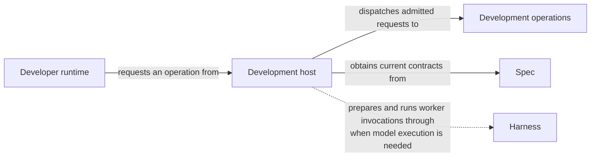

# Development operation host

## Purpose

Development is the common host through which Concorde operations are requested and run. It checks requests, selects the allowed operation and workspace, and records accepted results. Individual providers decide what their operation means; workflows decide how those operations form a larger task.

## Terminology

| Term | Meaning / definition |
| --- | --- |
| Public operation | An operation developers may invoke directly through a Skill or the public launcher. |
| Internal operation | An operation available only to declared composing operations, rather than a direct developer entry. |
| [Operation](../module.md#terminology) | Defined in Concorde Framework. |
| [Host](../module.md#terminology) | Defined in Concorde Framework. |
| [Graph](../module.md#terminology) | Defined in Concorde Framework. |
| [Skill](../module.md#terminology) | Defined in Concorde Framework. |
| [Worker](../module.md#terminology) | Defined in Concorde Framework. |
| [Candidate](../module.md#terminology) | Defined in Concorde Framework. |
| [Worktree](../module.md#terminology) | Defined in Concorde Framework. |
| [Ready](../module.md#terminology) | Defined in Concorde Framework. |
| [Evidence](../module.md#terminology) | Defined in Concorde Framework. |
| [Issue](../module.md#terminology) | Defined in Concorde Framework. |

## Usage

A developer invokes a public operation through its Skill or the common launcher. The host checks
the request and current workspace, then runs the selected provider or workflow. Internal operations
are available only to declared composing callers, not simply because someone knows their name.

For example, a standalone review and a development request use the same admission boundary, but
review returns findings while development may create a candidate. A successful host response must
still be read for the operation's result: answered, ready, blocked or another declared outcome.

Mutating work requested from primary runs in an isolated candidate the host creates from the
committed base: the request is relayed to that candidate's own launcher and its result returned,
while the requesting session stays where it is. Uncommitted primary edits are not silently carried
into it. Resuming preserves the saved task and workspace identity; incompatible input is rejected
rather than applied to another change. [Operations](operations.md) explains the public/internal distinction and [coordination](graphs.md)
explains the host's part in the workflow. The exact invocation envelope belongs in Implementation Specs.

## Design

Installed Skills explain how the Developer runtime requests an operation. Development operations
are the executable operations to which the Development host dispatches admitted requests. An Operation
may run ordinary code, use a model, or compose other Operations through a Graph. Worktree lifecycle
keeps a candidate's identity and progress, and File transactions applies accepted edits with checks
against the original state. LangGraph makes the host's ordering and branching inspectable.

Separating admission from domain work prevents a model's proposed result from choosing its own
permissions. [Harness Module](../harness/module.md) prepares worker execution, [Spec Module](../spec/module.md) supplies current contracts, and [Issues Module](../issues/module.md) keeps
observations. The chosen provider owns its behavior; a composing workflow owns when that behavior
runs and when the larger task is complete. Shared runtime code does not merge those responsibilities.

## Relationships

This scoped conceptual view follows a request, not every declared dependency or internal record.
Each operation has its own input/result agreement and permitted composition. Some operations must
first discover the relevant Module; others receive an already selected owner; deterministic lifecycle
operations may need no worker at all. The host checks that choice instead of allowing a request to
select arbitrary context or authority.

[Distribution Module](../distribution/module.md) supplies the Skill instructions used by the developer's client. The Development host
checks and dispatches the resulting request to the selected Operation, obtaining current contracts
through Spec where needed. When that Operation or one of its composed steps requires model execution,
the host prepares and runs the worker invocation through Harness. It keeps candidate progress
available when an operation cannot finish.

The solid dispatch edge applies to admitted Operation requests; the dotted worker-execution edge
applies only when model execution is needed. A deterministic operation need not start a worker.
Harness also provides other services, such as isolated checks, which this worker-execution edge
does not represent.

Candidate sequencing, repairs and ready/stop policy belong to
[Development Graph](../dev-loop/module.md#usage); independent Spec preparation belongs to
[Specification Graph](../specify-loop/module.md#usage). Providers are linked in the
[operation inventory](operations.md) and can serve other declared callers under their contracts.

## Provider collaboration

Harness prepares workers and checks; Spec selects contracts; Distribution supplies current
instructions; Issues keeps observations. The host records results while each provider owns its
behavior and the selected workflow owns sequencing. A failure in one provider prevents dependent
progress rather than being rewritten as a successful result by the host.

The Module-owned [collaboration agreements](collaborations.md) state each provider’s conditions,
guarantees and local duties once. A dependency is not another structural parent or code grant.

## Unresolved information

`operation_host.py` still contains invocation-binding mechanics (the freeze, compile, render,
launch, execute and validate sequence of `Invocation.stage` and `MainInvocation.stage`) that belong
to the Harness Module's own host contract; extracting them into a Harness-owned realization is pending.

Operation admission and dispatch, query/discovery, topology authoring and application,
planning, development and component coordination, and Issue solving execute through compiled
Graph factories. Deterministic lifecycle operations are nodes in the same public operation Graph.
Batch authoring, review and finalization use bounded Graph composition. The remaining invocation-binding
ownership gap does not change this Module's promises.

## Precise specifications

The Development Module owns the exact obligations and interface details in [requirements](requirements.md), [scenarios](scenarios.md).
These companions are part of the same complete Module specification, not separate topic owners.
