# Development capability host

## Purpose

Development supplies the common capability invocation boundary, typed admission, dispatch and
host-owned state mechanics used by Concorde's providers and flows. It serves external runtimes and
declared composing capabilities. Providers own their individual semantics and sibling flows own
their sequencing and completion policies; this host does not make dev-loop a universal capability
precondition. Harness binds execution, Spec resolves contracts, Issues captures explicit gaps,
and Distribution supplies fresh instruction projections.

## Usage

Use this host boundary to submit a registered public capability from an external runtime, or to
compose a declared private capability from trusted host code. Run the project-relative
`scripts/run-capability.py <skill-name>` from the intended project root and send one schema-3
invocation on stdin. Select execute or describe-policy mode, provide the capability's typed request,
and use configuration matching the initialized project. The [boundary reference](interfaces.md)
defines the exact envelope, error vocabulary and output; the [inventory](capabilities.md) maps
entries to their behavioral owners.

A successful envelope does not mean every domain goal completed: inspect the typed outcome for an
answer, a gap, a ready candidate or another result. Policy preview launches no Agent. Private entries
have no direct CLI or Skill. Mutating work in primary normally returns a fresh-session handoff from
the committed base; it neither carries uncommitted edits nor moves the originating session.
Resumption must match recorded worktree identity and intent. The host admits and dispatches work;
the chosen provider or Flow, not this common boundary, defines its sequencing and completion.

## Design

Admission, workspace binding, configuration checks, dispatch and finalization execute through the
[host Flows](flows.md). The host selects or restores a target before any bounded provider stage,
then delegates context, permissions and execution to Harness. Results, artifact references and
gap histories are host-validated before persistence; model completion alone cannot advance state.
These boundaries realize the versioned-result and frozen-context guarantees above.

Capability declarations describe exposure and allowed composition, not Module ownership. The shared
host package still realizes provider and Flow internals whose contracts belong to siblings. Its
worktree lifecycle and file-transaction entities supply common mutation mechanics. Detailed local
collaborator obligations and the remaining invocation-binding extraction gap stay internal here.

Installed Skills belong to Distribution and instruct the external Developer runtime to submit typed requests. Development capabilities declare exposure and composition; the Development host dispatches those requests through LangGraph Graph-API Flows. Worktree lifecycle retains candidate identity and progress, while File transactions applies exact before-digest-bound replacements with recovery. These shared mechanisms do not transfer the sibling providers' contracts into the host.

## Relationships

Every entry is a Capability with independent public exposure, context selection, determinism and
composition properties. Discover context selection uses a discovery-phase worker (answerer, router
or topology-designer) to select complete Module contexts; bound context selection consumes an
already selected Module without expanding it; none
performs deterministic host work without Agent context selection. Public capabilities have Skills,
while non-public capabilities require declared in-process composition. Development capabilities is the code inventory of capability contracts and composition. Distribution supplies installed Skills to the external developer runtime, which reads their instructions and submits requests. Development host admits, dispatches, coordinates and completes those requests, and prepares, evolves and finalizes the candidate worktree that carries one change's progress, gaps and evidence.

Candidate sequencing, repairs and ready/stop policy belong to
[Development Flow](../dev-loop/development.md); independent Spec preparation belongs to
[Specification Flow](../specify-loop/specify-loop.md). Providers are linked in the
[capability inventory](capabilities.md) and can serve other declared callers under their contracts.

```mermaid
flowchart TB
    accTitle: Development entities and relationships
    accDescr: Distribution supplies Installed Skills, which the external Developer runtime reads before submitting capability requests to the Development host. Development capabilities declares the contracts the host dispatches. The host uses Harness for Agent execution, Spec for selection and validation, Issues for gap history and Distribution for fresh projections. Worktree lifecycle and File transactions realize shared mutation mechanics.
    developmentCapabilities["Development capabilities"]
    developmentHost["Development host"]
    worktreeLifecycle["Worktree lifecycle"]
    fileTransactions["File transactions"]
    harness["Harness"]
    spec["Spec"]
    issues["Issues"]
    distribution["Distribution"]
    installedSkills["Installed Skills"]
    developerRuntime["Developer runtime"]
    distribution -->|builds and installs| installedSkills
    developerRuntime -->|reads| installedSkills
    developerRuntime -->|submits capability requests to| developmentHost
    developmentHost -->|dispatches contracts declared by| developmentCapabilities
    developmentHost -->|prepares and delivers candidates through| worktreeLifecycle
    developmentHost -->|applies accepted replacements through| fileTransactions
    developmentHost -->|resolves context, compiles permissions and runs Agents and isolated checks through| harness
    developmentHost -->|selects targets and validates Spec structure through| spec
    developmentHost -->|records classified problems in| issues
    developmentHost -->|verifies build freshness through| distribution
    worktreeLifecycle -.->|also realizes worktree mechanics for| harness
    fileTransactions -.->|also applies accepted replacements for| spec
    module_planning["Planning"]
    developmentHost -->|uses| module_planning
    module_implementation["Implementation"]
    developmentHost -->|uses| module_implementation
    module_spec_authoring["Spec Authoring"]
    developmentHost -->|uses| module_spec_authoring
    module_review["Review"]
    developmentHost -->|uses| module_review
    module_validation["Validation"]
    developmentHost -->|uses| module_validation
    module_delivery["Delivery"]
    developmentHost -->|uses| module_delivery
    module_query_routing["Query and Routing"]
    developmentHost -->|uses| module_query_routing
    module_topology["Topology"]
    developmentHost -->|uses| module_topology
    module_dev_loop["Development Flow"]
    developmentHost -->|uses| module_dev_loop
    module_specify_loop["Specification Flow"]
    developmentHost -->|uses| module_specify_loop
    langgraph["LangGraph"]
    developmentHost -->|executes orchestration as Flows built with| langgraph
```

## Dependencies and composition

Development's sole structural parent is `module.concorde`; it has no submodules of its own. Its direct uses distinguish shared services, providers and composing flows.

### Harness

Configure and run every Agent invocation: freeze context, bind definitions, compile permissions and launch its Pi worker; also isolate configured deterministic checks with OS-enforced project read-only access and external scratch.

Freeze context kinds, bind Agents, compile permissions, execute invocations and isolate configured checks.

This collaboration applies when a capability Flow reaches an Agent invocation, policy preview or configured deterministic check.

- [Freeze and recheck each stage input](../harness/contracts.md#contract.context.selection)
- [Stop rather than widen rejected authority](../harness/requirements.md#req.harness.permission-no-widen)
- [Admit only matching typed completions and enforcement evidence](../harness/execution.md)
- [Preserve finite delegation budgets and cancellation](../harness/graphs-and-loops.md)
- [Require read-only checks and retain raw output privately](../harness/requirements.md#req.harness.check-project-read-only)

### Spec

Own the project Spec model: the pinned Protocol binding, the explicit registry, structural validation, stable-ID file-set queries and honest initialization.

Select Module descriptors, documents and implementation bindings, and validate Spec structure.

This collaboration applies when routing, binding a target, deriving affected implementation users or recording validation evidence.

- [Find every affected consumer before coordinating work](../spec/contracts.md#registry-stable-id-spec-context-queries)
- [Require source-bound structural evidence without claiming semantic proof](../spec/scenarios.md#scenario.spec.validate-success)

### Issues

Retain, investigate and resolve explicitly attributed project feedback and persistent gaps.

Retain explicitly captured development gaps and reports.

This collaboration applies when a developer explicitly records gaps from a change's history.

- [Persist classified observations without controlling work](../issues/scenarios.md#scenario.issues.reference)

### Distribution

Own Skill sources and invocation instructions, build and install their external-runtime projections, verify build freshness and provision the managed runtime.

Own and distribute the public Skill instruction surface, render package projections and report build freshness.

This collaboration applies when a developer runtime uses an installed Skill, an invocation requires fresh projections, or delivery verifies an integrated checkout.

- [Use canonical Skill/Agent projections and require a successful deterministic build before integration](../distribution/build.md)
- [Keep installed Skill sources outside bounded Agent context](../distribution/installation.md)

### Planning

Planning assesses whether a selected Module contract supports a task, creates a revision-bound plan and derives implementation acceptance tasks. It serves admitted composing capabilities with separate assessment, plan and task contracts; no development-loop history is an implicit source of software meaning.

This collaboration applies when the request concerns Planning.

- [Planning contract](../planning/assessment.md); preserve its admission conditions, retain distinct blockers and do not infer wider authority from composition.

### Implementation

Implementation fulfills an admitted task list within the selected Module implementation grant and reports exact task completion. It serves composing capabilities that supply current plans and tasks, and distinguishes local code writing from separately admitted component coordination.

This collaboration applies when the request concerns Implementation.

- [Implementation contract](../implementation/implementation.md); preserve its admission conditions, retain distinct blockers and do not infer wider authority from composition.

### Spec Authoring

Spec Authoring proposes complete replacements for the selected Module's owned Spec documents from its complete contract and an explicit task. It serves specification flows and other declared callers; independent review and flow completion belong to their consumers.

This collaboration applies when the request concerns Spec Authoring.

- [Spec Authoring contract](../spec-authoring/authoring.md); preserve its admission conditions, retain distinct blockers and do not infer wider authority from composition.

### Review

Review independently evaluates an admitted task against current Module contracts and, in code mode, its separately granted implementation. It serves standalone callers and composing flows with revision-bound coverage, findings and gaps, without repairing or delivering the reviewed work.

This collaboration applies when the request concerns Review.

- [Review contract](../review/review.md); preserve its admission conditions, retain distinct blockers and do not infer wider authority from composition.

### Validation

Validation collects deterministic structural and configured implementation-check evidence for the current candidate and evaluates the applicable readiness gates. It serves explicit validation requests and composing flows; neither a development plan nor dev-loop invocation is universally required.

This collaboration applies when the request concerns Validation.

- [Validation contract](../validation/validation.md); preserve its admission conditions, retain distinct blockers and do not infer wider authority from composition.

### Delivery

Delivery stages a verified candidate on an independent branch, cleans up its source worktree and separately merges into the primary branch when explicitly authorized. It serves participating outer sessions and consumes current evidence without owning the flow that produced the candidate.

This collaboration applies when the request concerns Delivery.

- [Delivery contract](../delivery/delivery.md); preserve its admission conditions, retain distinct blockers and do not infer wider authority from composition.

### Query and Routing

Query and Routing answers questions from explicitly selected complete Module contexts and selects one owning Module for a routed task. It serves the main entry and discovery consumers, preserving caller intent without reading implementation to infer behavior.

This collaboration applies when the request concerns Query and Routing.

- [Query and Routing contract](../query-routing/query-and-routing.md); preserve its admission conditions, retain distinct blockers and do not infer wider authority from composition.

### Topology

Topology designs, prepares and atomically applies changes to registered Module structure and owned definitions. It serves developers evolving ownership, references, dependencies and file bindings through the existing accepted design and application boundaries.

This collaboration applies when the request concerns Topology.

- [Topology contract](../topology/topology.md); preserve its admission conditions, retain distinct blockers and do not infer wider authority from composition.

### Development Flow

Development Flow composes sibling providers to carry one intended change through Spec preparation, planning, tasks, implementation, validation and independent code review to a ready candidate. It owns that sequence, candidate lifecycle, bounded repair and stop policy, while each provider owns its own reusable contract.

This collaboration applies when the request concerns Development Flow.

- [Development Flow contract](../dev-loop/development.md); preserve its admission conditions, retain distinct blockers and do not infer wider authority from composition.

### Specification Flow

Specification Flow composes routing, Spec Authoring and Review to prepare or review one Module contract independently of implementation. It owns Spec-stage ordering, accepted-authoring reuse and Spec-review completion, and returns before planning or readiness.

This collaboration applies when the request concerns Specification Flow.

- [Specification Flow contract](../specify-loop/specify-loop.md); preserve its admission conditions, retain distinct blockers and do not infer wider authority from composition.

## Unresolved information

`capability_host.py` still contains invocation-binding mechanics (the freeze, compile, render,
launch, execute and validate sequence of `Invocation.stage` and `MainInvocation.stage`) that belong
to the Harness Module's own host contract; extracting them into a Harness-owned realization is pending.

Capability admission and dispatch, query/discovery, topology authoring and application,
planning, development and component coordination, and Issue solving execute through compiled
Flow factories. Deterministic lifecycle operations are nodes in the same public capability Flow.
Batch authoring, review and finalization use bounded Flow composition. The remaining invocation-binding
ownership gap does not change this Module's promises.

## Precise specifications

The Development Module owns the exact obligations and interface details in [requirements](requirements.md), [scenarios](scenarios.md).
These companions are part of the same complete Module specification, not separate topic owners.
