# Development capability host

## Purpose

Development supplies the common capability invocation boundary, typed admission, dispatch and
host-owned state mechanics used by Concorde's providers and flows. It serves external runtimes and
declared composing capabilities. Providers own their individual semantics and sibling flows own
their sequencing and completion policies; this host does not make dev-loop a universal capability
precondition. Harness binds execution, Spec resolves contracts, Reflections captures explicit gaps,
and Distribution supplies fresh instruction projections.

## Usage

Use this host boundary to submit a registered public capability from an external runtime, or to
compose a declared private capability from trusted host code. Run the project-relative
`scripts/run-capability.py <skill-name>` from the intended project root and send one schema-3
invocation on stdin. Select execute or describe-policy mode, provide the capability's typed request,
and use configuration matching the initialized project. The [boundary reference](interfaces.md)
defines the exact envelope, error vocabulary and output; the [inventory](capabilities.md) maps
entries to their behavioral owners.

A successful envelope does not mean every domain goal completed: inspect the typed outcome for an
answer, a gap, a ready candidate or another result. Policy preview launches no Agent. Private entries
have no direct CLI or Skill. Mutating work in primary normally returns a fresh-session handoff from
the committed base; it neither carries uncommitted edits nor moves the originating session.
Resumption must match recorded worktree identity and intent. The host admits and dispatches work;
the chosen provider or Flow, not this common boundary, defines its sequencing and completion.

## Design

Admission, workspace binding, configuration checks, dispatch and finalization execute through the
[host Flows](flows.md). The host selects or restores a target before any bounded provider stage,
then delegates context, permissions and execution to Harness. Results, artifact references and
gap histories are host-validated before persistence; model completion alone cannot advance state.
These boundaries realize the versioned-result and frozen-context guarantees above.

Capability declarations describe exposure and allowed composition, not Module ownership. The shared
host package still realizes provider and Flow internals whose contracts belong to siblings. Its
worktree lifecycle and file-transaction entities supply common mutation mechanics. Detailed local
collaborator obligations and the remaining invocation-binding extraction gap stay internal here.

Installed Skills belong to Distribution and instruct the external Developer runtime to submit typed requests. Development capabilities declare exposure and composition; the Development host dispatches those requests through LangGraph Graph-API Flows. Worktree lifecycle retains candidate identity and progress, while File transactions applies exact before-digest-bound replacements with recovery. These shared mechanisms do not transfer the sibling providers' contracts into the host.

## Relationships

Every entry is a Capability with independent public exposure, context selection, determinism and
composition properties. Discover context selection uses a discovery-phase worker (answerer, router
or topology-designer) to select complete Module contexts; bound context selection consumes an
already selected Module without expanding it; none
performs deterministic host work without Agent context selection. Public capabilities have Skills,
while non-public capabilities require declared in-process composition. Development capabilities is the code inventory of capability contracts and composition. Distribution supplies installed Skills to the external developer runtime, which reads their instructions and submits requests. Development host admits, dispatches, coordinates and completes those requests, and prepares, evolves and finalizes the candidate worktree that carries one change's progress, gaps and evidence.

Candidate sequencing, repairs and ready/stop policy belong to
[Development Flow](../dev-loop/development.md); independent Spec preparation belongs to
[Specification Flow](../specify-loop/specify-loop.md). Providers are linked in the
[capability inventory](capabilities.md) and can serve other declared callers under their contracts.

```mermaid
flowchart TB
    accTitle: Development entities and relationships
    accDescr: Distribution supplies Installed Skills, which the external Developer runtime reads before submitting capability requests to the Development host. Development capabilities declares the contracts the host dispatches. The host uses Harness for Agent execution, Spec for selection and validation, Reflections for gap history and Distribution for fresh projections. Worktree lifecycle and File transactions realize shared mutation mechanics.
    developmentCapabilities["Development capabilities"]
    developmentHost["Development host"]
    worktreeLifecycle["Worktree lifecycle"]
    fileTransactions["File transactions"]
    harness["Harness"]
    spec["Spec"]
    reflections["Reflections"]
    distribution["Distribution"]
    installedSkills["Installed Skills"]
    developerRuntime["Developer runtime"]
    distribution -->|builds and installs| installedSkills
    developerRuntime -->|reads| installedSkills
    developerRuntime -->|submits capability requests to| developmentHost
    developmentHost -->|dispatches contracts declared by| developmentCapabilities
    developmentHost -->|prepares and delivers candidates through| worktreeLifecycle
    developmentHost -->|applies accepted replacements through| fileTransactions
    developmentHost -->|resolves context, compiles permissions and runs Agents and isolated checks through| harness
    developmentHost -->|selects targets and validates Spec structure through| spec
    developmentHost -->|records attributed gaps in| reflections
    developmentHost -->|verifies build freshness through| distribution
    worktreeLifecycle -.->|also realizes worktree mechanics for| harness
    fileTransactions -.->|also applies accepted replacements for| spec
    module_planning["Planning"]
    developmentHost -->|uses| module_planning
    module_implementation["Implementation"]
    developmentHost -->|uses| module_implementation
    module_spec_authoring["Spec Authoring"]
    developmentHost -->|uses| module_spec_authoring
    module_review["Review"]
    developmentHost -->|uses| module_review
    module_validation["Validation"]
    developmentHost -->|uses| module_validation
    module_delivery["Delivery"]
    developmentHost -->|uses| module_delivery
    module_query_routing["Query and Routing"]
    developmentHost -->|uses| module_query_routing
    module_topology["Topology"]
    developmentHost -->|uses| module_topology
    module_dev_loop["Development Flow"]
    developmentHost -->|uses| module_dev_loop
    module_specify_loop["Specification Flow"]
    developmentHost -->|uses| module_specify_loop
    langgraph["LangGraph"]
    developmentHost -->|executes orchestration as Flows built with| langgraph
```

## Requirements

### req.development.stage-no-reselect — Bound capabilities preserve their context

A Capability with bound context selection SHALL NOT reselect or expand the frozen context its composing capability gave it.

### req.development.no-implementation-for-non-code — No implementation contents for non-code phases

A planner, task author or Spec-only reviewer SHALL NOT receive the contents of this Module's or any
other Module's listed implementation files.

### req.development.project-root-is-working-directory — Project root is the entry process's working directory

The host SHALL bind every invocation's project root to the working directory of its entry
process, exactly as resolved and without searching parent directories.

The registry, Spec collections, lifecycle state and listed implementation files an invocation
reads are therefore those of the worktree at that directory. The worktree in which the
developer's agent session started, the worktree whose rendered Skill supplied the instructions
and every other linked worktree are not inputs; see
[invocation worktree binding](#scenario.development.invocation-worktree-binding).

### req.development.distinct-outcomes — Results distinguish admission, domain and execution outcomes

A capability result SHALL distinguish admission, domain and execution outcomes instead of collapsing
them into one generic failure.

### req.development.stage-no-skill — Non-public capabilities have no installed Skill

A non-public Capability SHALL have no installed Skill.

### req.development.stage-in-process-only — Non-public capabilities require declared composition

A non-public Capability SHALL be reachable only in-process from a capability that declares it in its
composition.

## Scenarios

### scenario.development.execute-capability — Successful capability execution

- GIVEN an installed `concorde-*` Skill names one registered public Capability
- AND stdin carries a well-formed `concorde-capability-invocation@3` envelope in `execute` mode
- WHEN the host admits the request
- THEN it selects the capability's declared execution Flow and obtains every Agent invocation it needs, bound to current instructions, context and compiled authority, from Harness
- AND it returns a `concorde-capability-result@3` with status `succeeded` and the capability's own typed output

See [single boundary](#req.development.single-boundary) and [distinct outcomes](#req.development.distinct-outcomes).

### scenario.development.execute-unregistered — Unregistered or private capability refused

- GIVEN a `capability_id` that names no registered Skill, or a non-public capability invoked directly instead of through its composing capability
- WHEN the host admits the request
- THEN it refuses the request with `unknown_capability`
- AND no Agent is launched and no project file changes

See [non-public capabilities have no installed Skill](#req.development.stage-no-skill) and
[non-public capabilities require declared composition](#req.development.stage-in-process-only).

### scenario.development.execute-blocked-launch — Stale build or unenforceable permission blocks launch

- GIVEN the recorded build manifest no longer matches its sources, or the compiled policy for the bound Agent cannot be enforced by the Pi worker extension gate
- WHEN the host would otherwise launch an Agent for an admitted request
- THEN it blocks the request with `stale_build` or the applicable permission error before any process starts
- AND any existing candidate is preserved unchanged

### scenario.development.describe-policy — Preview a capability's grants without executing it

- GIVEN a request with `mode: describe-policy`
- WHEN the host processes it
- THEN it returns status `described`, naming the bound Agent, Harness, `agent_binding_digest`, `instructions_digest` and effective loop timeout for each previewed stage
- AND no Agent is launched and no project file changes

### scenario.development.invocation-worktree-binding — An invocation binds to the worktree at its working directory

- GIVEN a public Skill submits an invocation through the entry script from some working directory
- WHEN the host admits the request
- THEN it binds the project root to exactly that directory, without searching parent directories
- AND it reads the registry, every Spec collection, the lifecycle state and the listed implementation files from that worktree alone
- AND a working directory at a Git worktree root yields workspace kind `primary` or `change`, and a directory outside any Git repository yields kind `unversioned`
- AND a working directory inside a Git worktree that is not its root is refused with `workspace_mismatch` and no Agent is launched
- BUT the worktree in which the developer's agent session started, the worktree whose rendered Skill supplied the instructions and every other linked worktree contribute no registry, document or file to the invocation

See [project root is the entry process's working directory](#req.development.project-root-is-working-directory).

### scenario.development.workspace-inventory — The primary inventory reads only linked worktrees' lifecycle state

- GIVEN the primary worktree and one or more live linked worktrees, some managed by their own `.concorde/worktree.json` and some not
- WHEN a capability invoked in the primary worktree resolves its `workspace` metadata
- THEN `active_worktrees` lists every live linked worktree from Git's worktree inventory with its path, branch, head and lock status
- AND a managed worktree contributes only the change_id, target, task summary, phase, status and outcome recorded in its own `.concorde/worktree.json`, and an unmanaged worktree is reported with status `unmanaged`
- AND the same inventory is persisted to the primary's `.concorde/worktrees.json`
- BUT no linked worktree's registry, Spec document or implementation file is read, so a candidate's draft Spec edits stay invisible to the primary until they are delivered
- AND a capability invoked in a linked worktree instead sees kind `change` with its own candidate identity and status

### scenario.development.worktree-handoff — Mutating request in the primary worktree hands off

- GIVEN a mutating capability request is admitted while the current session's worktree is the primary worktree
- WHEN the host would otherwise start development work there
- THEN it creates an isolated worktree from the committed HEAD and returns `worktree_handoff_required` with its path, branch, base commit and change_id
- AND it does not copy uncommitted primary changes or continue the originating session in the new worktree
- AND the error carries a complete Framework execution profile P10 prompt with real worktree identity, the submitted task and constraints, and the current preparation and check status

## Internal constraints

### req.development.langgraph-control-flow — Orchestration executes as a LangGraph Flow

Every capability's orchestration SHALL execute as a LangGraph Flow of deterministic operations,
Agent invocations and explicitly represented transitions.

Flow is the terminology defined by Harness in [Agent Flows and Loops](../harness/graphs-and-loops.md).

### req.development.single-boundary — Every invocation passes through the host adapter

Every capability invocation SHALL pass through this Module's host adapter, with no direct
agent-to-agent channel bypassing it.

## Internal verification scenarios

### scenario.development.flow-specs — Every Flow Spec equals its compiled Flow

- GIVEN the Flow catalog compiles every executable Flow with inert nodes
- WHEN the Flow Spec check reads every Mermaid flowchart bound with `%% flow: <name>` in the registered Spec documents
- THEN each bound diagram's node identifiers are exactly the compiled nodes including start and end, its edges are exactly the compiled edges, each edge leaving a node with several successors carries its routing condition and each edge leaving a node with one successor carries none, and every executing node's label states its in and out state
- AND every compiled Flow has exactly one bound diagram and every bound name is a compiled Flow
- BUT a passing check proves only that the Spec and the executed topology agree, not that the routing is right

### scenario.development.graph-api-only — Every Flow is built with the Graph API

- GIVEN the Flow catalog compiles every executable Flow with inert nodes
- WHEN the Flow Spec check inspects each compiled Flow and parses every Python file under `src/` and `scripts/` without executing it
- THEN each compiled Flow is a compiled `StateGraph` of LangGraph's Graph API
- AND no file imports LangGraph's Functional API, `langgraph.func` or its `entrypoint` and `task` decorators
- AND a Flow of any other kind, an import of the Functional API and a file that cannot be parsed are each an error finding naming the Flow or the file and line

### scenario.development.flow-execution — Execute the inspected Flow

- GIVEN an admitted capability request through a local or Studio entry
- WHEN the host executes the request
- THEN the same compiled Flow definitions select its capability branch, Agent stages and feedback transitions
- AND discovery expansion, topology authors, component work and reflection resolutions advance through bounded Flow transitions
- AND failed admission or a stopping outcome prevents dependent nodes from running
- AND existing task identity, context isolation, review requirements and delivery authorization remain enforced
- AND a change to the Flow that schedules scoped reviews invalidates their recorded input identity

### scenario.development.flow-bounds — Preserve domain limits across Flow composition

- GIVEN a Flow whose admitted work requires more than LangGraph's default scheduling limit
- WHEN the host executes its bounded discovery, batch or review-repair transitions
- THEN the configured scheduling allowance permits the admitted sequence to reach its domain completion or limit outcome
- AND exhausting a declared domain limit does not silently restart the Flow or widen its authority

## Dependencies and composition

Development's sole structural parent is `module.concorde`; it has no submodules of its own. Its direct uses distinguish shared services, providers and composing flows.

### Harness

Configure and run every Agent invocation: freeze context, bind definitions, compile permissions and launch its Pi worker; also isolate configured deterministic checks with OS-enforced project read-only access and external scratch.

Freeze context kinds, bind Agents, compile permissions, execute invocations and isolate configured checks.

This collaboration applies when a capability Flow reaches an Agent invocation, policy preview or configured deterministic check.

- [Freeze and recheck each stage input](../harness/context.md#contract.context.selection)
- [Stop rather than widen rejected authority](../harness/module.md#req.harness.permission-no-widen)
- [Admit only matching typed completions and enforcement evidence](../harness/execution.md)
- [Preserve finite delegation budgets and cancellation](../harness/graphs-and-loops.md)
- [Require read-only checks and retain raw output privately](../harness/module.md#req.harness.check-project-read-only)

### Spec

Own the project Spec model: the pinned Protocol binding, the explicit registry, structural validation, stable-ID file-set queries and honest initialization.

Select Module descriptors, documents and implementation bindings, and validate Spec structure.

This collaboration applies when routing, binding a target, deriving affected implementation users or recording validation evidence.

- [Find every affected consumer before coordinating work](../spec/registry.md#stable-id-spec-context-queries)
- [Require source-bound structural evidence without claiming semantic proof](../spec/structure.md#scenario.spec.validate-success)

### Reflections

Retain, investigate and resolve explicitly attributed project feedback and persistent gaps.

Retain explicitly captured development gaps and reports.

This collaboration applies when a developer explicitly records gaps from a change's history.

- [Create or reuse an explicit gap link without resolving it or starting repair](../reflections/interfaces.md#scenario.reflections.capture-gap)

### Distribution

Own Skill sources and invocation instructions, build and install their external-runtime projections, verify build freshness and provision the managed runtime.

Own and distribute the public Skill instruction surface, render package projections and report build freshness.

This collaboration applies when a developer runtime uses an installed Skill, an invocation requires fresh projections, or delivery verifies an integrated checkout.

- [Use canonical Skill/Agent projections and require a successful deterministic build before integration](../distribution/build.md)
- [Keep installed Skill sources outside bounded Agent context](../distribution/installation.md)

### Planning

Planning assesses whether a selected Module contract supports a task, creates a revision-bound plan and derives implementation acceptance tasks. It serves admitted composing capabilities with separate assessment, plan and task contracts; no development-loop history is an implicit source of software meaning.

This collaboration applies when the request concerns Planning.

- [Planning contract](../planning/assessment.md); preserve its admission conditions, retain distinct blockers and do not infer wider authority from composition.

### Implementation

Implementation fulfills an admitted task list within the selected Module implementation grant and reports exact task completion. It serves composing capabilities that supply current plans and tasks, and distinguishes local code writing from separately admitted component coordination.

This collaboration applies when the request concerns Implementation.

- [Implementation contract](../implementation/implementation.md); preserve its admission conditions, retain distinct blockers and do not infer wider authority from composition.

### Spec Authoring

Spec Authoring proposes complete replacements for the selected Module's owned Spec documents from its complete contract and an explicit task. It serves specification flows and other declared callers; independent review and flow completion belong to their consumers.

This collaboration applies when the request concerns Spec Authoring.

- [Spec Authoring contract](../spec-authoring/authoring.md); preserve its admission conditions, retain distinct blockers and do not infer wider authority from composition.

### Review

Review independently evaluates an admitted task against current Module contracts and, in code mode, its separately granted implementation. It serves standalone callers and composing flows with revision-bound coverage, findings and gaps, without repairing or delivering the reviewed work.

This collaboration applies when the request concerns Review.

- [Review contract](../review/review.md); preserve its admission conditions, retain distinct blockers and do not infer wider authority from composition.

### Validation

Validation collects deterministic structural and configured implementation-check evidence for the current candidate and evaluates the applicable readiness gates. It serves explicit validation requests and composing flows; neither a development plan nor dev-loop invocation is universally required.

This collaboration applies when the request concerns Validation.

- [Validation contract](../validation/validation.md); preserve its admission conditions, retain distinct blockers and do not infer wider authority from composition.

### Delivery

Delivery stages a verified candidate on an independent branch, cleans up its source worktree and separately merges into the primary branch when explicitly authorized. It serves participating outer sessions and consumes current evidence without owning the flow that produced the candidate.

This collaboration applies when the request concerns Delivery.

- [Delivery contract](../delivery/delivery.md); preserve its admission conditions, retain distinct blockers and do not infer wider authority from composition.

### Query and Routing

Query and Routing answers questions from explicitly selected complete Module contexts and selects one owning Module for a routed task. It serves the main entry and discovery consumers, preserving caller intent without reading implementation to infer behavior.

This collaboration applies when the request concerns Query and Routing.

- [Query and Routing contract](../query-routing/query-and-routing.md); preserve its admission conditions, retain distinct blockers and do not infer wider authority from composition.

### Topology

Topology designs, prepares and atomically applies changes to registered Module structure and owned definitions. It serves developers evolving ownership, references, dependencies and file bindings through the existing accepted design and application boundaries.

This collaboration applies when the request concerns Topology.

- [Topology contract](../topology/topology.md); preserve its admission conditions, retain distinct blockers and do not infer wider authority from composition.

### Development Flow

Development Flow composes sibling providers to carry one intended change through Spec preparation, planning, tasks, implementation, validation and independent code review to a ready candidate. It owns that sequence, candidate lifecycle, bounded repair and stop policy, while each provider owns its own reusable contract.

This collaboration applies when the request concerns Development Flow.

- [Development Flow contract](../dev-loop/development.md); preserve its admission conditions, retain distinct blockers and do not infer wider authority from composition.

### Specification Flow

Specification Flow composes routing, Spec Authoring and Review to prepare or review one Module contract independently of implementation. It owns Spec-stage ordering, accepted-authoring reuse and Spec-review completion, and returns before planning or readiness.

This collaboration applies when the request concerns Specification Flow.

- [Specification Flow contract](../specify-loop/specify-loop.md); preserve its admission conditions, retain distinct blockers and do not infer wider authority from composition.

## Unresolved information

`capability_host.py` still contains invocation-binding mechanics (the freeze, compile, render,
launch, execute and validate sequence of `Invocation.stage` and `MainInvocation.stage`) that belong
to the Harness Module's own host contract; extracting them into a Harness-owned realization is pending.

Capability admission and dispatch, query/discovery, topology authoring and application,
planning, development and component coordination, and reflection triage execute through compiled
Flow factories. Deterministic lifecycle operations are nodes in the same public capability Flow.
Batch authoring, review and finalization use bounded Flow composition. The remaining invocation-binding
ownership gap does not change this Module's promises.
