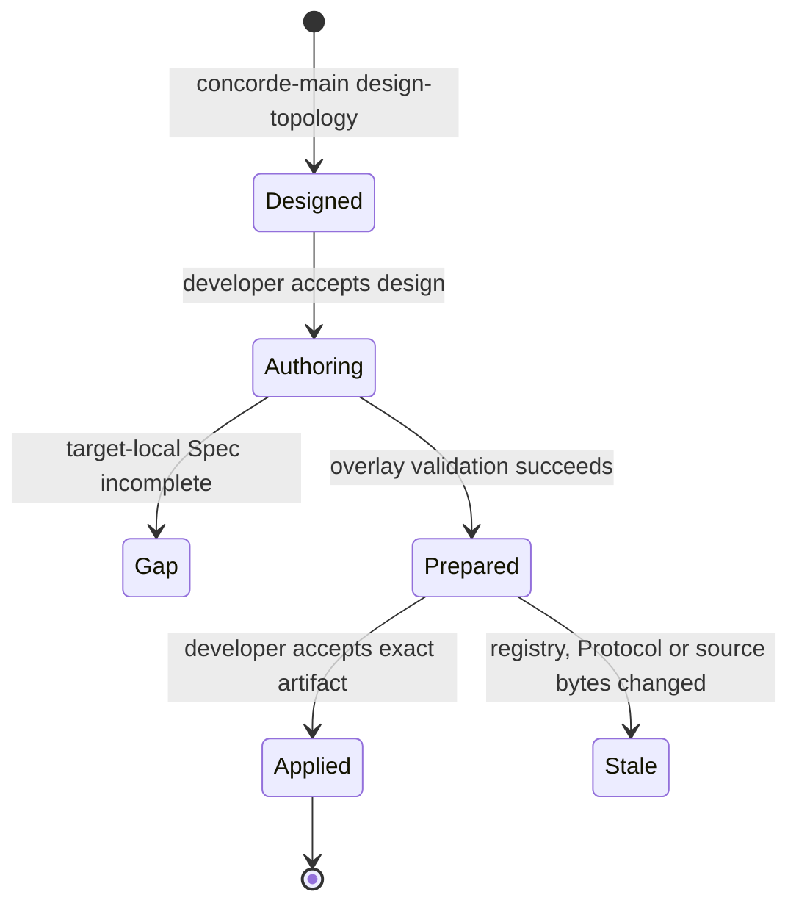

```concorde-document
{
  "id": "document.development.topology",
  "owner": "module.development",
  "main_visible": true
}
```
# Topology evolution Agent Graph

Use this Graph when registered targets, document ownership and references, shared truth or routing structure
must change together. The developer supplies intended behavior and constraints. Main designs a
candidate registry; fresh target-local authors supply the affected Specs after design acceptance.
A second acceptance binds the exact prepared transaction before application.

Human acceptance is a Graph control input tied to the exact design or prepared application. A
rejection may select another design or authoring loop, but cannot authorize the rejected effects.
The loop waits for a required decision and re-admits revised intent and current source identity.
Coordinator and target-author invocations retain separate Agent definitions and Harness bindings.

## Stages and outcomes



No target author writes project files. A gap or unresolved consumer compatibility leaves the
pre-design project unchanged. Prepared
artifacts contain full proposed bytes, but only their path/digest enters coordinator cognition.
Application is one host transaction with current before-digests and final repository validation.


Every new Concorde Module includes a local `module.md` with an inline Mermaid entity diagram
whose `accTitle` and `accDescr` describe it for readers who cannot see it. Its author returns the
complete registered Markdown replacements, including diagram fences. The host checks all proposed
files as one overlay before exposing the prepared application. Diagram content cannot widen Spec
membership or agent permissions. Only the sole owner proposes shared source bytes; all affected consumers receive separate compatibility checks.
