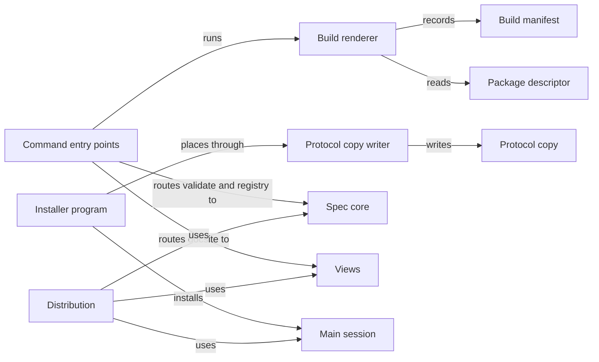

# Distribution

## Purpose

Distribution turns the Concorde checkout into something a developer can run and install. It
describes the package, builds the generated files from their prompt sources and records them in a
build manifest, provides the `concorde` command-line interface that routes each command to the
Module that owns it, writes the Protocol copy a project carries, and installs Concorde into another
project together with the main-session guidance. It does not decide what a command does (the
owning Module does), what the main agent is told (Main session does) or what a project's Specs and
configuration say (initialization and the developer do): the installer never writes Specs. The
installer and the tests of this Module are not implemented yet.

## Terminology

| Term | Definition |
| --- | --- |
| Package | The set of Concorde files, described by `concorde.json`, that is built, checked and installed as one unit. |
| Build | The deterministic rendering of every registered prompt root under `prompts/` into plain files under `generated/`. |
| Build manifest | The generated record of the digest of every source the build read and of every output it wrote. |
| Command-line interface | The `concorde` command, whose subcommands each print exactly one JSON result envelope and exit with a status derived from it. |
| Protocol copy | The rendered Spec Protocol bundle placed in a project under `.concorde/protocol/`, whose manifest digest the project configuration binds. |
| Installer | The program that places the Protocol copy, the `concorde` command and the main-session guidance into a project without writing its Specs. |
| [Developer](../vocabulary.md#concept.concorde.developer) | |
| [Main agent](../vocabulary.md#concept.concorde.main-agent) | |
| [Protocol binding](../spec-tooling/spec/module.md#concept.spec.protocol-binding) | |
| [Registry](../spec-tooling/spec/module.md#concept.spec.registry) | |
| [Structural check](../spec-tooling/spec/module.md#concept.spec.structural-check) | |
| [Scaffold proposal](../spec-tooling/views/module.md#concept.views.scaffold-proposal) | |
| [Main-session guidance](../main-session/module.md#concept.main-session.guidance) | |

The package, the build and its manifest describe what the checkout produces; the command-line
interface, the Protocol copy and the installer describe how a project receives and runs it.

## Usage

**The package.** The package is this checkout, described by `concorde.json`: name, version,
licence, repository, the architecture profile, the Python runtime requirement, the package roots
the installer ships (`docsite`, `prompts`, `protocol`, `scripts`, `src`), the install locations and
the supported client, `claude-code`. Everything the installer ships comes from it, and the build
reads it as an input so that a changed descriptor makes every render stale. Views reads its package
roots to confirm that the docsite template ships.

**Building.** Whoever changes a source the build reads rebuilds in the same worktree with
`python3 scripts/concorde.py build`. The build resolves every prompt root under `prompts/`, expands
its `@path.md` include lines and `{KEY}` parameters, and writes each result one to one under
`generated/`, for example `prompts/protocol/principles.md` to `generated/protocol/principles.md`.
It then writes the **build manifest** `generated/build-manifest.json` with the digest of every
source and output. `build --check` renders in memory, writes nothing and reports every stale or
missing output. Today the only prompt roots are the Protocol bundle; the main-session guidance and
the worker briefs become prompt roots when their Modules add them, and a prompt file that no root
includes fails the build, so a new prompt cannot be forgotten. `generated/` is ignored by Git: a
checkout always rebuilds.

After a Protocol change, `python3 scripts/concorde.py protocol-manifest --write --bind-project`
accepts the fresh digests into the tracked `protocol/manifest.json`, binds the project
configuration to that manifest and refreshes this checkout's own Protocol copy. Without `--write` it
only reports whether the tracked manifest matches the build.

**The command line.** `scripts/concorde.py` (or the `concorde.sh` and `concorde.ps1` wrappers, or
`python -m concorde` with `src/` on the path) takes a global `--project-root` and one subcommand:

| Command | Does | Owned by |
| --- | --- | --- |
| `validate [target]` | runs the structural checks | [Spec core](../spec-tooling/spec/module.md) |
| `registry --write` or `--check` | regenerates or checks the registry mirror | [Spec core](../spec-tooling/spec/module.md) |
| `docsite --propose` or `--apply` | proposes or applies the docsite scaffold | [Views](../spec-tooling/views/module.md) |
| `build [--check]` | renders or checks the generated files | Distribution |
| `protocol-manifest [--write] [--bind-project]` | reconciles the Protocol manifest | Distribution |

Every command prints exactly one JSON result envelope and exits with its status; a refused command
line or an unexpected error still prints one `failed` envelope rather than a traceback. The
`grant`, `task`, `run` and `init` commands will be added by Spec core, Tasks, Operations and
initialization respectively; Distribution only routes them.

**Installing into a project.** The **installer**, `python3 scripts/install-concorde.py <project>`,
is designed but not implemented. It places the **Protocol copy** under `.concorde/protocol/` (the
tracked manifest and every rendered asset it lists), the `concorde` command, and the
[main-session guidance](../main-session/module.md#concept.main-session.guidance) as Claude Code
guidance: a project skill and a delimited block in the project's `CLAUDE.md`. It also seeds
Concorde-owned defaults when they are absent, such as `.concorde/issues/.gitignore`. It never
writes Specs, the registry or the Protocol binding; initialization proposes the first Spec, and
the developer accepts a new Protocol copy by updating the binding. It refuses to copy from a
package whose build is stale. Until it exists, tests and `protocol-manifest --bind-project` write
the Protocol copy with the same helper.

## Design

The **package descriptor** `concorde.json` is the package's identity. Keeping it an input of the
build means a version or licence change is never shipped with renders made before it.

The **build renderer** is a pure function of the source tree followed by a guarded write. Includes
must be safe repository-relative Markdown paths, may not reach a Spec document, may not form a
cycle or reach one file twice within a root, and must agree on audience; Protocol prompts include
only Protocol text. An output is written only inside the build-owned locations
`generated/protocol/` and `generated/build-manifest.json`, because `generated/` is shared; an owned
output the build no longer produces is removed only when its bytes match the previous manifest,
and links or unknown files stop the build before anything changes. The manifest lets any consumer
check freshness cheaply by rehashing the recorded sources instead of rebuilding. The resolver still
knows two source shapes of the removed Operation guidance and Agent Specs; no root uses them.

The **command entry points** are thin: they parse the command line, hand the request to the owning
Module's function, and wrap the outcome in the shared envelope from Spec core. A command's meaning
therefore changes only in its owner, and the entry points never interpret Specs themselves.

The **Protocol copy writer** builds the copy from the tracked manifest and the rendered assets,
after checking that the build is fresh and that each asset still has its recorded digest. A project
therefore receives exactly the Protocol the manifest names, which is what Spec core's
[Protocol binding](../spec-tooling/spec/module.md#concept.spec.protocol-binding) accepts.

The **installer program** will reuse the Protocol copy writer and the build, and install the
rendered main-session guidance; it is pending.

The **Distribution tests** will exercise the build, the command line and the installer on fixture
projects; they are pending. The obligations they verify are in the
[requirements](requirements.md) and [scenarios](scenarios.md).

## Relationships

**Spec core** owns `validate` and `registry`, the [structural checks](../spec-tooling/spec/module.md#concept.spec.structural-check)
and the [registry](../spec-tooling/spec/module.md#concept.spec.registry) they work on, the Protocol
text and manifest the build renders, and the
[Protocol binding](../spec-tooling/spec/module.md#concept.spec.protocol-binding) that
`protocol-manifest --bind-project` rewrites and the installer leaves to the developer.
Distribution relies on Spec core's result envelope for every command and never interprets a Spec
itself; when Spec core refuses a project, the command prints that refusal unchanged.

**Views** owns the docsite scaffold. The `docsite` command only routes `--propose` and `--apply` to
it; the [scaffold proposal](../spec-tooling/views/module.md#concept.views.scaffold-proposal) and
every file it writes are Views' responsibility, and an `--apply` without `--proposal` is refused
before Views is called.

**Main session** owns the guidance the main agent receives, authored under `prompts/main-session/`.
Distribution renders it as a prompt root once it exists and the installer places the rendered
[main-session guidance](../main-session/module.md#concept.main-session.guidance) into the project's
Claude Code configuration without changing its content. If the guidance is missing or stale, the
installer refuses instead of installing an older copy.
