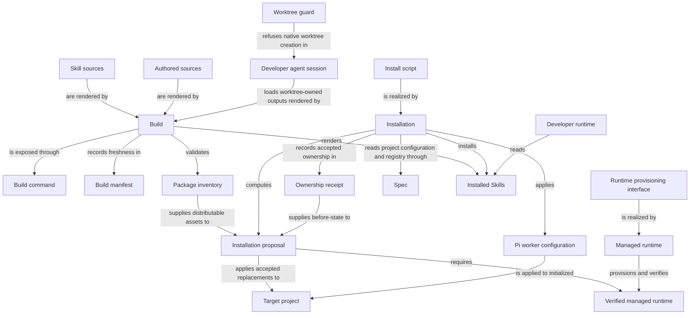

# Distribution

## Purpose

Distribution turns authored Framework sources into the deterministic outputs a project actually
runs: rendered Agent instructions and Skills, an installed and configured integration, and a
verified managed Python and viewer runtime. Its users are developers installing or updating
Concorde into a consumer project, developers maintaining this source checkout, and every other
Framework capability that depends on fresh generated projections before it executes. It owns Skill
sources and shared invocation instructions; installed Skills are read by the developer's external
runtime, which submits requests to the Development capability boundary. Capability behavior remains
with its providing Module. Distribution's installation promises stop at owned, receipt-tracked
output: it never edits project-owned Specs or configuration, and it
never decides what those Specs should say.

## Usage

Use Distribution to build this checkout, install or update Concorde in a consumer project, change
an initialized project's worker configuration, or provision the pinned runtime. Run
`python3 scripts/concorde.py build` after authored instruction or contract changes; use
`build --check` to check freshness without writing. Builds stay with their source worktree.
Installation previews owned changes by default and applies them only with explicit acceptance;
local modifications to receipt-owned output conflict rather than being silently adopted.

Installation deploys Framework assets and the Protocol copy, not project business Specs or a
registry. Initialize those separately. An update does not accept a new Protocol binding for you:
review and explicitly rebind it after any required project migration. Use `concorde-configure` for
worker model, thinking, timeout and overrides. Runtime provisioning needs a reviewed current plan;
launching a viewer or worker does not implicitly provision it. See [installation](installation.md),
[build](build.md) and [runtime](runtime.md). The existing runtime-rebuild preservation gap below
means a failed rebuild must not be assumed to have recovered the prior environment.

## Design

The Build command resolves Authored sources, including Skill sources, into deterministic worker
instructions, Installed Skills and runtime schemas. Build manifest binds their exact inputs and
outputs, while Package inventory determines which assets can be distributed. The external Developer
runtime reads an installed Skill to submit a typed capability request; Skills are not injected as
worker context or an independent execution grant. [Build realization](build.md#design) explains
source accounting and freshness checks.

Install script exposes Installation's preview/apply boundary. An Installation proposal selects
exact owned changes in the Target project; an Ownership receipt records those installed bytes and
their before-state for later updates. A fresh build is not installation acceptance, and a receipt
is not permission to overwrite unrelated user content. Failure restores owned installation state.
Project Specs and their accepted Protocol binding remain separately controlled.

Managed runtime implements the Runtime provisioning interface and records a Verified managed
runtime only after its checks succeed. Provisioning does not decide which project files may be
replaced. Pi worker configuration is a separate explicit operation selecting model, thinking,
timeout and overrides; accepting new Protocol assets is an additional explicit decision. The
runtime-rebuild preservation gap below remains an unfulfilled obligation, not a claim that every
failed rebuild restored the prior environment.

The checkout-only Worktree guard constrains the Developer agent session to the worktree that
supplied its instructions. It is not installed into consumer projects and does not move a session
between revisions. Builds use only their own worktree's source and outputs; host-created candidate
work follows the separate fresh-session handoff rule.

## Relationships

Build, Installation and Managed runtime are independent programs that only meet at explicit
records: Build never writes into a target project, Installation never renders Framework assets
itself, and Managed runtime never chooses which files Installation replaces. Ownership receipt and
Build manifest play matching but distinct roles — one binds installed bytes in a target project,
the other binds authored sources to rendered outputs in this checkout or a build client — and
neither substitutes for the other. In this source checkout specifically, the worktree guard and the
developer session it constrains are the only entities with no counterpart in an installed consumer
project, because the guard is checkout policy and ships to no one else.

Skill sources are authored and owned here, Build renders them, and Installation places the rendered
Skills in the target integration. The external Developer runtime consumes those instructions and
calls the declared capability boundary. This distribution path creates no worker Harness input and
does not transfer ownership of executable capability behavior to Distribution.

## Requirements

### req.distribution.no-silent-protocol-rewrite — No silent Protocol rebinding

Install or update SHALL NOT silently rewrite a consumer's Protocol binding.

### req.distribution.explicit-binding-decision — Changed Protocol assets need explicit acceptance

A package with changed Protocol assets SHALL require the consumer's explicit binding decision
before execution.

### req.distribution.build-idempotent — Build output is deterministic and idempotent

`build` and `build --check` SHALL be idempotent and byte-identical across repeated runs.

### req.distribution.build-no-io — Build performs no network or process I/O

`build` and `build --check` SHALL perform no network or process I/O.

### req.distribution.one-worktree-build — Build stays within its own worktree

Every build invocation SHALL operate only on the worktree containing its named sources.

### req.distribution.no-cross-worktree-build — No cross-worktree build output

Build SHALL NOT point one worktree's build at another worktree's outputs.

### req.distribution.checkout-skills-user-invoked — Source-checkout Skills wait for the developer

Build SHALL render the source checkout's own Claude Skill projections as user-invocable only,
hidden from model-initiated invocation.

Developing the Concorde checkout is direct developer-authorized maintenance by default; a Concorde
flow runs on the checkout only when the developer explicitly asks for it. The installed consumer
projection is unaffected and stays model-invocable.

### req.distribution.root-block-ownership — Root rule ownership is block-scoped

A root rule entry SHALL be owned only within its exact bounded block, including its separator.

### req.distribution.no-surrounding-text-rewrite — Surrounding user text stays untouched

Installation SHALL NOT hash or replace user text surrounding an owned root block.

### req.distribution.rollback-on-failure — Installation rolls back atomically on failure

A runtime or setup failure during installation SHALL roll back root bytes, modes and the receipt
together with the other installation outputs.

### req.distribution.guard-inspects-text — Guard decides from the submitted command text

The worktree guard SHALL decide from the submitted command text, including global git options such
as `-C` and `--git-dir=`.

### req.distribution.guard-not-agent-reliant — Guard does not rely on agent memory

The worktree guard SHALL NOT depend on an agent remembering the policy.

### req.distribution.guard-checkout-only — Guard protects only this checkout's sessions

The worktree guard SHALL protect only developer sessions of this source checkout.

### req.distribution.guard-not-in-consumer-projects — Guard is excluded from consumer projects

The worktree guard SHALL NOT be installed into consumer projects.

## Scenarios

Scenario definitions for installing, configuring and guarding this source checkout's own worktrees
are registered in [installation](installation.md). Scenario definitions for rendering and
freshness-checking projections are registered in [build](build.md). Scenario definitions for
provisioning the managed Python and viewer runtime are registered in [runtime](runtime.md).

## Dependencies and composition

### Spec

Defines the project configuration and registry that installation, configuration and initialization read or write, with exactly one pinned Protocol binding.

Define the project configuration and registry that installation, configuration and initialization read or write.

This collaboration applies when installing into or configuring an initialized project, or when a Protocol binding must be checked.

- [Preserve the accepted binding and reject incompatible configuration](../spec/values.md#framework-configuration-and-storage-versions)

## Unresolved information

Managed runtime's replacement design intends to preserve the previous valid runtime until a rebuild
is verified and to restore it after a failed rebuild, but the current provisioning implementation
still removes an owned environment before rebuilding; this preservation promise is not yet fulfilled
by code, and callers must not infer recovery from the absence of success metadata.

Project initialization and Protocol-binding decisions belong to `module.spec`'s `concorde-init`
capability, not to this Module; installation never creates the registry or a Module stub itself.

## Ownership, context and implementation status

Runtime admission, initialization, installation inventory and package Spec/wire alignment support Protocol 7/Profile 14. Build success proves output freshness only. Project updates must preserve explicit owner/reference choices and never silently migrate consumers.
